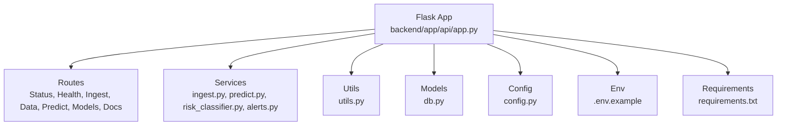
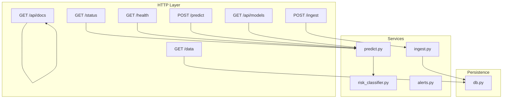
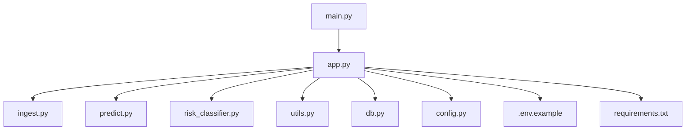

# API Endpoints Reference

<cite>
**Referenced Files in This Document**
- [backend/main.py](file://backend/main.py)
- [backend/app/api/app.py](file://backend/app/api/app.py)
- [backend/app/services/ingest.py](file://backend/app/services/ingest.py)
- [backend/app/services/predict.py](file://backend/app/services/predict.py)
- [backend/app/services/risk_classifier.py](file://backend/app/services/risk_classifier.py)
- [backend/app/services/alerts.py](file://backend/app/services/alerts.py)
- [backend/app/utils/utils.py](file://backend/app/utils/utils.py)
- [backend/app/models/db.py](file://backend/app/models/db.py)
- [backend/app/core/config.py](file://backend/app/core/config.py)
- [backend/.env.example](file://backend/.env.example)
- [backend/requirements.txt](file://backend/requirements.txt)
- [backend/docs/POWERSHELL_API_EXAMPLES.md](file://backend/docs/POWERSHELL_API_EXAMPLES.md)
</cite>

## Table of Contents
1. [Introduction](#introduction)
2. [Project Structure](#project-structure)
3. [Core Components](#core-components)
4. [Architecture Overview](#architecture-overview)
5. [Detailed Component Analysis](#detailed-component-analysis)
6. [Dependency Analysis](#dependency-analysis)
7. [Performance Considerations](#performance-considerations)
8. [Troubleshooting Guide](#troubleshooting-guide)
9. [Conclusion](#conclusion)
10. [Appendices](#appendices)

## Introduction
This document provides a comprehensive API reference for the floodingnaque backend. It covers all RESTful endpoints, request/response schemas, authentication, rate limiting, CORS, and usage examples in PowerShell and Python requests. It also outlines the prediction schema, risk classification, and versioning strategy for forward compatibility.

## Project Structure
The backend is a Flask application that exposes REST endpoints and orchestrates services for weather data ingestion, model inference, risk classification, and database persistence. Key components:
- Application entrypoint initializes the Flask app and loads environment configuration.
- API routes define endpoints for status, health, ingestion, data retrieval, prediction, model listing, and documentation.
- Services encapsulate ingestion logic, prediction pipeline, risk classification, and alerting.
- Utilities handle logging, coordinate validation, and request ID tracking.
- Database models define the schema for weather data storage.

**Diagram sources**
- [backend/app/api/app.py](file://backend/app/api/app.py#L1-L120)
- [backend/app/services/ingest.py](file://backend/app/services/ingest.py#L1-L111)
- [backend/app/services/predict.py](file://backend/app/services/predict.py#L1-L236)
- [backend/app/services/risk_classifier.py](file://backend/app/services/risk_classifier.py#L1-L170)
- [backend/app/services/alerts.py](file://backend/app/services/alerts.py#L1-L167)
- [backend/app/utils/utils.py](file://backend/app/utils/utils.py#L1-L48)
- [backend/app/models/db.py](file://backend/app/models/db.py#L1-L37)
- [backend/app/core/config.py](file://backend/app/core/config.py#L1-L10)
- [backend/.env.example](file://backend/.env.example#L1-L4)
- [backend/requirements.txt](file://backend/requirements.txt#L1-L15)

**Section sources**
- [backend/main.py](file://backend/main.py#L1-L25)
- [backend/app/api/app.py](file://backend/app/api/app.py#L1-L120)

## Core Components
- Flask application with CORS enabled globally.
- Environment-driven configuration and logging setup.
- Request ID tracking for observability.
- Scheduler initialization for periodic tasks.
- Database initialization and ORM model for weather data.

**Section sources**
- [backend/app/api/app.py](file://backend/app/api/app.py#L72-L121)
- [backend/app/utils/utils.py](file://backend/app/utils/utils.py#L1-L48)
- [backend/app/models/db.py](file://backend/app/models/db.py#L1-L37)
- [backend/app/core/config.py](file://backend/app/core/config.py#L1-L10)

## Architecture Overview
The API follows a layered architecture:
- Routes layer handles HTTP requests and delegates to services.
- Services layer implements business logic for ingestion, prediction, risk classification, and alerting.
- Persistence layer manages database operations.
- Utilities provide cross-cutting concerns like logging and validation.

**Diagram sources**
- [backend/app/api/app.py](file://backend/app/api/app.py#L123-L536)
- [backend/app/services/ingest.py](file://backend/app/services/ingest.py#L1-L111)
- [backend/app/services/predict.py](file://backend/app/services/predict.py#L1-L236)
- [backend/app/services/risk_classifier.py](file://backend/app/services/risk_classifier.py#L1-L170)
- [backend/app/services/alerts.py](file://backend/app/services/alerts.py#L1-L167)
- [backend/app/models/db.py](file://backend/app/models/db.py#L1-L37)

## Detailed Component Analysis

### Endpoint: GET /status
- Purpose: Lightweight health status including model availability.
- Response fields:
  - status: "running"
  - database: "connected"
  - model: "loaded" | "not found"
  - model_version: present if model loaded
  - model_accuracy: present if model metadata available
- Success code: 200
- Error codes: N/A (returns 200 with status fields)

**Section sources**
- [backend/app/api/app.py](file://backend/app/api/app.py#L123-L139)

### Endpoint: GET /health
- Purpose: Detailed health including scheduler status and model metadata.
- Response fields:
  - status: "healthy"
  - database: "connected"
  - model_available: boolean
  - scheduler_running: boolean
  - model.loaded: boolean
  - model.type: model class name
  - model.path: model file path
  - model.features: list of feature names
  - model.version: model metadata version
  - model.created_at: model creation timestamp
  - model.metrics: accuracy, precision, recall, f1_score
- Success code: 200
- Error codes: N/A (returns 200 with status fields)

**Section sources**
- [backend/app/api/app.py](file://backend/app/api/app.py#L306-L339)

### Endpoint: POST /ingest
- Purpose: Ingest weather data from external APIs (OpenWeatherMap and Weatherstack) and persist to database.
- Authentication: None
- Request body (JSON):
  - lat: float (optional, -90 to 90)
  - lon: float (optional, -180 to 180)
- Response fields:
  - message: "Data ingested successfully"
  - data.temperature: float
  - data.humidity: float
  - data.precipitation: float
  - data.timestamp: ISO datetime string
  - request_id: UUID string
- Success code: 200
- Error codes:
  - 400: Invalid JSON, invalid coordinates, or ingestion failure
  - 500: Internal server error

Notes:
- If lat/lon are omitted, defaults to New York City coordinates.
- Requires environment keys for external APIs.

**Section sources**
- [backend/app/api/app.py](file://backend/app/api/app.py#L141-L223)
- [backend/app/services/ingest.py](file://backend/app/services/ingest.py#L1-L111)
- [backend/.env.example](file://backend/.env.example#L1-L4)

### Endpoint: GET /data
- Purpose: Retrieve historical weather data with pagination and optional date filtering.
- Query parameters:
  - limit: integer (1–1000, default 100)
  - offset: integer (default 0)
  - start_date: ISO datetime string (optional)
  - end_date: ISO datetime string (optional)
- Response fields:
  - data: array of weather records
  - total: integer
  - limit: integer
  - offset: integer
  - count: integer
  - request_id: UUID string
- Success code: 200
- Error codes:
  - 400: Invalid limit or date format
  - 500: Internal server error

**Section sources**
- [backend/app/api/app.py](file://backend/app/api/app.py#L341-L404)
- [backend/app/models/db.py](file://backend/app/models/db.py#L1-L37)

### Endpoint: POST /predict
- Purpose: Predict flood risk based on weather features with optional 3-level risk classification and probabilities.
- Authentication: None
- Request body (JSON):
  - temperature: float (required)
  - humidity: float (required)
  - precipitation: float (required)
  - model_version: integer (optional) – select a specific model version
- Query parameters:
  - return_proba: boolean (default false) – include prediction probabilities
  - risk_level: boolean (default true) – include 3-level risk classification
- Response fields:
  - prediction: 0 or 1 (binary)
  - flood_risk: "low" | "high" (backward compatible)
  - model_version: string or null
  - risk_level: 0 (Safe) | 1 (Alert) | 2 (Critical) (when risk_level=true)
  - risk_label: "Safe" | "Alert" | "Critical" (when risk_level=true)
  - risk_color: hex color code (when risk_level=true)
  - risk_description: human-readable description (when risk_level=true)
  - confidence: float (0–1) (when risk_level=true)
  - probability: object with no_flood and flood probabilities (when return_proba=true)
  - request_id: UUID string
- Success code: 200
- Error codes:
  - 400: Invalid JSON, missing fields, validation error
  - 404: Model not found
  - 500: Internal server error

Prediction schema highlights:
- Features: temperature, humidity, precipitation (plus optional model_version).
- Risk classification: Safe/Alert/Critical with confidence and color-coded labels.
- Backward compatibility: flood_risk remains "low"|"high" while richer risk_level fields are included when requested.

**Section sources**
- [backend/app/api/app.py](file://backend/app/api/app.py#L224-L305)
- [backend/app/services/predict.py](file://backend/app/services/predict.py#L112-L216)
- [backend/app/services/risk_classifier.py](file://backend/app/services/risk_classifier.py#L32-L111)

### Endpoint: GET /api/models
- Purpose: List available model versions and current model metadata.
- Response fields:
  - models: array of model entries
    - version: integer
    - path: string
    - is_current: boolean
    - created_at: string (optional)
    - metrics: accuracy, precision, recall, f1_score (optional)
  - current_version: integer or null
  - total_versions: integer
  - request_id: UUID string
- Success code: 200
- Error codes:
  - 500: Internal server error

**Section sources**
- [backend/app/api/app.py](file://backend/app/api/app.py#L415-L452)
- [backend/app/services/predict.py](file://backend/app/services/predict.py#L33-L71)

### Endpoint: GET /api/docs
- Purpose: Return a machine-readable API documentation snapshot.
- Response fields:
  - endpoints: object keyed by endpoint path with descriptions and schemas
  - version: string
  - base_url: string
- Success code: 200
- Error codes: N/A

**Section sources**
- [backend/app/api/app.py](file://backend/app/api/app.py#L454-L536)

### Real-World Usage Examples

- PowerShell (download.ps1 references and examples):
  - Health check, status, predict, ingest, and model listing are demonstrated in the PowerShell examples documentation.
  - Use Invoke-RestMethod for JSON responses and ConvertTo-Json for request bodies.
  - See quick reference and troubleshooting tips for common issues.

- Python requests:
  - Use requests.post/requests.get with appropriate JSON bodies and headers.
  - For predict with probabilities and risk level, pass query parameters and include temperature, humidity, precipitation in the JSON body.

**Section sources**
- [backend/docs/POWERSHELL_API_EXAMPLES.md](file://backend/docs/POWERSHELL_API_EXAMPLES.md#L1-L203)

## Dependency Analysis
Key runtime dependencies and integrations:
- Flask and flask-cors enable routing and cross-origin support.
- APScheduler runs periodic tasks.
- SQLAlchemy manages database sessions and ORM.
- External weather APIs (OpenWeatherMap and Weatherstack) require environment keys.
- Joblib and scikit-learn power model loading and inference.

**Diagram sources**
- [backend/main.py](file://backend/main.py#L1-L25)
- [backend/app/api/app.py](file://backend/app/api/app.py#L1-L120)
- [backend/app/services/ingest.py](file://backend/app/services/ingest.py#L1-L111)
- [backend/app/services/predict.py](file://backend/app/services/predict.py#L1-L236)
- [backend/app/services/risk_classifier.py](file://backend/app/services/risk_classifier.py#L1-L170)
- [backend/app/utils/utils.py](file://backend/app/utils/utils.py#L1-L48)
- [backend/app/models/db.py](file://backend/app/models/db.py#L1-L37)
- [backend/app/core/config.py](file://backend/app/core/config.py#L1-L10)
- [backend/.env.example](file://backend/.env.example#L1-L4)
- [backend/requirements.txt](file://backend/requirements.txt#L1-L15)

**Section sources**
- [backend/requirements.txt](file://backend/requirements.txt#L1-L15)
- [backend/app/api/app.py](file://backend/app/api/app.py#L1-L120)

## Performance Considerations
- Ingestion latency depends on external weather APIs; timeouts are configured in ingestion service.
- Prediction performance scales with model complexity; consider batching requests and caching frequent predictions where appropriate.
- Database queries for /data use pagination and date filters to limit payload sizes.
- CORS is enabled globally; ensure client-side requests include necessary headers.

[No sources needed since this section provides general guidance]

## Troubleshooting Guide
Common issues and resolutions:
- Invalid JSON or parsing failures: Ensure request body is valid JSON and use ConvertTo-Json in PowerShell or json.dumps in Python.
- Missing environment keys: Set OWM_API_KEY and METEOSTAT_API_KEY/METEOSTAT_API_KEY in environment.
- Coordinate validation errors: Provide lat/lon within valid ranges.
- Model not found: Train or place the model file in the expected models directory and ensure metadata is present.
- Connection refused: Confirm the Flask server is running on the expected host/port.

**Section sources**
- [backend/app/api/app.py](file://backend/app/api/app.py#L176-L223)
- [backend/app/services/ingest.py](file://backend/app/services/ingest.py#L20-L34)
- [backend/app/utils/utils.py](file://backend/app/utils/utils.py#L39-L48)
- [backend/.env.example](file://backend/.env.example#L1-L4)

## Conclusion
The floodingnaque backend provides a robust set of REST endpoints for flood risk prediction, including ingestion, historical data retrieval, prediction with risk classification, and model management. The API is designed for straightforward integration with minimal authentication requirements, while offering rich response schemas for modern applications.

[No sources needed since this section summarizes without analyzing specific files]

## Appendices

### Authentication and Security
- Authentication: None for the documented endpoints.
- Environment keys:
  - OWM_API_KEY: OpenWeatherMap API key for weather data.
  - METEOSTAT_API_KEY or WEATHERSTACK_API_KEY: Weatherstack API key for precipitation data.
  - DATABASE_URL: Database connection string (defaults to SQLite).
- CORS: Enabled globally to support frontend integration.

**Section sources**
- [backend/.env.example](file://backend/.env.example#L1-L4)
- [backend/app/api/app.py](file://backend/app/api/app.py#L72-L73)
- [backend/app/services/ingest.py](file://backend/app/services/ingest.py#L20-L24)

### Rate Limiting
- Not implemented. Consider adding rate limiting middleware or upstream proxy configuration for production deployments.

[No sources needed since this section provides general guidance]

### Versioning and Backward Compatibility
- API version endpoint: GET /api/version returns version metadata.
- Model versioning: Predictions can target a specific model_version via request body; otherwise the latest model is used.
- Backward compatibility: The response includes flood_risk ("low"|"high") alongside richer risk_level fields when requested.
- Recommendations for future changes:
  - Use a base URL prefix (e.g., /v1) and increment version numbers for breaking changes.
  - Maintain deprecation timelines and transitional endpoints.
  - Preserve core fields (e.g., prediction, flood_risk) while extending with new fields.

**Section sources**
- [backend/app/api/app.py](file://backend/app/api/app.py#L406-L414)
- [backend/app/api/app.py](file://backend/app/api/app.py#L248-L264)
- [backend/app/services/predict.py](file://backend/app/services/predict.py#L104-L111)

### Prediction Request/Response Schema Details
- Request body (POST /predict):
  - temperature: float
  - humidity: float
  - precipitation: float
  - model_version: integer (optional)
- Query parameters:
  - return_proba: boolean (default false)
  - risk_level: boolean (default true)
- Response (when risk_level=true):
  - risk_level: 0 (Safe) | 1 (Alert) | 2 (Critical)
  - risk_label: "Safe" | "Alert" | "Critical"
  - risk_color: hex color code
  - risk_description: human-readable description
  - confidence: float (0–1)
  - probability: object with no_flood and flood probabilities (when return_proba=true)
- Backward compatibility:
  - flood_risk: "low" | "high" remains for legacy clients.

**Section sources**
- [backend/app/api/app.py](file://backend/app/api/app.py#L224-L305)
- [backend/app/services/risk_classifier.py](file://backend/app/services/risk_classifier.py#L32-L111)

### Usage Examples Index
- PowerShell examples for health, status, predict, ingest, and model listing are available in the PowerShell examples documentation.

**Section sources**
- [backend/docs/POWERSHELL_API_EXAMPLES.md](file://backend/docs/POWERSHELL_API_EXAMPLES.md#L1-L203)