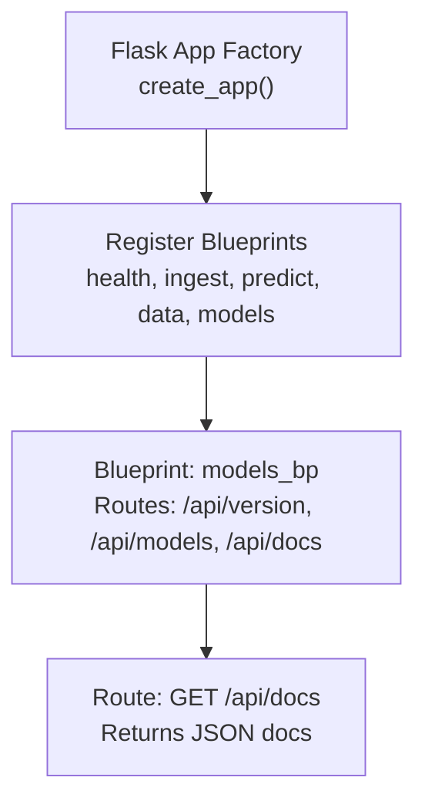
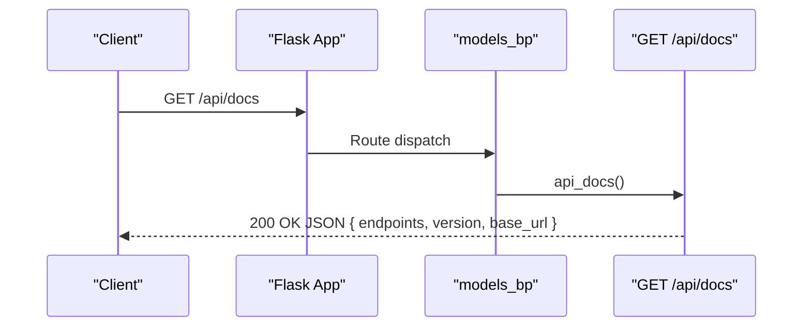
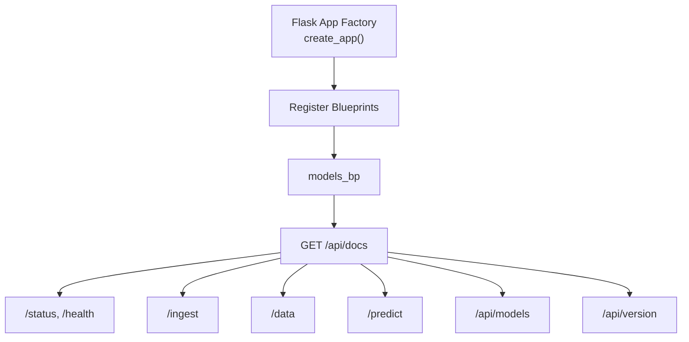

# GET /api/docs

<cite>
**Referenced Files in This Document**
- [backend/README.md](file://backend/README.md)
- [backend/docs/BACKEND_COMPLETE.md](file://backend/docs/BACKEND_COMPLETE.md)
- [backend/app/api/app.py](file://backend/app/api/app.py)
- [backend/app/api/routes/__init__.py](file://backend/app/api/routes/__init__.py)
- [backend/app/api/routes/models.py](file://backend/app/api/routes/models.py)
- [backend/app/api/routes/health.py](file://backend/app/api/routes/health.py)
- [backend/app/api/routes/data.py](file://backend/app/api/routes/data.py)
- [backend/app/api/routes/predict.py](file://backend/app/api/routes/predict.py)
- [backend/app/api/middleware/auth.py](file://backend/app/api/middleware/auth.py)
- [backend/tests/integration/test_endpoints.py](file://backend/tests/integration/test_endpoints.py)
</cite>

## Table of Contents
1. [Introduction](#introduction)
2. [Project Structure](#project-structure)
3. [Core Components](#core-components)
4. [Architecture Overview](#architecture-overview)
5. [Detailed Component Analysis](#detailed-component-analysis)
6. [Dependency Analysis](#dependency-analysis)
7. [Performance Considerations](#performance-considerations)
8. [Troubleshooting Guide](#troubleshooting-guide)
9. [Conclusion](#conclusion)
10. [Appendices](#appendices)

## Introduction
This document describes the GET /api/docs endpoint in the floodingnaque backend. It provides machine-readable API documentation in JSON format, acting as a self-describing interface for the API. The endpoint returns a structured specification of all public endpoints, including descriptions, request parameters, body schemas, and response formats. It supports API discovery and client integration by exposing a complete specification for /status, /health, /ingest, /data, /predict, and /api/models. The endpoint is publicly accessible without authentication and includes versioning information to help clients stay synchronized with the backend.

## Project Structure
The API is implemented using a Flask application factory that registers modular blueprints for each functional area. The /api/docs endpoint is defined under the models blueprint and returns a consolidated documentation object.

**Diagram sources**
- [backend/app/api/app.py](file://backend/app/api/app.py#L122-L131)
- [backend/app/api/routes/__init__.py](file://backend/app/api/routes/__init__.py#L8-L10)
- [backend/app/api/routes/models.py](file://backend/app/api/routes/models.py#L66-L150)

**Section sources**
- [backend/app/api/app.py](file://backend/app/api/app.py#L122-L131)
- [backend/app/api/routes/__init__.py](file://backend/app/api/routes/__init__.py#L8-L10)

## Core Components
- Endpoint: GET /api/docs
- Method: GET
- Authentication: Not required
- Response: JSON object containing endpoint specifications, versioning, and base URL
- Purpose: Provide a machine-readable, self-describing API documentation for discovery and client integration

Key behaviors:
- Returns a JSON object with an “endpoints” map describing each endpoint’s HTTP method, path, description, request parameters, request body schema, and response schema
- Includes top-level fields: version, base_url
- Supports discovery of /status, /health, /ingest, /data, /predict, and /api/models

**Section sources**
- [backend/app/api/routes/models.py](file://backend/app/api/routes/models.py#L66-L150)
- [backend/README.md](file://backend/README.md#L74-L94)

## Architecture Overview
The /api/docs endpoint is part of the models blueprint and is registered by the Flask application factory. It consolidates endpoint metadata and returns it as a JSON document.

**Diagram sources**
- [backend/app/api/app.py](file://backend/app/api/app.py#L122-L131)
- [backend/app/api/routes/models.py](file://backend/app/api/routes/models.py#L66-L150)

## Detailed Component Analysis

### Endpoint Definition: GET /api/docs
- Location: models blueprint route
- Decorators: rate-limited via a shared limiter
- Behavior: Returns a JSON object with:
  - endpoints: map of endpoint identifiers to their specifications
  - version: API version string
  - base_url: the server’s base URL

Specification structure:
- endpoints: object keyed by HTTP method and path (e.g., "GET /status")
  - description: human-readable description of the endpoint
  - request_body: optional schema for POST/PUT bodies (when applicable)
  - query_parameters: optional schema for query parameters (when applicable)
  - response: schema of the typical successful response
- version: string indicating API version
- base_url: string indicating the base URL used to construct links

Supported endpoints documented:
- GET /status
- GET /health
- POST /ingest
- GET /data
- POST /predict
- GET /api/models
- GET /api/version

Notes:
- GET /api/docs itself is not included in the endpoints map to avoid recursion
- The endpoint is publicly accessible without authentication

**Section sources**
- [backend/app/api/routes/models.py](file://backend/app/api/routes/models.py#L66-L150)

### Supporting Endpoints Referenced by /api/docs
- GET /status: Basic health check with model availability and accuracy when loaded
- GET /health: Detailed health with model metadata and scheduler status
- POST /ingest: Weather data ingestion with optional coordinates
- GET /data: Historical weather data with pagination and date filters
- POST /predict: Flood risk prediction with optional model selection and classification options
- GET /api/models: Lists available model versions and current model metadata
- GET /api/version: Returns API version information

These endpoints are described in the docs object returned by GET /api/docs, enabling clients to programmatically discover and integrate with the API.

**Section sources**
- [backend/app/api/routes/health.py](file://backend/app/api/routes/health.py#L18-L92)
- [backend/app/api/routes/data.py](file://backend/app/api/routes/data.py#L18-L83)
- [backend/app/api/routes/predict.py](file://backend/app/api/routes/predict.py#L20-L103)
- [backend/app/api/routes/models.py](file://backend/app/api/routes/models.py#L17-L65)

### Authentication and Access Control
- GET /api/docs: No authentication required
- Other endpoints may require API key authentication depending on their route definitions:
  - POST /predict is protected by an API key decorator
  - POST /ingest is protected by an API key decorator
  - GET /data, GET /status, GET /health, GET /api/models, GET /api/version are not protected by the API key decorator in the referenced files

Clients should check the docs object to determine whether authentication is required for a given endpoint.

**Section sources**
- [backend/app/api/routes/models.py](file://backend/app/api/routes/models.py#L66-L150)
- [backend/app/api/routes/predict.py](file://backend/app/api/routes/predict.py#L20-L23)
- [backend/app/api/routes/ingest.py](file://backend/app/api/routes/ingest.py#L21-L24)
- [backend/app/api/middleware/auth.py](file://backend/app/api/middleware/auth.py#L28-L69)

### Response Schema Details
The GET /api/docs response includes:
- endpoints: map of endpoint specs
  - Keys are strings like "GET /status"
  - Values include description, optional request_body, optional query_parameters, and response schema
- version: string indicating API version
- base_url: string indicating the base URL

Example response structure outline:
- endpoints:
  - "GET /status": { description, response }
  - "GET /health": { description, response }
  - "POST /ingest": { description, request_body, response }
  - "GET /data": { description, query_parameters, response }
  - "POST /predict": { description, request_body, query_parameters, response }
  - "GET /api/models": { description, response }
  - "GET /api/version": { description, response }
- version: "1.0.0"
- base_url: "http://localhost:5000" (or the actual server base URL)

**Section sources**
- [backend/app/api/routes/models.py](file://backend/app/api/routes/models.py#L66-L150)

### Programmatic Discovery and Client Integration
Clients can:
- Fetch GET /api/docs to obtain a complete specification of all endpoints
- Use the version field to detect API changes and adjust client behavior accordingly
- Use the base_url to construct absolute URLs for subsequent requests
- Inspect endpoint-specific schemas to build request payloads and parse responses

This reduces the learning curve for new developers by providing a single source of truth for API capabilities.

**Section sources**
- [backend/tests/integration/test_endpoints.py](file://backend/tests/integration/test_endpoints.py#L64-L75)
- [backend/README.md](file://backend/README.md#L141-L148)

### Maintenance and Synchronization
- The docs object is defined statically in the models blueprint route
- To keep the docs synchronized with implementation changes:
  - Update the docs object whenever endpoint signatures change
  - Keep descriptions and schemas aligned with actual request/response handling
  - Ensure version is incremented when breaking changes occur
- Automated tests verify that GET /api/docs returns a 200 response and includes the expected top-level fields

**Section sources**
- [backend/app/api/routes/models.py](file://backend/app/api/routes/models.py#L66-L150)
- [backend/tests/integration/test_endpoints.py](file://backend/tests/integration/test_endpoints.py#L64-L75)

## Dependency Analysis
The /api/docs endpoint depends on:
- Flask application factory and blueprint registration
- Route definitions for the endpoints it documents
- Middleware for rate limiting (shared across endpoints)

**Diagram sources**
- [backend/app/api/app.py](file://backend/app/api/app.py#L122-L131)
- [backend/app/api/routes/__init__.py](file://backend/app/api/routes/__init__.py#L8-L10)
- [backend/app/api/routes/models.py](file://backend/app/api/routes/models.py#L66-L150)

**Section sources**
- [backend/app/api/app.py](file://backend/app/api/app.py#L122-L131)
- [backend/app/api/routes/__init__.py](file://backend/app/api/routes/__init__.py#L8-L10)

## Performance Considerations
- The endpoint returns a static JSON object constructed in memory; it is lightweight and suitable for frequent client discovery
- Rate limiting is applied via a shared limiter, helping to prevent abuse while remaining responsive for discovery

[No sources needed since this section provides general guidance]

## Troubleshooting Guide
Common issues and resolutions:
- 404 Not Found: Ensure the endpoint path is correct and the models blueprint is registered
- 500 Internal Server Error: Indicates an unexpected error in the docs route; check logs and confirm the endpoint is reachable
- Unexpected schema: If client behavior relies on specific fields, verify the version and update client logic accordingly

Verification steps:
- Confirm GET /api/docs returns 200 and includes endpoints, version, and base_url
- Compare the returned version against client expectations to detect breaking changes

**Section sources**
- [backend/tests/integration/test_endpoints.py](file://backend/tests/integration/test_endpoints.py#L64-L75)

## Conclusion
GET /api/docs provides a machine-readable, self-describing interface that enables clients to discover and integrate with the floodingnaque API. It documents all public endpoints, their request/response schemas, and versioning information. Together with human-readable documentation, it accelerates developer onboarding and ensures clients remain synchronized with backend changes.

[No sources needed since this section summarizes without analyzing specific files]

## Appendices

### Endpoint Reference and Schemas
- GET /status
  - Description: Basic health check
  - Response: status, database, model, and optional model metadata
- GET /health
  - Description: Detailed health check
  - Response: status, database, model_available, scheduler_running, and model metadata
- POST /ingest
  - Description: Ingest weather data from external APIs
  - Request body: lat, lon (optional)
  - Response: message, data with temperature, humidity, precipitation, timestamp
- GET /data
  - Description: Retrieve historical weather data
  - Query parameters: limit, offset, start_date, end_date
  - Response: data array, total, limit, offset, count
- POST /predict
  - Description: Predict flood risk with 3-level classification
  - Request body: temperature, humidity, precipitation, optional model_version
  - Query parameters: return_proba, risk_level
  - Response: prediction, flood_risk, optional risk_level/risk_label/risk_color/risk_description/confidence/probability
- GET /api/models
  - Description: List available model versions
  - Response: models array, current_version, total_versions
- GET /api/version
  - Description: API version information
  - Response: version, name, base_url

**Section sources**
- [backend/app/api/routes/health.py](file://backend/app/api/routes/health.py#L18-L92)
- [backend/app/api/routes/data.py](file://backend/app/api/routes/data.py#L18-L83)
- [backend/app/api/routes/predict.py](file://backend/app/api/routes/predict.py#L20-L103)
- [backend/app/api/routes/models.py](file://backend/app/api/routes/models.py#L17-L65)
- [backend/app/api/routes/models.py](file://backend/app/api/routes/models.py#L66-L150)

### Usage Examples for Programmatic Discovery
- Fetch documentation: GET http://localhost:5000/api/docs
- Use version to detect changes and adapt client behavior
- Use base_url to construct absolute endpoint URLs
- Inspect endpoint schemas to build request payloads and parse responses

**Section sources**
- [backend/README.md](file://backend/README.md#L141-L148)
- [backend/docs/BACKEND_COMPLETE.md](file://backend/docs/BACKEND_COMPLETE.md#L167-L181)