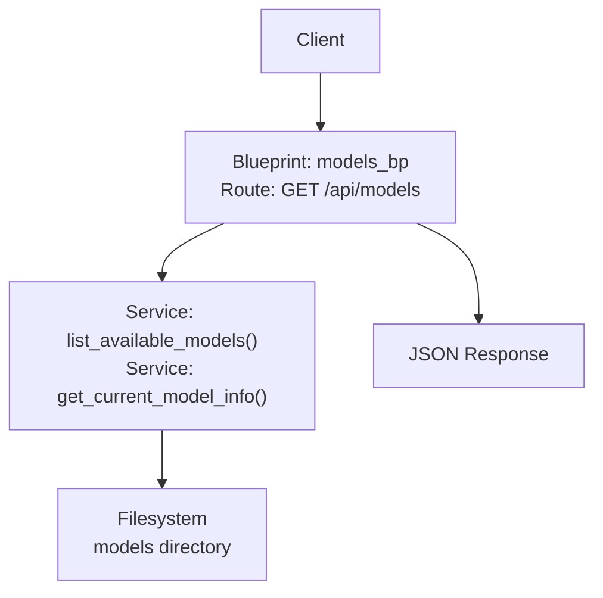
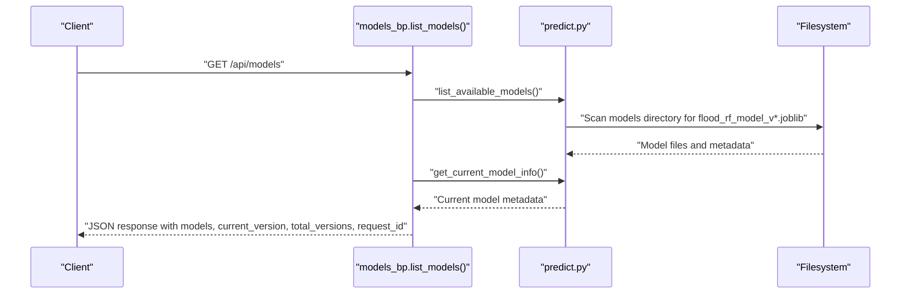
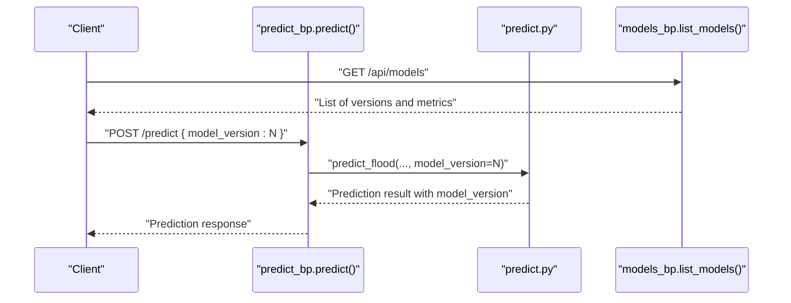
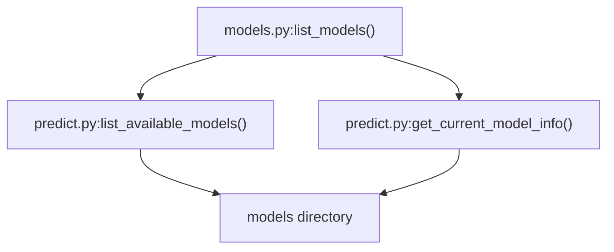

# GET /api/models

<cite>
**Referenced Files in This Document**
- [backend/app/api/routes/models.py](file://backend/app/api/routes/models.py)
- [backend/app/services/predict.py](file://backend/app/services/predict.py)
- [backend/app/api/routes/predict.py](file://backend/app/api/routes/predict.py)
- [backend/docs/MODEL_MANAGEMENT.md](file://backend/docs/MODEL_MANAGEMENT.md)
- [backend/app/api/middleware/auth.py](file://backend/app/api/middleware/auth.py)
</cite>

## Table of Contents
1. [Introduction](#introduction)
2. [Project Structure](#project-structure)
3. [Core Components](#core-components)
4. [Architecture Overview](#architecture-overview)
5. [Detailed Component Analysis](#detailed-component-analysis)
6. [Dependency Analysis](#dependency-analysis)
7. [Performance Considerations](#performance-considerations)
8. [Troubleshooting Guide](#troubleshooting-guide)
9. [Conclusion](#conclusion)
10. [Appendices](#appendices)

## Introduction
This document provides API documentation for the GET /api/models endpoint in the floodingnaque backend. It explains how to list all available machine learning model versions, their metadata, and performance metrics. The endpoint returns a structured response that includes:
- A models array with version, path, creation date, and performance metrics (accuracy, precision, recall, F1 score)
- An is_current flag indicating whether a version is the active model
- The current_version field
- Additional metadata such as total_versions and request_id

The endpoint does not require authentication and takes no parameters. It supports model management, A/B testing, and rollback scenarios by exposing all model versions and their comparative metrics. The response integrates with the /predict endpoint’s model_version parameter to enable selecting a specific model version for inference.

## Project Structure
The GET /api/models endpoint is implemented as part of the models blueprint and relies on services that enumerate available models and retrieve current model metadata.

**Diagram sources**
- [backend/app/api/routes/models.py](file://backend/app/api/routes/models.py#L27-L65)
- [backend/app/services/predict.py](file://backend/app/services/predict.py#L33-L55)
- [backend/app/services/predict.py](file://backend/app/services/predict.py#L218-L236)

**Section sources**
- [backend/app/api/routes/models.py](file://backend/app/api/routes/models.py#L1-L150)
- [backend/app/services/predict.py](file://backend/app/services/predict.py#L1-L236)

## Core Components
- Endpoint: GET /api/models
- Authentication: Not required
- Parameters: None
- Response fields:
  - models: array of objects with:
    - version: integer
    - path: string (model file path)
    - is_current: boolean
    - created_at: string (ISO timestamp)
    - metrics: object with accuracy, precision, recall, f1_score
  - current_version: integer or null
  - total_versions: integer
  - request_id: string

Behavior highlights:
- Lists all model versions found in the models directory
- Uses the current model metadata to compute is_current
- Returns a compact representation of metrics for quick comparison

**Section sources**
- [backend/app/api/routes/models.py](file://backend/app/api/routes/models.py#L27-L65)
- [backend/app/services/predict.py](file://backend/app/services/predict.py#L33-L55)
- [backend/app/services/predict.py](file://backend/app/services/predict.py#L218-L236)

## Architecture Overview
The GET /api/models endpoint orchestrates two service functions:
- list_available_models(): enumerates model files and loads associated metadata
- get_current_model_info(): retrieves the metadata of the currently loaded model to determine current_version

**Diagram sources**
- [backend/app/api/routes/models.py](file://backend/app/api/routes/models.py#L27-L65)
- [backend/app/services/predict.py](file://backend/app/services/predict.py#L33-L55)
- [backend/app/services/predict.py](file://backend/app/services/predict.py#L218-L236)

## Detailed Component Analysis

### Endpoint Definition and Behavior
- HTTP method: GET
- URL pattern: /api/models
- Authentication: Not required
- Parameters: None
- Response shape:
  - models: array of objects with version, path, is_current, created_at, metrics
  - current_version: integer or null
  - total_versions: integer
  - request_id: string

Processing logic:
- Collect all model versions by scanning the models directory for files matching the naming convention
- Load metadata for each model if present
- Determine current_version from the currently loaded model metadata
- Compute is_current by comparing each version with current_version
- Build a compact response with metrics and metadata

**Section sources**
- [backend/app/api/routes/models.py](file://backend/app/api/routes/models.py#L27-L65)
- [backend/app/services/predict.py](file://backend/app/services/predict.py#L33-L55)
- [backend/app/services/predict.py](file://backend/app/services/predict.py#L218-L236)

### Response Structure Details
- models[] entries include:
  - version: integer
  - path: string
  - is_current: boolean
  - created_at: string (ISO timestamp) if metadata exists
  - metrics: object with:
    - accuracy: number or null
    - precision: number or null
    - recall: number or null
    - f1_score: number or null
- current_version: integer or null
- total_versions: integer
- request_id: string

Example response outline:
- models: [
  - { version, path, is_current, created_at, metrics }
]
- current_version: integer or null
- total_versions: integer
- request_id: string

**Section sources**
- [backend/app/api/routes/models.py](file://backend/app/api/routes/models.py#L27-L65)

### Integration with /predict and model_version
- The /predict endpoint accepts an optional model_version parameter in the request body
- When model_version is provided, the prediction service loads the specified model version for inference
- The /api/models endpoint enables selecting a version for A/B testing or rollback by exposing all versions and their metrics
- The current_version field helps identify the active model

**Diagram sources**
- [backend/app/api/routes/predict.py](file://backend/app/api/routes/predict.py#L20-L103)
- [backend/app/services/predict.py](file://backend/app/services/predict.py#L112-L216)
- [backend/app/api/routes/models.py](file://backend/app/api/routes/models.py#L27-L65)

**Section sources**
- [backend/app/api/routes/predict.py](file://backend/app/api/routes/predict.py#L20-L103)
- [backend/app/services/predict.py](file://backend/app/services/predict.py#L112-L216)

### Authentication and Security Notes
- GET /api/models does not require authentication
- Authentication middleware is not applied to this endpoint
- Other endpoints may require API keys depending on configuration

**Section sources**
- [backend/app/api/routes/models.py](file://backend/app/api/routes/models.py#L27-L65)
- [backend/app/api/middleware/auth.py](file://backend/app/api/middleware/auth.py#L1-L94)

### Example Responses
- Single model version response:
  - models: [{ version, path, is_current, created_at, metrics }]
  - current_version: integer or null
  - total_versions: integer
  - request_id: string

- Multiple model versions response:
  - models: [
    - { version: 1, path: ".../flood_rf_model_v1.joblib", is_current: false, created_at: "...", metrics: { accuracy, precision, recall, f1_score } },
    - { version: 2, path: ".../flood_rf_model_v2.joblib", is_current: true, created_at: "...", metrics: { accuracy, precision, recall, f1_score } },
    - { version: 3, path: ".../flood_rf_model_v3.joblib", is_current: false, created_at: "...", metrics: { accuracy, precision, recall, f1_score } }
  ]
  - current_version: 2
  - total_versions: 3
  - request_id: string

Note: The exact fields and values depend on the presence of metadata files for each model.

**Section sources**
- [backend/docs/MODEL_MANAGEMENT.md](file://backend/docs/MODEL_MANAGEMENT.md#L70-L93)

### Usage Examples

#### JavaScript (fetch)
- GET /api/models
  - Method: GET
  - URL: /api/models
  - Headers: none required
  - Response: JSON with models, current_version, total_versions, request_id

#### Python (requests)
- GET /api/models
  - Method: GET
  - URL: /api/models
  - Headers: none required
  - Response: JSON with models, current_version, total_versions, request_id

Integration with /predict:
- POST /predict with model_version parameter to select a specific model version for inference

**Section sources**
- [backend/app/api/routes/predict.py](file://backend/app/api/routes/predict.py#L20-L103)
- [backend/docs/MODEL_MANAGEMENT.md](file://backend/docs/MODEL_MANAGEMENT.md#L111-L121)

## Dependency Analysis
The endpoint depends on:
- list_available_models(): discovers model files and metadata
- get_current_model_info(): determines the active model metadata for current_version

**Diagram sources**
- [backend/app/api/routes/models.py](file://backend/app/api/routes/models.py#L27-L65)
- [backend/app/services/predict.py](file://backend/app/services/predict.py#L33-L55)
- [backend/app/services/predict.py](file://backend/app/services/predict.py#L218-L236)

**Section sources**
- [backend/app/api/routes/models.py](file://backend/app/api/routes/models.py#L27-L65)
- [backend/app/services/predict.py](file://backend/app/services/predict.py#L33-L55)
- [backend/app/services/predict.py](file://backend/app/services/predict.py#L218-L236)

## Performance Considerations
- Scanning the models directory is O(N) with respect to the number of model files
- Loading metadata files is O(1) per model file
- The response is lightweight and suitable for frequent polling
- Consider caching the response at the application layer if the model directory is static

[No sources needed since this section provides general guidance]

## Troubleshooting Guide
Common issues and impacts:
- Missing model files:
  - The models directory may be empty or inaccessible
  - The endpoint returns an empty models array and current_version as null
- Corrupted or missing metadata:
  - Metadata loading may fail silently, resulting in missing created_at and metrics fields for affected versions
- No current model loaded:
  - current_version may be null if the service cannot load the current model metadata

Mitigation steps:
- Ensure the models directory exists and contains model files with the expected naming convention
- Verify that metadata JSON files accompany model files
- Confirm that the application has read permissions for the models directory

**Section sources**
- [backend/app/services/predict.py](file://backend/app/services/predict.py#L33-L55)
- [backend/app/services/predict.py](file://backend/app/services/predict.py#L18-L31)
- [backend/app/services/predict.py](file://backend/app/services/predict.py#L218-L236)

## Conclusion
GET /api/models provides a simple, unauthenticated way to discover all available model versions, their metadata, and performance metrics. It enables model management, A/B testing, and rollback scenarios by exposing comparative metrics and identifying the active model. Combined with the /predict endpoint’s model_version parameter, it supports flexible and auditable model selection for inference.

[No sources needed since this section summarizes without analyzing specific files]

## Appendices

### API Reference Summary
- Endpoint: GET /api/models
- Authentication: Not required
- Parameters: None
- Response fields:
  - models: array of objects with version, path, is_current, created_at, metrics
  - current_version: integer or null
  - total_versions: integer
  - request_id: string

**Section sources**
- [backend/app/api/routes/models.py](file://backend/app/api/routes/models.py#L27-L65)