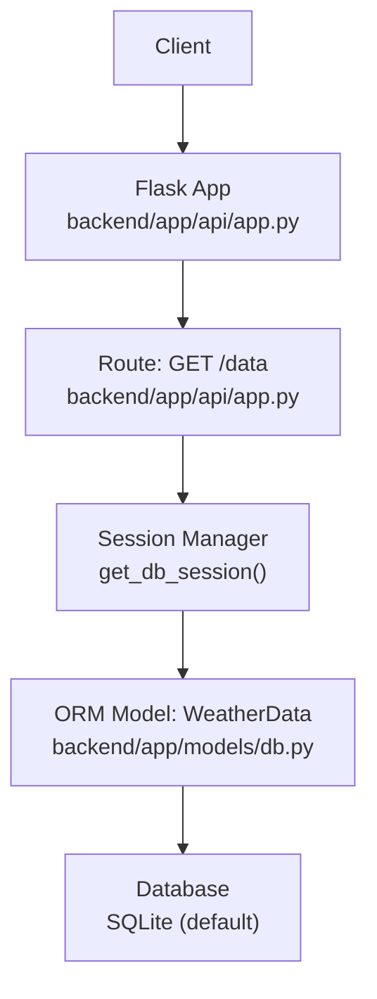
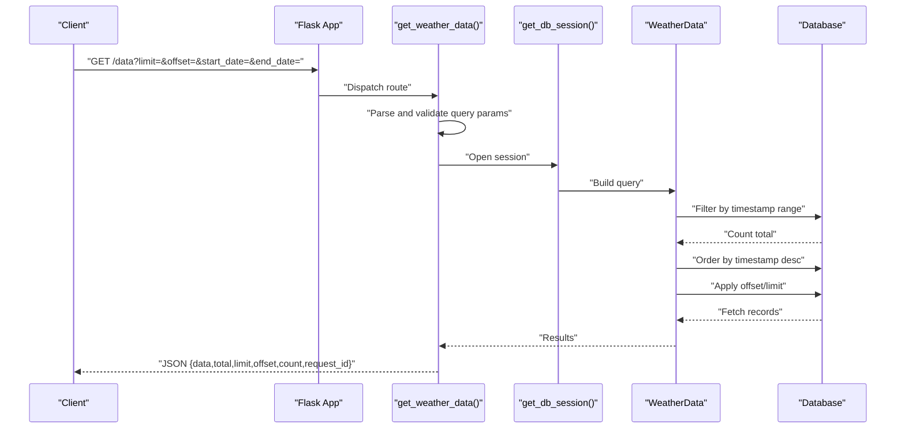
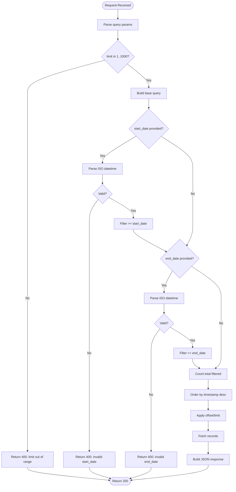
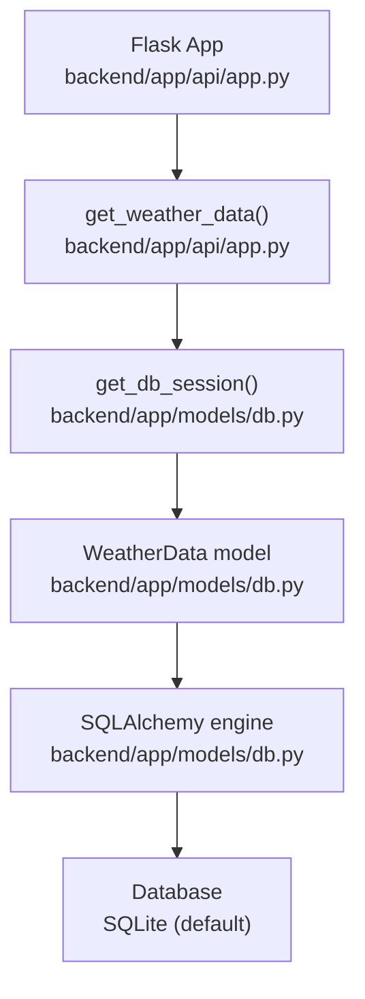

# GET /data

<cite>
**Referenced Files in This Document**
- [backend/app/api/app.py](file://backend/app/api/app.py)
- [backend/app/models/db.py](file://backend/app/models/db.py)
- [backend/docs/DATABASE_SETUP.md](file://backend/docs/DATABASE_SETUP.md)
- [backend/docs/FRONTEND_INTEGRATION.md](file://backend/docs/FRONTEND_INTEGRATION.md)
- [backend/docs/BACKEND_COMPLETE.md](file://backend/docs/BACKEND_COMPLETE.md)
- [backend/docs/POWERSHELL_API_EXAMPLES.md](file://backend/docs/POWERSHELL_API_EXAMPLES.md)
- [backend/main.py](file://backend/main.py)
</cite>

## Table of Contents
1. [Introduction](#introduction)
2. [Project Structure](#project-structure)
3. [Core Components](#core-components)
4. [Architecture Overview](#architecture-overview)
5. [Detailed Component Analysis](#detailed-component-analysis)
6. [Dependency Analysis](#dependency-analysis)
7. [Performance Considerations](#performance-considerations)
8. [Troubleshooting Guide](#troubleshooting-guide)
9. [Conclusion](#conclusion)
10. [Appendices](#appendices)

## Introduction
This document provides API documentation for the GET /data endpoint in the floodingnaque backend. The endpoint retrieves historical weather data from the database for analysis and visualization. It supports pagination via limit and offset, and allows filtering by a time range using start_date and end_date. Responses are returned in JSON format and include metadata such as total count and pagination details. No authentication is required. Timestamps are returned in ISO format.

## Project Structure
The GET /data endpoint is implemented in the Flask application module and interacts with the SQLAlchemy ORM model for the weather data table. The database is initialized automatically and uses a scoped session for thread-safe operations.

**Diagram sources**
- [backend/app/api/app.py](file://backend/app/api/app.py#L340-L405)
- [backend/app/models/db.py](file://backend/app/models/db.py#L1-L37)

**Section sources**
- [backend/app/api/app.py](file://backend/app/api/app.py#L340-L405)
- [backend/app/models/db.py](file://backend/app/models/db.py#L1-L37)
- [backend/main.py](file://backend/main.py#L1-L25)

## Core Components
- Endpoint: GET /data
- Purpose: Retrieve historical weather data with optional time range filtering and pagination
- Authentication: Not required
- Response format: JSON with data array, total count, pagination metadata, and request_id

Key implementation references:
- Route definition and handler: [backend/app/api/app.py](file://backend/app/api/app.py#L340-L405)
- Database model and session management: [backend/app/models/db.py](file://backend/app/models/db.py#L1-L37)
- Database schema and initialization: [backend/docs/DATABASE_SETUP.md](file://backend/docs/DATABASE_SETUP.md#L27-L48)

**Section sources**
- [backend/app/api/app.py](file://backend/app/api/app.py#L340-L405)
- [backend/app/models/db.py](file://backend/app/models/db.py#L1-L37)
- [backend/docs/DATABASE_SETUP.md](file://backend/docs/DATABASE_SETUP.md#L27-L48)

## Architecture Overview
The GET /data flow involves parsing query parameters, applying filters, counting total matching records, ordering by timestamp descending, paginating, and returning structured JSON.

**Diagram sources**
- [backend/app/api/app.py](file://backend/app/api/app.py#L340-L405)
- [backend/app/models/db.py](file://backend/app/models/db.py#L1-L37)

## Detailed Component Analysis

### Endpoint Definition and Behavior
- HTTP Method: GET
- URL Pattern: /data
- Query Parameters:
  - limit (integer, 1–1000, default 100)
  - offset (integer, default 0)
  - start_date (ISO datetime string, optional)
  - end_date (ISO datetime string, optional)
- Response Schema:
  - data: array of weather records
  - total: integer count of matching records
  - limit: integer limit used
  - offset: integer offset used
  - count: integer number of records returned
  - request_id: string identifier for tracing

Implementation references:
- Route registration and handler: [backend/app/api/app.py](file://backend/app/api/app.py#L340-L405)
- Documentation endpoint for GET /data: [backend/app/api/app.py](file://backend/app/api/app.py#L492-L507)
- Database model definition: [backend/app/models/db.py](file://backend/app/models/db.py#L13-L20)

**Section sources**
- [backend/app/api/app.py](file://backend/app/api/app.py#L340-L405)
- [backend/app/api/app.py](file://backend/app/api/app.py#L492-L507)
- [backend/app/models/db.py](file://backend/app/models/db.py#L13-L20)

### Request Flow and Validation
- Parameter parsing and validation:
  - limit validated to be within 1–1000; otherwise returns 400 with error message
  - start_date and end_date parsed using ISO format; invalid formats return 400 with error message
- Filtering:
  - If start_date provided, filter records with timestamp greater than or equal to start_date
  - If end_date provided, filter records with timestamp less than or equal to end_date
- Pagination:
  - Order by timestamp descending
  - Apply offset and limit
- Response construction:
  - data array contains id, temperature, humidity, precipitation, timestamp (ISO)
  - total is the count of filtered records
  - limit, offset, count included for client-side pagination logic
  - request_id added for tracing

**Diagram sources**
- [backend/app/api/app.py](file://backend/app/api/app.py#L340-L405)

**Section sources**
- [backend/app/api/app.py](file://backend/app/api/app.py#L340-L405)

### Response Schema Details
- Top-level fields:
  - data: array of weather records
  - total: integer
  - limit: integer
  - offset: integer
  - count: integer
  - request_id: string
- Individual record structure:
  - id: integer
  - temperature: float
  - humidity: float
  - precipitation: float
  - timestamp: string (ISO datetime)

References:
- Response construction: [backend/app/api/app.py](file://backend/app/api/app.py#L383-L399)
- Database model fields: [backend/app/models/db.py](file://backend/app/models/db.py#L13-L20)

**Section sources**
- [backend/app/api/app.py](file://backend/app/api/app.py#L383-L399)
- [backend/app/models/db.py](file://backend/app/models/db.py#L13-L20)

### Example Requests and Responses
Note: The following examples illustrate typical usage. Replace the base URL with your deployed API endpoint.

- Basic pagination
  - Request: GET /data?limit=10&offset=0
  - Response: JSON with data array of up to 10 records, total, limit, offset, count, and request_id

- Filter by date range
  - Request: GET /data?start_date=2025-01-01T00:00:00&end_date=2025-12-31T23:59:59&limit=100&offset=0
  - Response: JSON with filtered data array, total reflecting filtered count, and pagination metadata

- Combined filters
  - Request: GET /data?start_date=2025-12-01T00:00:00&limit=50&offset=0
  - Response: JSON with filtered data array, total, limit, offset, count, and request_id

References:
- Frontend integration example using GET /data: [backend/docs/FRONTEND_INTEGRATION.md](file://backend/docs/FRONTEND_INTEGRATION.md#L101-L140)
- Additional PowerShell examples: [backend/docs/POWERSHELL_API_EXAMPLES.md](file://backend/docs/POWERSHELL_API_EXAMPLES.md#L126-L144)
- Backend documentation for GET /data: [backend/docs/BACKEND_COMPLETE.md](file://backend/docs/BACKEND_COMPLETE.md#L113-L126)

**Section sources**
- [backend/docs/FRONTEND_INTEGRATION.md](file://backend/docs/FRONTEND_INTEGRATION.md#L101-L140)
- [backend/docs/POWERSHELL_API_EXAMPLES.md](file://backend/docs/POWERSHELL_API_EXAMPLES.md#L126-L144)
- [backend/docs/BACKEND_COMPLETE.md](file://backend/docs/BACKEND_COMPLETE.md#L113-L126)

### Usage Examples

#### JavaScript (fetch)
- Basic usage with pagination:
  - fetch("http://localhost:5000/data?limit=10&offset=0")
    .then(response => response.json())
    .then(data => console.log(data))
    .catch(error => console.error("Error:", error))

Reference:
- Frontend integration example: [backend/docs/FRONTEND_INTEGRATION.md](file://backend/docs/FRONTEND_INTEGRATION.md#L101-L140)

**Section sources**
- [backend/docs/FRONTEND_INTEGRATION.md](file://backend/docs/FRONTEND_INTEGRATION.md#L101-L140)

#### Python (requests)
- Basic usage with pagination:
  - import requests
  - response = requests.get("http://localhost:5000/data?limit=10&offset=0")
  - data = response.json()
  - print(data)

Reference:
- Frontend integration example: [backend/docs/FRONTEND_INTEGRATION.md](file://backend/docs/FRONTEND_INTEGRATION.md#L101-L140)

**Section sources**
- [backend/docs/FRONTEND_INTEGRATION.md](file://backend/docs/FRONTEND_INTEGRATION.md#L101-L140)

## Dependency Analysis
The GET /data endpoint depends on:
- Flask routing and request handling
- SQLAlchemy ORM model WeatherData
- Database session management
- Environment configuration for database URL

**Diagram sources**
- [backend/app/api/app.py](file://backend/app/api/app.py#L340-L405)
- [backend/app/models/db.py](file://backend/app/models/db.py#L1-L37)

**Section sources**
- [backend/app/api/app.py](file://backend/app/api/app.py#L340-L405)
- [backend/app/models/db.py](file://backend/app/models/db.py#L1-L37)

## Performance Considerations
- Large datasets:
  - Use limit and offset to page results and avoid loading excessive data in a single request.
  - Combine with start_date and end_date to reduce the dataset size early in the query.
- Indexing:
  - Proper indexing on the timestamp column is crucial for efficient filtering and sorting. Without an index, queries may scan the entire table, leading to slow responses as data grows.
  - The current model defines timestamp as a DateTime column. Consider adding an index on timestamp in production deployments for optimal performance.
- Database choice:
  - SQLite is used by default. For high-throughput or large-scale deployments, consider PostgreSQL or MySQL, which offer better performance characteristics and indexing capabilities.

References:
- Database schema and initialization: [backend/docs/DATABASE_SETUP.md](file://backend/docs/DATABASE_SETUP.md#L27-L48)
- Default database configuration: [backend/app/models/db.py](file://backend/app/models/db.py#L8-L12)

**Section sources**
- [backend/docs/DATABASE_SETUP.md](file://backend/docs/DATABASE_SETUP.md#L27-L48)
- [backend/app/models/db.py](file://backend/app/models/db.py#L8-L12)

## Troubleshooting Guide
Common issues and resolutions:

- Invalid limit
  - Symptom: 400 error indicating limit must be between 1 and 1000
  - Resolution: Adjust limit to be within the allowed range

- Invalid date formats
  - Symptom: 400 error indicating invalid start_date or end_date format
  - Resolution: Ensure ISO format (YYYY-MM-DDTHH:MM:SS). Optionally append Z for UTC

- Database connectivity or query errors
  - Symptom: 500 error with error message and request_id
  - Resolution: Check server logs, verify database initialization, and confirm the database is reachable

- CORS-related issues (frontend)
  - Symptom: Cross-origin request blocked
  - Resolution: CORS is enabled in the Flask app; ensure requests originate from allowed origins

References:
- Error handling in handler: [backend/app/api/app.py](file://backend/app/api/app.py#L340-L405)
- CORS configuration: [backend/app/api/app.py](file://backend/app/api/app.py#L72-L74)
- Frontend integration error handling: [backend/docs/FRONTEND_INTEGRATION.md](file://backend/docs/FRONTEND_INTEGRATION.md#L142-L177)

**Section sources**
- [backend/app/api/app.py](file://backend/app/api/app.py#L340-L405)
- [backend/app/api/app.py](file://backend/app/api/app.py#L72-L74)
- [backend/docs/FRONTEND_INTEGRATION.md](file://backend/docs/FRONTEND_INTEGRATION.md#L142-L177)

## Conclusion
The GET /data endpoint provides a straightforward way to retrieve historical weather data with robust pagination and time-range filtering. It returns a consistent JSON structure suitable for visualization and analysis. For reliable performance at scale, ensure proper indexing on the timestamp column and consider migrating from SQLite to a production-grade database.

## Appendices

### API Reference Summary
- Endpoint: GET /data
- Query Parameters:
  - limit (1–1000, default 100)
  - offset (default 0)
  - start_date (ISO datetime, optional)
  - end_date (ISO datetime, optional)
- Response Fields:
  - data: array of records
  - total: integer
  - limit: integer
  - offset: integer
  - count: integer
  - request_id: string
- Record Fields:
  - id: integer
  - temperature: float
  - humidity: float
  - precipitation: float
  - timestamp: string (ISO datetime)

References:
- Handler implementation: [backend/app/api/app.py](file://backend/app/api/app.py#L340-L405)
- Documentation endpoint: [backend/app/api/app.py](file://backend/app/api/app.py#L492-L507)
- Database model: [backend/app/models/db.py](file://backend/app/models/db.py#L13-L20)

**Section sources**
- [backend/app/api/app.py](file://backend/app/api/app.py#L340-L405)
- [backend/app/api/app.py](file://backend/app/api/app.py#L492-L507)
- [backend/app/models/db.py](file://backend/app/models/db.py#L13-L20)