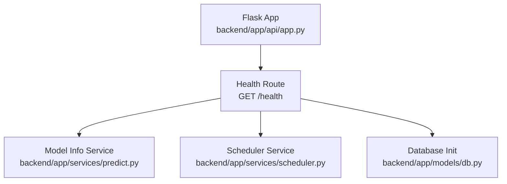
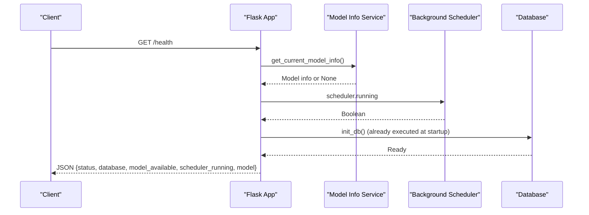
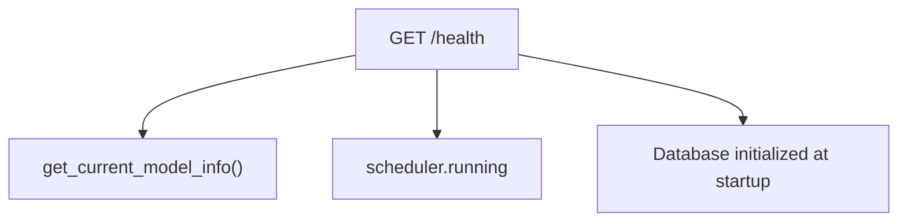

# GET /health

<cite>
**Referenced Files in This Document**
- [app.py](file://backend/app/api/app.py)
- [predict.py](file://backend/app/services/predict.py)
- [scheduler.py](file://backend/app/services/scheduler.py)
- [db.py](file://backend/app/models/db.py)
- [README.md](file://backend/README.md)
- [BACKEND_COMPLETE.md](file://backend/docs/BACKEND_COMPLETE.md)
- [POWERSHELL_API_EXAMPLES.md](file://backend/docs/POWERSHELL_API_EXAMPLES.md)
</cite>

## Table of Contents
1. [Introduction](#introduction)
2. [Project Structure](#project-structure)
3. [Core Components](#core-components)
4. [Architecture Overview](#architecture-overview)
5. [Detailed Component Analysis](#detailed-component-analysis)
6. [Dependency Analysis](#dependency-analysis)
7. [Performance Considerations](#performance-considerations)
8. [Troubleshooting Guide](#troubleshooting-guide)
9. [Conclusion](#conclusion)

## Introduction
This document provides API documentation for the GET /health endpoint in the floodingnaque backend. It explains that this endpoint performs a detailed health check, returning comprehensive system diagnostics including model metadata, scheduler status, and database connectivity. The endpoint is useful for production monitoring and troubleshooting because it surfaces deeper operational signals compared to the basic /status endpoint.

Key facts:
- HTTP method: GET
- URL pattern: /health
- Authentication: Not required
- Request parameters: Not required
- Response: JSON object containing status, database connectivity, model availability, scheduler status, and nested model information such as version, metrics, and creation date

## Project Structure
The /health endpoint is defined in the Flask application module and integrates with services for model metadata, scheduler status, and database initialization.

**Diagram sources**
- [app.py](file://backend/app/api/app.py#L306-L339)
- [predict.py](file://backend/app/services/predict.py#L218-L236)
- [scheduler.py](file://backend/app/services/scheduler.py#L1-L15)
- [db.py](file://backend/app/models/db.py#L1-L37)

**Section sources**
- [app.py](file://backend/app/api/app.py#L306-L339)
- [README.md](file://backend/README.md#L44-L64)

## Core Components
- Health route handler: Implements GET /health and constructs a structured JSON response.
- Model info provider: Supplies current model metadata and availability.
- Scheduler status: Reports whether the background scheduler is running.
- Database initialization: Ensures database connectivity is available.

Response schema highlights:
- status: String indicating overall system health.
- database: String indicating database connectivity state.
- model_available: Boolean indicating if a model is available.
- scheduler_running: Boolean indicating scheduler activity.
- model: Nested object with:
  - loaded: Boolean indicating model load status.
  - type: String describing the model type.
  - path: String with the model file path.
  - features: Array of feature names used by the model.
  - version: Integer or string version identifier.
  - created_at: ISO timestamp string for model creation.
  - metrics: Object containing accuracy, precision, recall, and f1_score.

**Section sources**
- [app.py](file://backend/app/api/app.py#L306-L339)
- [predict.py](file://backend/app/services/predict.py#L218-L236)
- [scheduler.py](file://backend/app/services/scheduler.py#L1-L15)
- [db.py](file://backend/app/models/db.py#L1-L37)

## Architecture Overview
The GET /health endpoint orchestrates checks across model availability, scheduler status, and database connectivity. It returns a consolidated JSON payload suitable for automated monitoring systems.

**Diagram sources**
- [app.py](file://backend/app/api/app.py#L306-L339)
- [predict.py](file://backend/app/services/predict.py#L218-L236)
- [scheduler.py](file://backend/app/services/scheduler.py#L1-L15)
- [db.py](file://backend/app/models/db.py#L1-L37)

## Detailed Component Analysis

### Endpoint Definition and Behavior
- Route registration: The endpoint is registered at GET /health.
- Model availability: Determined by attempting to retrieve current model info.
- Scheduler status: Retrieved from the scheduler’s running property.
- Database connectivity: Assumed connected since database initialization occurs at application startup.

Response construction logic:
- status: Always set to a healthy state string.
- database: Always set to a connected state string.
- model_available: Boolean derived from model info presence.
- scheduler_running: Boolean from scheduler.running.
- model: Nested object populated when model info is present, including type, path, features, version, created_at, and metrics.

**Section sources**
- [app.py](file://backend/app/api/app.py#L306-L339)

### Model Metadata Provider
- Purpose: Provides current model information including metadata and features.
- Behavior: Lazily loads the model if not already loaded and returns structured info including metadata and feature names.

Implications for /health:
- Enables inclusion of model version, creation date, and performance metrics in the response.
- Supports backward compatibility by returning None when no model is available.

**Section sources**
- [predict.py](file://backend/app/services/predict.py#L218-L236)

### Scheduler Integration
- Purpose: Background scheduler for periodic tasks.
- Behavior: Starts during application initialization and exposes a running flag used by /health.

Implications for /health:
- Indicates whether scheduled ingestion is active.
- Helps detect operational anomalies if the scheduler is not running.

**Section sources**
- [scheduler.py](file://backend/app/services/scheduler.py#L1-L15)

### Database Connectivity
- Purpose: Initializes database engine and tables.
- Behavior: Executed at application startup; subsequent health checks assume connectivity.

Implications for /health:
- Ensures database readiness is reflected consistently.
- Does not perform explicit runtime connectivity checks in /health.

**Section sources**
- [db.py](file://backend/app/models/db.py#L1-L37)

### Difference Between /health and /status
- /status: Returns a compact system status with minimal fields.
- /health: Returns a richer diagnostic payload including model metadata, scheduler status, and database connectivity, enabling deeper inspection.

Practical usage:
- Use /status for quick liveness checks.
- Use /health for comprehensive system diagnostics and troubleshooting.

**Section sources**
- [app.py](file://backend/app/api/app.py#L123-L139)
- [BACKEND_COMPLETE.md](file://backend/docs/BACKEND_COMPLETE.md#L49-L87)

## Dependency Analysis
The /health endpoint depends on:
- Model info service for metadata and availability.
- Scheduler service for runtime status.
- Database initialization for connectivity assurance.

**Diagram sources**
- [app.py](file://backend/app/api/app.py#L306-L339)
- [predict.py](file://backend/app/services/predict.py#L218-L236)
- [scheduler.py](file://backend/app/services/scheduler.py#L1-L15)
- [db.py](file://backend/app/models/db.py#L1-L37)

**Section sources**
- [app.py](file://backend/app/api/app.py#L306-L339)
- [predict.py](file://backend/app/services/predict.py#L218-L236)
- [scheduler.py](file://backend/app/services/scheduler.py#L1-L15)
- [db.py](file://backend/app/models/db.py#L1-L37)

## Performance Considerations
- The endpoint performs lightweight checks: model info retrieval, scheduler status, and database initialization.
- No heavy computations or external API calls are involved, so latency is low.
- For production monitoring, consider caching or rate-limiting if the endpoint is polled frequently.

[No sources needed since this section provides general guidance]

## Troubleshooting Guide
Common scenarios and what the response indicates:
- model_available is false: The model was not loaded or could not be found. Check model files and metadata.
- scheduler_running is false: The background scheduler is not active. Investigate startup logs and scheduler configuration.
- database connectivity: If database initialization fails at startup, the application would not reach the health endpoint. Verify environment variables and database URL.

Operational tips:
- Use the /api/docs endpoint to review endpoint definitions and expected responses.
- Compare /status and /health responses to isolate issues (e.g., model vs scheduler vs database).

**Section sources**
- [app.py](file://backend/app/api/app.py#L454-L535)
- [db.py](file://backend/app/models/db.py#L1-L37)

## Conclusion
The GET /health endpoint offers a comprehensive health snapshot for the floodingnaque backend, integrating model metadata, scheduler status, and database connectivity. It is ideal for production monitoring and troubleshooting, providing richer diagnostics than the basic /status endpoint. Use it alongside /status for quick checks and deeper inspection when needed.

[No sources needed since this section summarizes without analyzing specific files]

## Appendices

### Response Schema Details
- status: String
- database: String
- model_available: Boolean
- scheduler_running: Boolean
- model.loaded: Boolean
- model.type: String
- model.path: String
- model.features: Array of strings
- model.version: Integer or string
- model.created_at: ISO timestamp string
- model.metrics.accuracy: Number
- model.metrics.precision: Number
- model.metrics.recall: Number
- model.metrics.f1_score: Number

**Section sources**
- [app.py](file://backend/app/api/app.py#L306-L339)

### Example Responses

Healthy state:
- status: "healthy"
- database: "connected"
- model_available: true
- scheduler_running: true
- model.loaded: true
- model.type: "RandomForestClassifier"
- model.path: "models/flood_rf_model.joblib"
- model.features: ["temperature","humidity","precipitation"]
- model.version: 3
- model.created_at: "2025-01-15T10:30:00"
- model.metrics.accuracy: 0.95
- model.metrics.precision: 0.94
- model.metrics.recall: 0.96
- model.metrics.f1_score: 0.95

Degraded state (example):
- status: "healthy"
- database: "connected"
- model_available: false
- scheduler_running: false
- model: { "loaded": false }

**Section sources**
- [app.py](file://backend/app/api/app.py#L306-L339)
- [BACKEND_COMPLETE.md](file://backend/docs/BACKEND_COMPLETE.md#L343-L381)

### Usage Examples

Python requests:
- requests.get("http://localhost:5000/health")

PowerShell:
- Invoke-RestMethod -Uri "http://localhost:5000/health" -Method GET

Notes:
- No authentication header is required.
- No query parameters are required.

**Section sources**
- [README.md](file://backend/README.md#L44-L64)
- [POWERSHELL_API_EXAMPLES.md](file://backend/docs/POWERSHELL_API_EXAMPLES.md#L11-L21)