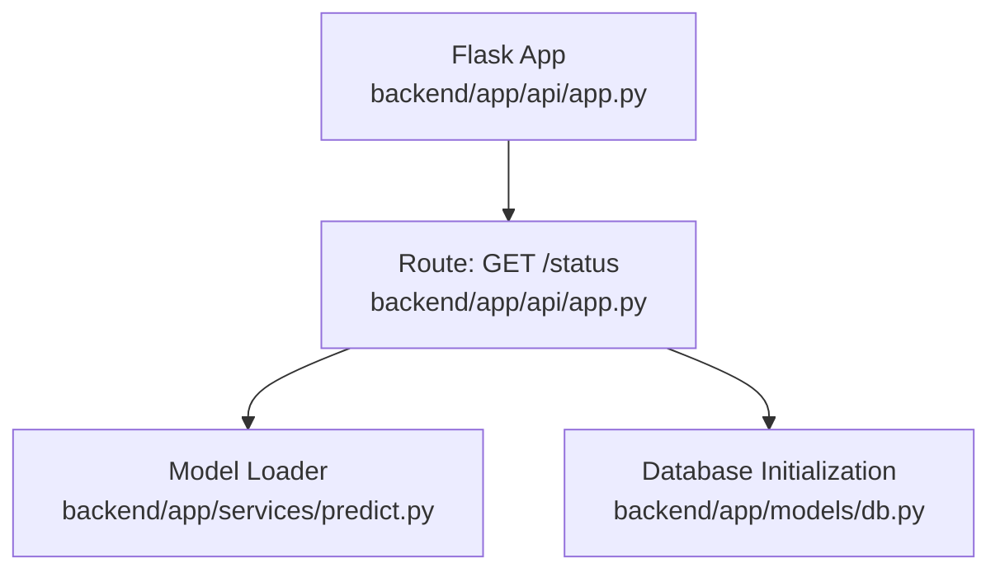
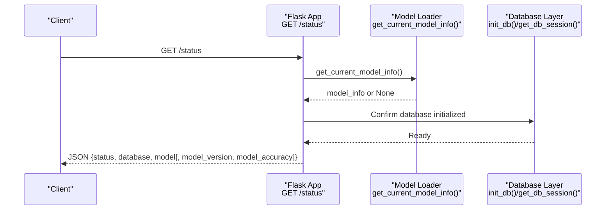
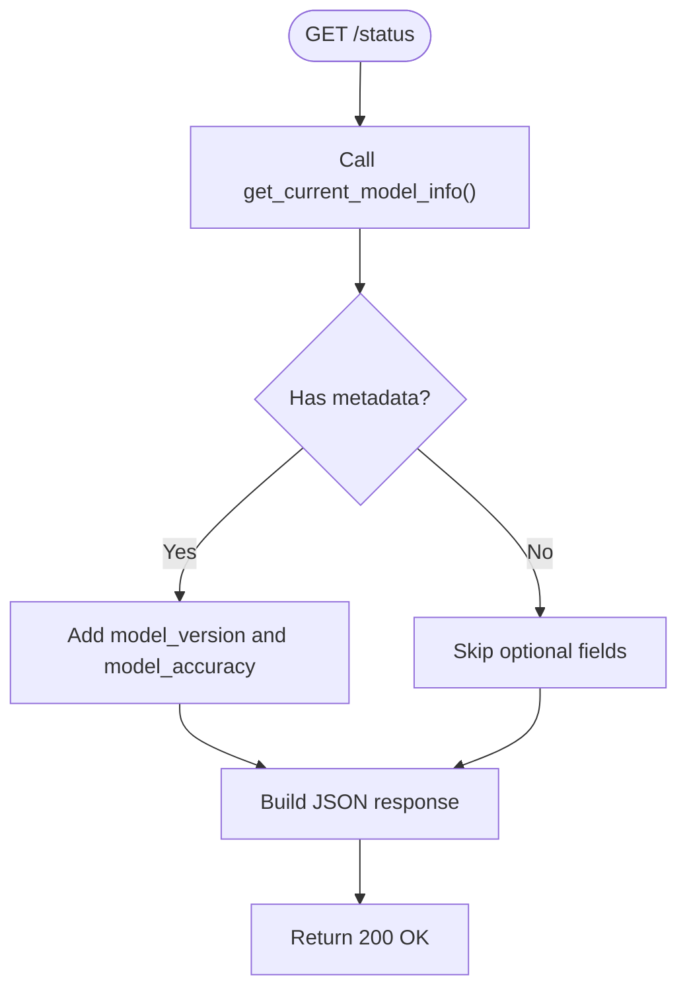
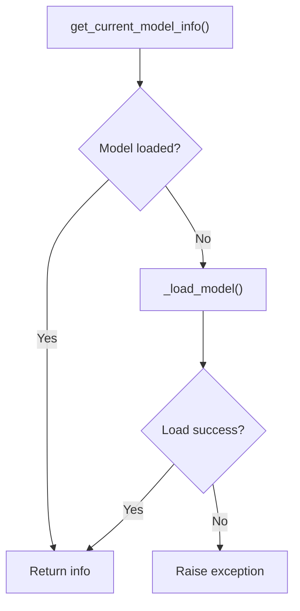
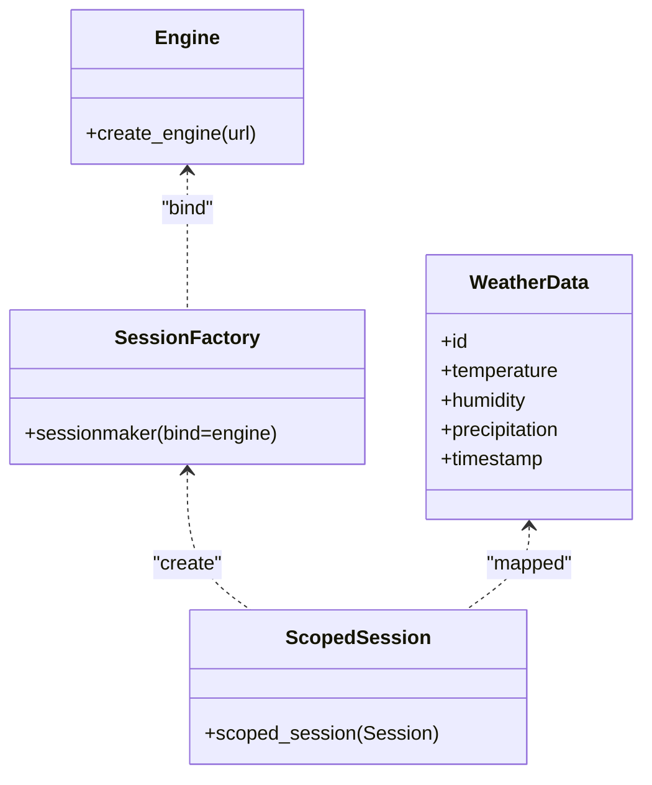
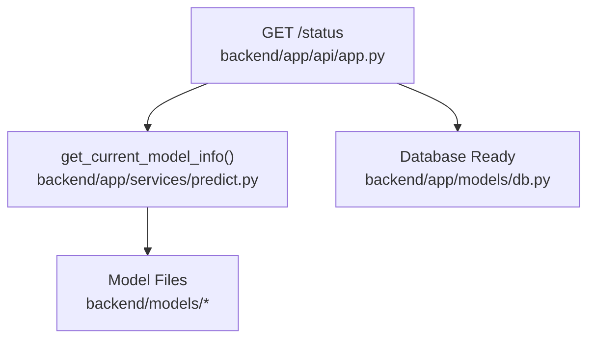

# GET /status

<cite>
**Referenced Files in This Document**
- [app.py](file://backend/app/api/app.py)
- [predict.py](file://backend/app/services/predict.py)
- [db.py](file://backend/app/models/db.py)
- [README.md](file://backend/README.md)
- [POWERSHELL_API_EXAMPLES.md](file://backend/docs/POWERSHELL_API_EXAMPLES.md)
- [BACKEND_COMPLETE.md](file://backend/docs/BACKEND_COMPLETE.md)
</cite>

## Table of Contents
1. [Introduction](#introduction)
2. [Project Structure](#project-structure)
3. [Core Components](#core-components)
4. [Architecture Overview](#architecture-overview)
5. [Detailed Component Analysis](#detailed-component-analysis)
6. [Dependency Analysis](#dependency-analysis)
7. [Performance Considerations](#performance-considerations)
8. [Troubleshooting Guide](#troubleshooting-guide)
9. [Conclusion](#conclusion)

## Introduction
This document provides API documentation for the GET /status endpoint in the floodingnaque backend. The endpoint serves as a lightweight health check that reports the operational status of the API, database connectivity, and model loading state. It is intended for quick system availability checks and monitoring integrations. The endpoint is publicly accessible and does not require authentication. It accepts no request parameters or body and returns a JSON payload indicating the current state of the system.

## Project Structure
The GET /status endpoint is defined within the Flask application module and integrates with the model loader and database initialization. The endpoint is registered alongside other API routes and is part of the application’s public interface.

**Diagram sources**
- [app.py](file://backend/app/api/app.py#L122-L139)
- [predict.py](file://backend/app/services/predict.py#L218-L235)
- [db.py](file://backend/app/models/db.py#L1-L37)

**Section sources**
- [app.py](file://backend/app/api/app.py#L122-L139)
- [README.md](file://backend/README.md#L44-L64)

## Core Components
- HTTP method: GET
- URL pattern: /status
- Authentication: Not required
- Request parameters/body: None
- Response format:
  - status: string, indicates API operational state
  - database: string, indicates database connection state
  - model: string, either “loaded” or “not found”
  - model_version: integer, included when model metadata is available
  - model_accuracy: float, included when model metadata is available

Behavior:
- The endpoint returns a JSON object with the above fields.
- The model field reflects whether the model is currently loaded or not.
- When model metadata is available, the response includes model_version and model_accuracy.

Success scenario (200 OK):
- Typical response includes status, database, model, model_version, and model_accuracy.

Error scenario (500 Internal Server Error):
- The endpoint itself does not explicitly return 500; however, if the underlying model loading raises an exception, the application may surface an error. The GET /health endpoint is recommended for detailed diagnostics.

**Section sources**
- [app.py](file://backend/app/api/app.py#L122-L139)
- [predict.py](file://backend/app/services/predict.py#L218-L235)

## Architecture Overview
The GET /status endpoint orchestrates a minimal health check by querying the current model information and confirming database readiness. It relies on the model loader and database initialization that occur during application startup.

**Diagram sources**
- [app.py](file://backend/app/api/app.py#L122-L139)
- [predict.py](file://backend/app/services/predict.py#L218-L235)
- [db.py](file://backend/app/models/db.py#L1-L37)

## Detailed Component Analysis

### Route Definition and Implementation
- The GET /status route is defined and returns a JSON object with status, database, and model fields.
- The model field is set to “loaded” if model metadata is available; otherwise “not found”.
- When model metadata is present, model_version and model_accuracy are included in the response.

**Diagram sources**
- [app.py](file://backend/app/api/app.py#L122-L139)
- [predict.py](file://backend/app/services/predict.py#L218-L235)

**Section sources**
- [app.py](file://backend/app/api/app.py#L122-L139)

### Model Loading Behavior
- The model loader lazily loads the model on demand. If the model is not yet loaded, the status endpoint triggers a load attempt.
- If the model file is missing or unreadable, the loader raises an exception. The status endpoint does not explicitly handle this exception; however, the GET /health endpoint provides richer diagnostics and can reveal model-related issues.

**Diagram sources**
- [predict.py](file://backend/app/services/predict.py#L218-L235)
- [predict.py](file://backend/app/services/predict.py#L74-L102)

**Section sources**
- [predict.py](file://backend/app/services/predict.py#L218-L235)

### Database Connectivity
- The application initializes the database at startup. The GET /status endpoint confirms database connectivity by relying on the established engine and session management.
- The database layer defines the engine and session factory and provides a context manager for safe session handling.

**Diagram sources**
- [db.py](file://backend/app/models/db.py#L1-L37)

**Section sources**
- [db.py](file://backend/app/models/db.py#L1-L37)

### Monitoring and Availability Checks
- GET /status is suitable for lightweight monitoring checks. It returns quickly and does not require authentication.
- For more detailed diagnostics, use GET /health, which includes model availability and scheduler status.

**Section sources**
- [app.py](file://backend/app/api/app.py#L306-L339)

## Dependency Analysis
The GET /status endpoint depends on:
- Model loader to determine model state
- Database initialization to confirm connectivity
- Flask routing to expose the endpoint

**Diagram sources**
- [app.py](file://backend/app/api/app.py#L122-L139)
- [predict.py](file://backend/app/services/predict.py#L218-L235)
- [db.py](file://backend/app/models/db.py#L1-L37)

**Section sources**
- [app.py](file://backend/app/api/app.py#L122-L139)
- [predict.py](file://backend/app/services/predict.py#L218-L235)
- [db.py](file://backend/app/models/db.py#L1-L37)

## Performance Considerations
- GET /status performs minimal work: checking model metadata and confirming database readiness. It is efficient and appropriate for frequent polling.
- Avoid excessive polling in production to reduce unnecessary load.

## Troubleshooting Guide
Common issues and impacts on the response:

- Database connection failure:
  - Symptoms: Unexpected errors when accessing other endpoints; GET /health may indicate database issues.
  - Impact on GET /status: The endpoint relies on the database being initialized at startup. If initialization fails, other endpoints may fail, but GET /status itself still returns a JSON response.

- Missing model files:
  - Symptoms: Prediction endpoints may return errors; GET /health indicates model not available.
  - Impact on GET /status: The model field will be “not found,” and optional fields model_version and model_accuracy will be omitted.

- Model loading exceptions:
  - Symptoms: Exceptions raised during model load can cause downstream errors.
  - Impact on GET /status: The endpoint does not explicitly handle model load exceptions; use GET /health for detailed diagnostics.

Recommended diagnostic steps:
- Use GET /health for comprehensive system status.
- Verify environment variables and model files exist.
- Check logs for error messages.

**Section sources**
- [app.py](file://backend/app/api/app.py#L306-L339)
- [predict.py](file://backend/app/services/predict.py#L74-L102)
- [db.py](file://backend/app/models/db.py#L1-L37)

## Conclusion
GET /status provides a fast, unauthenticated health check for the floodingnaque backend. It reports API status, database connectivity, and model loading state. For deeper diagnostics, use GET /health. The endpoint is ideal for monitoring and availability checks and integrates seamlessly with common client tools like curl and PowerShell.

## Real-World Usage Examples

### Using curl
- Basic GET /status:
  - curl http://localhost:5000/status

- With verbose output:
  - curl -v http://localhost:5000/status

### Using PowerShell
- Invoke-RestMethod:
  - Invoke-RestMethod -Uri "http://localhost:5000/status" -Method GET

- Try-catch pattern:
  - try { Invoke-RestMethod -Uri "http://localhost:5000/status"; Write-Host "Server is running" } catch { Write-Host "Server is not responding" }

**Section sources**
- [POWERSHELL_API_EXAMPLES.md](file://backend/docs/POWERSHELL_API_EXAMPLES.md#L193-L201)
- [README.md](file://backend/README.md#L44-L64)

## Example Responses

### Success (200 OK)
- Minimal response:
  - {
    - "status": "running",
    - "database": "connected",
    - "model": "loaded"
    - }

- With model metadata:
  - {
    - "status": "running",
    - "database": "connected",
    - "model": "loaded",
    - "model_version": 1,
    - "model_accuracy": 0.95
    - }

### Error (500 Internal Server Error)
- The GET /status endpoint itself does not explicitly return 500. However, if model loading fails or other internal errors occur, the application may surface an error. Prefer GET /health for detailed diagnostics.

**Section sources**
- [app.py](file://backend/app/api/app.py#L122-L139)
- [app.py](file://backend/app/api/app.py#L306-L339)