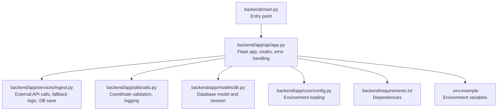
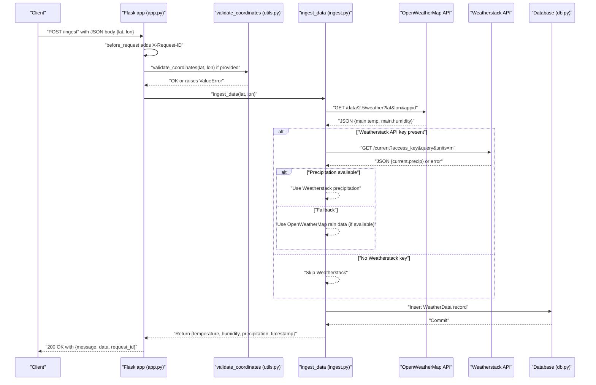
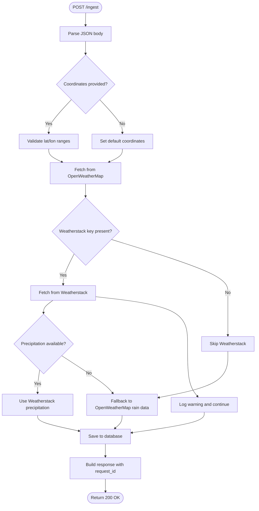
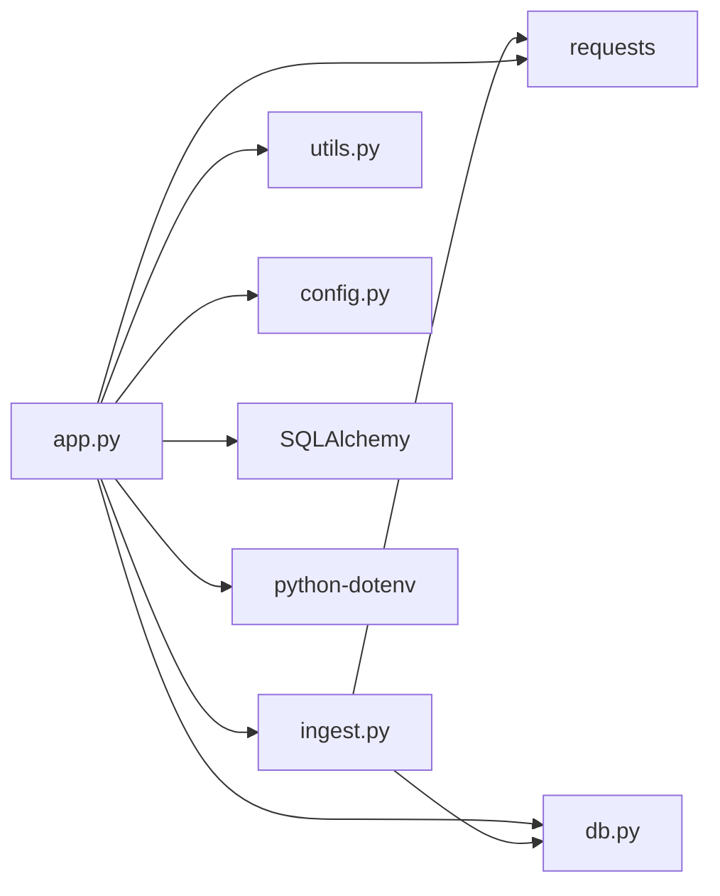

# POST /ingest

<cite>
**Referenced Files in This Document**
- [main.py](file://backend/main.py)
- [app.py](file://backend/app/api/app.py)
- [ingest.py](file://backend/app/services/ingest.py)
- [db.py](file://backend/app/models/db.py)
- [utils.py](file://backend/app/utils/utils.py)
- [config.py](file://backend/app/core/config.py)
- [requirements.txt](file://backend/requirements.txt)
- [.env.example](file://backend/.env.example)
- [BACKEND_COMPLETE.md](file://backend/docs/BACKEND_COMPLETE.md)
- [POWERSHELL_API_EXAMPLES.md](file://backend/docs/POWERSHELL_API_EXAMPLES.md)
</cite>

## Table of Contents
1. [Introduction](#introduction)
2. [Project Structure](#project-structure)
3. [Core Components](#core-components)
4. [Architecture Overview](#architecture-overview)
5. [Detailed Component Analysis](#detailed-component-analysis)
6. [Dependency Analysis](#dependency-analysis)
7. [Performance Considerations](#performance-considerations)
8. [Troubleshooting Guide](#troubleshooting-guide)
9. [Conclusion](#conclusion)
10. [Appendices](#appendices)

## Introduction
This document provides API documentation for the POST /ingest endpoint in the floodingnaque backend. The endpoint triggers weather data ingestion from external APIs (OpenWeatherMap and Weatherstack) for flood prediction. It accepts an optional request body with location coordinates (lat, lon), validates inputs, fetches weather metrics, stores them in the database, and returns a structured response including ingested weather data and request tracking.

## Project Structure
The POST /ingest endpoint is implemented in the Flask application and integrates with services and models for ingestion, persistence, and validation.

**Diagram sources**
- [main.py](file://backend/main.py#L1-L25)
- [app.py](file://backend/app/api/app.py#L1-L120)
- [ingest.py](file://backend/app/services/ingest.py#L1-L111)
- [db.py](file://backend/app/models/db.py#L1-L37)
- [utils.py](file://backend/app/utils/utils.py#L1-L48)
- [config.py](file://backend/app/core/config.py#L1-L10)
- [requirements.txt](file://backend/requirements.txt#L1-L15)
- [.env.example](file://backend/.env.example#L1-L4)

**Section sources**
- [main.py](file://backend/main.py#L1-L25)
- [app.py](file://backend/app/api/app.py#L1-L120)
- [requirements.txt](file://backend/requirements.txt#L1-L15)
- [.env.example](file://backend/.env.example#L1-L4)

## Core Components
- Flask application and routing: Defines the /ingest endpoint and global request lifecycle hooks.
- Ingestion service: Orchestrates fetching from OpenWeatherMap and Weatherstack, applies fallback logic, and persists data.
- Database model and session: Provides the WeatherData entity and session management for safe transactions.
- Utilities: Validates coordinates and sets up logging.
- Configuration: Loads environment variables for API keys and database connectivity.

**Section sources**
- [app.py](file://backend/app/api/app.py#L120-L223)
- [ingest.py](file://backend/app/services/ingest.py#L1-L111)
- [db.py](file://backend/app/models/db.py#L1-L37)
- [utils.py](file://backend/app/utils/utils.py#L1-L48)
- [config.py](file://backend/app/core/config.py#L1-L10)

## Architecture Overview
The POST /ingest endpoint follows a clear flow: request validation, coordinate validation, external API fetching with fallback, database storage, and response construction with request tracking.

**Diagram sources**
- [app.py](file://backend/app/api/app.py#L141-L223)
- [utils.py](file://backend/app/utils/utils.py#L39-L48)
- [ingest.py](file://backend/app/services/ingest.py#L9-L111)
- [db.py](file://backend/app/models/db.py#L13-L37)

## Detailed Component Analysis

### Endpoint Definition
- Method: POST
- URL: /ingest
- Purpose: Ingest weather data from external APIs for flood prediction.
- Behavior:
  - GET /ingest returns usage information and examples.
  - POST /ingest accepts optional JSON body with lat and lon, validates inputs, fetches weather data, saves to database, and returns a structured response.

**Section sources**
- [app.py](file://backend/app/api/app.py#L141-L174)
- [app.py](file://backend/app/api/app.py#L176-L223)

### Request Body
- Optional parameters:
  - lat: float, required range -90 to 90
  - lon: float, required range -180 to 180
- If lat or lon are omitted, the service falls back to default coordinates (New York City).

**Section sources**
- [app.py](file://backend/app/api/app.py#L146-L174)
- [utils.py](file://backend/app/utils/utils.py#L39-L48)
- [ingest.py](file://backend/app/services/ingest.py#L9-L30)

### Response Format
- Success response includes:
  - message: human-readable status
  - data: object containing
    - temperature: float (Kelvin)
    - humidity: float (%)
    - precipitation: float (mm/h)
    - timestamp: ISO datetime string
  - request_id: UUID string for request tracking

**Section sources**
- [app.py](file://backend/app/api/app.py#L206-L210)
- [db.py](file://backend/app/models/db.py#L13-L20)

### Internal Workflow
1. Request validation:
   - Generates X-Request-ID and logs request details.
   - Parses JSON body robustly, handling PowerShell curl escaping.
2. Coordinate validation:
   - Validates lat and lon ranges if provided.
3. Data fetching:
   - Fetches temperature and humidity from OpenWeatherMap.
   - Attempts Weatherstack for precipitation; falls back to OpenWeatherMap rain data if unavailable.
4. Database storage:
   - Inserts a WeatherData record with ingested fields.
5. Response:
   - Returns success with request_id for tracing.

**Diagram sources**
- [app.py](file://backend/app/api/app.py#L176-L223)
- [utils.py](file://backend/app/utils/utils.py#L39-L48)
- [ingest.py](file://backend/app/services/ingest.py#L37-L111)
- [db.py](file://backend/app/models/db.py#L13-L37)

**Section sources**
- [app.py](file://backend/app/api/app.py#L176-L223)
- [ingest.py](file://backend/app/services/ingest.py#L9-L111)
- [db.py](file://backend/app/models/db.py#L13-L37)

### Error Handling
- 400 Bad Request:
  - Invalid JSON body
  - Invalid coordinate ranges
- 500 Internal Server Error:
  - External API failures or database errors
- Error responses include request_id for correlation.

**Section sources**
- [app.py](file://backend/app/api/app.py#L186-L223)
- [ingest.py](file://backend/app/services/ingest.py#L51-L111)

### Fallback Behavior
- Default coordinates: New York City (40.7128, -74.0060) when lat or lon are not provided.
- Precipitation fallback:
  - Prefer Weatherstack if API key is configured.
  - Fallback to OpenWeatherMap rain data (converted hourly) if Weatherstack does not provide precipitation.

**Section sources**
- [ingest.py](file://backend/app/services/ingest.py#L25-L30)
- [ingest.py](file://backend/app/services/ingest.py#L62-L96)

### External API Integration
- OpenWeatherMap:
  - Temperature and humidity are extracted from the response.
  - Rain data is used for precipitation if available.
- Weatherstack:
  - Precipitation is taken from current.precip when available.
  - Errors are logged and ingestion continues with fallback.

**Section sources**
- [ingest.py](file://backend/app/services/ingest.py#L37-L96)

### Database Storage
- WeatherData entity fields: temperature, humidity, precipitation, timestamp.
- Session management uses scoped_session with automatic commit/rollback and cleanup.

**Section sources**
- [db.py](file://backend/app/models/db.py#L13-L37)

### Request Tracking
- X-Request-ID header is used to correlate logs and responses.
- The endpoint returns request_id in the response payload.

**Section sources**
- [app.py](file://backend/app/api/app.py#L85-L97)
- [app.py](file://backend/app/api/app.py#L205-L210)

## Dependency Analysis
- Flask app depends on:
  - Services for ingestion logic
  - Utilities for validation and logging
  - Models for database operations
  - Core config for environment variables
- External dependencies include requests, SQLAlchemy, APScheduler, and dotenv.

**Diagram sources**
- [app.py](file://backend/app/api/app.py#L1-L120)
- [ingest.py](file://backend/app/services/ingest.py#L1-L111)
- [db.py](file://backend/app/models/db.py#L1-L37)
- [utils.py](file://backend/app/utils/utils.py#L1-L48)
- [config.py](file://backend/app/core/config.py#L1-L10)
- [requirements.txt](file://backend/requirements.txt#L1-L15)

**Section sources**
- [requirements.txt](file://backend/requirements.txt#L1-L15)
- [app.py](file://backend/app/api/app.py#L1-L120)

## Performance Considerations
- External API timeouts are set to protect the service.
- Database operations use a scoped session to ensure thread safety and efficient resource management.
- Consider adding rate limiting and caching for high-traffic scenarios.

[No sources needed since this section provides general guidance]

## Troubleshooting Guide
Common issues and resolutions:
- Invalid JSON body:
  - Ensure the request body is valid JSON. The endpoint includes robust parsing for PowerShell curl escaping.
- Invalid coordinates:
  - lat must be between -90 and 90; lon must be between -180 and 180.
- Missing API keys:
  - OWM_API_KEY must be configured. Weatherstack key is optional but improves precipitation accuracy.
- External API rate limits:
  - External services may throttle requests. Retry logic and caching can help mitigate impact.
- Database connection errors:
  - Verify DATABASE_URL and that the database is reachable.

**Section sources**
- [app.py](file://backend/app/api/app.py#L186-L223)
- [utils.py](file://backend/app/utils/utils.py#L39-L48)
- [ingest.py](file://backend/app/services/ingest.py#L21-L34)
- [db.py](file://backend/app/models/db.py#L1-L12)
- [.env.example](file://backend/.env.example#L1-L4)

## Conclusion
The POST /ingest endpoint provides a reliable mechanism to ingest weather data from OpenWeatherMap and Weatherstack, with robust validation, fallback logic, and database persistence. It returns a consistent response format enriched with request tracking, enabling effective debugging and integration.

[No sources needed since this section summarizes without analyzing specific files]

## Appendices

### API Definition
- Method: POST
- URL: /ingest
- Request body (optional):
  - lat: float (-90 to 90)
  - lon: float (-180 to 180)
- Response:
  - message: string
  - data: object with temperature, humidity, precipitation, timestamp
  - request_id: string (UUID)

**Section sources**
- [app.py](file://backend/app/api/app.py#L146-L174)
- [app.py](file://backend/app/api/app.py#L206-L210)
- [BACKEND_COMPLETE.md](file://backend/docs/BACKEND_COMPLETE.md#L88-L111)

### Example Requests

- curl
  - Without coordinates (defaults applied):
    - curl -X POST http://localhost:5000/ingest -H "Content-Type: application/json" -d '{}'
  - With coordinates:
    - curl -X POST http://localhost:5000/ingest -H "Content-Type: application/json" -d '{"lat": 14.6, "lon": 120.98}'

- PowerShell (Invoke-RestMethod)
  - $body = @{lat=14.6; lon=120.98} | ConvertTo-Json; Invoke-RestMethod -Uri "http://localhost:5000/ingest" -Method POST -ContentType "application/json" -Body $body

- Python requests
  - requests.post("http://localhost:5000/ingest", json={"lat": 14.6, "lon": 120.98})

Notes:
- The endpoint gracefully handles PowerShell curl escaping and returns request_id for correlation.
- If lat/lon are omitted, default coordinates are used.

**Section sources**
- [app.py](file://backend/app/api/app.py#L146-L174)
- [POWERSHELL_API_EXAMPLES.md](file://backend/docs/POWERSHELL_API_EXAMPLES.md#L74-L83)

### Environment Configuration
- Required environment variables:
  - OWM_API_KEY: OpenWeatherMap API key
  - Optional: METEOSTAT_API_KEY or WEATHERSTACK_API_KEY: Weatherstack API key
  - DATABASE_URL: Database connection string
- Example template is provided in .env.example.

**Section sources**
- [.env.example](file://backend/.env.example#L1-L4)
- [ingest.py](file://backend/app/services/ingest.py#L21-L24)
- [db.py](file://backend/app/models/db.py#L1-L12)