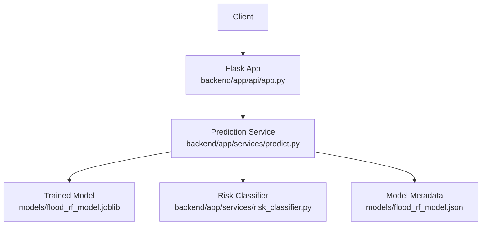
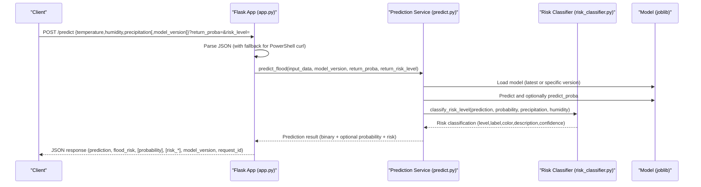
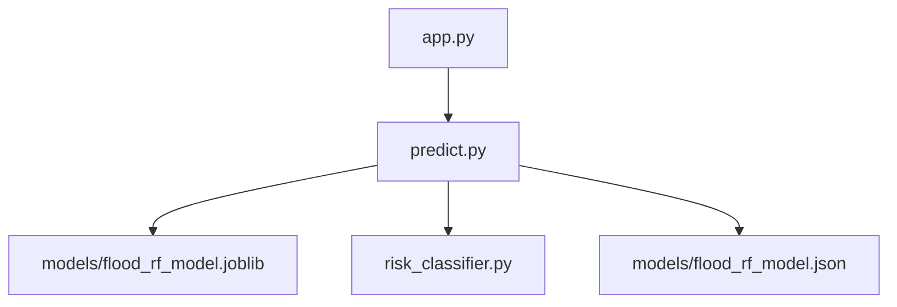

# POST /predict

<cite>
**Referenced Files in This Document**
- [main.py](file://backend/main.py)
- [app.py](file://backend/app/api/app.py)
- [predict.py](file://backend/app/services/predict.py)
- [risk_classifier.py](file://backend/app/services/risk_classifier.py)
- [utils.py](file://backend/app/utils/utils.py)
- [flood_rf_model.json](file://backend/models/flood_rf_model.json)
- [MODEL_MANAGEMENT.md](file://backend/docs/MODEL_MANAGEMENT.md)
- [POWERSHELL_API_EXAMPLES.md](file://backend/docs/POWERSHELL_API_EXAMPLES.md)
- [QUICK_REFERENCE.md](file://backend/README.md)
</cite>

## Table of Contents
1. [Introduction](#introduction)
2. [Project Structure](#project-structure)
3. [Core Components](#core-components)
4. [Architecture Overview](#architecture-overview)
5. [Detailed Component Analysis](#detailed-component-analysis)
6. [Dependency Analysis](#dependency-analysis)
7. [Performance Considerations](#performance-considerations)
8. [Troubleshooting Guide](#troubleshooting-guide)
9. [Conclusion](#conclusion)
10. [Appendices](#appendices)

## Introduction
This document provides comprehensive API documentation for the POST /predict endpoint, the core flood risk prediction service powered by machine learning. It covers HTTP method and URL, request body fields, query parameters, response schema, model versioning, backward compatibility, and practical usage examples in PowerShell and Python. It also outlines common issues and their resolutions with appropriate HTTP status codes.

## Project Structure
The POST /predict endpoint is implemented in the Flask application and integrates with prediction and risk classification services.

**Diagram sources**
- [app.py](file://backend/app/api/app.py#L224-L305)
- [predict.py](file://backend/app/services/predict.py#L112-L216)
- [risk_classifier.py](file://backend/app/services/risk_classifier.py#L32-L111)
- [flood_rf_model.json](file://backend/models/flood_rf_model.json#L1-L67)

**Section sources**
- [main.py](file://backend/main.py#L1-L25)
- [app.py](file://backend/app/api/app.py#L224-L305)
- [predict.py](file://backend/app/services/predict.py#L1-L236)
- [risk_classifier.py](file://backend/app/services/risk_classifier.py#L1-L170)
- [flood_rf_model.json](file://backend/models/flood_rf_model.json#L1-L67)

## Core Components
- Endpoint: POST /predict
- Purpose: Predict flood risk using a machine learning model with 3-level risk classification (Safe/Alert/Critical) and optional probability output.
- Required request body fields:
  - temperature (float)
  - humidity (float)
  - precipitation (float)
- Optional request body field:
  - model_version (int) to select a specific model version
- Query parameters:
  - return_proba (boolean, default false): include prediction probabilities
  - risk_level (boolean, default true): include 3-level risk classification (Safe/Alert/Critical)

Backward compatibility:
- The response includes a flood_risk field with values "low" or "high" derived from the binary prediction for legacy clients.

**Section sources**
- [app.py](file://backend/app/api/app.py#L224-L305)
- [predict.py](file://backend/app/services/predict.py#L112-L216)
- [risk_classifier.py](file://backend/app/services/risk_classifier.py#L32-L111)

## Architecture Overview
The POST /predict flow:

**Diagram sources**
- [app.py](file://backend/app/api/app.py#L224-L305)
- [predict.py](file://backend/app/services/predict.py#L112-L216)
- [risk_classifier.py](file://backend/app/services/risk_classifier.py#L32-L111)

## Detailed Component Analysis

### Endpoint Definition and Behavior
- HTTP method: POST
- URL pattern: /predict
- Request body:
  - temperature (required)
  - humidity (required)
  - precipitation (required)
  - model_version (optional)
- Query parameters:
  - return_proba (boolean): include probability distribution
  - risk_level (boolean): include 3-level risk classification
- Response:
  - prediction: 0 or 1 (binary)
  - flood_risk: "low" or "high" (backward compatible)
  - model_version: included when available
  - request_id: included for tracing
  - probability: included when return_proba=true or risk_level=true (requires probabilities)
  - risk_level: integer 0 (Safe), 1 (Alert), 2 (Critical)
  - risk_label: "Safe", "Alert", "Critical"
  - risk_color: hex color code
  - risk_description: human-readable description
  - confidence: float (0–1)

Backward compatibility:
- flood_risk is derived from prediction for older clients.

**Section sources**
- [app.py](file://backend/app/api/app.py#L224-L305)
- [predict.py](file://backend/app/services/predict.py#L112-L216)

### Model Versioning and Selection
- Latest model path: models/flood_rf_model.joblib
- Versioned models: models/flood_rf_model_vN.joblib
- Listing and selection:
  - list_available_models() enumerates versions and sorts by descending version number
  - get_latest_model_version() returns the highest version number
  - load_model_version(version) loads a specific version
- Metadata:
  - Each model has a corresponding JSON metadata file with version, metrics, and training details
  - get_model_metadata(path) reads metadata for a given model file

Backward compatibility:
- The latest model is kept as flood_rf_model.joblib for seamless fallback.

**Section sources**
- [predict.py](file://backend/app/services/predict.py#L33-L111)
- [flood_rf_model.json](file://backend/models/flood_rf_model.json#L1-L67)
- [MODEL_MANAGEMENT.md](file://backend/docs/MODEL_MANAGEMENT.md#L55-L122)

### Risk Classification Logic
- Levels:
  - Safe (0): binary prediction = 0 AND low flood probability
  - Alert (1): binary prediction = 0 with moderate probability OR moderate precipitation
  - Critical (2): binary prediction = 1 OR high flood probability
- Confidence:
  - Derived from the higher of the two probabilities (or the corresponding class probability)
- Color and description:
  - Safe: green
  - Alert: yellow/orange
  - Critical: red

**Section sources**
- [risk_classifier.py](file://backend/app/services/risk_classifier.py#L32-L111)

### Response Schema Details
- Required fields:
  - prediction: integer 0 or 1
  - flood_risk: string "low" or "high"
  - request_id: string UUID
- Optional fields:
  - probability: object with "no_flood" and "flood" probabilities (when return_proba=true or risk_level=true)
  - risk_level: integer 0, 1, or 2
  - risk_label: "Safe", "Alert", or "Critical"
  - risk_color: hex color code
  - risk_description: human-readable description
  - confidence: float between 0 and 1
  - model_version: integer (from metadata)

**Section sources**
- [app.py](file://backend/app/api/app.py#L266-L292)
- [predict.py](file://backend/app/services/predict.py#L194-L212)
- [risk_classifier.py](file://backend/app/services/risk_classifier.py#L103-L111)

### Real-World Usage Examples

#### PowerShell
- Basic prediction:
  - Invoke-RestMethod -Uri "http://localhost:5000/predict" -Method POST -ContentType "application/json" -Body "{...}"
- With probabilities:
  - Invoke-RestMethod -Uri "http://localhost:5000/predict?return_proba=true" -Method POST -ContentType "application/json" -Body "{...}"
- With specific model version:
  - Invoke-RestMethod -Uri "http://localhost:5000/predict" -Method POST -ContentType "application/json" -Body "{...}"

**Section sources**
- [POWERSHELL_API_EXAMPLES.md](file://backend/docs/POWERSHELL_API_EXAMPLES.md#L35-L73)

#### Python
- Using requests library:
  - POST to http://localhost:5000/predict with JSON payload containing temperature, humidity, precipitation, and optional model_version
  - Append ?return_proba=true or ?risk_level=true as needed

**Section sources**
- [QUICK_REFERENCE.md](file://backend/README.md#L44-L64)

### Example Scenarios
- Low-risk scenario (Safe):
  - temperature typical, humidity moderate, precipitation low
  - risk_label: "Safe", risk_level: 0, confidence moderate
- Moderate-risk scenario (Alert):
  - temperature typical, humidity high, precipitation moderate
  - risk_label: "Alert", risk_level: 1, confidence lower than Safe
- High-risk scenario (Critical):
  - temperature typical, humidity high, precipitation heavy
  - risk_label: "Critical", risk_level: 2, confidence high

These examples illustrate how the risk level depends on both prediction and probability thresholds, plus contextual weather indicators.

**Section sources**
- [risk_classifier.py](file://backend/app/services/risk_classifier.py#L32-L111)

## Dependency Analysis
The POST /predict endpoint depends on:
- Flask routing and request parsing
- Prediction service for model loading and inference
- Risk classifier for 3-level classification
- Model metadata for version information

**Diagram sources**
- [app.py](file://backend/app/api/app.py#L224-L305)
- [predict.py](file://backend/app/services/predict.py#L112-L216)
- [risk_classifier.py](file://backend/app/services/risk_classifier.py#L32-L111)
- [flood_rf_model.json](file://backend/models/flood_rf_model.json#L1-L67)

**Section sources**
- [app.py](file://backend/app/api/app.py#L224-L305)
- [predict.py](file://backend/app/services/predict.py#L112-L216)
- [risk_classifier.py](file://backend/app/services/risk_classifier.py#L32-L111)

## Performance Considerations
- Model loading is lazy and cached; repeated calls reuse the loaded model until forced reload.
- Probability computation is only performed when return_proba=true or risk_level=true.
- Risk classification adds minimal overhead compared to inference.

[No sources needed since this section provides general guidance]

## Troubleshooting Guide
Common issues and resolutions:

- Missing required fields:
  - Symptom: 400 Bad Request indicating missing temperature, humidity, or precipitation
  - Resolution: Ensure the request body includes all three required numeric fields
- Invalid JSON or malformed request:
  - Symptom: 400 Bad Request due to invalid JSON format
  - Resolution: Validate JSON structure and encoding; PowerShell curl may require escaping
- Model not found:
  - Symptom: 404 Not Found when requesting a non-existent model_version
  - Resolution: Train a model or use an existing version; verify model files in models/
- Model loading error:
  - Symptom: 500 Internal Server Error during prediction
  - Resolution: Check model integrity and metadata; retrain if necessary
- Coordinate validation errors (related to ingest endpoint):
  - Symptom: 400 Bad Request for invalid lat/lon values
  - Resolution: Ensure latitudes between -90 and 90, longitudes between -180 and 180

HTTP status codes:
- 200 OK: Successful prediction
- 400 Bad Request: Invalid JSON, missing fields, or coordinate validation errors
- 404 Not Found: Requested model version does not exist
- 500 Internal Server Error: Unexpected server-side error

**Section sources**
- [app.py](file://backend/app/api/app.py#L224-L305)
- [predict.py](file://backend/app/services/predict.py#L112-L216)
- [utils.py](file://backend/app/utils/utils.py#L39-L48)

## Conclusion
POST /predict is the primary interface for flood risk prediction. It supports binary predictions, optional probabilities, and a 3-level risk classification with confidence and color-coded labels. Model versioning ensures backward compatibility and enables controlled rollouts. The endpoint is production-ready with robust error handling and comprehensive documentation.

[No sources needed since this section summarizes without analyzing specific files]

## Appendices

### API Definition Summary
- Method: POST
- URL: /predict
- Query parameters:
  - return_proba (boolean, default false)
  - risk_level (boolean, default true)
- Request body (JSON):
  - temperature (float, required)
  - humidity (float, required)
  - precipitation (float, required)
  - model_version (int, optional)
- Response (JSON):
  - prediction (int)
  - flood_risk (string)
  - model_version (int, optional)
  - request_id (string)
  - probability (object, optional)
  - risk_level (int, optional)
  - risk_label (string, optional)
  - risk_color (string, optional)
  - risk_description (string, optional)
  - confidence (float, optional)

**Section sources**
- [app.py](file://backend/app/api/app.py#L224-L305)
- [predict.py](file://backend/app/services/predict.py#L112-L216)
- [risk_classifier.py](file://backend/app/services/risk_classifier.py#L32-L111)

### Model Versioning Reference
- Listing versions: GET /api/models
- Latest model: models/flood_rf_model.joblib
- Versioned models: models/flood_rf_model_vN.joblib
- Metadata: models/flood_rf_model_vN.json

**Section sources**
- [predict.py](file://backend/app/services/predict.py#L33-L111)
- [flood_rf_model.json](file://backend/models/flood_rf_model.json#L1-L67)
- [MODEL_MANAGEMENT.md](file://backend/docs/MODEL_MANAGEMENT.md#L55-L122)