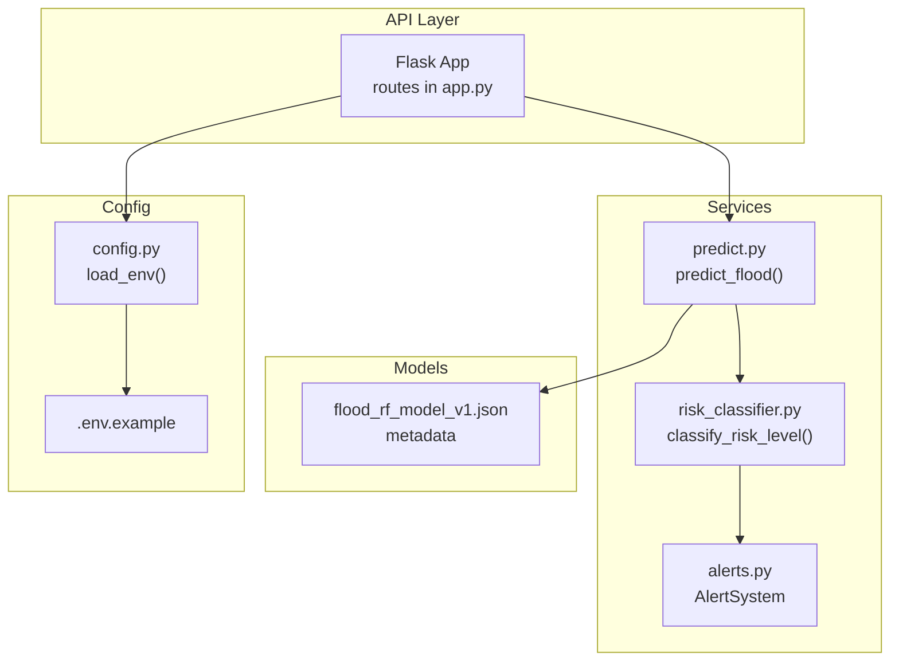
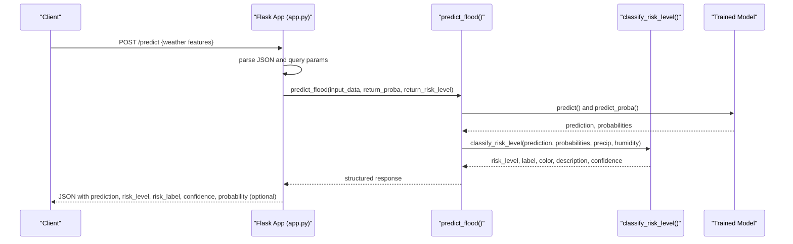
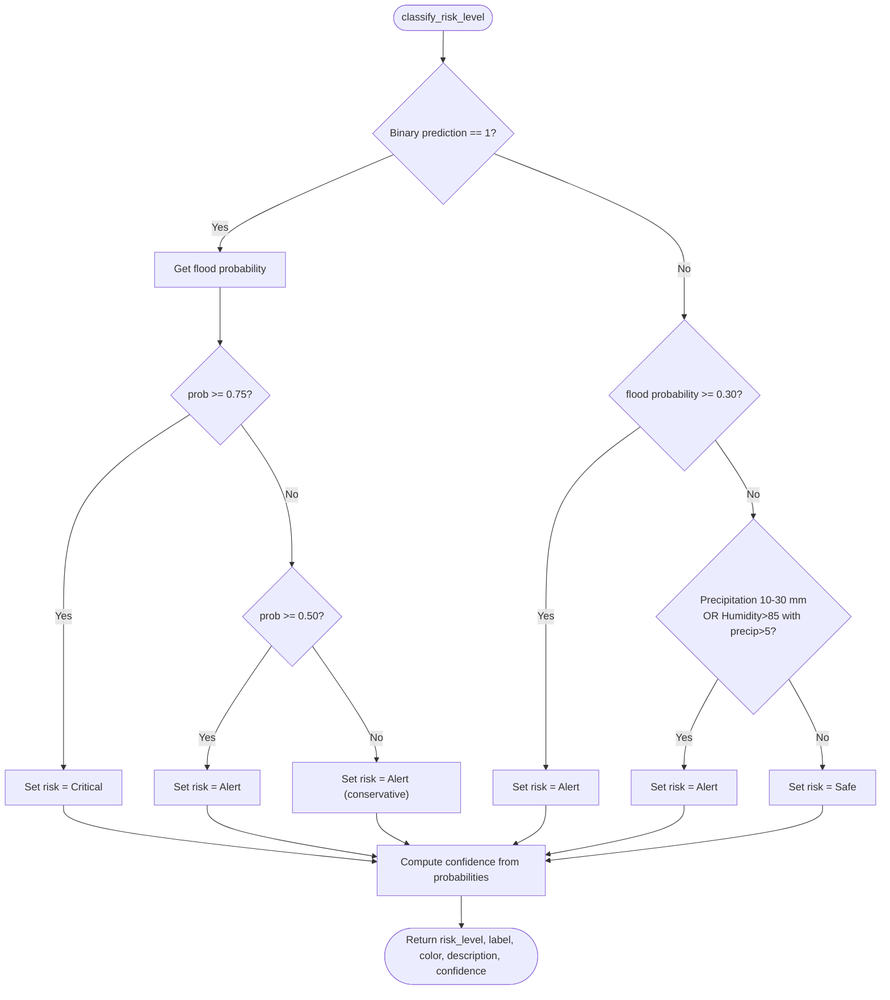
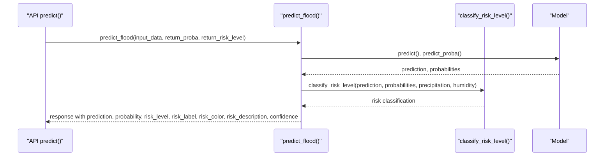
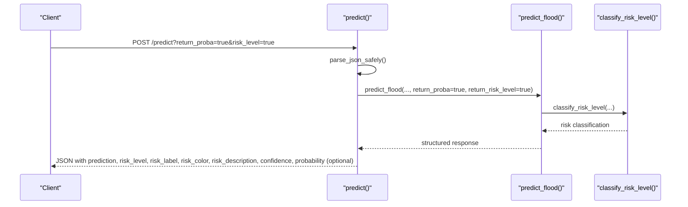
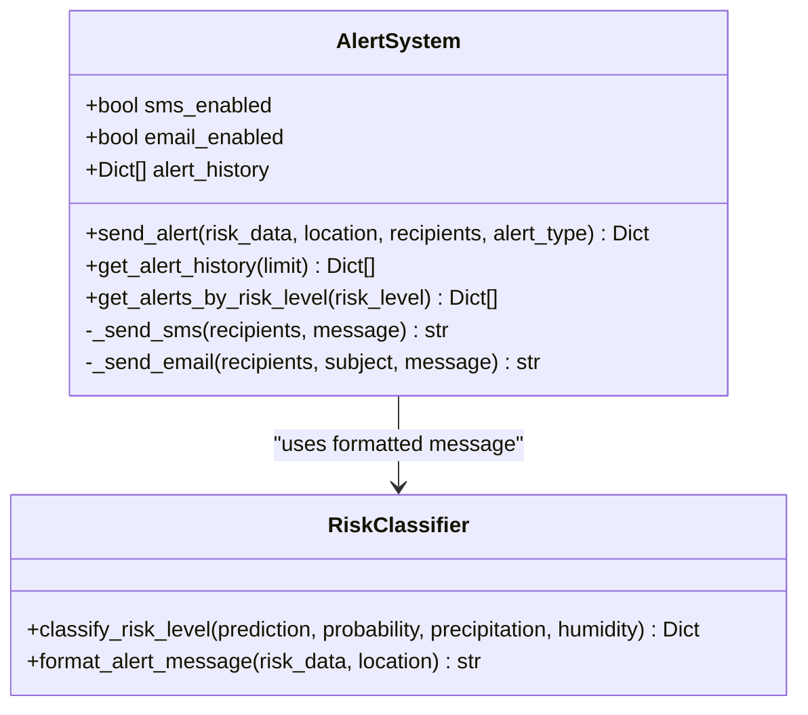
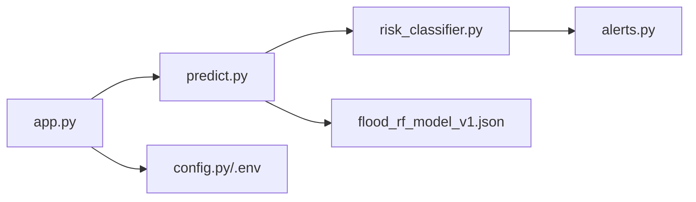

# 3-Level Risk Classification

<cite>
**Referenced Files in This Document**
- [risk_classifier.py](file://backend/app/services/risk_classifier.py)
- [predict.py](file://backend/app/services/predict.py)
- [app.py](file://backend/app/api/app.py)
- [alerts.py](file://backend/app/services/alerts.py)
- [TEST_3LEVEL_CLASSIFICATION.md](file://backend/docs/TEST_3LEVEL_CLASSIFICATION.md)
- [main.py](file://backend/main.py)
- [config.py](file://backend/app/core/config.py)
- [.env.example](file://backend/.env.example)
- [flood_rf_model_v1.json](file://backend/models/flood_rf_model_v1.json)
</cite>

## Table of Contents
1. [Introduction](#introduction)
2. [Project Structure](#project-structure)
3. [Core Components](#core-components)
4. [Architecture Overview](#architecture-overview)
5. [Detailed Component Analysis](#detailed-component-analysis)
6. [Dependency Analysis](#dependency-analysis)
7. [Performance Considerations](#performance-considerations)
8. [Troubleshooting Guide](#troubleshooting-guide)
9. [Conclusion](#conclusion)
10. [Appendices](#appendices)

## Introduction
This document explains the 3-level risk classification system that converts model predictions into Safe, Alert, and Critical flood risk levels. It covers the decision logic, threshold configuration, integration with the prediction service, and client-facing responses. It also provides practical examples from the codebase and guidance for tuning thresholds and reducing false positives.

## Project Structure
The risk classification lives in the backend under the services package and integrates with the API layer. Environment variables are loaded via a small utility, and the API exposes a /predict endpoint that returns both binary predictions and 3-level risk classification.

**Diagram sources**
- [app.py](file://backend/app/api/app.py#L224-L305)
- [predict.py](file://backend/app/services/predict.py#L112-L216)
- [risk_classifier.py](file://backend/app/services/risk_classifier.py#L32-L111)
- [alerts.py](file://backend/app/services/alerts.py#L24-L95)
- [flood_rf_model_v1.json](file://backend/models/flood_rf_model_v1.json#L1-L65)
- [config.py](file://backend/app/core/config.py#L1-L10)
- [.env.example](file://backend/.env.example#L1-L4)

**Section sources**
- [app.py](file://backend/app/api/app.py#L1-L120)
- [main.py](file://backend/main.py#L1-L25)
- [config.py](file://backend/app/core/config.py#L1-L10)

## Core Components
- Risk classifier: Converts binary prediction and probabilities into Safe/Alert/Critical with confidence and metadata.
- Prediction service: Loads model, validates input, runs inference, and optionally classifies risk.
- API: Exposes /predict with query parameters to toggle probability and risk level inclusion.
- Alerts: Formats and dispatches messages based on risk classification.

Key responsibilities:
- Risk classifier defines thresholds and confidence calculation.
- Prediction service orchestrates model loading and passes inputs to the classifier.
- API parses request bodies, handles JSON edge cases, and returns structured responses.

**Section sources**
- [risk_classifier.py](file://backend/app/services/risk_classifier.py#L32-L111)
- [predict.py](file://backend/app/services/predict.py#L112-L216)
- [app.py](file://backend/app/api/app.py#L224-L305)
- [alerts.py](file://backend/app/services/alerts.py#L24-L95)

## Architecture Overview
The flow from client request to classification result:

**Diagram sources**
- [app.py](file://backend/app/api/app.py#L224-L305)
- [predict.py](file://backend/app/services/predict.py#L112-L216)
- [risk_classifier.py](file://backend/app/services/risk_classifier.py#L32-L111)

## Detailed Component Analysis

### Risk Classifier Decision Logic
The classifier determines risk levels using a hybrid rule-based approach:
- If the model predicts flood (binary 1):
  - High flood probability threshold yields Critical.
  - Medium flood probability yields Alert.
  - Low flood probability conservatively yields Alert.
- If the model predicts no flood (binary 0):
  - If flood probability exceeds a threshold, Alert.
  - Else if environmental conditions suggest Alert (moderate precipitation or high humidity with precipitation), Alert.
  - Otherwise Safe.
- Confidence is derived from the underlying probabilities.

Thresholds are defined in code and also exposed as a helper for documentation/configuration.

**Diagram sources**
- [risk_classifier.py](file://backend/app/services/risk_classifier.py#L32-L111)

**Section sources**
- [risk_classifier.py](file://backend/app/services/risk_classifier.py#L32-L111)
- [risk_classifier.py](file://backend/app/services/risk_classifier.py#L114-L139)

### Prediction Service Integration
The prediction service:
- Validates input fields and loads the model (supports versioning).
- Runs inference and collects probabilities if available.
- Calls the risk classifier with prediction, probabilities, and environmental features.
- Builds a response that includes risk level, label, color, description, and confidence.

**Diagram sources**
- [app.py](file://backend/app/api/app.py#L224-L305)
- [predict.py](file://backend/app/services/predict.py#L112-L216)
- [risk_classifier.py](file://backend/app/services/risk_classifier.py#L32-L111)

**Section sources**
- [predict.py](file://backend/app/services/predict.py#L112-L216)

### API Exposure and Client Response
The API’s /predict endpoint:
- Parses JSON safely, handling edge cases.
- Supports query parameters:
  - return_proba: include probability breakdown.
  - risk_level: include 3-level classification (default true).
- Returns a structured response with prediction, risk metadata, and optional probabilities.

**Diagram sources**
- [app.py](file://backend/app/api/app.py#L224-L305)
- [predict.py](file://backend/app/services/predict.py#L112-L216)
- [risk_classifier.py](file://backend/app/services/risk_classifier.py#L32-L111)

**Section sources**
- [app.py](file://backend/app/api/app.py#L224-L305)

### Threshold Configuration and Tuning
- Thresholds are embedded in the risk classifier module and also exposed via a helper for documentation and potential future configuration.
- The current thresholds are:
  - Safe: flood probability < 0.30, precipitation < 10 mm.
  - Alert: flood probability 0.30–0.75 OR precipitation 10–30 mm OR high humidity with precipitation.
  - Critical: flood probability ≥ 0.75 OR binary prediction = 1 with high confidence.
- Environment variables are supported for runtime configuration (e.g., host/port), but thresholds themselves are not currently configurable via environment variables in the codebase.

Practical tips for tuning:
- Increase Critical thresholds (e.g., raise Critical probability threshold) to reduce false positives.
- Adjust Alert thresholds to balance sensitivity vs. noise.
- Consider adding environment-based overrides for thresholds if needed.

**Section sources**
- [risk_classifier.py](file://backend/app/services/risk_classifier.py#L32-L111)
- [risk_classifier.py](file://backend/app/services/risk_classifier.py#L114-L139)
- [config.py](file://backend/app/core/config.py#L1-L10)
- [.env.example](file://backend/.env.example#L1-L4)

### Integration with Alerts
The alerts module formats messages using risk metadata and can dispatch notifications. It relies on the risk classifier’s formatted output.

**Diagram sources**
- [alerts.py](file://backend/app/services/alerts.py#L24-L95)
- [risk_classifier.py](file://backend/app/services/risk_classifier.py#L142-L169)

**Section sources**
- [alerts.py](file://backend/app/services/alerts.py#L24-L95)
- [risk_classifier.py](file://backend/app/services/risk_classifier.py#L142-L169)

### Concrete Examples from the Codebase
- Safe example: low precipitation and low probability yield Safe.
- Alert example: moderate precipitation and high humidity yield Alert.
- Critical example: high precipitation and high probability yield Critical.
- Probability inclusion: when requested, the response includes probability breakdown alongside risk classification.

These examples are documented in the repository’s testing guide.

**Section sources**
- [TEST_3LEVEL_CLASSIFICATION.md](file://backend/docs/TEST_3LEVEL_CLASSIFICATION.md#L1-L108)

## Dependency Analysis
The risk classifier depends on the prediction service for model outputs and environmental features. The API depends on the prediction service and risk classifier to produce client-facing responses. The alerts module depends on the risk classifier for messaging.

**Diagram sources**
- [app.py](file://backend/app/api/app.py#L224-L305)
- [predict.py](file://backend/app/services/predict.py#L112-L216)
- [risk_classifier.py](file://backend/app/services/risk_classifier.py#L32-L111)
- [alerts.py](file://backend/app/services/alerts.py#L24-L95)
- [flood_rf_model_v1.json](file://backend/models/flood_rf_model_v1.json#L1-L65)
- [config.py](file://backend/app/core/config.py#L1-L10)

**Section sources**
- [app.py](file://backend/app/api/app.py#L224-L305)
- [predict.py](file://backend/app/services/predict.py#L112-L216)
- [risk_classifier.py](file://backend/app/services/risk_classifier.py#L32-L111)
- [alerts.py](file://backend/app/services/alerts.py#L24-L95)

## Performance Considerations
- Model loading is lazy and cached; versioning is supported to avoid reloading overhead.
- Probability computation is only performed when needed (based on query parameters).
- The risk classification is O(1) with simple comparisons and constant-time operations.
- For production, consider caching frequent predictions and precomputing probabilities only when return_proba is requested.

[No sources needed since this section provides general guidance]

## Troubleshooting Guide
Common issues and resolutions:
- Invalid JSON input: The API includes robust JSON parsing and returns clear error messages. Ensure the request body is valid JSON and includes required fields.
- Missing required fields: The prediction service validates presence of temperature, humidity, and precipitation.
- Model not found: If the model file is missing, the service raises a clear error. Ensure the model exists and metadata is present.
- Unexpected risk level: Verify the input values and probabilities. Adjust thresholds if necessary or tune the model.
- False positives (Alert/Critical when Safe): Raise the Critical and Alert thresholds slightly or increase the Safe threshold to reduce sensitivity.

**Section sources**
- [app.py](file://backend/app/api/app.py#L224-L305)
- [predict.py](file://backend/app/services/predict.py#L112-L216)

## Conclusion
The 3-level risk classification system combines model outputs with environmental conditions and configurable thresholds to produce Safe, Alert, and Critical risk levels. The API exposes both binary predictions and rich risk metadata, enabling clients to act on actionable insights. While thresholds are currently hardcoded, the design allows for straightforward extension to support environment-based configuration.

[No sources needed since this section summarizes without analyzing specific files]

## Appendices

### API Endpoint Reference
- POST /predict
  - Query parameters:
    - return_proba: include probability breakdown.
    - risk_level: include 3-level classification (default true).
  - Request body: temperature, humidity, precipitation (and optionally model_version).
  - Response: prediction, risk_level, risk_label, risk_color, risk_description, confidence, probability (optional).

**Section sources**
- [app.py](file://backend/app/api/app.py#L508-L530)

### Model Metadata
- The model metadata includes version, metrics, and feature importance, which can inform threshold tuning and model selection.

**Section sources**
- [flood_rf_model_v1.json](file://backend/models/flood_rf_model_v1.json#L1-L65)