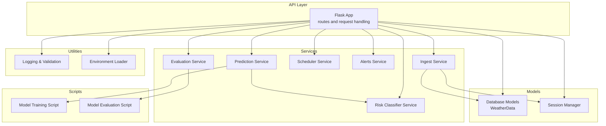
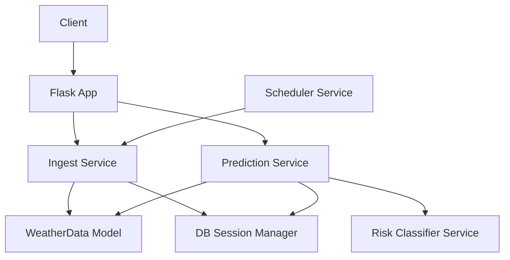
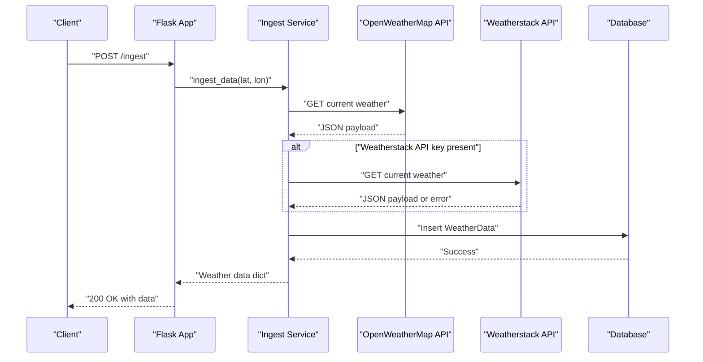
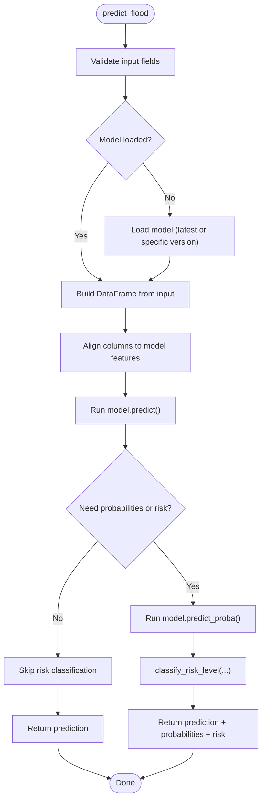
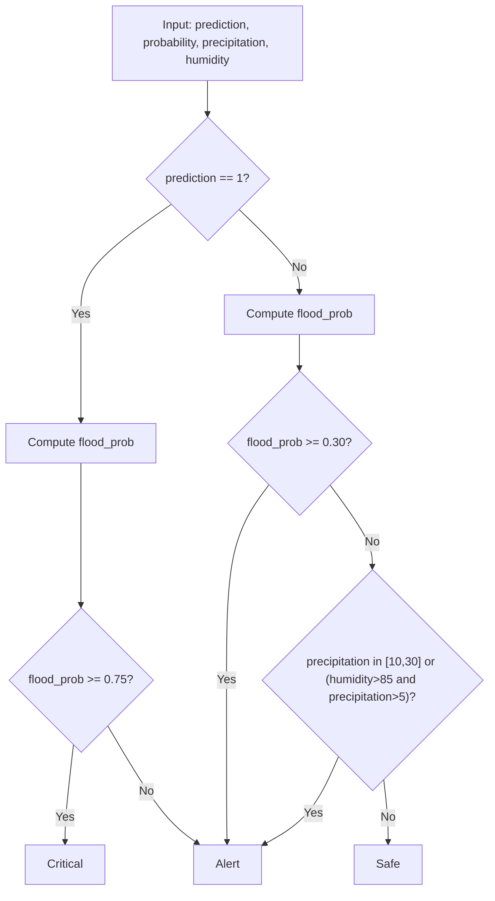
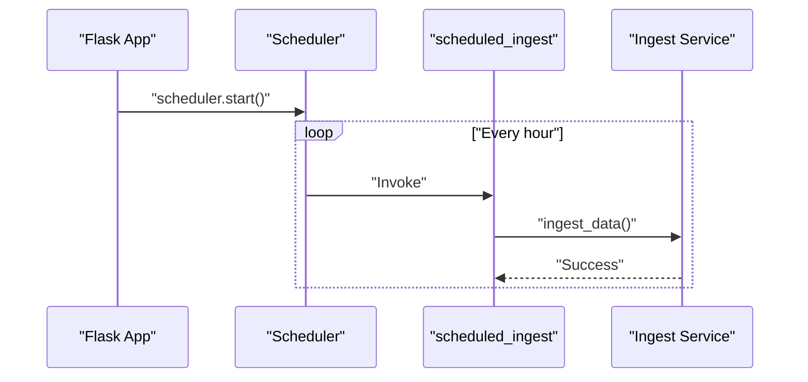
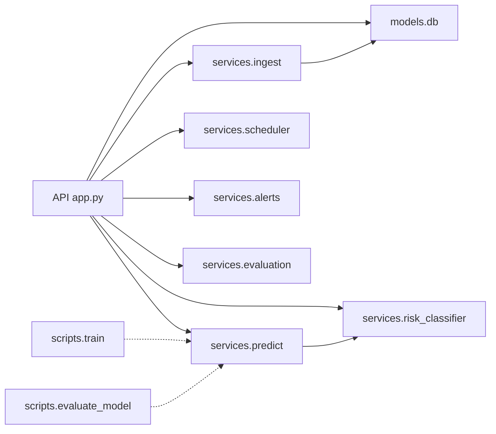

# Business Logic Layer

<cite>
**Referenced Files in This Document**
- [main.py](file://backend/main.py)
- [app.py](file://backend/app/api/app.py)
- [config.py](file://backend/app/core/config.py)
- [db.py](file://backend/app/models/db.py)
- [ingest.py](file://backend/app/services/ingest.py)
- [predict.py](file://backend/app/services/predict.py)
- [risk_classifier.py](file://backend/app/services/risk_classifier.py)
- [scheduler.py](file://backend/app/services/scheduler.py)
- [alerts.py](file://backend/app/services/alerts.py)
- [evaluation.py](file://backend/app/services/evaluation.py)
- [utils.py](file://backend/app/utils/utils.py)
- [train.py](file://backend/scripts/train.py)
- [evaluate_model.py](file://backend/scripts/evaluate_model.py)
</cite>

## Table of Contents
1. [Introduction](#introduction)
2. [Project Structure](#project-structure)
3. [Core Components](#core-components)
4. [Architecture Overview](#architecture-overview)
5. [Detailed Component Analysis](#detailed-component-analysis)
6. [Dependency Analysis](#dependency-analysis)
7. [Performance Considerations](#performance-considerations)
8. [Troubleshooting Guide](#troubleshooting-guide)
9. [Conclusion](#conclusion)

## Introduction
This document explains the business logic layer of the floodingnaque system, focusing on the service layer pattern across ingest, prediction, risk classification, and scheduling services. It details how WeatherData is fetched from OpenWeatherMap and Weatherstack APIs, transformed, and persisted; the machine learning prediction pipeline from feature extraction to model inference using scikit-learn; the 3-level risk classification logic with configurable thresholds; and the APScheduler-based automation for periodic data collection. It also illustrates the end-to-end flow from API request to service invocation to database interaction, including error handling and retry strategies for external API calls. Finally, it demonstrates service composition and dependency injection patterns used in the application.

## Project Structure
The backend is organized around a Flask API that orchestrates service-layer components. Services encapsulate business logic, while the API layer handles HTTP requests/responses and delegates to services. Models define persistence and database sessions. Scripts support training and evaluating the ML model. Utilities centralize logging and validation helpers.

**Diagram sources**
- [app.py](file://backend/app/api/app.py#L1-L120)
- [ingest.py](file://backend/app/services/ingest.py#L1-L111)
- [predict.py](file://backend/app/services/predict.py#L1-L236)
- [risk_classifier.py](file://backend/app/services/risk_classifier.py#L1-L170)
- [scheduler.py](file://backend/app/services/scheduler.py#L1-L15)
- [alerts.py](file://backend/app/services/alerts.py#L1-L167)
- [evaluation.py](file://backend/app/services/evaluation.py#L1-L246)
- [db.py](file://backend/app/models/db.py#L1-L37)
- [utils.py](file://backend/app/utils/utils.py#L1-L48)
- [config.py](file://backend/app/core/config.py#L1-L10)
- [train.py](file://backend/scripts/train.py#L1-L287)
- [evaluate_model.py](file://backend/scripts/evaluate_model.py#L1-L56)

**Section sources**
- [main.py](file://backend/main.py#L1-L25)
- [app.py](file://backend/app/api/app.py#L1-L120)

## Core Components
- Ingest Service: Fetches weather data from OpenWeatherMap and Weatherstack, validates and transforms the payload, and persists it to the database.
- Prediction Service: Loads trained scikit-learn models, performs feature validation and alignment, runs inference, and integrates risk classification.
- Risk Classifier Service: Converts binary predictions and probabilities into a 3-level risk classification (Safe/Alert/Critical) with configurable thresholds and descriptive metadata.
- Scheduler Service: Uses APScheduler to periodically trigger data ingestion jobs.
- Alerts Service: Formats and dispatches alerts to web, SMS, and email channels (placeholders for integrations).
- Evaluation Service: Provides metrics and reporting for accuracy, scalability, reliability, and usability.
- Database Models and Session Manager: Defines the WeatherData entity and provides a scoped session context manager for safe transactions.
- Utilities and Config: Centralized logging, coordinate validation, and environment loading.

**Section sources**
- [ingest.py](file://backend/app/services/ingest.py#L1-L111)
- [predict.py](file://backend/app/services/predict.py#L1-L236)
- [risk_classifier.py](file://backend/app/services/risk_classifier.py#L1-L170)
- [scheduler.py](file://backend/app/services/scheduler.py#L1-L15)
- [alerts.py](file://backend/app/services/alerts.py#L1-L167)
- [evaluation.py](file://backend/app/services/evaluation.py#L1-L246)
- [db.py](file://backend/app/models/db.py#L1-L37)
- [utils.py](file://backend/app/utils/utils.py#L1-L48)
- [config.py](file://backend/app/core/config.py#L1-L10)

## Architecture Overview
The system follows a layered service architecture:
- API layer exposes endpoints and delegates to services.
- Services encapsulate business logic and orchestrate data movement and transformations.
- Persistence is handled via SQLAlchemy ORM with a scoped session context manager.
- Machine learning models are serialized and versioned, loaded lazily, and integrated into prediction workflows.
- Automation is implemented with APScheduler for periodic ingestion.

**Diagram sources**
- [app.py](file://backend/app/api/app.py#L140-L340)
- [ingest.py](file://backend/app/services/ingest.py#L1-L111)
- [predict.py](file://backend/app/services/predict.py#L112-L216)
- [risk_classifier.py](file://backend/app/services/risk_classifier.py#L32-L112)
- [scheduler.py](file://backend/app/services/scheduler.py#L1-L15)
- [db.py](file://backend/app/models/db.py#L13-L37)

## Detailed Component Analysis

### Ingest Service
Responsibilities:
- Validates environment variables for API keys.
- Fetches current weather from OpenWeatherMap and optionally falls back to Weatherstack for precipitation.
- Transforms and enriches the payload with timestamps and precipitation rates.
- Persists WeatherData to the database using a scoped session context manager.

External API handling:
- OpenWeatherMap: Fetches current weather; raises explicit errors on invalid responses.
- Weatherstack: Attempted first if configured; logs warnings and continues on failures; parses precipitation in millimeters.

Persistence:
- Uses a context manager to ensure commit/rollback semantics and session cleanup.

**Diagram sources**
- [app.py](file://backend/app/api/app.py#L141-L223)
- [ingest.py](file://backend/app/services/ingest.py#L9-L111)
- [db.py](file://backend/app/models/db.py#L13-L37)

**Section sources**
- [ingest.py](file://backend/app/services/ingest.py#L9-L111)
- [db.py](file://backend/app/models/db.py#L13-L37)

### Prediction Service
Responsibilities:
- Lazy loads scikit-learn models from disk with versioning support.
- Validates input features and aligns them with model expectations.
- Performs inference and optionally returns prediction probabilities.
- Integrates risk classification to produce a 3-level risk assessment.

Model management:
- Supports listing available versions, loading a specific version, and retrieving current model info.
- Loads metadata JSON alongside model files to expose version and metrics.

Feature handling:
- Ensures DataFrame column order matches model’s expected features.
- Applies sensible defaults for missing features.

**Diagram sources**
- [predict.py](file://backend/app/services/predict.py#L112-L216)
- [risk_classifier.py](file://backend/app/services/risk_classifier.py#L32-L112)

**Section sources**
- [predict.py](file://backend/app/services/predict.py#L112-L216)
- [risk_classifier.py](file://backend/app/services/risk_classifier.py#L32-L112)

### Risk Classifier Service
Logic:
- Safe: Binary prediction 0 and low flood probability.
- Alert: Binary prediction 0 with moderate probability or moderate precipitation/humidity conditions.
- Critical: Binary prediction 1 or high flood probability.

Thresholds:
- Configurable thresholds exposed via a helper for documentation and potential runtime configuration.

Metadata:
- Provides labels, colors, descriptions, and confidence derived from prediction probabilities.

**Diagram sources**
- [risk_classifier.py](file://backend/app/services/risk_classifier.py#L32-L112)

**Section sources**
- [risk_classifier.py](file://backend/app/services/risk_classifier.py#L1-L170)

### Scheduler Service
Automation:
- Starts an APScheduler background scheduler.
- Adds a recurring job to ingest weather data every hour.
- Wraps ingestion in error logging to prevent scheduler crashes.

**Diagram sources**
- [app.py](file://backend/app/api/app.py#L92-L104)
- [scheduler.py](file://backend/app/services/scheduler.py#L1-L15)
- [ingest.py](file://backend/app/services/ingest.py#L9-L111)

**Section sources**
- [scheduler.py](file://backend/app/services/scheduler.py#L1-L15)
- [app.py](file://backend/app/api/app.py#L92-L104)

### Alerts Service
Capabilities:
- Formats alert messages aligned with risk classification.
- Supports web delivery out-of-the-box and placeholders for SMS/email integrations.
- Maintains alert history and provides filtering by risk level.

Integration:
- Uses risk classifier’s formatting function to produce human-readable messages.

**Section sources**
- [alerts.py](file://backend/app/services/alerts.py#L1-L167)
- [risk_classifier.py](file://backend/app/services/risk_classifier.py#L142-L170)

### Evaluation Service
Purpose:
- Provides a framework for measuring accuracy, scalability, reliability, and usability.
- Generates structured reports and persists them to disk.

Usage:
- Can be invoked programmatically to compile a comprehensive evaluation report.

**Section sources**
- [evaluation.py](file://backend/app/services/evaluation.py#L1-L246)

### Database Models and Session Management
- Defines the WeatherData entity with temperature, humidity, precipitation, and timestamp.
- Provides a scoped session factory and a context manager for transactional safety and automatic cleanup.

**Section sources**
- [db.py](file://backend/app/models/db.py#L1-L37)

### Utilities and Configuration
- Logging: Rotating file handler plus console output.
- Validation: Coordinate validation with clear error messages.
- Environment: Loads .env variables for API keys and database URLs.

**Section sources**
- [utils.py](file://backend/app/utils/utils.py#L1-L48)
- [config.py](file://backend/app/core/config.py#L1-L10)

### Model Training and Evaluation Scripts
- Training script: Loads synthetic data, trains a Random Forest model, computes comprehensive metrics, saves the model and metadata, and supports versioning.
- Evaluation script: Loads a saved model, evaluates on data, and generates plots for confusion matrix and feature importance.

**Section sources**
- [train.py](file://backend/scripts/train.py#L1-L287)
- [evaluate_model.py](file://backend/scripts/evaluate_model.py#L1-L56)

## Dependency Analysis
The API layer depends on services and models; services depend on each other and on shared utilities. The scheduler depends on the ingest service. The prediction service depends on the risk classifier and database/session utilities. The training and evaluation scripts are separate from the runtime services but integrate with the model artifacts.

**Diagram sources**
- [app.py](file://backend/app/api/app.py#L1-L120)
- [ingest.py](file://backend/app/services/ingest.py#L1-L111)
- [predict.py](file://backend/app/services/predict.py#L1-L236)
- [risk_classifier.py](file://backend/app/services/risk_classifier.py#L1-L170)
- [scheduler.py](file://backend/app/services/scheduler.py#L1-L15)
- [alerts.py](file://backend/app/services/alerts.py#L1-L167)
- [evaluation.py](file://backend/app/services/evaluation.py#L1-L246)
- [db.py](file://backend/app/models/db.py#L1-L37)
- [train.py](file://backend/scripts/train.py#L1-L287)
- [evaluate_model.py](file://backend/scripts/evaluate_model.py#L1-L56)

**Section sources**
- [app.py](file://backend/app/api/app.py#L1-L120)
- [ingest.py](file://backend/app/services/ingest.py#L1-L111)
- [predict.py](file://backend/app/services/predict.py#L1-L236)
- [risk_classifier.py](file://backend/app/services/risk_classifier.py#L1-L170)
- [scheduler.py](file://backend/app/services/scheduler.py#L1-L15)
- [alerts.py](file://backend/app/services/alerts.py#L1-L167)
- [evaluation.py](file://backend/app/services/evaluation.py#L1-L246)
- [db.py](file://backend/app/models/db.py#L1-L37)
- [train.py](file://backend/scripts/train.py#L1-L287)
- [evaluate_model.py](file://backend/scripts/evaluate_model.py#L1-L56)

## Performance Considerations
- External API timeouts: Requests to OpenWeatherMap and Weatherstack use timeouts to avoid blocking; consider adding retries with exponential backoff for transient network errors.
- Model loading: Lazy loading avoids startup overhead; ensure models are cached in memory for repeated predictions.
- Database transactions: Scoped sessions reduce contention and ensure cleanup; batch writes can be considered for high-frequency ingestion.
- Scheduler cadence: Hourly ingestion balances freshness and cost; adjust based on API quotas and resource constraints.
- API parsing: Robust JSON parsing reduces error rates; consider rate limiting and circuit breakers for upstream services.

[No sources needed since this section provides general guidance]

## Troubleshooting Guide
Common issues and resolutions:
- Missing API keys: Ensure environment variables for OpenWeatherMap and Weatherstack are set; the ingest service validates presence and raises explicit errors.
- Invalid JSON payloads: The API layer includes robust parsing and returns clear 400 errors; verify client formatting and encoding.
- Database connectivity: Verify DATABASE_URL; the session context manager handles commits/rollbacks and cleanup.
- Model not found: The prediction service raises a 404 when a requested model version is missing; confirm model files and metadata exist.
- Scheduler errors: Wrapped ingestion errors are logged; check logs for underlying causes and ensure the scheduler starts successfully.

**Section sources**
- [ingest.py](file://backend/app/services/ingest.py#L21-L34)
- [app.py](file://backend/app/api/app.py#L176-L223)
- [db.py](file://backend/app/models/db.py#L25-L37)
- [predict.py](file://backend/app/services/predict.py#L74-L111)
- [scheduler.py](file://backend/app/services/scheduler.py#L1-L15)

## Conclusion
The floodingnaque system implements a clean service-layer architecture with clear separation of concerns. The ingest service reliably collects weather data from multiple providers, the prediction service integrates scikit-learn models with robust feature handling, and the risk classifier provides actionable 3-level classifications. APScheduler automates ingestion, while the API layer orchestrates requests, error handling, and response formatting. Utilities and scripts support logging, validation, training, and evaluation, enabling a production-ready prototype for flood detection in Parañaque City.