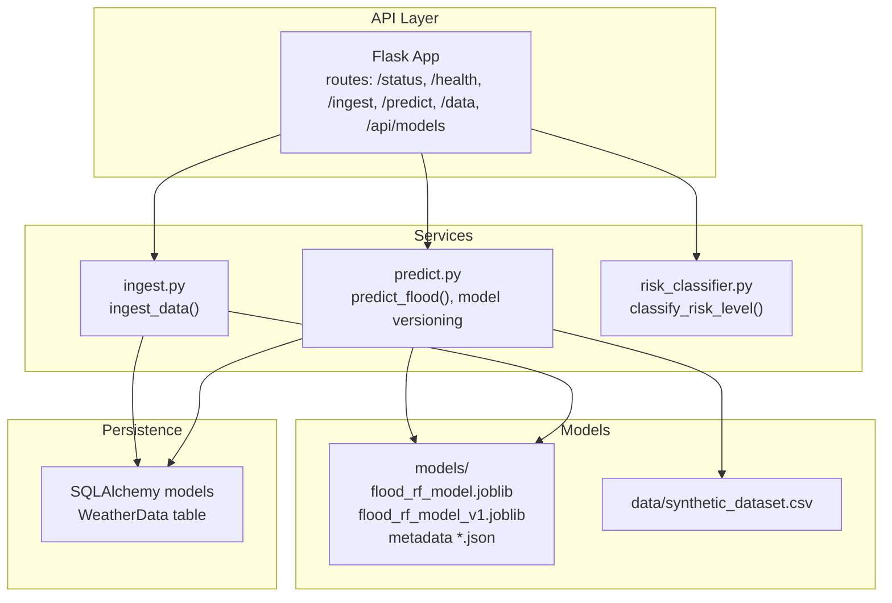
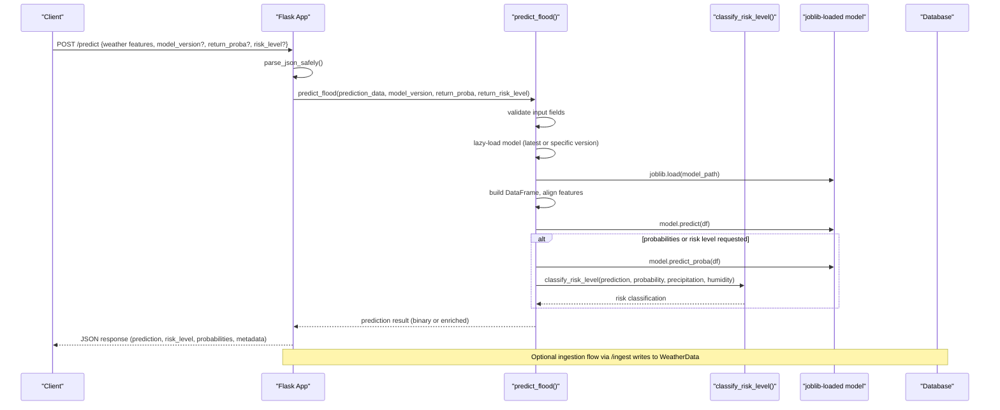
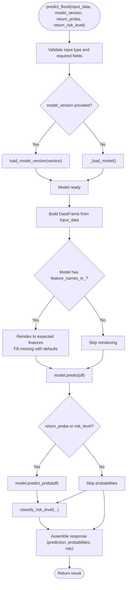
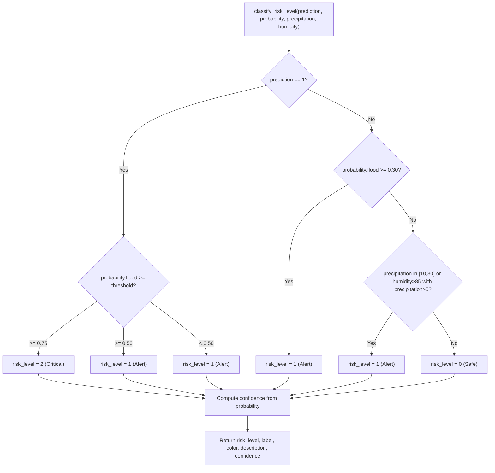
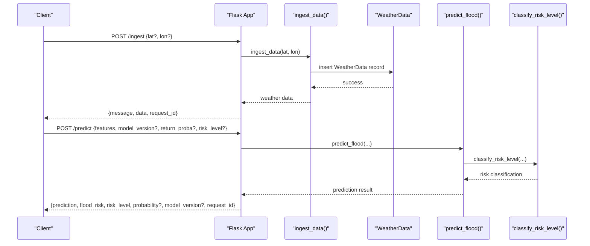
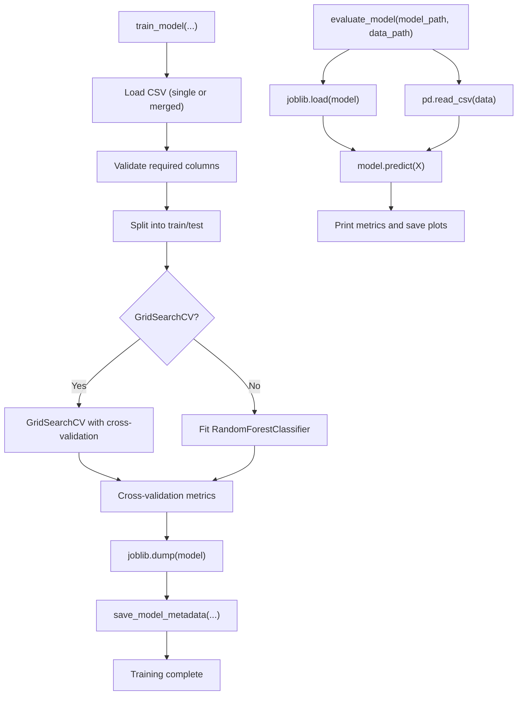
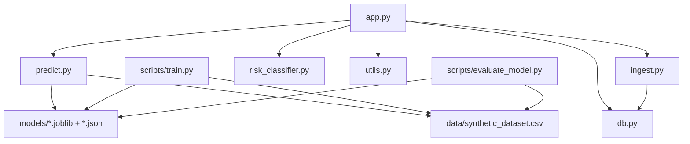

# Flood Risk Prediction

<cite>
**Referenced Files in This Document**
- [main.py](file://backend/main.py)
- [app.py](file://backend/app/api/app.py)
- [predict.py](file://backend/app/services/predict.py)
- [risk_classifier.py](file://backend/app/services/risk_classifier.py)
- [ingest.py](file://backend/app/services/ingest.py)
- [db.py](file://backend/app/models/db.py)
- [utils.py](file://backend/app/utils/utils.py)
- [train.py](file://backend/scripts/train.py)
- [evaluate_model.py](file://backend/scripts/evaluate_model.py)
- [synthetic_dataset.csv](file://backend/data/synthetic_dataset.csv)
- [flood_rf_model.joblib](file://backend/models/flood_rf_model.joblib)
- [flood_rf_model.json](file://backend/models/flood_rf_model.json)
- [flood_rf_model_v1.joblib](file://backend/models/flood_rf_model_v1.joblib)
- [flood_rf_model_v1.json](file://backend/models/flood_rf_model_v1.json)
- [test_models.py](file://backend/tests/test_models.py)
</cite>

## Table of Contents
1. [Introduction](#introduction)
2. [Project Structure](#project-structure)
3. [Core Components](#core-components)
4. [Architecture Overview](#architecture-overview)
5. [Detailed Component Analysis](#detailed-component-analysis)
6. [Dependency Analysis](#dependency-analysis)
7. [Performance Considerations](#performance-considerations)
8. [Troubleshooting Guide](#troubleshooting-guide)
9. [Conclusion](#conclusion)
10. [Appendices](#appendices)

## Introduction
This document explains the flood risk prediction service implemented in the backend. It covers the machine learning prediction pipeline, including feature extraction from weather data, model loading using joblib, and inference execution with scikit-learn. It also details the lazy-loading mechanism for model initialization, version-based model selection, input validation and transformation, and the service’s interaction with the risk classifier within the API request flow. Performance considerations, error handling, and guidance for extending the service with new models or features are included to serve both beginners and advanced users.

## Project Structure
The backend is organized around a Flask API that orchestrates services for ingestion, prediction, and risk classification, backed by a lightweight SQLAlchemy database and a models directory containing trained scikit-learn models serialized with joblib.

**Diagram sources**
- [app.py](file://backend/app/api/app.py#L1-L543)
- [predict.py](file://backend/app/services/predict.py#L1-L236)
- [risk_classifier.py](file://backend/app/services/risk_classifier.py#L1-L170)
- [ingest.py](file://backend/app/services/ingest.py#L1-L111)
- [db.py](file://backend/app/models/db.py#L1-L37)
- [synthetic_dataset.csv](file://backend/data/synthetic_dataset.csv#L1-L12)

**Section sources**
- [main.py](file://backend/main.py#L1-L25)
- [app.py](file://backend/app/api/app.py#L1-L543)

## Core Components
- Prediction service: Loads models lazily, validates and transforms input, executes scikit-learn predictions, and integrates risk classification.
- Risk classifier: Converts binary predictions and probabilities into a 3-level risk classification (Safe, Alert, Critical).
- Ingestion service: Fetches weather data from external APIs and persists it to the database.
- API layer: Exposes endpoints for status, health, ingestion, prediction, data retrieval, and model listing.
- Training and evaluation scripts: Train Random Forest models, compute metrics, and serialize artifacts with metadata.

**Section sources**
- [predict.py](file://backend/app/services/predict.py#L1-L236)
- [risk_classifier.py](file://backend/app/services/risk_classifier.py#L1-L170)
- [ingest.py](file://backend/app/services/ingest.py#L1-L111)
- [app.py](file://backend/app/api/app.py#L1-L543)
- [train.py](file://backend/scripts/train.py#L1-L402)
- [evaluate_model.py](file://backend/scripts/evaluate_model.py#L1-L56)

## Architecture Overview
The API routes handle requests, parse JSON payloads, and delegate to services. The prediction service loads the appropriate model (latest or a specific version), ensures feature alignment, runs inference, and enriches the result with risk classification. The ingestion service retrieves weather data and stores it in the database. The risk classifier encapsulates the logic for translating predictions into actionable risk levels.

**Diagram sources**
- [app.py](file://backend/app/api/app.py#L224-L305)
- [predict.py](file://backend/app/services/predict.py#L112-L216)
- [risk_classifier.py](file://backend/app/services/risk_classifier.py#L32-L112)
- [ingest.py](file://backend/app/services/ingest.py#L1-L111)

## Detailed Component Analysis

### Prediction Pipeline and Model Loading
- Lazy loading: The model is loaded on first use or when forced, and cached globally. Metadata is loaded alongside the model to provide version and metrics.
- Versioning: Models are versioned with filenames like flood_rf_model_vX.joblib. The latest model is also kept as flood_rf_model.joblib with a separate metadata file.
- Feature alignment: The prediction function converts input dictionaries to a DataFrame and reindexes to match the model’s expected features, filling missing values with reasonable defaults.
- Inference: Uses scikit-learn’s predict and predict_proba when available, returning either a simple integer or a richer dictionary with probabilities and risk classification.

**Diagram sources**
- [predict.py](file://backend/app/services/predict.py#L112-L216)
- [risk_classifier.py](file://backend/app/services/risk_classifier.py#L32-L112)

**Section sources**
- [predict.py](file://backend/app/services/predict.py#L1-L236)
- [flood_rf_model.joblib](file://backend/models/flood_rf_model.joblib#L1-L200)
- [flood_rf_model.json](file://backend/models/flood_rf_model.json#L1-L67)
- [flood_rf_model_v1.joblib](file://backend/models/flood_rf_model_v1.joblib#L1-L200)
- [flood_rf_model_v1.json](file://backend/models/flood_rf_model_v1.json#L1-L65)

### Risk Classification Logic
- Converts binary predictions and optional probabilities into a 3-level risk classification.
- Uses thresholds for probability and environmental cues (precipitation and humidity) to decide between Safe, Alert, and Critical.
- Provides confidence derived from the underlying probabilities and descriptive labels with color codes.

**Diagram sources**
- [risk_classifier.py](file://backend/app/services/risk_classifier.py#L32-L112)

**Section sources**
- [risk_classifier.py](file://backend/app/services/risk_classifier.py#L1-L170)

### API Request Flow and Endpoints
- Root and health/status endpoints provide operational information.
- Ingest endpoint fetches weather data from external APIs and persists it to the database.
- Predict endpoint accepts weather features, optional model version, and flags to include probabilities and risk classification.
- Data endpoint retrieves historical weather records with filtering and pagination.
- Model listing endpoint enumerates available versions and metadata.

**Diagram sources**
- [app.py](file://backend/app/api/app.py#L141-L305)
- [ingest.py](file://backend/app/services/ingest.py#L1-L111)
- [predict.py](file://backend/app/services/predict.py#L112-L216)
- [risk_classifier.py](file://backend/app/services/risk_classifier.py#L32-L112)
- [db.py](file://backend/app/models/db.py#L1-L37)

**Section sources**
- [app.py](file://backend/app/api/app.py#L1-L543)
- [ingest.py](file://backend/app/services/ingest.py#L1-L111)
- [predict.py](file://backend/app/services/predict.py#L112-L216)
- [db.py](file://backend/app/models/db.py#L1-L37)

### Training and Evaluation Scripts
- Training script builds a Random Forest model, optionally performs hyperparameter tuning, evaluates metrics, and serializes both the model and metadata.
- Evaluation script loads a model and data to compute accuracy, confusion matrix, and feature importance plots.

**Diagram sources**
- [train.py](file://backend/scripts/train.py#L125-L347)
- [evaluate_model.py](file://backend/scripts/evaluate_model.py#L1-L56)

**Section sources**
- [train.py](file://backend/scripts/train.py#L1-L402)
- [evaluate_model.py](file://backend/scripts/evaluate_model.py#L1-L56)
- [synthetic_dataset.csv](file://backend/data/synthetic_dataset.csv#L1-L12)

## Dependency Analysis
- API depends on prediction, ingestion, risk classification, configuration, database, and utilities.
- Prediction service depends on joblib, pandas, and risk classifier.
- Risk classifier is self-contained with constants and classification logic.
- Ingestion service depends on external weather APIs and database persistence.
- Training and evaluation scripts depend on scikit-learn, joblib, pandas, and matplotlib/seaborn.

**Diagram sources**
- [app.py](file://backend/app/api/app.py#L1-L543)
- [predict.py](file://backend/app/services/predict.py#L1-L236)
- [risk_classifier.py](file://backend/app/services/risk_classifier.py#L1-L170)
- [ingest.py](file://backend/app/services/ingest.py#L1-L111)
- [db.py](file://backend/app/models/db.py#L1-L37)
- [train.py](file://backend/scripts/train.py#L1-L402)
- [evaluate_model.py](file://backend/scripts/evaluate_model.py#L1-L56)
- [synthetic_dataset.csv](file://backend/data/synthetic_dataset.csv#L1-L12)

**Section sources**
- [app.py](file://backend/app/api/app.py#L1-L543)
- [predict.py](file://backend/app/services/predict.py#L1-L236)
- [risk_classifier.py](file://backend/app/services/risk_classifier.py#L1-L170)
- [ingest.py](file://backend/app/services/ingest.py#L1-L111)
- [db.py](file://backend/app/models/db.py#L1-L37)
- [train.py](file://backend/scripts/train.py#L1-L402)
- [evaluate_model.py](file://backend/scripts/evaluate_model.py#L1-L56)

## Performance Considerations
- Model serialization overhead: joblib serialization/deserialization is efficient for scikit-learn models. The lazy-loading pattern avoids loading the model until needed, reducing cold-start latency for unused endpoints.
- Memory usage: The model is held in memory after first load. Subsequent predictions reuse the cached model instance. If multiple versions are present, consider explicit version switching to control memory footprint.
- Feature alignment cost: Reindexing and filling missing features adds minimal overhead compared to model inference. Ensure the number of features remains reasonable.
- I/O and network: Ingestion pulls data from external APIs and writes to the database. Network timeouts and database transactions should be considered in production deployments.
- Concurrency: The Flask app runs single-threaded by default. For production, deploy behind a WSGI server and enable multiple workers or use async patterns if needed.

[No sources needed since this section provides general guidance]

## Troubleshooting Guide
Common issues and resolutions:
- Missing model file: The prediction service raises a file-not-found error when the model path does not exist. Ensure the model joblib file and its metadata JSON are present in the models directory.
- Invalid input data: The prediction service validates that input is a dictionary and contains required fields. Ensure the payload includes temperature, humidity, and precipitation.
- JSON parsing failures: The API includes a robust JSON parsing helper to handle double-escaped strings commonly produced by PowerShell curl. If parsing still fails, verify the request body format.
- Risk classification thresholds: Adjust thresholds in the risk classifier module if the default logic does not fit local conditions.
- Database connectivity: Verify the DATABASE_URL environment variable and ensure the database engine is reachable.

**Section sources**
- [predict.py](file://backend/app/services/predict.py#L112-L216)
- [app.py](file://backend/app/api/app.py#L19-L71)
- [risk_classifier.py](file://backend/app/services/risk_classifier.py#L32-L112)
- [db.py](file://backend/app/models/db.py#L1-L37)

## Conclusion
The flood risk prediction service integrates ingestion, prediction, and risk classification into a cohesive API. It leverages scikit-learn models serialized with joblib, supports versioning and lazy loading, and provides a clear extension point for new models and features. The modular design allows easy maintenance and future enhancements while maintaining predictable performance characteristics.

[No sources needed since this section summarizes without analyzing specific files]

## Appendices

### API Endpoints Reference
- GET /status: Basic health and model status.
- GET /health: Detailed health including model availability and metrics.
- POST /ingest: Ingest weather data from external APIs; returns weather features and stores them in the database.
- POST /predict: Predict flood risk; supports model version selection and optional inclusion of probabilities and risk classification.
- GET /data: Retrieve historical weather data with filtering and pagination.
- GET /api/models: List available model versions and metadata.
- GET /api/docs: API documentation with request/response examples.

**Section sources**
- [app.py](file://backend/app/api/app.py#L123-L536)

### Extending the Service
- Adding a new model version:
  - Train a new model using the training script, which automatically increments the version and saves both the model and metadata.
  - Ensure the model’s feature names align with the expected features used by the prediction pipeline.
- Adding new features:
  - Extend the training dataset with new columns and update the prediction pipeline to handle missing values appropriately.
  - Update the risk classifier thresholds if new features change the risk interpretation.
- Changing the model type:
  - Modify the training script to use a different estimator and ensure the prediction pipeline supports the new model’s interface (predict, predict_proba).
- Monitoring and evaluation:
  - Use the evaluation script to assess model performance on historical data and generate diagnostic plots.

**Section sources**
- [train.py](file://backend/scripts/train.py#L125-L347)
- [evaluate_model.py](file://backend/scripts/evaluate_model.py#L1-L56)
- [predict.py](file://backend/app/services/predict.py#L112-L216)
- [risk_classifier.py](file://backend/app/services/risk_classifier.py#L32-L112)
