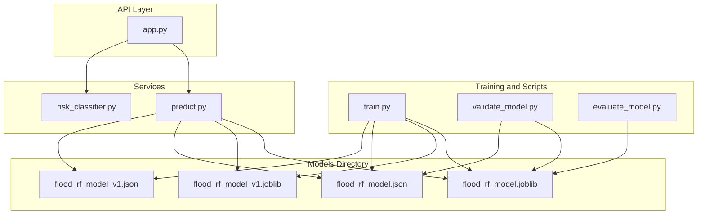
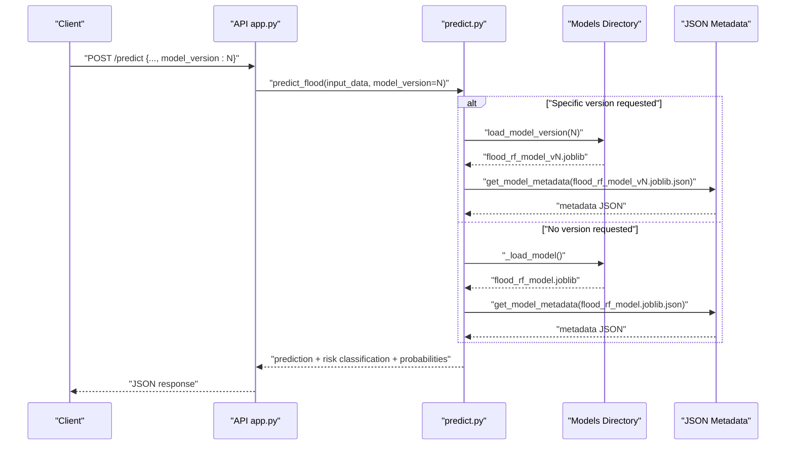
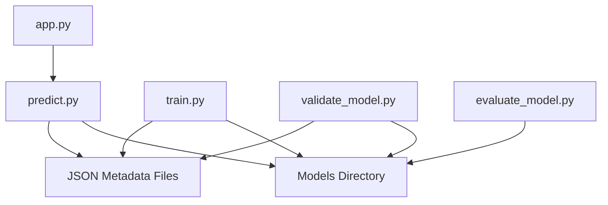

# Model Version Management

<cite>
**Referenced Files in This Document**
- [predict.py](file://backend/app/services/predict.py)
- [app.py](file://backend/app/api/app.py)
- [train.py](file://backend/scripts/train.py)
- [validate_model.py](file://backend/scripts/validate_model.py)
- [evaluate_model.py](file://backend/scripts/evaluate_model.py)
- [risk_classifier.py](file://backend/app/services/risk_classifier.py)
- [MODEL_MANAGEMENT.md](file://backend/docs/MODEL_MANAGEMENT.md)
- [flood_rf_model.json](file://backend/models/flood_rf_model.json)
- [flood_rf_model_v1.json](file://backend/models/flood_rf_model_v1.json)
- [models_folder_content.txt](file://backend/models/models_folder_content.txt)
- [config.py](file://backend/app/core/config.py)
- [test_models.py](file://backend/tests/test_models.py)
</cite>

## Table of Contents
1. [Introduction](#introduction)
2. [Project Structure](#project-structure)
3. [Core Components](#core-components)
4. [Architecture Overview](#architecture-overview)
5. [Detailed Component Analysis](#detailed-component-analysis)
6. [Dependency Analysis](#dependency-analysis)
7. [Performance Considerations](#performance-considerations)
8. [Troubleshooting Guide](#troubleshooting-guide)
9. [Conclusion](#conclusion)
10. [Appendices](#appendices)

## Introduction
This document explains the model version management system for the flood prediction model. It covers how multiple versions are stored in the models directory, how the predict service resolves model versions, how missing or invalid versions are handled, and how the system defaults to the latest version. It also documents the JSON metadata strategy, integration with the file system, model file integrity and security considerations, deployment workflows, and lifecycle management including testing, validation, and retirement.

## Project Structure
The model versioning system spans training, storage, metadata, API integration, and validation:

- Training and versioning: scripts that build models and metadata
- Storage: models directory with versioned joblib files and JSON metadata
- API: endpoints to list models, health/status, and prediction with version selection
- Services: prediction service that loads models lazily and supports version resolution
- Validation: scripts to verify model integrity and performance
- Documentation: guide describing versioning, metadata, and API usage

**Diagram sources**
- [train.py](file://backend/scripts/train.py#L306-L347)
- [validate_model.py](file://backend/scripts/validate_model.py#L200-L326)
- [evaluate_model.py](file://backend/scripts/evaluate_model.py#L1-L56)
- [app.py](file://backend/app/api/app.py#L415-L449)
- [predict.py](file://backend/app/services/predict.py#L18-L236)
- [risk_classifier.py](file://backend/app/services/risk_classifier.py#L1-L170)
- [flood_rf_model.json](file://backend/models/flood_rf_model.json#L1-L67)
- [flood_rf_model_v1.json](file://backend/models/flood_rf_model_v1.json#L1-L65)

**Section sources**
- [train.py](file://backend/scripts/train.py#L306-L347)
- [app.py](file://backend/app/api/app.py#L415-L449)
- [predict.py](file://backend/app/services/predict.py#L18-L236)
- [validate_model.py](file://backend/scripts/validate_model.py#L200-L326)
- [evaluate_model.py](file://backend/scripts/evaluate_model.py#L1-L56)
- [flood_rf_model.json](file://backend/models/flood_rf_model.json#L1-L67)
- [flood_rf_model_v1.json](file://backend/models/flood_rf_model_v1.json#L1-L65)

## Core Components
- Versioned model storage: joblib files named with version suffixes and a symlink-like latest model file for backward compatibility.
- JSON metadata: per-version JSON files capturing version, model type, training data, parameters, metrics, and feature importance.
- Prediction service: lazy-loading of models, version resolution, and robust error handling.
- API endpoints: listing models, health/status, and prediction with optional model_version parameter.
- Validation pipeline: integrity checks, metadata verification, feature validation, prediction tests, and performance evaluation.

**Section sources**
- [train.py](file://backend/scripts/train.py#L306-L347)
- [predict.py](file://backend/app/services/predict.py#L18-L236)
- [app.py](file://backend/app/api/app.py#L415-L449)
- [validate_model.py](file://backend/scripts/validate_model.py#L200-L326)
- [flood_rf_model.json](file://backend/models/flood_rf_model.json#L1-L67)
- [flood_rf_model_v1.json](file://backend/models/flood_rf_model_v1.json#L1-L65)

## Architecture Overview
The system integrates training, storage, and runtime prediction with explicit versioning and metadata:

**Diagram sources**
- [app.py](file://backend/app/api/app.py#L224-L305)
- [predict.py](file://backend/app/services/predict.py#L104-L216)
- [flood_rf_model.json](file://backend/models/flood_rf_model.json#L1-L67)
- [flood_rf_model_v1.json](file://backend/models/flood_rf_model_v1.json#L1-L65)

## Detailed Component Analysis

### Versioning Strategy and Storage
- Versioned models: joblib files named with a version suffix (e.g., flood_rf_model_vN.joblib).
- Latest model: a symlink-like latest model file for backward compatibility.
- Metadata: JSON files alongside each model joblib with version, model type, training data, parameters, metrics, and feature importance.
- Next version calculation: scanning the models directory for existing flood_rf_model_v*.joblib files and incrementing the highest version.

Key behaviors:
- Training saves both the versioned model and the latest model file.
- Training updates the latest model’s metadata to mark it as latest and link to the versioned model.
- Listing available models parses filenames to extract versions and attaches metadata.

**Section sources**
- [train.py](file://backend/scripts/train.py#L306-L347)
- [train.py](file://backend/scripts/train.py#L27-L45)
- [flood_rf_model.json](file://backend/models/flood_rf_model.json#L1-L67)
- [flood_rf_model_v1.json](file://backend/models/flood_rf_model_v1.json#L1-L65)
- [predict.py](file://backend/app/services/predict.py#L33-L71)

### Metadata Tracking and JSON Schema
- Metadata includes: version, model_type, model_path, created_at, training_data (file, shape, features, target_distribution), model_parameters, metrics (accuracy, precision, recall, f1_score, per-class metrics, confusion matrix, ROC-AUC if available), and feature_importance.
- Latest model metadata is augmented to indicate it is the latest and links to the versioned model path.

Practical implications:
- API responses can include model version and metrics.
- Validation scripts rely on metadata to verify structure and content.
- Prediction service can read metadata to log and report model version.

**Section sources**
- [flood_rf_model.json](file://backend/models/flood_rf_model.json#L1-L67)
- [flood_rf_model_v1.json](file://backend/models/flood_rf_model_v1.json#L1-L65)
- [train.py](file://backend/scripts/train.py#L47-L82)
- [train.py](file://backend/scripts/train.py#L327-L339)

### Prediction Service: Version Resolution and Error Handling
- Lazy loading: models are loaded on demand and cached globally.
- Version resolution:
  - If model_version is provided, load_model_version constructs the path for the specific version and raises an error if not found.
  - If model_version is None, _load_model loads the default latest model and logs its version from metadata.
- Robust input validation: ensures required fields are present and reindexes DataFrame to match model’s expected features, filling missing values with reasonable defaults.
- Risk classification: integrates with risk_classifier to produce 3-level risk labels and confidence.

Error handling highlights:
- FileNotFoundError raised when a requested model file is missing.
- Exceptions during model loading or prediction are logged and re-raised.
- API routes catch specific exceptions and return appropriate HTTP status codes.

**Section sources**
- [predict.py](file://backend/app/services/predict.py#L104-L216)
- [predict.py](file://backend/app/services/predict.py#L18-L31)
- [predict.py](file://backend/app/services/predict.py#L112-L216)
- [risk_classifier.py](file://backend/app/services/risk_classifier.py#L32-L112)
- [app.py](file://backend/app/api/app.py#L224-L305)

### API Integration: Listing Models and Prediction with Version Selection
- List models endpoint: enumerates available versions, attaches metadata, and marks the current version.
- Health/status endpoints: expose model availability, type, path, features, and metrics.
- Prediction endpoint: accepts model_version in the request body and optional query parameters for returning probabilities and risk classification.

Example usage:
- Listing models via API endpoint.
- Predictions with model_version parameter to select a specific version.
- Health/status endpoints to confirm model metadata and metrics.

**Section sources**
- [app.py](file://backend/app/api/app.py#L415-L449)
- [app.py](file://backend/app/api/app.py#L123-L139)
- [app.py](file://backend/app/api/app.py#L306-L339)
- [app.py](file://backend/app/api/app.py#L224-L293)
- [MODEL_MANAGEMENT.md](file://backend/docs/MODEL_MANAGEMENT.md#L66-L122)

### Validation Pipeline: Integrity, Metadata, Features, Predictions, and Performance
- Integrity: verifies model file existence and successful loading.
- Metadata: checks presence and structure of JSON metadata.
- Features: validates expected features against model’s feature_names_in_.
- Predictions: runs sample predictions to ensure the model produces outputs.
- Performance: evaluates metrics on provided test data.

Validation is designed to be non-blocking on feature mismatches (warnings) while failing fast on critical integrity issues.

**Section sources**
- [validate_model.py](file://backend/scripts/validate_model.py#L200-L326)
- [validate_model.py](file://backend/scripts/validate_model.py#L31-L146)
- [evaluate_model.py](file://backend/scripts/evaluate_model.py#L1-L56)

### File System Integration and Security Considerations
- File locations: models directory contains joblib files and JSON metadata.
- Latest model symlink: training writes both the versioned and latest model files to maintain backward compatibility.
- Security considerations:
  - Validate model integrity and metadata before loading.
  - Restrict model directory permissions in production environments.
  - Sanitize and validate request inputs to prediction endpoint.
  - Use HTTPS and authentication for API endpoints in production.
  - Avoid exposing internal file paths in error responses.

**Section sources**
- [train.py](file://backend/scripts/train.py#L314-L326)
- [train.py](file://backend/scripts/train.py#L332-L339)
- [validate_model.py](file://backend/scripts/validate_model.py#L200-L326)
- [app.py](file://backend/app/api/app.py#L224-L305)

### Deployment Workflows and Backward Compatibility
- Training workflow:
  - Train a new model with automatic versioning.
  - Validate the model using the validation script.
  - Optionally evaluate performance on test data.
- Deployment steps:
  - Ensure the latest model file exists and is readable.
  - Confirm metadata JSON is present and valid.
  - Restart or reload the API service to pick up the latest model.
- Backward compatibility:
  - The latest model file is maintained for legacy clients.
  - API endpoints return model version and metrics for traceability.

**Section sources**
- [MODEL_MANAGEMENT.md](file://backend/docs/MODEL_MANAGEMENT.md#L1-L120)
- [train.py](file://backend/scripts/train.py#L306-L347)
- [validate_model.py](file://backend/scripts/validate_model.py#L200-L326)
- [evaluate_model.py](file://backend/scripts/evaluate_model.py#L1-L56)

### Model Lifecycle Management: Testing, Validation, and Retirement
- Testing:
  - Use the validation script to verify integrity, metadata, features, predictions, and performance.
  - Use the evaluation script to compute confusion matrices and feature importance plots.
- Validation:
  - Run pre-deployment checks to ensure model readiness.
- Retirement:
  - Keep older versions around for auditability and rollback.
  - Mark retired versions in documentation and monitoring dashboards.
  - Remove outdated artifacts only after verifying no downstream dependencies.

**Section sources**
- [validate_model.py](file://backend/scripts/validate_model.py#L200-L326)
- [evaluate_model.py](file://backend/scripts/evaluate_model.py#L1-L56)
- [MODEL_MANAGEMENT.md](file://backend/docs/MODEL_MANAGEMENT.md#L417-L482)

## Dependency Analysis
The following diagram shows key dependencies among components involved in model versioning and prediction:

**Diagram sources**
- [app.py](file://backend/app/api/app.py#L415-L449)
- [predict.py](file://backend/app/services/predict.py#L18-L236)
- [train.py](file://backend/scripts/train.py#L306-L347)
- [validate_model.py](file://backend/scripts/validate_model.py#L200-L326)
- [evaluate_model.py](file://backend/scripts/evaluate_model.py#L1-L56)
- [flood_rf_model.json](file://backend/models/flood_rf_model.json#L1-L67)
- [flood_rf_model_v1.json](file://backend/models/flood_rf_model_v1.json#L1-L65)

**Section sources**
- [app.py](file://backend/app/api/app.py#L415-L449)
- [predict.py](file://backend/app/services/predict.py#L18-L236)
- [train.py](file://backend/scripts/train.py#L306-L347)
- [validate_model.py](file://backend/scripts/validate_model.py#L200-L326)
- [evaluate_model.py](file://backend/scripts/evaluate_model.py#L1-L56)

## Performance Considerations
- Lazy loading reduces startup overhead; models are loaded only when needed.
- Version resolution is O(n) over available models due to filesystem scanning; keep the models directory organized.
- Prediction performance depends on model complexity and input size; ensure adequate resources for inference.
- Caching the loaded model avoids repeated disk I/O and metadata reads.

[No sources needed since this section provides general guidance]

## Troubleshooting Guide
Common issues and resolutions:
- Model file not found:
  - Ensure the model joblib exists in the models directory.
  - Verify the model_version parameter is correct.
  - Use the validation script to check integrity and metadata.
- Invalid JSON in API requests:
  - The API includes robust JSON parsing with fallback handling for malformed payloads.
- Missing required fields in prediction input:
  - The prediction service validates required fields and fills missing values with defaults.
- Risk classification discrepancies:
  - Review risk thresholds and ensure probabilities are included when requesting risk level classification.

**Section sources**
- [app.py](file://backend/app/api/app.py#L224-L305)
- [predict.py](file://backend/app/services/predict.py#L112-L216)
- [validate_model.py](file://backend/scripts/validate_model.py#L200-L326)
- [risk_classifier.py](file://backend/app/services/risk_classifier.py#L32-L112)

## Conclusion
The model version management system provides a robust, transparent, and secure way to manage multiple versions of the flood prediction model. It leverages versioned joblib files, comprehensive JSON metadata, and clear API integrations. The prediction service supports dynamic version selection, graceful error handling, and risk classification. Validation and evaluation scripts ensure quality and reliability. With careful deployment and lifecycle management, teams can confidently roll out improvements while maintaining backward compatibility and traceability.

[No sources needed since this section summarizes without analyzing specific files]

## Appendices

### Appendix A: Example Workflows
- Train a new model and validate:
  - Train with automatic versioning.
  - Validate integrity, metadata, features, predictions, and performance.
- Deploy a new version:
  - Ensure latest model file and metadata are present.
  - Restart the API service and verify health/status endpoints.
- Compare versions:
  - Use the models listing endpoint to review versions and metrics.
- Test prediction with a specific version:
  - Send a prediction request with model_version set.

**Section sources**
- [MODEL_MANAGEMENT.md](file://backend/docs/MODEL_MANAGEMENT.md#L1-L120)
- [app.py](file://backend/app/api/app.py#L415-L449)
- [app.py](file://backend/app/api/app.py#L123-L139)
- [app.py](file://backend/app/api/app.py#L306-L339)
- [test_models.py](file://backend/tests/test_models.py#L1-L35)

### Appendix B: Model Metadata Fields
- version: integer version number
- model_type: string indicating model class
- model_path: path to the model file
- created_at: ISO timestamp of creation
- training_data: file path, shape, features, target distribution
- model_parameters: hyperparameters used during training
- metrics: accuracy, precision, recall, f1_score, per-class metrics, confusion matrix, ROC-AUC
- feature_importance: mapping of feature names to importance scores

**Section sources**
- [flood_rf_model.json](file://backend/models/flood_rf_model.json#L1-L67)
- [flood_rf_model_v1.json](file://backend/models/flood_rf_model_v1.json#L1-L65)