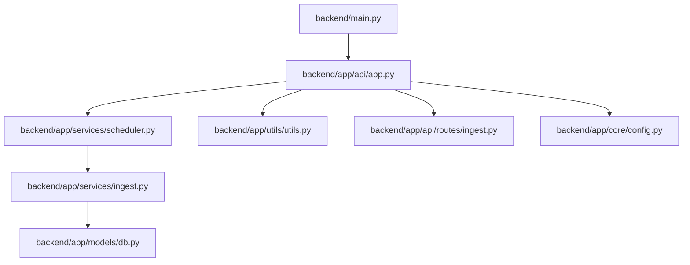
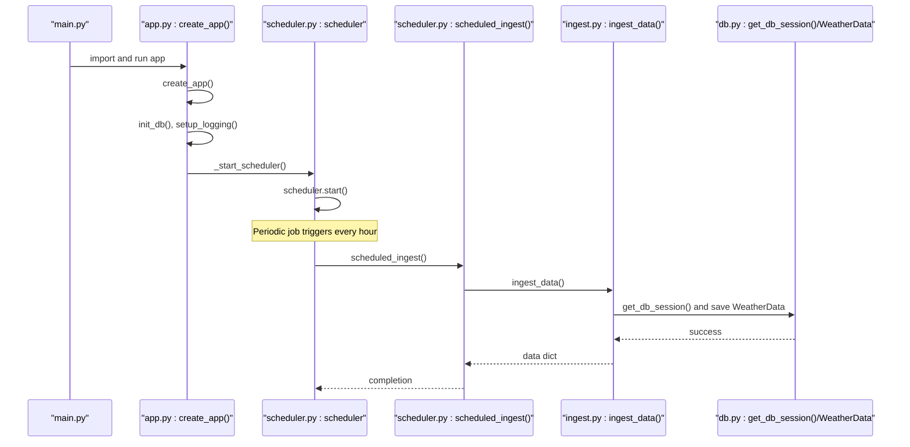
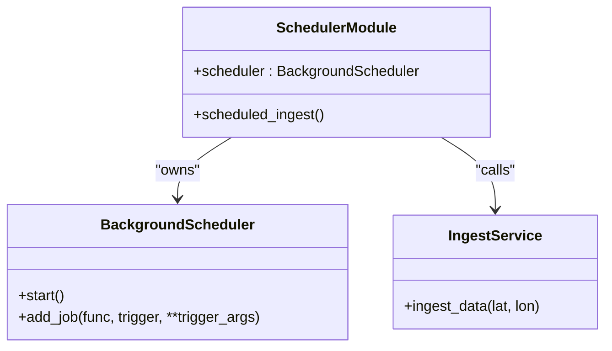
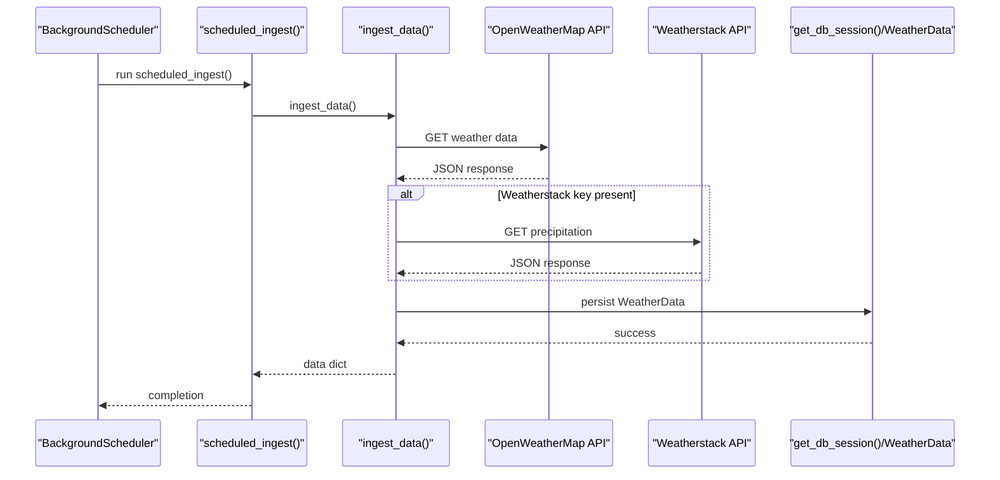
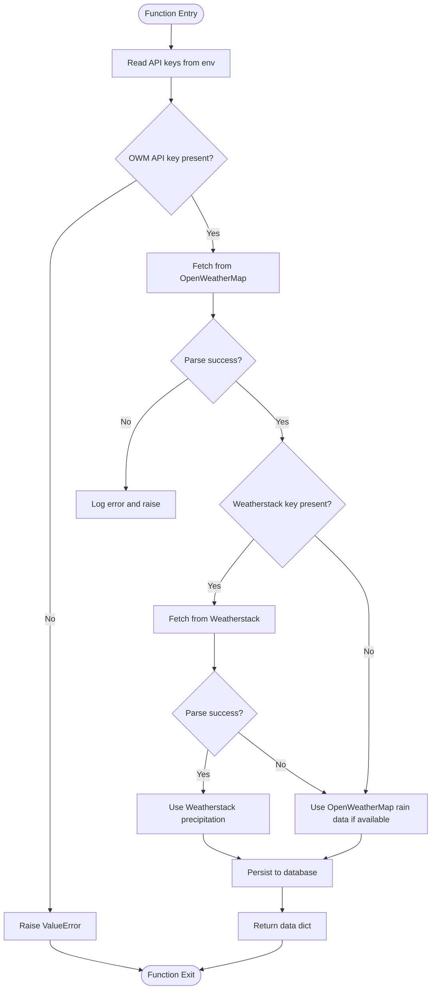
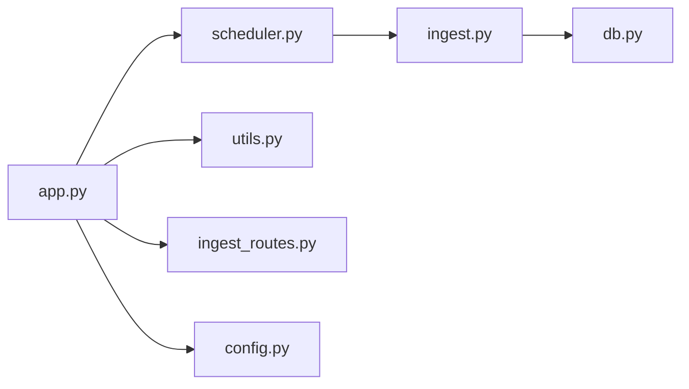

# Scheduled Tasks

<cite>
**Referenced Files in This Document**
- [main.py](file://backend/main.py)
- [app.py](file://backend/app/api/app.py)
- [scheduler.py](file://backend/app/services/scheduler.py)
- [ingest.py](file://backend/app/services/ingest.py)
- [db.py](file://backend/app/models/db.py)
- [utils.py](file://backend/app/utils/utils.py)
- [ingest_routes.py](file://backend/app/api/routes/ingest.py)
- [config.py](file://backend/app/core/config.py)
- [BACKEND_COMPLETE.md](file://backend/docs/BACKEND_COMPLETE.md)
</cite>

## Table of Contents
1. [Introduction](#introduction)
2. [Project Structure](#project-structure)
3. [Core Components](#core-components)
4. [Architecture Overview](#architecture-overview)
5. [Detailed Component Analysis](#detailed-component-analysis)
6. [Dependency Analysis](#dependency-analysis)
7. [Performance Considerations](#performance-considerations)
8. [Troubleshooting Guide](#troubleshooting-guide)
9. [Conclusion](#conclusion)

## Introduction
This document explains the scheduled tasks system that automates periodic weather data ingestion using APScheduler. It covers how the scheduler is initialized and started, how jobs are registered and executed, and how the ingestion service integrates with the database and external weather APIs. It also addresses common operational concerns such as job overlap, failure recovery, logging, and performance considerations. The goal is to make background task management approachable for beginners while providing technical depth for experienced developers.

## Project Structure
The scheduled tasks system spans a few focused modules:
- Application bootstrap and lifecycle: main entry point and Flask application factory
- Scheduler: APScheduler instance and job registration
- Ingestion service: weather data collection and persistence
- Database models and session management
- Logging and configuration utilities
- API routes that demonstrate the ingestion workflow

**Diagram sources**
- [main.py](file://backend/main.py#L1-L28)
- [app.py](file://backend/app/api/app.py#L1-L152)
- [scheduler.py](file://backend/app/services/scheduler.py#L1-L15)
- [ingest.py](file://backend/app/services/ingest.py#L1-L113)
- [db.py](file://backend/app/models/db.py#L1-L298)
- [utils.py](file://backend/app/utils/utils.py#L1-L48)
- [ingest_routes.py](file://backend/app/api/routes/ingest.py#L1-L104)
- [config.py](file://backend/app/core/config.py#L1-L108)

**Section sources**
- [main.py](file://backend/main.py#L1-L28)
- [app.py](file://backend/app/api/app.py#L1-L152)

## Core Components
- APScheduler BackgroundScheduler instance and job registration
- Scheduled ingestion job that calls the ingestion service
- Flask application factory that starts the scheduler on app creation
- Ingestion service that fetches data from external APIs and persists it
- Database session management and model definitions
- Logging configuration and utilities

**Section sources**
- [scheduler.py](file://backend/app/services/scheduler.py#L1-L15)
- [app.py](file://backend/app/api/app.py#L120-L151)
- [ingest.py](file://backend/app/services/ingest.py#L1-L113)
- [db.py](file://backend/app/models/db.py#L1-L298)
- [utils.py](file://backend/app/utils/utils.py#L1-L48)

## Architecture Overview
The scheduler is a singleton-like module-scoped BackgroundScheduler that registers a single job to run periodically. The Flask application factory initializes configuration, logging, database, and then starts the scheduler. The ingestion job invokes the ingestion service, which interacts with external APIs and the database.

**Diagram sources**
- [main.py](file://backend/main.py#L1-L28)
- [app.py](file://backend/app/api/app.py#L1-L152)
- [scheduler.py](file://backend/app/services/scheduler.py#L1-L15)
- [ingest.py](file://backend/app/services/ingest.py#L1-L113)
- [db.py](file://backend/app/models/db.py#L271-L298)

## Detailed Component Analysis

### Scheduler Singleton and Job Registration
- The scheduler module creates a BackgroundScheduler instance and defines a scheduled job function.
- The job function wraps the ingestion service and logs outcomes.
- The job is added with an interval trigger set to run every hour.
- The application factory starts the scheduler when the app is created.

Implementation highlights:
- Singleton-like scheduler instance created at module import time
- Job added with an interval trigger
- Error handling inside the scheduled job logs failures and avoids crashing the scheduler

Integration points:
- The scheduler module imports the ingestion service to call it on schedule
- The application factory imports the scheduler module and starts it during app initialization

**Section sources**
- [scheduler.py](file://backend/app/services/scheduler.py#L1-L15)
- [app.py](file://backend/app/api/app.py#L133-L140)

### Startup Process in main.py and App Factory
- The main entry point sets up the Python path and runs the Flask app.
- The Flask application factory:
  - Loads environment variables and configuration
  - Initializes the database
  - Sets up logging
  - Registers blueprints
  - Starts the scheduler

This ensures the scheduler begins running alongside the web server.

**Section sources**
- [main.py](file://backend/main.py#L1-L28)
- [app.py](file://backend/app/api/app.py#L27-L78)
- [app.py](file://backend/app/api/app.py#L133-L140)

### Ingestion Service and External API Integration
- The ingestion service:
  - Reads API keys from environment variables
  - Fetches temperature and humidity from OpenWeatherMap
  - Optionally fetches precipitation from Weatherstack if configured
  - Falls back to OpenWeatherMap rain data if Weatherstack is unavailable
  - Validates responses and raises appropriate errors
  - Persists data to the database using a session context manager
  - Returns a structured data dictionary

Key behaviors:
- Timeout protection for external API calls
- Graceful fallback between APIs
- Structured logging for successes and failures
- Session management with automatic commit/rollback and cleanup

**Section sources**
- [ingest.py](file://backend/app/services/ingest.py#L1-L113)
- [db.py](file://backend/app/models/db.py#L271-L298)
- [utils.py](file://backend/app/utils/utils.py#L1-L28)

### API Route Integration
- The ingestion route validates JSON input, coordinates, and delegates to the ingestion service.
- It returns structured responses and logs errors with request IDs.
- This demonstrates how manual ingestion requests integrate with the same ingestion service used by the scheduler.

**Section sources**
- [ingest_routes.py](file://backend/app/api/routes/ingest.py#L1-L104)

### Configuration and Environment
- Configuration loads environment variables and provides defaults.
- API keys for weather services are read from environment variables.
- Logging level and format are configurable.

**Section sources**
- [config.py](file://backend/app/core/config.py#L1-L108)

### Class Diagram: Scheduler and Ingestion Relationship

**Diagram sources**
- [scheduler.py](file://backend/app/services/scheduler.py#L1-L15)
- [ingest.py](file://backend/app/services/ingest.py#L1-L113)

### Sequence Diagram: Scheduled Ingestion Flow

**Diagram sources**
- [scheduler.py](file://backend/app/services/scheduler.py#L1-L15)
- [ingest.py](file://backend/app/services/ingest.py#L1-L113)
- [db.py](file://backend/app/models/db.py#L271-L298)

### Flowchart: Ingestion Decision Logic

**Diagram sources**
- [ingest.py](file://backend/app/services/ingest.py#L1-L113)

## Dependency Analysis
- The scheduler module depends on the ingestion service to perform work.
- The application factory depends on the scheduler module to start it.
- The ingestion service depends on the database session manager and models.
- Logging utilities are used across services and routes.

**Diagram sources**
- [app.py](file://backend/app/api/app.py#L1-L152)
- [scheduler.py](file://backend/app/services/scheduler.py#L1-L15)
- [ingest.py](file://backend/app/services/ingest.py#L1-L113)
- [db.py](file://backend/app/models/db.py#L1-L298)
- [utils.py](file://backend/app/utils/utils.py#L1-L48)
- [ingest_routes.py](file://backend/app/api/routes/ingest.py#L1-L104)
- [config.py](file://backend/app/core/config.py#L1-L108)

**Section sources**
- [app.py](file://backend/app/api/app.py#L1-L152)
- [scheduler.py](file://backend/app/services/scheduler.py#L1-L15)
- [ingest.py](file://backend/app/services/ingest.py#L1-L113)
- [db.py](file://backend/app/models/db.py#L1-L298)
- [utils.py](file://backend/app/utils/utils.py#L1-L48)
- [ingest_routes.py](file://backend/app/api/routes/ingest.py#L1-L104)
- [config.py](file://backend/app/core/config.py#L1-L108)

## Performance Considerations
- Current scheduling cadence: jobs run every hour via an interval trigger. This is lightweight and suitable for low-frequency tasks.
- External API timeouts: ingestion enforces timeouts to prevent long blocking calls.
- Database session management: sessions are scoped and cleaned up automatically, reducing contention.
- Recommendations for peak times:
  - If increasing frequency, consider staggering jobs to avoid spikes.
  - Monitor external API quotas and rate limits.
  - Use connection pooling tuned to your database provider.
  - Add job concurrency controls if you introduce parallel jobs later.
- Adding new scheduled jobs:
  - Keep jobs small and idempotent where possible.
  - Wrap job functions with robust error handling and logging.
  - Prefer interval or cron triggers suited to workload patterns.
  - Avoid heavy computations in the scheduler thread; offload to worker processes if needed.

[No sources needed since this section provides general guidance]

## Troubleshooting Guide
Common issues and implemented solutions:
- Job overlap: The current job uses an interval trigger without explicit overlap prevention. If you anticipate long-running jobs, consider adding a job coalescing policy or a lock mechanism around the job function. The existing code does not include overlap handling in the scheduler module.
- Failure recovery: The scheduled job catches exceptions and logs them. The scheduler itself logs start-up errors. For improved resilience, consider:
  - Adding retry logic inside the job function for transient failures
  - Using APScheduler’s built-in job misfire handling policies
  - Ensuring database transactions are wrapped in try/except blocks (already handled by the ingestion service)
- Logging:
  - Centralized logging is configured in the application factory and utilities.
  - The ingestion service logs successes and failures.
  - The scheduler logs successful start and errors during start-up.
  - Use the health endpoint to confirm scheduler status.
- Health verification:
  - The health endpoint includes a field indicating whether the scheduler is running, helping operators confirm task automation status.

**Section sources**
- [scheduler.py](file://backend/app/services/scheduler.py#L1-L15)
- [app.py](file://backend/app/api/app.py#L133-L140)
- [ingest.py](file://backend/app/services/ingest.py#L1-L113)
- [utils.py](file://backend/app/utils/utils.py#L1-L28)
- [BACKEND_COMPLETE.md](file://backend/docs/BACKEND_COMPLETE.md#L75-L86)

## Conclusion
The scheduled tasks system uses APScheduler to run a periodic ingestion job every hour. The scheduler is initialized and started by the Flask application factory, ensuring it runs alongside the web server. The ingestion service integrates with external weather APIs and the database, with robust logging and error handling. While the current implementation focuses on simplicity and reliability, future enhancements can include finer-grained scheduling, overlap prevention, and improved failure recovery strategies.

[No sources needed since this section summarizes without analyzing specific files]