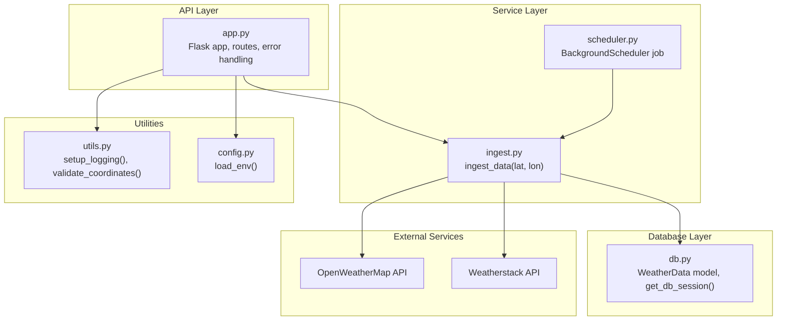
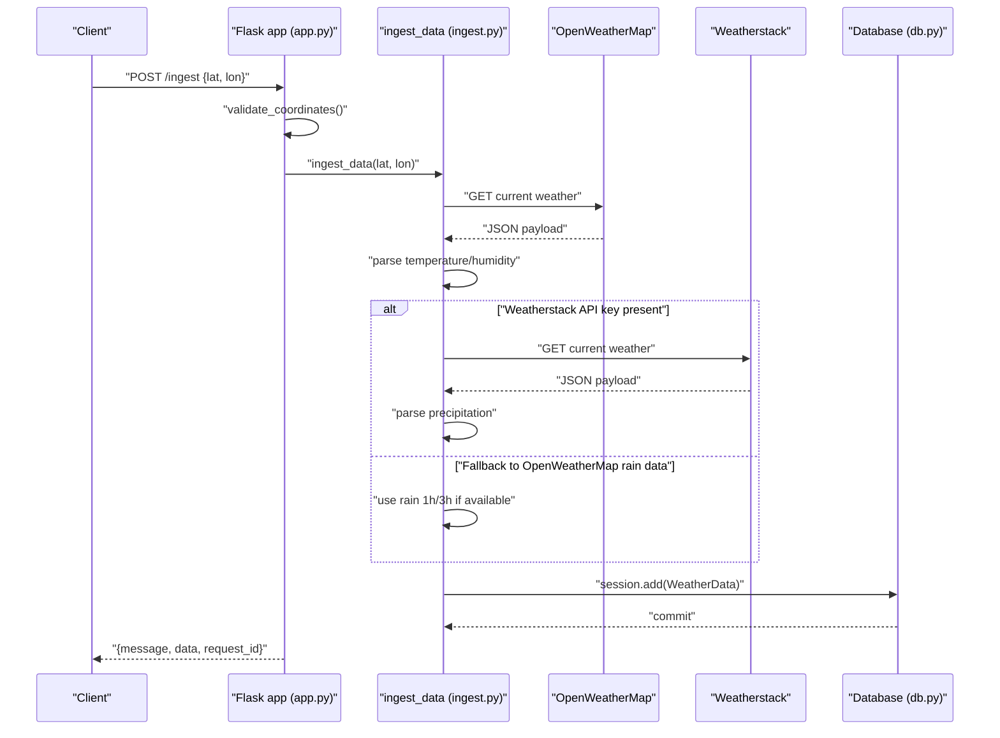
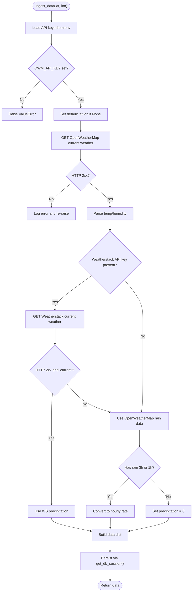
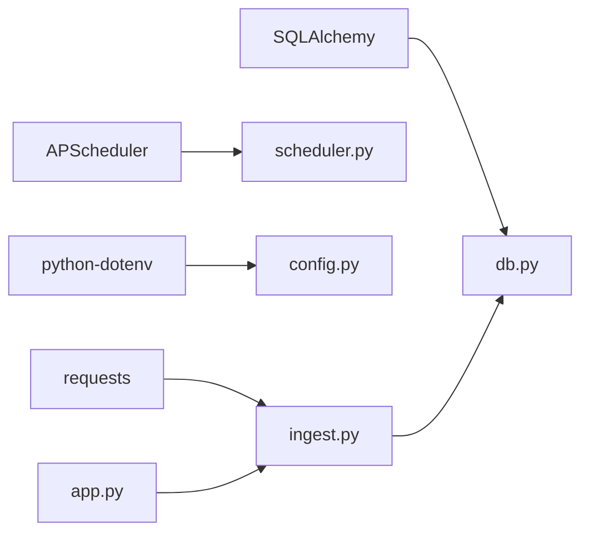

# Weather Data Ingestion

<cite>
**Referenced Files in This Document**
- [ingest.py](file://backend/app/services/ingest.py)
- [app.py](file://backend/app/api/app.py)
- [db.py](file://backend/app/models/db.py)
- [.env.example](file://backend/.env.example)
- [config.py](file://backend/app/core/config.py)
- [utils.py](file://backend/app/utils/utils.py)
- [scheduler.py](file://backend/app/services/scheduler.py)
- [requirements.txt](file://backend/requirements.txt)
- [main.py](file://backend/main.py)
</cite>

## Table of Contents
1. [Introduction](#introduction)
2. [Project Structure](#project-structure)
3. [Core Components](#core-components)
4. [Architecture Overview](#architecture-overview)
5. [Detailed Component Analysis](#detailed-component-analysis)
6. [Dependency Analysis](#dependency-analysis)
7. [Performance Considerations](#performance-considerations)
8. [Troubleshooting Guide](#troubleshooting-guide)
9. [Conclusion](#conclusion)

## Introduction
This document explains the weather data ingestion service that fetches real-time weather conditions from external APIs and persists them into the application’s database. It covers how the service constructs requests using location parameters, manages API keys via environment variables, parses and transforms JSON responses into the internal WeatherData model, and integrates with the database layer. It also documents error handling for network failures and invalid responses, and outlines operational concerns such as rate limiting, API downtime, and data consistency. The content is structured to be accessible to beginners while providing technical depth for experienced developers.

## Project Structure
The weather ingestion service lives in the backend application and is composed of:
- API layer: exposes the /ingest endpoint and orchestrates ingestion requests
- Service layer: performs HTTP requests to OpenWeatherMap and Weatherstack, parses responses, and prepares data
- Database layer: defines the WeatherData model and session management
- Utilities: logging setup and coordinate validation
- Scheduler: periodically triggers ingestion jobs
- Configuration: environment loading and environment variables

**Diagram sources**
- [app.py](file://backend/app/api/app.py#L141-L223)
- [ingest.py](file://backend/app/services/ingest.py#L9-L111)
- [db.py](file://backend/app/models/db.py#L13-L37)
- [utils.py](file://backend/app/utils/utils.py#L1-L48)
- [config.py](file://backend/app/core/config.py#L1-L10)
- [scheduler.py](file://backend/app/services/scheduler.py#L1-L15)

**Section sources**
- [app.py](file://backend/app/api/app.py#L141-L223)
- [ingest.py](file://backend/app/services/ingest.py#L9-L111)
- [db.py](file://backend/app/models/db.py#L13-L37)
- [utils.py](file://backend/app/utils/utils.py#L1-L48)
- [config.py](file://backend/app/core/config.py#L1-L10)
- [scheduler.py](file://backend/app/services/scheduler.py#L1-L15)

## Core Components
- Ingest service: fetches weather data from OpenWeatherMap and Weatherstack, validates and transforms responses, and persists to the database
- API endpoint: exposes /ingest for manual ingestion and handles JSON parsing, validation, and error responses
- Database model and session: defines the WeatherData entity and provides a context-managed session for transactions
- Environment configuration: loads environment variables for API keys and database URL
- Utilities: logging and coordinate validation
- Scheduler: runs periodic ingestion jobs

**Section sources**
- [ingest.py](file://backend/app/services/ingest.py#L9-L111)
- [app.py](file://backend/app/api/app.py#L141-L223)
- [db.py](file://backend/app/models/db.py#L13-L37)
- [.env.example](file://backend/.env.example#L1-L4)
- [config.py](file://backend/app/core/config.py#L1-L10)
- [utils.py](file://backend/app/utils/utils.py#L1-L48)
- [scheduler.py](file://backend/app/services/scheduler.py#L1-L15)

## Architecture Overview
The ingestion pipeline is a request-driven process:
- An HTTP client calls the /ingest endpoint with optional lat/lon
- The API validates coordinates and delegates to the ingest service
- The ingest service builds and executes HTTP requests to OpenWeatherMap and Weatherstack
- Responses are parsed and normalized into a WeatherData-compatible dictionary
- The dictionary is persisted via the database session manager
- The API returns the ingested data to the caller

**Diagram sources**
- [app.py](file://backend/app/api/app.py#L141-L223)
- [ingest.py](file://backend/app/services/ingest.py#L9-L111)
- [db.py](file://backend/app/models/db.py#L25-L37)

## Detailed Component Analysis

### Ingest Service: ingest_data(lat, lon)
Responsibilities:
- Load API keys from environment variables
- Default to a known location if lat/lon are not provided
- Fetch current weather from OpenWeatherMap
- Optionally fetch precipitation from Weatherstack if configured
- Normalize precipitation from OpenWeatherMap rain fields
- Build a WeatherData-compatible dictionary and persist it to the database
- Return the ingested data

Key behaviors:
- API key management: reads OWM_API_KEY and falls back to METEOSTAT_API_KEY or WEATHERSTACK_API_KEY for Weatherstack
- Request construction: builds URLs with lat/lon and API keys; sets a 10-second timeout for HTTP requests
- Error handling: raises exceptions on missing API keys, invalid responses, and database errors; logs warnings for partial failures
- Data transformation: extracts temperature and humidity from OpenWeatherMap; precipitation prioritizes Weatherstack, with fallback to OpenWeatherMap rain fields

**Diagram sources**
- [ingest.py](file://backend/app/services/ingest.py#L9-L111)

**Section sources**
- [ingest.py](file://backend/app/services/ingest.py#L9-L111)
- [.env.example](file://backend/.env.example#L1-L4)

### API Endpoint: /ingest
Responsibilities:
- Serve usage information for GET /ingest
- Parse JSON request bodies robustly, including PowerShell curl edge cases
- Validate coordinates if provided
- Delegate ingestion to ingest_data and return standardized responses
- Centralize error handling for validation, parsing, and unexpected exceptions

Notable features:
- JSON parsing helper handles double-escaped strings commonly produced by PowerShell curl
- Coordinate validation ensures lat/lon are within acceptable ranges
- Error responses include request_id for traceability

**Section sources**
- [app.py](file://backend/app/api/app.py#L141-L223)
- [utils.py](file://backend/app/utils/utils.py#L1-L48)

### Database Layer: WeatherData and Session Management
Responsibilities:
- Define the WeatherData SQLAlchemy model with fields for temperature, humidity, precipitation, and timestamp
- Provide a context manager get_db_session() that commits on success, rolls back on exceptions, and cleans up the session

Integration with ingestion:
- The ingest service passes a data dictionary to WeatherData constructor and adds it to the session
- The session lifecycle is managed centrally to ensure consistency and cleanup

**Section sources**
- [db.py](file://backend/app/models/db.py#L13-L37)
- [ingest.py](file://backend/app/services/ingest.py#L100-L109)

### Environment Configuration and API Keys
- Environment loading: load_env() loads .env variables into the process
- API keys: OWM_API_KEY is mandatory; Weatherstack API key is optional and can be provided via METEOSTAT_API_KEY or WEATHERSTACK_API_KEY
- Database URL: DATABASE_URL controls persistence (defaults to SQLite)

Operational note:
- The example .env file demonstrates typical values for API keys and database URL

**Section sources**
- [config.py](file://backend/app/core/config.py#L1-L10)
- [.env.example](file://backend/.env.example#L1-L4)

### Logging and Utilities
- Logging: setup_logging() configures rotating file logs and console output
- Coordinate validation: validate_coordinates() enforces lat/lon bounds and types

**Section sources**
- [utils.py](file://backend/app/utils/utils.py#L1-L48)

### Scheduler Integration
- BackgroundScheduler runs ingest_data on an hourly interval
- Errors in scheduled jobs are logged and do not crash the scheduler

**Section sources**
- [scheduler.py](file://backend/app/services/scheduler.py#L1-L15)

## Dependency Analysis
External dependencies relevant to ingestion:
- requests: HTTP client used to call OpenWeatherMap and Weatherstack
- APScheduler: background scheduler for periodic ingestion
- python-dotenv: environment variable loading
- SQLAlchemy: ORM for database operations

**Diagram sources**
- [requirements.txt](file://backend/requirements.txt#L1-L15)
- [ingest.py](file://backend/app/services/ingest.py#L1-L111)
- [scheduler.py](file://backend/app/services/scheduler.py#L1-L15)
- [config.py](file://backend/app/core/config.py#L1-L10)
- [db.py](file://backend/app/models/db.py#L1-L37)
- [app.py](file://backend/app/api/app.py#L141-L223)

**Section sources**
- [requirements.txt](file://backend/requirements.txt#L1-L15)

## Performance Considerations
- Timeout configuration: HTTP requests to external APIs use a 10-second timeout to prevent blocking the API thread
- Retry logic: the current implementation does not include explicit retries for transient failures; consider adding exponential backoff if needed
- Concurrency: the database session uses a scoped session; ensure the API is deployed behind a WSGI server (e.g., Gunicorn) for concurrency support
- Rate limiting: external APIs may throttle requests; monitor response codes and implement retry with backoff if necessary
- Data volume: ingestion occurs per request; for batch ingestion, consider extending the service to accept arrays of locations

[No sources needed since this section provides general guidance]

## Troubleshooting Guide
Common issues and resolutions:
- Missing API keys
  - Symptom: ValueError raised indicating OWM_API_KEY is not set
  - Resolution: Set OWM_API_KEY in the environment; optionally set METEOSTAT_API_KEY or WEATHERSTACK_API_KEY for precipitation fallback
  - Section sources
    - [ingest.py](file://backend/app/services/ingest.py#L31-L34)
    - [.env.example](file://backend/.env.example#L1-L4)

- Invalid JSON or malformed payloads
  - Symptom: 400 Bad Request from /ingest
  - Resolution: Ensure JSON is properly formatted; the API includes a helper to handle PowerShell curl edge cases
  - Section sources
    - [app.py](file://backend/app/api/app.py#L176-L223)

- Invalid coordinates
  - Symptom: Validation error when lat/lon are out of range
  - Resolution: Provide lat in [-90, 90] and lon in [-180, 180]
  - Section sources
    - [utils.py](file://backend/app/utils/utils.py#L39-L48)

- Network failures or timeouts
  - Symptom: HTTP request exceptions or timeouts
  - Resolution: Verify network connectivity, adjust timeouts, and consider retry logic with backoff
  - Section sources
    - [ingest.py](file://backend/app/services/ingest.py#L39-L41)

- Invalid or incomplete API responses
  - Symptom: KeyError or ValueError when parsing responses
  - Resolution: Confirm API responses contain expected fields; the ingest service checks for presence of required keys
  - Section sources
    - [ingest.py](file://backend/app/services/ingest.py#L44-L46)

- Database errors
  - Symptom: Exception during commit or rollback
  - Resolution: Inspect database connectivity and permissions; the session manager handles rollback and cleanup
  - Section sources
    - [db.py](file://backend/app/models/db.py#L25-L37)

- Scheduled ingestion failures
  - Symptom: Errors logged by the scheduler
  - Resolution: Review logs and ensure environment variables are loaded before scheduling starts
  - Section sources
    - [scheduler.py](file://backend/app/services/scheduler.py#L1-L15)
    - [app.py](file://backend/app/api/app.py#L75-L83)

## Conclusion
The weather data ingestion service provides a robust, modular pipeline for fetching real-time weather conditions, transforming them into the internal WeatherData model, and persisting them to the database. It supports location-based parameters, environment-based API key management, and comprehensive error handling. While the current implementation focuses on request-driven ingestion, the architecture readily supports enhancements such as retry logic, batch ingestion, and improved resilience against external API limitations. The API layer offers clear endpoints and strong validation, and the database layer ensures transactional integrity through a context-managed session.
