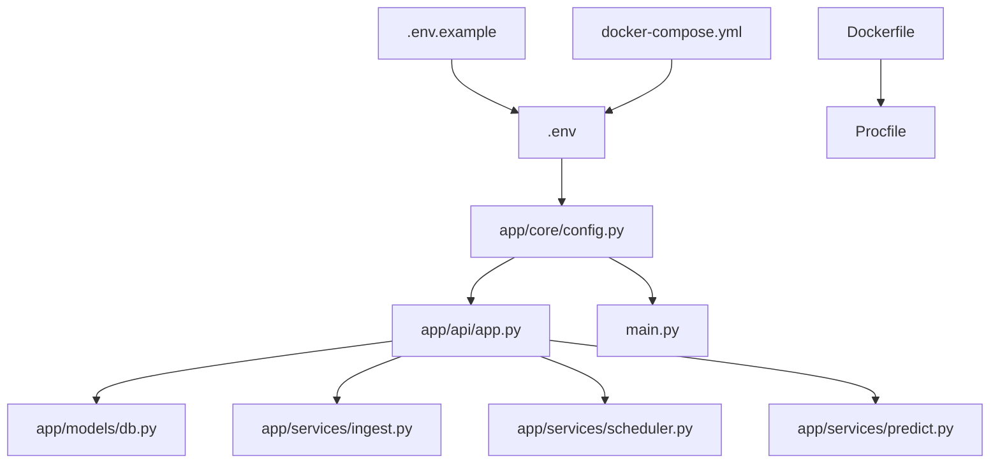
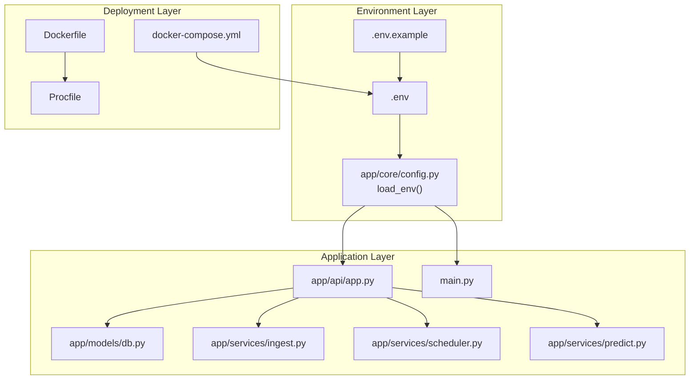
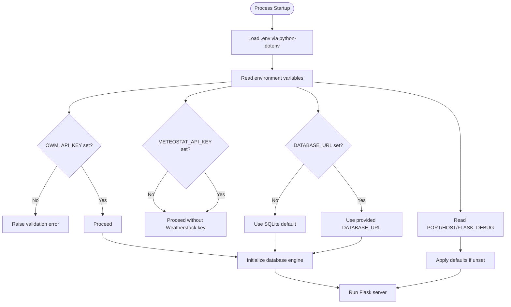
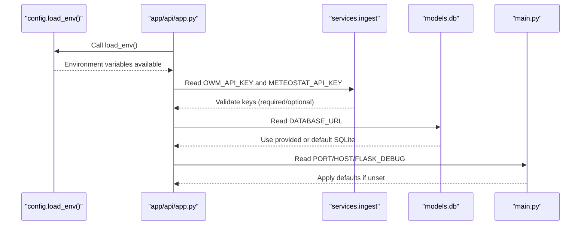
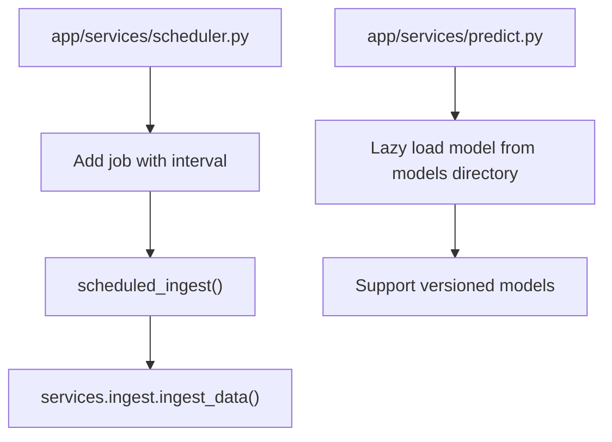
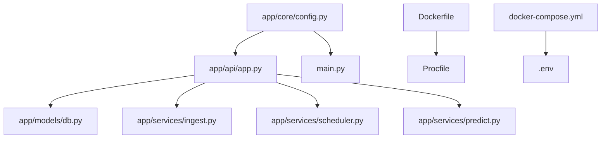

# Configuration & Environment Setup

<cite>
**Referenced Files in This Document**
- [backend/.env.example](file://backend/.env.example)
- [backend/app/core/config.py](file://backend/app/core/config.py)
- [backend/app/api/app.py](file://backend/app/api/app.py)
- [backend/app/models/db.py](file://backend/app/models/db.py)
- [backend/app/services/ingest.py](file://backend/app/services/ingest.py)
- [backend/app/services/scheduler.py](file://backend/app/services/scheduler.py)
- [backend/app/services/predict.py](file://backend/app/services/predict.py)
- [backend/main.py](file://backend/main.py)
- [backend/Dockerfile](file://backend/Dockerfile)
- [docker-compose.yml](file://docker-compose.yml)
- [backend/Procfile](file://backend/Procfile)
- [backend/requirements.txt](file://backend/requirements.txt)
- [backend/docs/MODEL_MANAGEMENT.md](file://backend/docs/MODEL_MANAGEMENT.md)
</cite>

## Table of Contents
1. [Introduction](#introduction)
2. [Project Structure](#project-structure)
3. [Core Components](#core-components)
4. [Architecture Overview](#architecture-overview)
5. [Detailed Component Analysis](#detailed-component-analysis)
6. [Dependency Analysis](#dependency-analysis)
7. [Performance Considerations](#performance-considerations)
8. [Troubleshooting Guide](#troubleshooting-guide)
9. [Conclusion](#conclusion)
10. [Appendices](#appendices)

## Introduction
This section explains how to configure the floodingnaque application using environment variables and configuration files. It covers the environment variables defined in the repository’s example template, how configuration is loaded and validated, and how these settings influence runtime behavior such as database connectivity, API keys, scheduler intervals, and model loading paths. It also provides step-by-step setup instructions for local development and production deployment, including examples for SQLite and PostgreSQL databases, and best practices for securing sensitive data.

## Project Structure
The configuration system spans several files:
- Environment templates and files: .env.example, .env
- Configuration loader: app/core/config.py
- Application entry points: main.py and app/api/app.py
- Database configuration: app/models/db.py
- Weather data ingestion: app/services/ingest.py
- Scheduler configuration: app/services/scheduler.py
- Model loading and paths: app/services/predict.py
- Deployment configurations: Dockerfile, docker-compose.yml, Procfile
- Requirements: requirements.txt

**Diagram sources**
- [backend/.env.example](file://backend/.env.example#L1-L4)
- [backend/app/core/config.py](file://backend/app/core/config.py#L1-L10)
- [backend/app/api/app.py](file://backend/app/api/app.py#L72-L84)
- [backend/app/models/db.py](file://backend/app/models/db.py#L1-L12)
- [backend/app/services/ingest.py](file://backend/app/services/ingest.py#L20-L34)
- [backend/app/services/scheduler.py](file://backend/app/services/scheduler.py#L1-L15)
- [backend/app/services/predict.py](file://backend/app/services/predict.py#L12-L16)
- [backend/main.py](file://backend/main.py#L17-L24)
- [backend/Dockerfile](file://backend/Dockerfile#L1-L37)
- [docker-compose.yml](file://docker-compose.yml#L1-L35)
- [backend/Procfile](file://backend/Procfile#L1-L1)

**Section sources**
- [backend/.env.example](file://backend/.env.example#L1-L4)
- [backend/app/core/config.py](file://backend/app/core/config.py#L1-L10)
- [backend/app/api/app.py](file://backend/app/api/app.py#L72-L84)
- [backend/app/models/db.py](file://backend/app/models/db.py#L1-L12)
- [backend/app/services/ingest.py](file://backend/app/services/ingest.py#L20-L34)
- [backend/app/services/scheduler.py](file://backend/app/services/scheduler.py#L1-L15)
- [backend/app/services/predict.py](file://backend/app/services/predict.py#L12-L16)
- [backend/main.py](file://backend/main.py#L17-L24)
- [backend/Dockerfile](file://backend/Dockerfile#L1-L37)
- [docker-compose.yml](file://docker-compose.yml#L1-L35)
- [backend/Procfile](file://backend/Procfile#L1-L1)

## Core Components
This section documents the environment variables defined in the repository and how they are consumed across the application.

- OWM_API_KEY
  - Purpose: Authentication for OpenWeatherMap API used during weather data ingestion.
  - Consumption: Retrieved via environment variable in the ingestion service.
  - Behavior: Required; missing value triggers a validation error.
  - Impact: Without a valid key, ingestion endpoints cannot fetch weather data.

- METEOSTAT_API_KEY
  - Purpose: Authentication for Weatherstack API (used as a fallback or alternative).
  - Consumption: Retrieved via environment variable; also supports WEATHERSTACK_API_KEY as a fallback.
  - Behavior: Optional; ingestion continues if unavailable.
  - Impact: Enables alternate data source if OpenWeatherMap is not used.

- DATABASE_URL
  - Purpose: SQLAlchemy database connection string.
  - Consumption: Used by the database engine initialization.
  - Defaults: Falls back to an SQLite file path if not provided.
  - Impact: Determines persistence backend (SQLite vs PostgreSQL).

- PORT
  - Purpose: TCP port for the Flask application.
  - Consumption: Read by both the WSGI entry point and the Flask CLI entry point.
  - Defaults: Uses 5000 if not set.
  - Impact: Controls where the server listens for requests.

- HOST
  - Purpose: Host binding address for the Flask application.
  - Consumption: Read by the Flask CLI entry point.
  - Defaults: Binds to 0.0.0.0 if not set.
  - Impact: Controls network interface exposure.

- FLASK_DEBUG
  - Purpose: Debug mode toggle for Flask.
  - Consumption: Read by the Flask CLI entry point.
  - Defaults: False if not set.
  - Impact: Enables or disables development-time features like auto-reload and detailed error pages.

- Additional configuration points
  - python-dotenv: The configuration loader imports and exposes a function to load environment variables from a .env file.
  - Scheduler interval: The scheduler runs at a fixed interval; this is configured in the scheduler module.

**Section sources**
- [backend/.env.example](file://backend/.env.example#L1-L4)
- [backend/app/core/config.py](file://backend/app/core/config.py#L1-L10)
- [backend/app/services/ingest.py](file://backend/app/services/ingest.py#L20-L34)
- [backend/app/models/db.py](file://backend/app/models/db.py#L7-L9)
- [backend/app/api/app.py](file://backend/app/api/app.py#L537-L543)
- [backend/main.py](file://backend/main.py#L17-L24)
- [backend/app/services/scheduler.py](file://backend/app/services/scheduler.py#L14-L15)

## Architecture Overview
The configuration architecture follows a layered approach:
- Environment templates (.env.example) define the canonical variables.
- A loader function (python-dotenv) makes variables available to the process.
- Application components read environment variables directly via os.getenv with sensible defaults.
- Database engine reads DATABASE_URL to select the backend.
- Scheduler and ingestion services consume API keys and other settings.
- Deployment artifacts (Dockerfile, docker-compose.yml, Procfile) propagate environment variables to containers and platforms.

**Diagram sources**
- [backend/.env.example](file://backend/.env.example#L1-L4)
- [backend/app/core/config.py](file://backend/app/core/config.py#L1-L10)
- [backend/app/api/app.py](file://backend/app/api/app.py#L72-L84)
- [backend/app/models/db.py](file://backend/app/models/db.py#L1-L12)
- [backend/app/services/ingest.py](file://backend/app/services/ingest.py#L20-L34)
- [backend/app/services/scheduler.py](file://backend/app/services/scheduler.py#L1-L15)
- [backend/app/services/predict.py](file://backend/app/services/predict.py#L12-L16)
- [backend/main.py](file://backend/main.py#L17-L24)
- [backend/Dockerfile](file://backend/Dockerfile#L1-L37)
- [docker-compose.yml](file://docker-compose.yml#L1-L35)
- [backend/Procfile](file://backend/Procfile#L1-L1)

## Detailed Component Analysis

### Environment Variable Configuration
- OWM_API_KEY
  - Loaded in ingestion service to call OpenWeatherMap.
  - Required; absence raises a validation error.
- METEOSTAT_API_KEY
  - Loaded in ingestion service; supports WEATHERSTACK_API_KEY fallback.
  - Optional; ingestion continues if not present.
- DATABASE_URL
  - Loaded by the database engine; defaults to SQLite if unset.
- PORT, HOST, FLASK_DEBUG
  - Loaded by both the WSGI entry point and the Flask CLI entry point; defaults provided.

**Diagram sources**
- [backend/app/core/config.py](file://backend/app/core/config.py#L1-L10)
- [backend/app/services/ingest.py](file://backend/app/services/ingest.py#L20-L34)
- [backend/app/models/db.py](file://backend/app/models/db.py#L7-L9)
- [backend/app/api/app.py](file://backend/app/api/app.py#L537-L543)
- [backend/main.py](file://backend/main.py#L17-L24)

**Section sources**
- [backend/.env.example](file://backend/.env.example#L1-L4)
- [backend/app/core/config.py](file://backend/app/core/config.py#L1-L10)
- [backend/app/services/ingest.py](file://backend/app/services/ingest.py#L20-L34)
- [backend/app/models/db.py](file://backend/app/models/db.py#L7-L9)
- [backend/app/api/app.py](file://backend/app/api/app.py#L537-L543)
- [backend/main.py](file://backend/main.py#L17-L24)

### Configuration Loading and Validation
- Loading mechanism
  - A loader function imports python-dotenv and exposes a function to load environment variables from a .env file.
  - The API application calls this loader early in startup.
- Validation
  - OWM_API_KEY is required; missing key triggers a validation error.
  - DATABASE_URL defaults to SQLite if not provided.
  - PORT defaults to 5000; HOST defaults to 0.0.0.0; FLASK_DEBUG defaults to False.

**Diagram sources**
- [backend/app/core/config.py](file://backend/app/core/config.py#L1-L10)
- [backend/app/api/app.py](file://backend/app/api/app.py#L72-L84)
- [backend/app/services/ingest.py](file://backend/app/services/ingest.py#L20-L34)
- [backend/app/models/db.py](file://backend/app/models/db.py#L7-L9)
- [backend/main.py](file://backend/main.py#L17-L24)

**Section sources**
- [backend/app/core/config.py](file://backend/app/core/config.py#L1-L10)
- [backend/app/api/app.py](file://backend/app/api/app.py#L72-L84)
- [backend/app/services/ingest.py](file://backend/app/services/ingest.py#L20-L34)
- [backend/app/models/db.py](file://backend/app/models/db.py#L7-L9)
- [backend/main.py](file://backend/main.py#L17-L24)

### Scheduler Intervals and Model Loading Paths
- Scheduler interval
  - The scheduler is configured to run at a fixed interval; this is defined in the scheduler module.
- Model loading paths
  - The prediction service lazily loads models from a models directory and supports versioned models.
  - The default model path is derived from a relative path within the models directory.

**Diagram sources**
- [backend/app/services/scheduler.py](file://backend/app/services/scheduler.py#L1-L15)
- [backend/app/services/predict.py](file://backend/app/services/predict.py#L12-L16)
- [backend/app/services/ingest.py](file://backend/app/services/ingest.py#L9-L11)

**Section sources**
- [backend/app/services/scheduler.py](file://backend/app/services/scheduler.py#L1-L15)
- [backend/app/services/predict.py](file://backend/app/services/predict.py#L12-L16)
- [backend/app/services/ingest.py](file://backend/app/services/ingest.py#L9-L11)

### Step-by-Step Setup Instructions

#### Local Development
1. Create a .env file from the example template and populate API keys and database URL.
2. Install dependencies using the requirements file.
3. Start the application using the Flask CLI entry point or the WSGI entry point.
4. Confirm the server binds to the expected host/port and debug mode is set appropriately.

Key references:
- Environment template and loader: [backend/.env.example](file://backend/.env.example#L1-L4), [backend/app/core/config.py](file://backend/app/core/config.py#L1-L10)
- Entry points: [backend/app/api/app.py](file://backend/app/api/app.py#L537-L543), [backend/main.py](file://backend/main.py#L17-L24)
- Dependencies: [backend/requirements.txt](file://backend/requirements.txt#L1-L15)

#### Production Deployment
1. Configure environment variables in your platform (e.g., container orchestrator, cloud provider).
2. Use the provided Dockerfile and Procfile for containerized deployments.
3. For container orchestration, docker-compose demonstrates passing environment variables and mounting volumes.

Key references:
- Dockerfile and Procfile: [backend/Dockerfile](file://backend/Dockerfile#L1-L37), [backend/Procfile](file://backend/Procfile#L1-L1)
- docker-compose: [docker-compose.yml](file://docker-compose.yml#L1-L35)

**Section sources**
- [backend/.env.example](file://backend/.env.example#L1-L4)
- [backend/app/core/config.py](file://backend/app/core/config.py#L1-L10)
- [backend/app/api/app.py](file://backend/app/api/app.py#L537-L543)
- [backend/main.py](file://backend/main.py#L17-L24)
- [backend/requirements.txt](file://backend/requirements.txt#L1-L15)
- [backend/Dockerfile](file://backend/Dockerfile#L1-L37)
- [backend/Procfile](file://backend/Procfile#L1-L1)
- [docker-compose.yml](file://docker-compose.yml#L1-L35)

### Database Backends: SQLite and PostgreSQL
- SQLite
  - Default behavior when DATABASE_URL is not set.
  - Suitable for local development and lightweight deployments.
  - Reference: [backend/app/models/db.py](file://backend/app/models/db.py#L7-L9)
- PostgreSQL
  - Supported via DATABASE_URL pointing to a PostgreSQL connection string.
  - docker-compose defines a PostgreSQL service with credentials and volume mapping.
  - Reference: [docker-compose.yml](file://docker-compose.yml#L23-L33)

Best practice:
- Use DATABASE_URL to explicitly select the backend in production.
- For containerized environments, mount persistent volumes for PostgreSQL data.

**Section sources**
- [backend/app/models/db.py](file://backend/app/models/db.py#L7-L9)
- [docker-compose.yml](file://docker-compose.yml#L23-L33)

### Security Best Practices for API Keys and Sensitive Data
- Never commit secrets to version control.
- Use separate .env files per environment and ensure they are excluded from repositories.
- Restrict permissions on .env files to minimize exposure.
- Rotate API keys regularly and revoke compromised keys promptly.
- Avoid printing secrets in logs; sanitize logs and error messages.
- Prefer platform-managed secrets for production deployments (e.g., environment variables in containers or secret managers).

[No sources needed since this section provides general guidance]

### How Configuration Affects System Behavior
- Database connectivity
  - DATABASE_URL determines the backend and connection parameters; defaults to SQLite if unset.
  - Reference: [backend/app/models/db.py](file://backend/app/models/db.py#L7-L9)
- API keys
  - OWM_API_KEY is mandatory for ingestion; missing key prevents weather data retrieval.
  - METEOSTAT_API_KEY is optional; ingestion continues if absent.
  - Reference: [backend/app/services/ingest.py](file://backend/app/services/ingest.py#L20-L34)
- Scheduler intervals
  - The scheduler runs at a fixed interval; this influences automated data ingestion cadence.
  - Reference: [backend/app/services/scheduler.py](file://backend/app/services/scheduler.py#L14-L15)
- Model loading paths
  - Models are loaded from a models directory; versioned models are supported.
  - Reference: [backend/app/services/predict.py](file://backend/app/services/predict.py#L12-L16), [backend/docs/MODEL_MANAGEMENT.md](file://backend/docs/MODEL_MANAGEMENT.md#L1-L482)

**Section sources**
- [backend/app/models/db.py](file://backend/app/models/db.py#L7-L9)
- [backend/app/services/ingest.py](file://backend/app/services/ingest.py#L20-L34)
- [backend/app/services/scheduler.py](file://backend/app/services/scheduler.py#L14-L15)
- [backend/app/services/predict.py](file://backend/app/services/predict.py#L12-L16)
- [backend/docs/MODEL_MANAGEMENT.md](file://backend/docs/MODEL_MANAGEMENT.md#L1-L482)

## Dependency Analysis
The configuration dependencies are straightforward and centralized around environment variables and the loader function.

**Diagram sources**
- [backend/app/core/config.py](file://backend/app/core/config.py#L1-L10)
- [backend/app/api/app.py](file://backend/app/api/app.py#L72-L84)
- [backend/app/models/db.py](file://backend/app/models/db.py#L1-L12)
- [backend/app/services/ingest.py](file://backend/app/services/ingest.py#L20-L34)
- [backend/app/services/scheduler.py](file://backend/app/services/scheduler.py#L1-L15)
- [backend/app/services/predict.py](file://backend/app/services/predict.py#L12-L16)
- [backend/Dockerfile](file://backend/Dockerfile#L1-L37)
- [backend/Procfile](file://backend/Procfile#L1-L1)
- [docker-compose.yml](file://docker-compose.yml#L1-L35)

**Section sources**
- [backend/app/core/config.py](file://backend/app/core/config.py#L1-L10)
- [backend/app/api/app.py](file://backend/app/api/app.py#L72-L84)
- [backend/app/models/db.py](file://backend/app/models/db.py#L1-L12)
- [backend/app/services/ingest.py](file://backend/app/services/ingest.py#L20-L34)
- [backend/app/services/scheduler.py](file://backend/app/services/scheduler.py#L1-L15)
- [backend/app/services/predict.py](file://backend/app/services/predict.py#L12-L16)
- [backend/Dockerfile](file://backend/Dockerfile#L1-L37)
- [backend/Procfile](file://backend/Procfile#L1-L1)
- [docker-compose.yml](file://docker-compose.yml#L1-L35)

## Performance Considerations
- Environment variable lookups are fast and cached by the process; keep configuration minimal and centralized.
- For production, prefer platform-managed environment variables to avoid repeated file I/O.
- Ensure DATABASE_URL points to a performant backend (PostgreSQL for production-scale workloads).
- Tune scheduler intervals based on workload and data freshness requirements.

[No sources needed since this section provides general guidance]

## Troubleshooting Guide
Common configuration errors and resolutions:
- Missing OWM_API_KEY
  - Symptom: Ingestion endpoints fail with a validation error indicating the key is not set.
  - Resolution: Set OWM_API_KEY in .env and restart the application.
  - Reference: [backend/app/services/ingest.py](file://backend/app/services/ingest.py#L20-L34)
- Missing DATABASE_URL
  - Symptom: Application falls back to SQLite; unexpected if PostgreSQL was intended.
  - Resolution: Set DATABASE_URL to a PostgreSQL connection string or leave unset for SQLite.
  - Reference: [backend/app/models/db.py](file://backend/app/models/db.py#L7-L9)
- Incorrect PORT/HOST/FLASK_DEBUG
  - Symptom: Server does not bind to expected host/port or debug mode is not applied.
  - Resolution: Set PORT, HOST, and FLASK_DEBUG explicitly; defaults are applied if unset.
  - References: [backend/app/api/app.py](file://backend/app/api/app.py#L537-L543), [backend/main.py](file://backend/main.py#L17-L24)
- Scheduler not running
  - Symptom: Scheduled ingestion jobs do not execute.
  - Resolution: Verify scheduler initialization and logs; ensure no exceptions occur during startup.
  - Reference: [backend/app/services/scheduler.py](file://backend/app/services/scheduler.py#L1-L15)
- Model not found
  - Symptom: Predictions fail due to missing model file.
  - Resolution: Train a model and ensure the models directory contains the expected files.
  - References: [backend/app/services/predict.py](file://backend/app/services/predict.py#L74-L102), [backend/docs/MODEL_MANAGEMENT.md](file://backend/docs/MODEL_MANAGEMENT.md#L1-L482)

**Section sources**
- [backend/app/services/ingest.py](file://backend/app/services/ingest.py#L20-L34)
- [backend/app/models/db.py](file://backend/app/models/db.py#L7-L9)
- [backend/app/api/app.py](file://backend/app/api/app.py#L537-L543)
- [backend/main.py](file://backend/main.py#L17-L24)
- [backend/app/services/scheduler.py](file://backend/app/services/scheduler.py#L1-L15)
- [backend/app/services/predict.py](file://backend/app/services/predict.py#L74-L102)
- [backend/docs/MODEL_MANAGEMENT.md](file://backend/docs/MODEL_MANAGEMENT.md#L1-L482)

## Conclusion
The floodingnaque application relies on a simple, robust configuration system centered on environment variables and a minimal loader. By following the documented setup steps, using appropriate database backends, and adhering to security best practices, you can deploy and operate the system reliably in both development and production environments. Configuration directly impacts ingestion, persistence, scheduling, and model loading—ensuring correct values is essential for predictable behavior.

[No sources needed since this section summarizes without analyzing specific files]

## Appendices

### Appendix A: Environment Variables Reference
- OWM_API_KEY: Required for OpenWeatherMap ingestion.
- METEOSTAT_API_KEY: Optional; supports WEATHERSTACK_API_KEY fallback.
- DATABASE_URL: SQLAlchemy connection string; defaults to SQLite if unset.
- PORT: TCP port for the server; defaults to 5000.
- HOST: Host binding address; defaults to 0.0.0.0.
- FLASK_DEBUG: Debug mode toggle; defaults to False.

**Section sources**
- [backend/.env.example](file://backend/.env.example#L1-L4)
- [backend/app/services/ingest.py](file://backend/app/services/ingest.py#L20-L34)
- [backend/app/models/db.py](file://backend/app/models/db.py#L7-L9)
- [backend/app/api/app.py](file://backend/app/api/app.py#L537-L543)
- [backend/main.py](file://backend/main.py#L17-L24)
