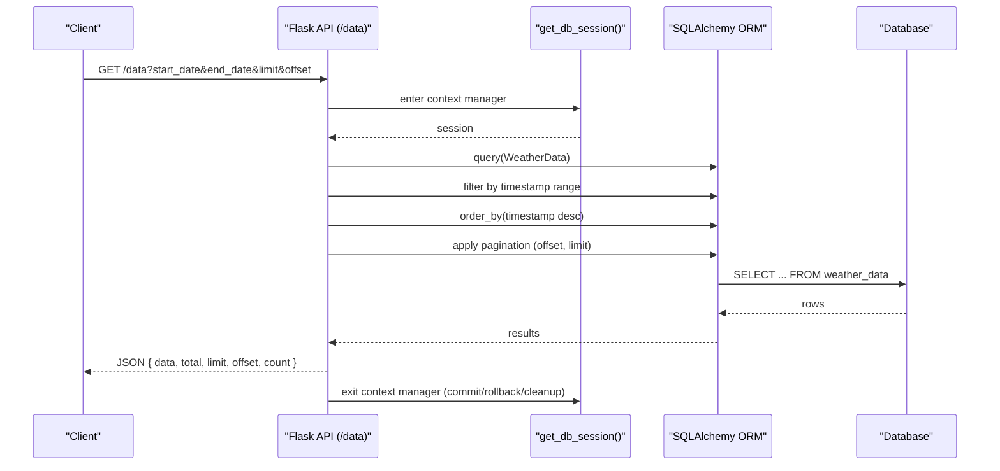
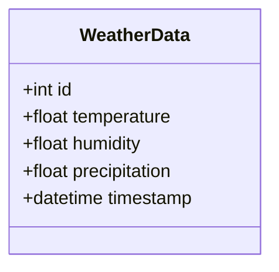
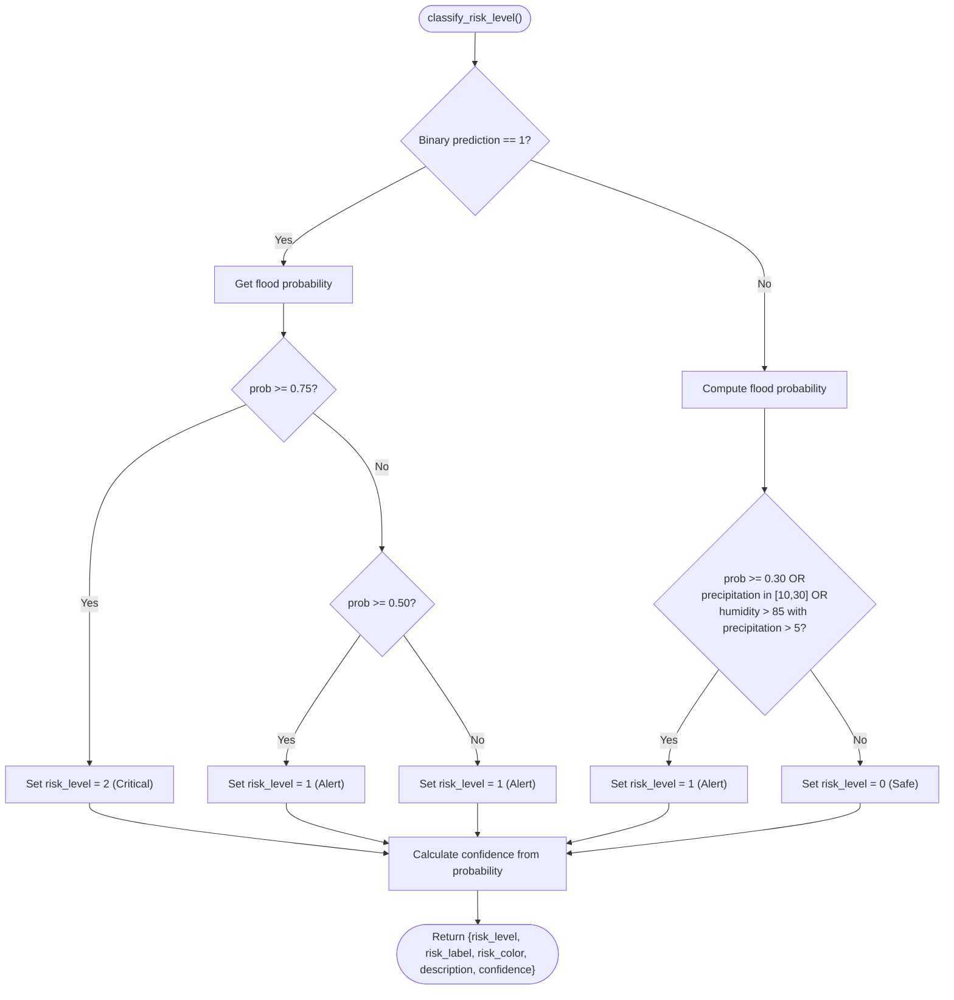
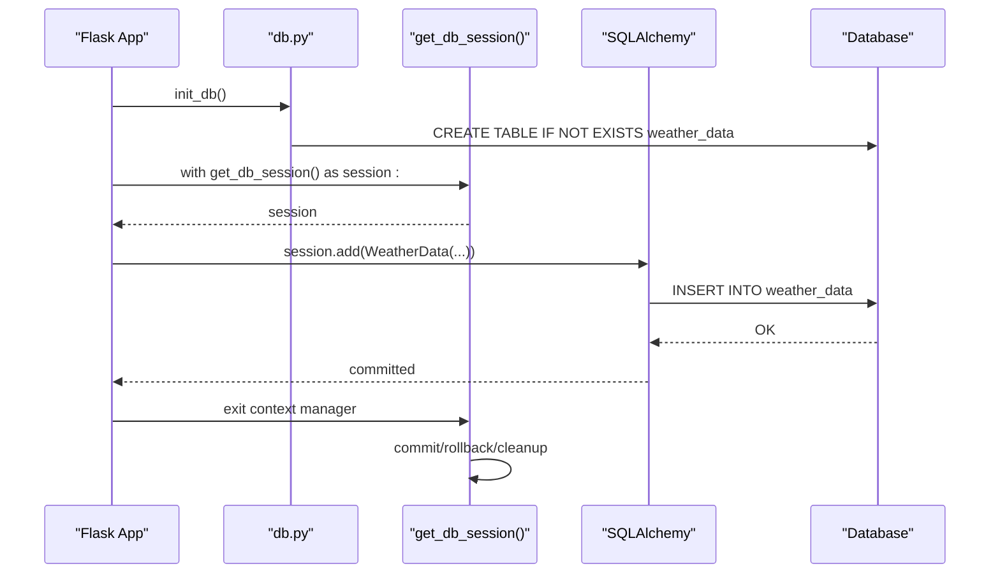
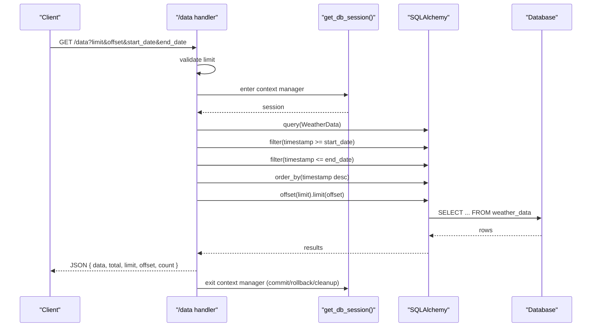
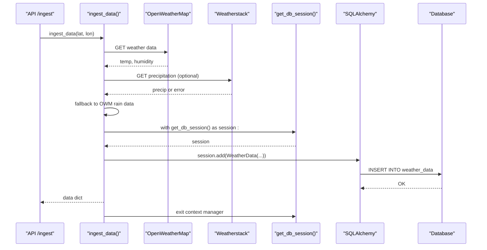
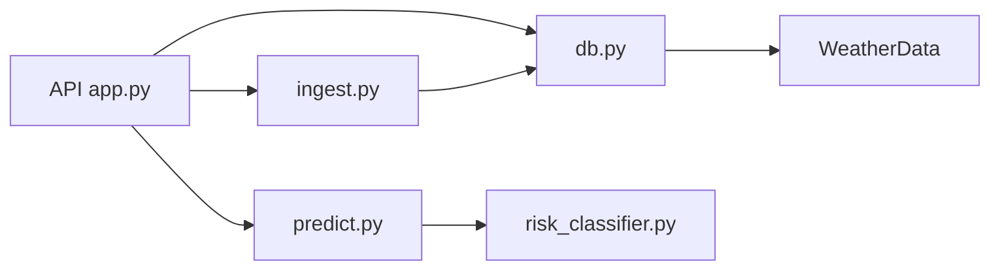

# Data Models & ORM Mapping

<cite>
**Referenced Files in This Document**
- [db.py](file://backend/app/models/db.py)
- [DATABASE_SETUP.md](file://backend/docs/DATABASE_SETUP.md)
- [ingest.py](file://backend/app/services/ingest.py)
- [app.py](file://backend/app/api/app.py)
- [risk_classifier.py](file://backend/app/services/risk_classifier.py)
- [predict.py](file://backend/app/services/predict.py)
- [inspect_db.py](file://backend/scripts/inspect_db.py)
</cite>

## Table of Contents
1. [Introduction](#introduction)
2. [Project Structure](#project-structure)
3. [Core Components](#core-components)
4. [Architecture Overview](#architecture-overview)
5. [Detailed Component Analysis](#detailed-component-analysis)
6. [Dependency Analysis](#dependency-analysis)
7. [Performance Considerations](#performance-considerations)
8. [Troubleshooting Guide](#troubleshooting-guide)
9. [Conclusion](#conclusion)

## Introduction
This document provides comprehensive data model documentation for the floodingnaque application. It focuses on the SQLAlchemy ORM models used for weather data storage and the risk classification logic that transforms model predictions into a 3-level risk classification. The document explains field definitions, primary keys, data types, constraints, schema design rationale, indexing strategy, relationships, session management patterns, and practical query examples for retrieving historical data and filtering by date ranges. It also covers validation rules embedded in service logic and performance considerations for large datasets, with references to DATABASE_SETUP.md for SQLite versus PostgreSQL configuration differences.

## Project Structure
The data model layer is centered around a single SQLAlchemy declarative base and a single table model for weather observations. Supporting components include:
- Database initialization and engine/session configuration
- Session context manager for safe transaction handling
- Weather ingestion service that persists observations
- API endpoints that expose historical data retrieval and prediction
- Risk classification service that produces risk_level and confidence_score for predictions

```mermaid
graph TB
subgraph "Models"
DB["backend/app/models/db.py<br/>Declarative Base, Engine, Session, WeatherData"]
end
subgraph "Services"
Ingest["backend/app/services/ingest.py<br/>ingest_data()"]
Predict["backend/app/services/predict.py<br/>predict_flood()"]
Risk["backend/app/services/risk_classifier.py<br/>classify_risk_level()"]
end
subgraph "API"
API["backend/app/api/app.py<br/>/data endpoint, /ingest endpoint"]
end
subgraph "Scripts"
Inspect["backend/scripts/inspect_db.py<br/>DB inspection"]
end
API --> DB
API --> Ingest
API --> Predict
Predict --> Risk
Ingest --> DB
Inspect --> DB
```

**Diagram sources**
- [db.py](file://backend/app/models/db.py#L1-L37)
- [ingest.py](file://backend/app/services/ingest.py#L1-L111)
- [app.py](file://backend/app/api/app.py#L341-L398)
- [predict.py](file://backend/app/services/predict.py#L111-L216)
- [risk_classifier.py](file://backend/app/services/risk_classifier.py#L32-L111)
- [inspect_db.py](file://backend/scripts/inspect_db.py#L1-L23)

**Section sources**
- [db.py](file://backend/app/models/db.py#L1-L37)
- [DATABASE_SETUP.md](file://backend/docs/DATABASE_SETUP.md#L1-L93)
- [ingest.py](file://backend/app/services/ingest.py#L1-L111)
- [app.py](file://backend/app/api/app.py#L341-L398)
- [predict.py](file://backend/app/services/predict.py#L111-L216)
- [risk_classifier.py](file://backend/app/services/risk_classifier.py#L32-L111)
- [inspect_db.py](file://backend/scripts/inspect_db.py#L1-L23)

## Core Components
- WeatherData ORM model
  - Purpose: Persist weather observations ingested from external APIs
  - Fields: id (Integer, primary key), temperature (Float), humidity (Float), precipitation (Float), timestamp (DateTime)
  - Constraints: No explicit NOT NULL constraints are declared; nulls are allowed for numeric fields
  - Table name: weather_data
- Database initialization and session management
  - Engine configured via DATABASE_URL environment variable with SQLite as default
  - Scoped session for thread-safe access
  - Context manager get_db_session() ensures commit/rollback and cleanup

**Section sources**
- [db.py](file://backend/app/models/db.py#L1-L37)
- [DATABASE_SETUP.md](file://backend/docs/DATABASE_SETUP.md#L1-L93)

## Architecture Overview
The data flow begins with weather ingestion, which persists observations to the database. Historical queries are served by the API, and predictions combine model inference with risk classification to produce risk_level and confidence_score.



**Diagram sources**
- [app.py](file://backend/app/api/app.py#L341-L398)
- [db.py](file://backend/app/models/db.py#L25-L37)

## Detailed Component Analysis

### WeatherData ORM Model
- Field definitions and types
  - id: Integer, primary key
  - temperature: Float
  - humidity: Float
  - precipitation: Float
  - timestamp: DateTime
- Primary key and auto-increment
  - id is the primary key; auto-increment behavior depends on the underlying database (SQLite default auto-increments)
- Data types and constraints
  - No explicit NOT NULL constraints are defined in the model; ingestion logic may supply defaults
  - Numeric fields may accept nulls; consumers should handle nulls appropriately
- Schema design rationale
  - Minimalist schema focused on essential weather metrics for flood prediction
  - Timestamp enables chronological ordering and range filtering
- Relationships
  - No foreign keys or explicit relationships defined; this is a standalone observation table
- Indexing strategy
  - No explicit indexes are defined in the model
  - For large datasets, consider adding an index on timestamp for efficient range queries and ordering
  - Consider composite indexes if queries frequently filter by timestamp and include other filters



**Diagram sources**
- [db.py](file://backend/app/models/db.py#L13-L20)

**Section sources**
- [db.py](file://backend/app/models/db.py#L13-L20)
- [DATABASE_SETUP.md](file://backend/docs/DATABASE_SETUP.md#L27-L40)

### RiskClassification Logic (3-Level Classification)
While the ORM model does not include a dedicated RiskClassification table, the risk classification is computed in-memory during prediction and returned as part of the API response. The fields risk_level and confidence_score are produced by the risk classifier and included in prediction responses.

- Risk levels
  - Safe (0), Alert (1), Critical (2)
- Confidence score
  - Derived from prediction probabilities; rounded to three decimal places
- Business logic
  - Flood predicted (binary 1) leads to Critical or Alert depending on probability threshold
  - No flood predicted (binary 0) may still be Alert if precipitation or humidity thresholds are met
  - Probability thresholds guide assignment to Critical or Alert when flood is predicted
- Relationship to WeatherData
  - Risk classification consumes WeatherData fields (temperature, humidity, precipitation) indirectly via prediction inputs
  - The classification does not persist risk_level/confidence_score to the database; it is computed per request



**Diagram sources**
- [risk_classifier.py](file://backend/app/services/risk_classifier.py#L32-L111)

**Section sources**
- [risk_classifier.py](file://backend/app/services/risk_classifier.py#L32-L111)
- [predict.py](file://backend/app/services/predict.py#L183-L209)
- [app.py](file://backend/app/api/app.py#L250-L292)

### Database Initialization and Session Management
- Initialization
  - init_db() creates tables if they do not exist
- Engine configuration
  - DATABASE_URL environment variable controls the database backend (SQLite default, PostgreSQL/MySQL supported)
- Session management
  - scoped_session for thread-safe access
  - get_db_session() context manager ensures commit on success, rollback on exceptions, and cleanup



**Diagram sources**
- [db.py](file://backend/app/models/db.py#L21-L37)
- [ingest.py](file://backend/app/services/ingest.py#L100-L110)

**Section sources**
- [db.py](file://backend/app/models/db.py#L21-L37)
- [DATABASE_SETUP.md](file://backend/docs/DATABASE_SETUP.md#L1-L26)
- [ingest.py](file://backend/app/services/ingest.py#L100-L110)

### Historical Data Retrieval and Filtering
- Endpoint: GET /data
- Query parameters
  - limit: integer, default 100, min 1, max 1000
  - offset: integer, default 0
  - start_date: ISO format datetime
  - end_date: ISO format datetime
- Behavior
  - Validates limit bounds
  - Applies date range filters on timestamp
  - Orders by timestamp descending
  - Paginates with offset and limit
  - Returns total count and paginated data



**Diagram sources**
- [app.py](file://backend/app/api/app.py#L341-L398)
- [db.py](file://backend/app/models/db.py#L25-L37)

**Section sources**
- [app.py](file://backend/app/api/app.py#L341-L398)

### Ingestion Workflow and Persistence
- Ingestion service
  - Fetches temperature and humidity from OpenWeatherMap
  - Attempts Weatherstack for precipitation; falls back to OpenWeatherMap rain data
  - Saves to WeatherData table via get_db_session() context manager
- Data types and defaults
  - temperature and humidity come from API responses
  - precipitation defaults to 0 if not provided
  - timestamp is set to current time



**Diagram sources**
- [ingest.py](file://backend/app/services/ingest.py#L1-L111)
- [db.py](file://backend/app/models/db.py#L25-L37)

**Section sources**
- [ingest.py](file://backend/app/services/ingest.py#L1-L111)

## Dependency Analysis
- Internal dependencies
  - API endpoints depend on db.py for initialization and session management
  - Ingestion service depends on WeatherData and get_db_session()
  - Prediction pipeline depends on risk_classifier for risk_level and confidence_score
- External dependencies
  - DATABASE_URL controls SQLAlchemy engine and backend selection
  - OpenWeatherMap and Weatherstack APIs for weather data
- Coupling and cohesion
  - WeatherData is cohesive around weather observations
  - Risk classification is decoupled from persistence and computed per request
  - Session management is centralized in db.py and reused across services



**Diagram sources**
- [app.py](file://backend/app/api/app.py#L1-L120)
- [db.py](file://backend/app/models/db.py#L1-L37)
- [ingest.py](file://backend/app/services/ingest.py#L1-L111)
- [predict.py](file://backend/app/services/predict.py#L111-L216)
- [risk_classifier.py](file://backend/app/services/risk_classifier.py#L32-L111)

**Section sources**
- [app.py](file://backend/app/api/app.py#L1-L120)
- [db.py](file://backend/app/models/db.py#L1-L37)
- [ingest.py](file://backend/app/services/ingest.py#L1-L111)
- [predict.py](file://backend/app/services/predict.py#L111-L216)
- [risk_classifier.py](file://backend/app/services/risk_classifier.py#L32-L111)

## Performance Considerations
- Indexing strategy
  - Add an index on timestamp for efficient range queries and ordering
  - Consider a composite index on (timestamp, id) to optimize pagination scans
- Query optimization
  - Use LIMIT and OFFSET judiciously; for large offsets, consider keyset pagination
  - Filter early with timestamp bounds to reduce result sets
- Data volume
  - Weather data grows continuously; archive older data or partition by date if needed
- Concurrency
  - scoped_session ensures thread-safe access; avoid long-running transactions
- Backend choice
  - SQLite is suitable for development and small deployments; PostgreSQL/MySQL scale better for production loads

[No sources needed since this section provides general guidance]

## Troubleshooting Guide
- Database connectivity
  - Verify DATABASE_URL environment variable and backend availability
  - Use inspect_db.py to list tables, columns, and row counts
- Session handling
  - Ensure get_db_session() context manager is used for all write operations
  - Confirm commit/rollback behavior and cleanup on exceptions
- API validation
  - Limit parameter must be between 1 and 1000
  - Date parameters must be valid ISO format
- Risk classification
  - risk_level and confidence_score are derived from prediction probabilities and thresholds
  - If probabilities are unavailable, confidence defaults to a neutral value

**Section sources**
- [DATABASE_SETUP.md](file://backend/docs/DATABASE_SETUP.md#L1-L93)
- [inspect_db.py](file://backend/scripts/inspect_db.py#L1-L23)
- [db.py](file://backend/app/models/db.py#L25-L37)
- [app.py](file://backend/app/api/app.py#L341-L398)
- [risk_classifier.py](file://backend/app/services/risk_classifier.py#L32-L111)

## Conclusion
The floodingnaque application employs a straightforward, efficient data model centered on the WeatherData ORM for storing weather observations. Historical data retrieval is exposed via a well-validated API endpoint with robust pagination and date-range filtering. Risk classification is computed dynamically during prediction, producing risk_level and confidence_score without persisting these fields to the database. Session management is centralized and safe, while schema design remains minimal and extensible. For production-scale deployments, consider adding indexes on timestamp and evaluating PostgreSQL/MySQL for improved concurrency and performance.