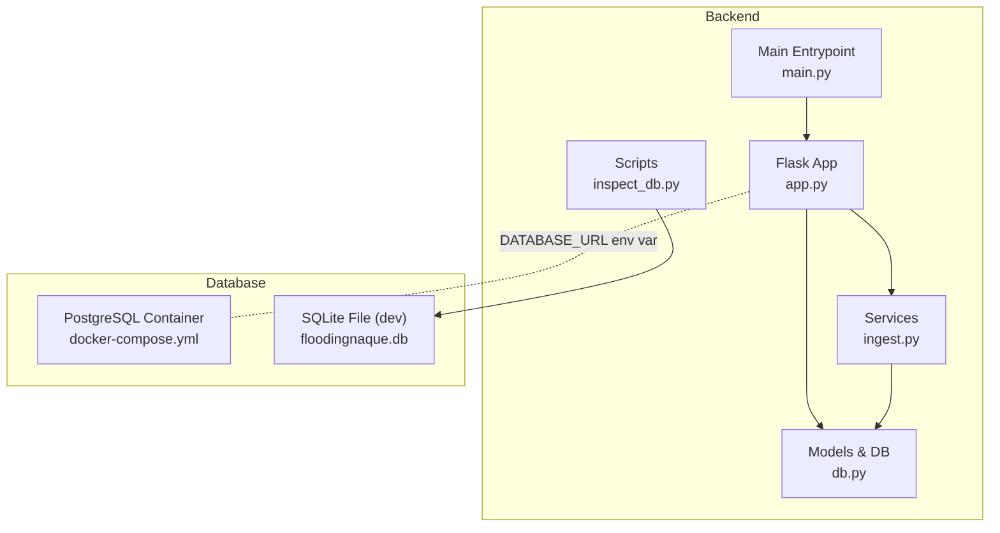
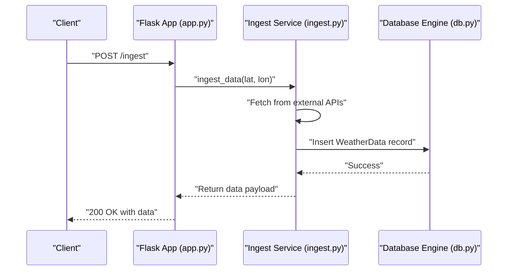
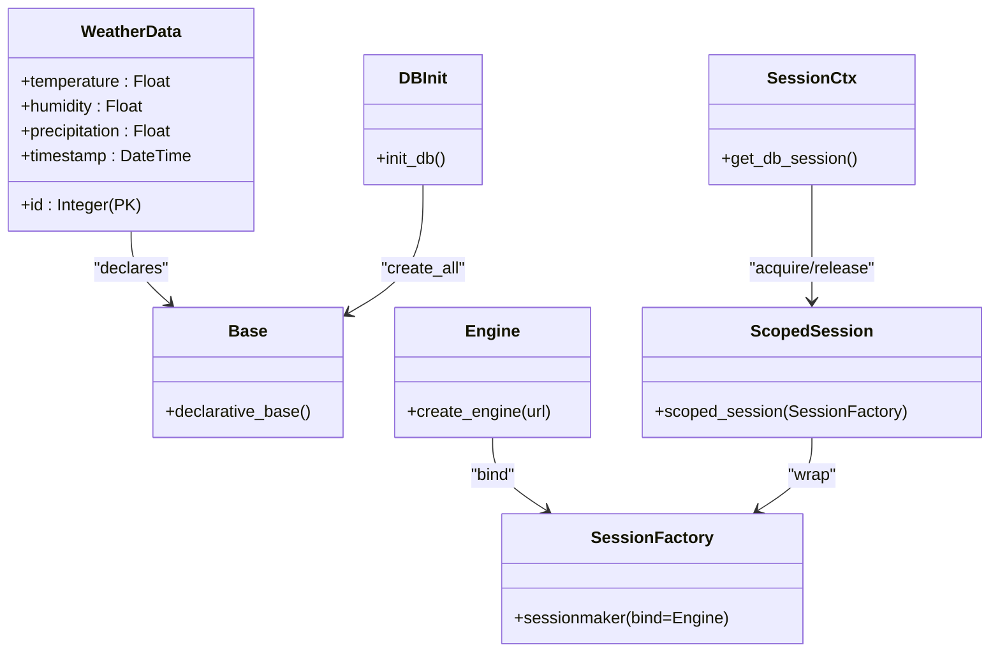
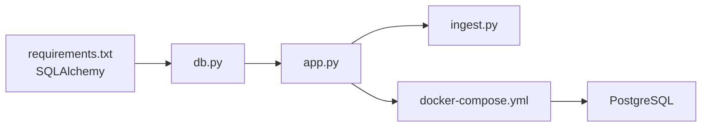
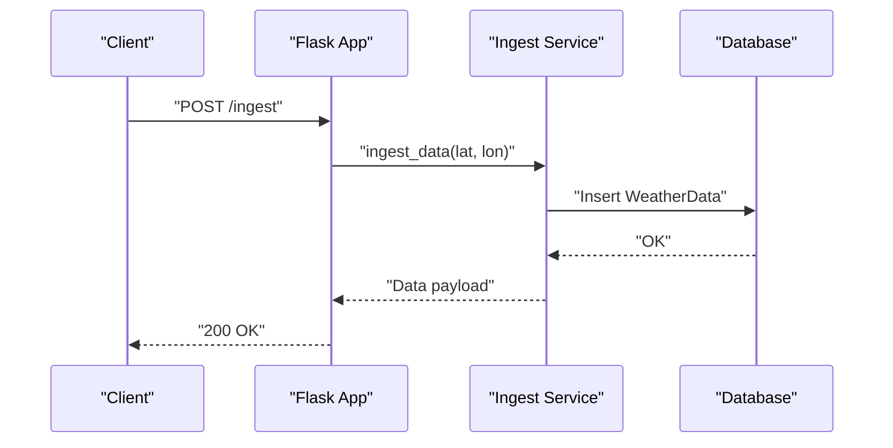

# Database Architecture

<cite>
**Referenced Files in This Document**
- [db.py](file://backend/app/models/db.py)
- [DATABASE_SETUP.md](file://backend/docs/DATABASE_SETUP.md)
- [docker-compose.yml](file://docker-compose.yml)
- [requirements.txt](file://backend/requirements.txt)
- [app.py](file://backend/app/api/app.py)
- [ingest.py](file://backend/app/services/ingest.py)
- [inspect_db.py](file://backend/scripts/inspect_db.py)
- [main.py](file://backend/main.py)
</cite>

## Table of Contents
1. [Introduction](#introduction)
2. [Project Structure](#project-structure)
3. [Core Components](#core-components)
4. [Architecture Overview](#architecture-overview)
5. [Detailed Component Analysis](#detailed-component-analysis)
6. [Dependency Analysis](#dependency-analysis)
7. [Performance Considerations](#performance-considerations)
8. [Troubleshooting Guide](#troubleshooting-guide)
9. [Conclusion](#conclusion)
10. [Appendices](#appendices)

## Introduction
This document describes the database architecture of floodingnaque, focusing on schema design, SQLAlchemy implementation, session management, migration strategy, deployment topology, scalability for time-series weather data, backup/recovery, data integrity, and performance optimizations. It also highlights the differences between development (SQLite) and production (PostgreSQL) configurations.

## Project Structure
The database layer is implemented in the backend under the models package and orchestrated by the Flask API. The deployment topology uses Docker Compose to run the backend service and a PostgreSQL database container with persistent storage.



**Diagram sources**
- [app.py](file://backend/app/api/app.py#L72-L84)
- [db.py](file://backend/app/models/db.py#L1-L37)
- [ingest.py](file://backend/app/services/ingest.py#L1-L111)
- [inspect_db.py](file://backend/scripts/inspect_db.py#L1-L23)
- [docker-compose.yml](file://docker-compose.yml#L1-L35)
- [main.py](file://backend/main.py#L1-L25)

**Section sources**
- [db.py](file://backend/app/models/db.py#L1-L37)
- [docker-compose.yml](file://docker-compose.yml#L1-L35)
- [DATABASE_SETUP.md](file://backend/docs/DATABASE_SETUP.md#L1-L93)

## Core Components
- Declarative base and engine: A SQLAlchemy declarative base is created and bound to an engine configured via the DATABASE_URL environment variable. By default, it uses SQLite; PostgreSQL is supported via environment configuration.
- Session management: A scoped session factory is used for thread-safe session handling, with a context manager that ensures commits, rollbacks, and cleanup.
- Model definition: A single table model stores weather observations with numeric fields and a timestamp column.
- Initialization: The database is initialized at application startup by creating tables if they do not exist.
- API integration: The Flask app initializes the database and exposes endpoints that trigger ingestion and prediction workflows.

**Section sources**
- [db.py](file://backend/app/models/db.py#L1-L37)
- [DATABASE_SETUP.md](file://backend/docs/DATABASE_SETUP.md#L1-L93)
- [app.py](file://backend/app/api/app.py#L72-L84)

## Architecture Overview
The system uses a simple, single-table schema optimized for time-series weather data. The ingestion service fetches data from external APIs and persists it to the database. The API orchestrates ingestion and prediction workflows.



**Diagram sources**
- [app.py](file://backend/app/api/app.py#L141-L223)
- [ingest.py](file://backend/app/services/ingest.py#L1-L111)
- [db.py](file://backend/app/models/db.py#L1-L37)

## Detailed Component Analysis

### Schema Design Decisions
- Normalization level: The schema is denormalized with a single table storing weather observations. This simplifies ingestion and querying for time-series analysis and aligns with typical IoT/time-series patterns.
- Data types:
  - Numeric fields for temperature, humidity, and precipitation.
  - Timestamp column for temporal ordering and efficient range queries.
- Primary key: Auto-increment integer identifier.
- Data retention strategy: No explicit retention policy is defined in the codebase. Retention should be implemented via scheduled cleanup jobs or partitioning strategies in production.

**Section sources**
- [db.py](file://backend/app/models/db.py#L13-L20)
- [DATABASE_SETUP.md](file://backend/docs/DATABASE_SETUP.md#L27-L40)

### SQLAlchemy Implementation
- Declarative base: A global declarative base is created and used by the model.
- Engine configuration: The engine reads DATABASE_URL from environment variables, defaulting to SQLite when not set.
- Session factory: A sessionmaker is bound to the engine; a scoped_session wrapper ensures thread-safe session management.
- Context manager: A context manager handles session lifecycle, committing on success, rolling back on exceptions, and cleaning up the session registry.



**Diagram sources**
- [db.py](file://backend/app/models/db.py#L1-L37)

**Section sources**
- [db.py](file://backend/app/models/db.py#L1-L37)

### Migration Strategy
- Current state: Migrations are not implemented. The application creates tables on startup using SQLAlchemy’s metadata creation mechanism.
- Manual verification script: A script inspects SQLite tables and row counts for local development.
- Recommendations for Alembic:
  - Initialize Alembic in the backend directory.
  - Define initial migrations for the weather_data table.
  - Add subsequent migrations for schema changes (e.g., adding indexes, partitions, or retention policies).
  - Integrate Alembic commands into CI/CD for automated migrations.
  - Use offline mode for PostgreSQL deployments to generate SQL scripts.

**Section sources**
- [DATABASE_SETUP.md](file://backend/docs/DATABASE_SETUP.md#L40-L60)
- [inspect_db.py](file://backend/scripts/inspect_db.py#L1-L23)

### Deployment Topology (Docker Compose)
- Backend service:
  - Builds from the backend Dockerfile.
  - Exposes port 5000.
  - Sets DATABASE_URL to SQLite by default.
  - Mounts backend directory and cache/model artifacts.
  - Depends on the db service.
- Database service:
  - PostgreSQL 13 Alpine image.
  - Environment variables for database name, user, and password.
  - Exposes port 5432.
  - Persists data to a named volume.
- Network isolation:
  - Services share a default bridge network managed by Docker Compose.

```mermaid
graph TB
subgraph "Network"
B["Backend Service"]
P["PostgreSQL Service"]
end
B --> |"DATABASE_URL" --> P
B ---|"Port 5000"| Client["Client"]
P ---|"Port 5432"| Admin["Admin Tools"]
```

**Diagram sources**
- [docker-compose.yml](file://docker-compose.yml#L1-L35)

**Section sources**
- [docker-compose.yml](file://docker-compose.yml#L1-L35)

### Scalability Considerations for Time-Series Weather Data
- Indexing:
  - Add an index on the timestamp column to accelerate time-range queries.
  - Consider composite indexes for frequent filters (e.g., timestamp + location if applicable).
- Partitioning:
  - For large datasets, consider table partitioning by time intervals (e.g., monthly) to improve maintenance and query performance.
- Batch ingestion:
  - Modify ingestion to batch inserts and use bulk operations to reduce overhead.
- Connection pooling:
  - Configure SQLAlchemy pool_size and max_overflow for production PostgreSQL deployments.
- Data archival:
  - Implement periodic archival jobs to move older data to cold storage while retaining recent data for predictions.

[No sources needed since this section provides general guidance]

### Backup and Recovery Procedures
- SQLite (development):
  - Back up the floodingnaque.db file regularly.
  - Use filesystem snapshots or tar archives of the backend directory.
- PostgreSQL (production):
  - Use pg_dump for logical backups and pg_basebackup for physical backups.
  - Schedule automated backups and test restoration procedures.
  - Store backups offsite or in cloud storage.
- Data integrity constraints:
  - Add NOT NULL constraints on critical fields (e.g., timestamp).
  - Add CHECK constraints for valid ranges (e.g., temperature Kelvin, humidity percentage).
  - Use foreign keys if additional related tables are introduced later.

[No sources needed since this section provides general guidance]

### Performance Optimization Techniques
- Indexing:
  - Create an index on timestamp for time-series queries.
  - Consider partial indexes for recent data if queries target recent windows.
- Query batching:
  - Batch reads/writes to reduce round-trips.
  - Use pagination for large result sets.
- Connection tuning:
  - Adjust pool settings (pool_size, max_overflow) for PostgreSQL.
- Data types:
  - Use appropriate numeric precision for weather metrics.
- Monitoring:
  - Track slow queries and query plans using database profiling tools.

[No sources needed since this section provides general guidance]

### Differences Between Development (SQLite) and Production (PostgreSQL)
- Database engine:
  - SQLite is embedded and file-based; PostgreSQL is a server process.
- Concurrency:
  - PostgreSQL supports concurrent connections and transactions better than SQLite.
- Persistence:
  - PostgreSQL uses volumes for durability; SQLite uses a single file.
- Environment configuration:
  - DATABASE_URL defaults to SQLite locally; set PostgreSQL connection string in production.
- Tooling:
  - PostgreSQL offers advanced features (extensions, partitioning, replication) not available in SQLite.

**Section sources**
- [DATABASE_SETUP.md](file://backend/docs/DATABASE_SETUP.md#L8-L25)
- [docker-compose.yml](file://docker-compose.yml#L12-L12)

## Dependency Analysis
The database layer depends on SQLAlchemy for ORM and session management. The API initializes the database at startup and the ingestion service persists records. The Docker Compose file defines the runtime dependencies between backend and database services.



**Diagram sources**
- [requirements.txt](file://backend/requirements.txt#L1-L15)
- [db.py](file://backend/app/models/db.py#L1-L37)
- [app.py](file://backend/app/api/app.py#L72-L84)
- [docker-compose.yml](file://docker-compose.yml#L1-L35)

**Section sources**
- [requirements.txt](file://backend/requirements.txt#L1-L15)
- [db.py](file://backend/app/models/db.py#L1-L37)
- [app.py](file://backend/app/api/app.py#L72-L84)
- [docker-compose.yml](file://docker-compose.yml#L1-L35)

## Performance Considerations
- Time-series optimization:
  - Ensure timestamp indexing and consider partitioning for large datasets.
- Batch operations:
  - Use bulk insert/update to minimize transaction overhead.
- Connection pooling:
  - Tune pool settings for PostgreSQL to handle concurrent requests efficiently.
- Query patterns:
  - Prefer range scans on timestamp and avoid SELECT * for large tables.

[No sources needed since this section provides general guidance]

## Troubleshooting Guide
- Database connectivity:
  - Verify DATABASE_URL environment variable is set correctly for PostgreSQL.
  - Confirm the backend service can reach the db service by name in Docker Compose.
- Initialization failures:
  - Ensure init_db runs at startup; check for permission issues on SQLite file or PostgreSQL credentials.
- Session errors:
  - Use the provided context manager to ensure proper commit/rollback and cleanup.
- Verification:
  - Use the inspection script to confirm table existence and row counts in SQLite.

**Section sources**
- [DATABASE_SETUP.md](file://backend/docs/DATABASE_SETUP.md#L40-L60)
- [inspect_db.py](file://backend/scripts/inspect_db.py#L1-L23)
- [db.py](file://backend/app/models/db.py#L25-L37)

## Conclusion
The floodingnaque database layer is intentionally simple and focused on time-series weather ingestion. It uses SQLAlchemy with a scoped session and a single-table schema suitable for development. For production, switch to PostgreSQL, implement Alembic migrations, add indexes and retention policies, and tune performance for scale. The Docker Compose setup provides a clean separation between backend and database with persistent storage.

[No sources needed since this section summarizes without analyzing specific files]

## Appendices

### Appendix A: API Workflow for Ingestion


**Diagram sources**
- [app.py](file://backend/app/api/app.py#L141-L223)
- [ingest.py](file://backend/app/services/ingest.py#L1-L111)
- [db.py](file://backend/app/models/db.py#L1-L37)