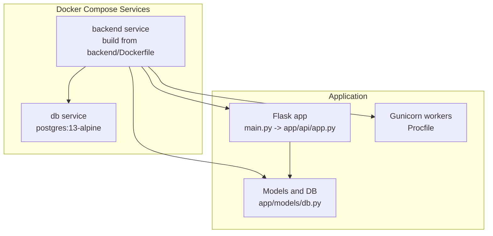
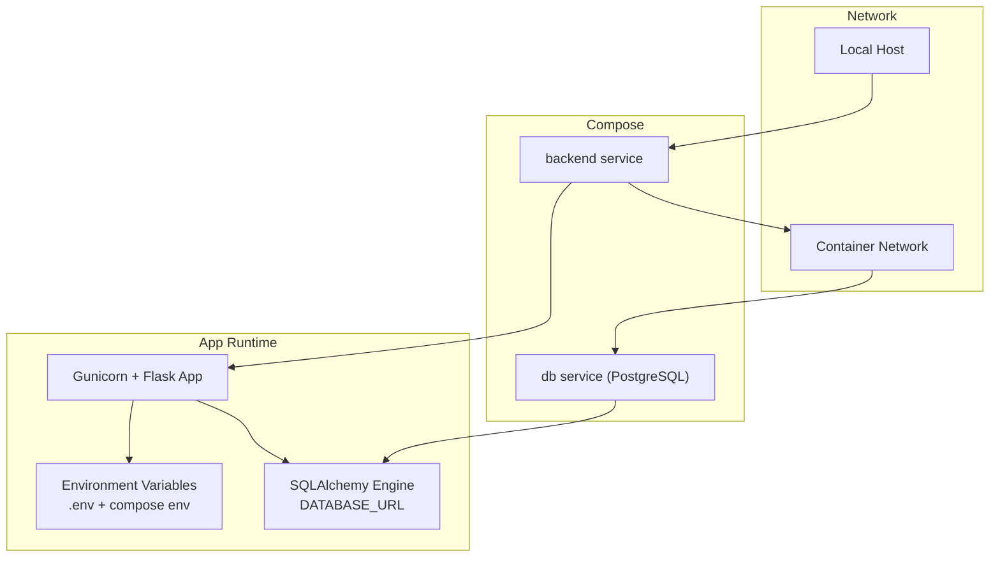
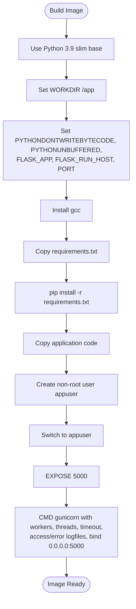
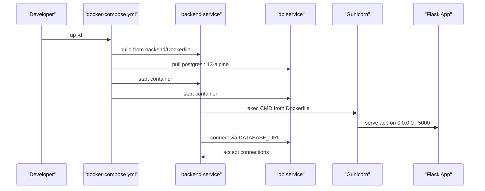
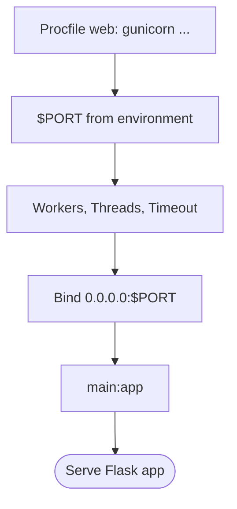
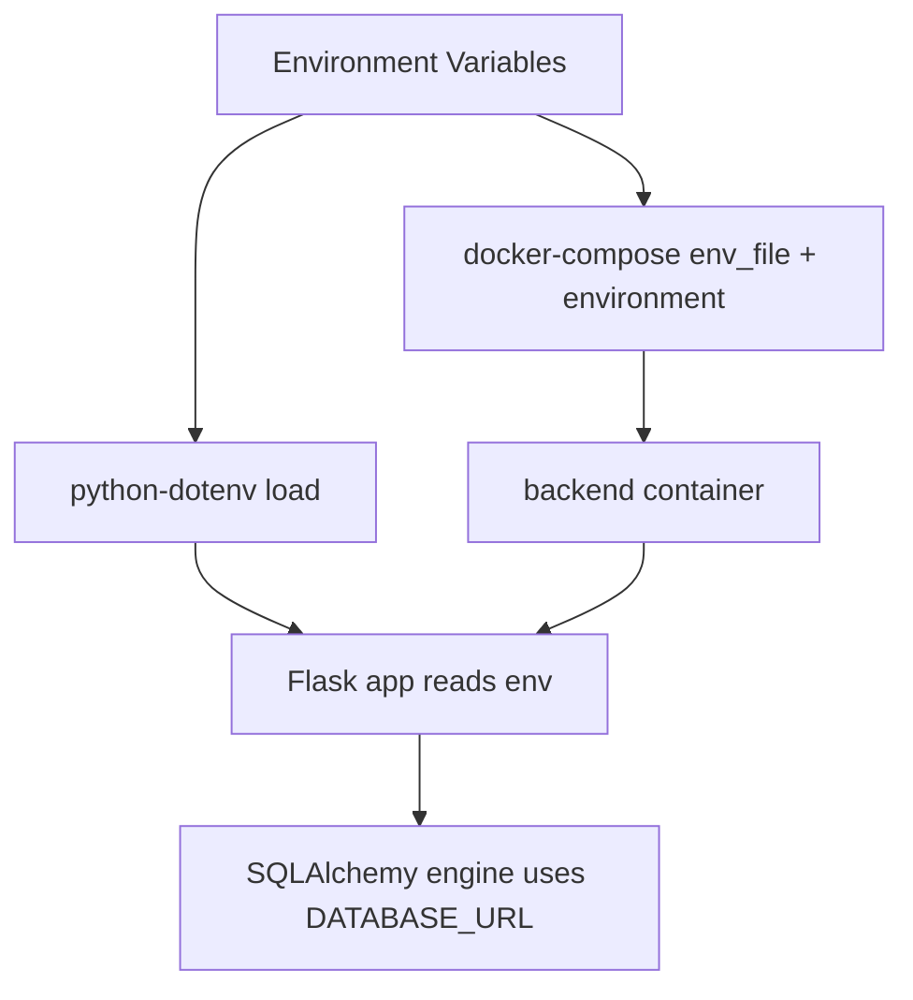
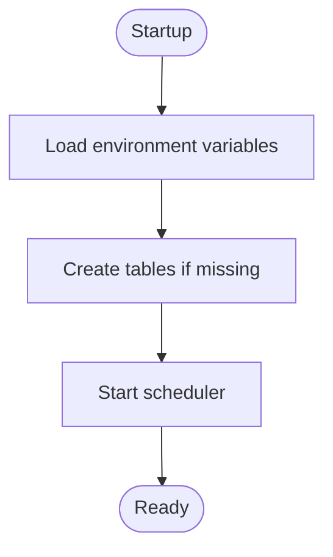
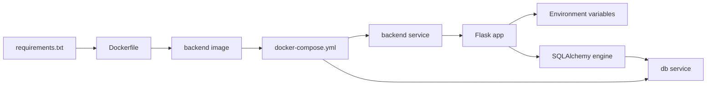

# Deployment Configuration

<cite>
**Referenced Files in This Document**
- [docker-compose.yml](file://docker-compose.yml)
- [backend/Dockerfile](file://backend/Dockerfile)
- [backend/Procfile](file://backend/Procfile)
- [backend/requirements.txt](file://backend/requirements.txt)
- [backend/main.py](file://backend/main.py)
- [backend/app/api/app.py](file://backend/app/api/app.py)
- [backend/app/models/db.py](file://backend/app/models/db.py)
- [backend/.env.example](file://backend/.env.example)
- [backend/README.md](file://backend/README.md)
- [backend/docs/DATABASE_SETUP.md](file://backend/docs/DATABASE_SETUP.md)
</cite>

## Table of Contents
1. [Introduction](#introduction)
2. [Project Structure](#project-structure)
3. [Core Components](#core-components)
4. [Architecture Overview](#architecture-overview)
5. [Detailed Component Analysis](#detailed-component-analysis)
6. [Dependency Analysis](#dependency-analysis)
7. [Performance Considerations](#performance-considerations)
8. [Troubleshooting Guide](#troubleshooting-guide)
9. [Conclusion](#conclusion)
10. [Appendices](#appendices)

## Introduction
This section documents the deployment configuration for the floodingnaque application. It covers containerization with Docker, orchestration with docker-compose, process management with Procfile and Gunicorn, and step-by-step deployment instructions for local, staging, and production environments. It also includes scaling recommendations, resource allocation guidelines, health checks, environment-specific configuration differences, secrets management, and troubleshooting tips for common deployment issues.

## Project Structure
The deployment stack consists of:
- A Flask application packaged in a Docker image built from the backend Dockerfile.
- A PostgreSQL database service managed by docker-compose.
- An optional SQLite database option configured via environment variables.
- A Procfile defining the production process for platforms that require it.

**Diagram sources**
- [docker-compose.yml](file://docker-compose.yml#L1-L35)
- [backend/Dockerfile](file://backend/Dockerfile#L1-L37)
- [backend/Procfile](file://backend/Procfile#L1-L2)
- [backend/main.py](file://backend/main.py#L1-L25)
- [backend/app/api/app.py](file://backend/app/api/app.py#L1-L120)
- [backend/app/models/db.py](file://backend/app/models/db.py#L1-L37)

**Section sources**
- [docker-compose.yml](file://docker-compose.yml#L1-L35)
- [backend/Dockerfile](file://backend/Dockerfile#L1-L37)
- [backend/Procfile](file://backend/Procfile#L1-L2)
- [backend/README.md](file://backend/README.md#L1-L60)

## Core Components
- Dockerfile defines the Python runtime, environment variables, system and Python dependencies, non-root user, exposed port, and the Gunicorn entrypoint.
- docker-compose.yml orchestrates the backend and PostgreSQL services, mounts volumes, injects environment variables, and sets inter-service dependencies.
- Procfile defines the production process command for platforms that require it (e.g., Render).
- Requirements pin the application dependencies, including Flask, Gunicorn, SQLAlchemy, scikit-learn, and others.
- Environment configuration is loaded via a .env file and example template, with defaults for API keys and database URLs.

Key deployment artifacts:
- Containerization strategy: Python 3.9 slim base image, system dependencies, Python packages installed from requirements.txt, non-root user, and Gunicorn CMD.
- Orchestration: backend service builds from backend/Dockerfile, exposes port 5000, mounts backend code and model cache, injects environment variables, and depends on db service.
- Process management: Gunicorn configured via Procfile and Dockerfile CMD for production.

**Section sources**
- [backend/Dockerfile](file://backend/Dockerfile#L1-L37)
- [docker-compose.yml](file://docker-compose.yml#L1-L35)
- [backend/Procfile](file://backend/Procfile#L1-L2)
- [backend/requirements.txt](file://backend/requirements.txt#L1-L15)
- [backend/.env.example](file://backend/.env.example#L1-L4)

## Architecture Overview
The deployment architecture comprises:
- Backend service: runs the Flask application with Gunicorn, binds to 0.0.0.0:5000, and loads environment variables from .env.
- Database service: PostgreSQL 13 Alpine image with persistent volume storage.
- Inter-service communication: backend depends on db service; backend uses DATABASE_URL to connect to either SQLite or PostgreSQL.

**Diagram sources**
- [docker-compose.yml](file://docker-compose.yml#L1-L35)
- [backend/Dockerfile](file://backend/Dockerfile#L1-L37)
- [backend/app/api/app.py](file://backend/app/api/app.py#L70-L120)
- [backend/app/models/db.py](file://backend/app/models/db.py#L1-L20)

## Detailed Component Analysis

### Dockerfile Strategy
- Base image: Python 3.9 slim.
- Working directory: /app.
- Environment variables: disables bytecode writing, enables unbuffered output, sets Flask app entrypoint, host binding, and default port.
- System dependencies: installs gcc for compilation.
- Python dependencies: installs from requirements.txt with no cache.
- Application code: copies all backend files.
- Security: creates non-root user appuser and switches to it.
- Port exposure: 5000.
- Entrypoint: Gunicorn with 4 workers, 2 threads, 120 timeout, stdout/stderr logging, and binds to 0.0.0.0:5000.

**Diagram sources**
- [backend/Dockerfile](file://backend/Dockerfile#L1-L37)

**Section sources**
- [backend/Dockerfile](file://backend/Dockerfile#L1-L37)

### docker-compose Orchestration
- backend service:
  - Build context: ./backend with Dockerfile.
  - Ports: 5000:5000.
  - Environment: FLASK_DEBUG, DATABASE_URL, PORT.
  - Volumes: mounts backend code into /app, excludes __pycache__ and model cache files.
  - env_file: loads environment variables from ./backend/.env.
  - depends_on: waits for db service to be ready.
- db service:
  - Image: postgres:13-alpine.
  - Environment: POSTGRES_DB, POSTGRES_USER, POSTGRES_PASSWORD.
  - Ports: 5432:5432.
  - Volume: named postgres_data for persistence.

**Diagram sources**
- [docker-compose.yml](file://docker-compose.yml#L1-L35)
- [backend/Dockerfile](file://backend/Dockerfile#L25-L37)
- [backend/app/models/db.py](file://backend/app/models/db.py#L1-L20)

**Section sources**
- [docker-compose.yml](file://docker-compose.yml#L1-L35)

### Procfile Configuration
- Defines the production web process as a Gunicorn command with:
  - Bind address and port from environment variable $PORT.
  - Workers and threads as configured.
  - Access and error logfiles set to stdout/stderr.
  - Application factory reference main:app.

**Diagram sources**
- [backend/Procfile](file://backend/Procfile#L1-L2)
- [backend/main.py](file://backend/main.py#L1-L25)

**Section sources**
- [backend/Procfile](file://backend/Procfile#L1-L2)
- [backend/main.py](file://backend/main.py#L1-L25)

### Environment and Secrets Management
- Environment variables:
  - Loaded via python-dotenv in the Flask app.
  - Defaults for API keys and DATABASE_URL are provided in .env.example.
  - docker-compose injects FLASK_DEBUG, DATABASE_URL, and PORT.
  - .env file is mounted into the backend container via env_file.
- Secrets:
  - API keys and database credentials are injected via environment variables.
  - For production, store secrets externally (e.g., platform secret managers) and mount them securely.

**Diagram sources**
- [backend/.env.example](file://backend/.env.example#L1-L4)
- [backend/app/core/config.py](file://backend/app/core/config.py#L1-L10)
- [backend/app/models/db.py](file://backend/app/models/db.py#L1-L20)
- [docker-compose.yml](file://docker-compose.yml#L10-L20)

**Section sources**
- [backend/.env.example](file://backend/.env.example#L1-L4)
- [backend/app/core/config.py](file://backend/app/core/config.py#L1-L10)
- [backend/app/models/db.py](file://backend/app/models/db.py#L1-L20)
- [docker-compose.yml](file://docker-compose.yml#L10-L20)

### Database Configuration and Health Checks
- Default database: SQLite via DATABASE_URL pointing to a file in the backend directory.
- Alternative databases: PostgreSQL or MySQL can be used by setting DATABASE_URL accordingly.
- Database initialization: SQLAlchemy creates tables on startup.
- Health endpoints:
  - GET /status: basic health and model availability.
  - GET /health: detailed health including scheduler status.

**Diagram sources**
- [backend/app/api/app.py](file://backend/app/api/app.py#L70-L120)
- [backend/app/models/db.py](file://backend/app/models/db.py#L1-L20)

**Section sources**
- [backend/docs/DATABASE_SETUP.md](file://backend/docs/DATABASE_SETUP.md#L1-L93)
- [backend/app/api/app.py](file://backend/app/api/app.py#L120-L160)
- [backend/app/models/db.py](file://backend/app/models/db.py#L1-L20)

## Dependency Analysis
- Backend Dockerfile depends on requirements.txt for Python package resolution.
- docker-compose depends on backend/Dockerfile for building the backend image.
- The Flask application depends on environment variables for configuration and on SQLAlchemy for database connectivity.
- The database service depends on persistent volume configuration for data durability.

**Diagram sources**
- [backend/requirements.txt](file://backend/requirements.txt#L1-L15)
- [backend/Dockerfile](file://backend/Dockerfile#L1-L37)
- [docker-compose.yml](file://docker-compose.yml#L1-L35)
- [backend/app/api/app.py](file://backend/app/api/app.py#L70-L120)
- [backend/app/models/db.py](file://backend/app/models/db.py#L1-L20)

**Section sources**
- [backend/requirements.txt](file://backend/requirements.txt#L1-L15)
- [backend/Dockerfile](file://backend/Dockerfile#L1-L37)
- [docker-compose.yml](file://docker-compose.yml#L1-L35)
- [backend/app/api/app.py](file://backend/app/api/app.py#L70-L120)
- [backend/app/models/db.py](file://backend/app/models/db.py#L1-L20)

## Performance Considerations
- Worker and thread configuration:
  - Gunicorn is configured with 4 workers and 2 threads per worker in both Dockerfile and Procfile.
  - Adjust workers based on CPU cores; threads depend on I/O-bound workload characteristics.
- Timeout:
  - Request timeout is set to 120 seconds; tune based on model inference latency and external API calls.
- Database:
  - SQLite is suitable for development; for production, use PostgreSQL with connection pooling and appropriate indexing.
- Logging:
  - Access and error logs are written to stdout/stderr; ensure container logging is enabled and aggregated.

[No sources needed since this section provides general guidance]

## Troubleshooting Guide
Common deployment issues and resolutions:
- Port conflicts:
  - Symptom: containers fail to start or bind to port 5000.
  - Resolution: change host port mapping in docker-compose or stop conflicting services.
- Database connection errors:
  - Symptom: backend cannot connect to database.
  - Resolution: verify DATABASE_URL, confirm db service is healthy, and ensure volume persistence is configured.
- Container startup failures:
  - Symptom: backend container exits immediately.
  - Resolution: check Gunicorn command, verify environment variables, and review logs from stdout/stderr.
- Health check failures:
  - Use GET /status and GET /health endpoints to diagnose model loading and scheduler status.

**Section sources**
- [docker-compose.yml](file://docker-compose.yml#L8-L22)
- [backend/Dockerfile](file://backend/Dockerfile#L25-L37)
- [backend/app/api/app.py](file://backend/app/api/app.py#L120-L160)

## Conclusion
The floodingnaque deployment is containerized with a clear separation between the backend Flask application and the database service. docker-compose orchestrates the stack, while Dockerfile and Procfile define the runtime and process management. Environment variables drive configuration, and health endpoints provide operational visibility. For production, consider PostgreSQL, secrets management, and scaling based on workload.

[No sources needed since this section summarizes without analyzing specific files]

## Appendices

### Step-by-Step Deployment Instructions

- Local environment (development):
  - Prerequisites: Docker and docker-compose installed.
  - Steps:
    1. Create a .env file in backend/ with required variables (API keys and DATABASE_URL).
    2. Start services: run docker-compose up -d.
    3. Verify: open http://localhost:5000/status and http://localhost:5000/health.
    4. Stop: docker-compose down.

- Staging environment:
  - Use docker-compose with environment overrides for staging-specific DATABASE_URL and API keys.
  - Scale backend service replicas if needed (compose scale backend=N).
  - Ensure persistent volume for database data.

- Production environment:
  - Use a platform that supports Procfile (e.g., Render) or deploy the backend image directly.
  - Provide environment variables via platform secrets.
  - Use PostgreSQL with connection pooling and SSL/TLS.
  - Configure health checks using GET /health.

[No sources needed since this section provides general guidance]

### Scaling Recommendations
- Horizontal scaling:
  - Increase Gunicorn workers proportionally to CPU cores; keep threads moderate for I/O-bound tasks.
  - Use a reverse proxy or platform load balancer to distribute traffic across replicas.
- Vertical scaling:
  - Allocate CPU and memory resources based on model inference latency and concurrent requests.
- Database scaling:
  - Prefer PostgreSQL with read replicas and connection pooling for production.

[No sources needed since this section provides general guidance]

### Resource Allocation Guidelines
- CPU: Start with 1-2 vCPUs for development; increase based on observed utilization.
- Memory: Allocate 512MB-1GB RAM for the backend process; adjust according to model size and concurrency.
- Storage: Persist database data using named volumes; monitor disk usage.

[No sources needed since this section provides general guidance]

### Environment-Specific Configuration Differences
- Local:
  - SQLite DATABASE_URL by default; FLASK_DEBUG enabled for development convenience.
- Staging:
  - PostgreSQL DATABASE_URL; moderate logging verbosity; feature flags toggled as needed.
- Production:
  - PostgreSQL DATABASE_URL with SSL/TLS; disable FLASK_DEBUG; secure API keys via secrets management.

**Section sources**
- [docker-compose.yml](file://docker-compose.yml#L10-L20)
- [backend/.env.example](file://backend/.env.example#L1-L4)
- [backend/README.md](file://backend/README.md#L1-L60)