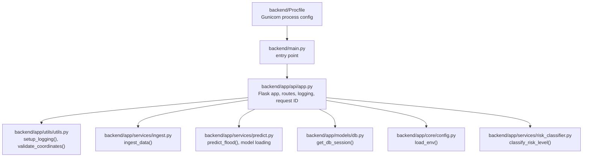
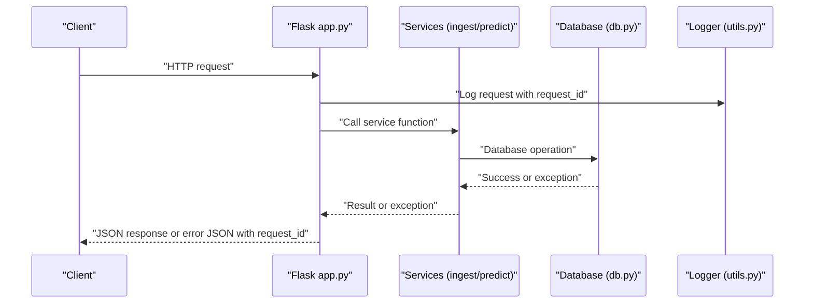
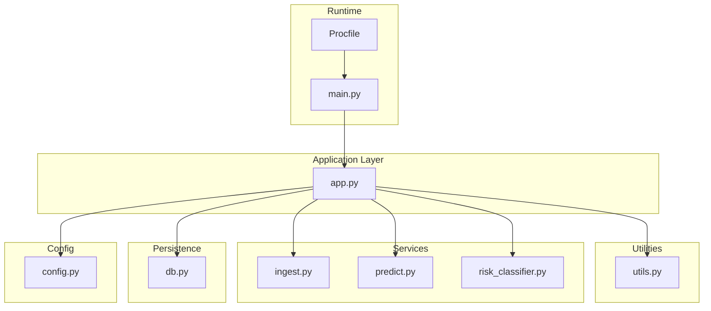

# Error Handling & Logging

<cite>
**Referenced Files in This Document**
- [app.py](file://backend/app/api/app.py)
- [utils.py](file://backend/app/utils/utils.py)
- [ingest.py](file://backend/app/services/ingest.py)
- [predict.py](file://backend/app/services/predict.py)
- [db.py](file://backend/app/models/db.py)
- [config.py](file://backend/app/core/config.py)
- [risk_classifier.py](file://backend/app/services/risk_classifier.py)
- [main.py](file://backend/main.py)
- [Procfile](file://backend/Procfile)
- [BACKEND_COMPLETE.md](file://backend/docs/BACKEND_COMPLETE.md)
</cite>

## Table of Contents
1. [Introduction](#introduction)
2. [Project Structure](#project-structure)
3. [Core Components](#core-components)
4. [Architecture Overview](#architecture-overview)
5. [Detailed Component Analysis](#detailed-component-analysis)
6. [Dependency Analysis](#dependency-analysis)
7. [Performance Considerations](#performance-considerations)
8. [Troubleshooting Guide](#troubleshooting-guide)
9. [Conclusion](#conclusion)

## Introduction
This document explains the error handling and logging mechanisms in floodingnaque’s backend. It covers centralized logging configuration, request ID tracking, JSON error responses, and robust error handling patterns across endpoints and services. It also provides guidance on monitoring and production log collection, along with troubleshooting steps for common issues such as API connectivity problems, database connection failures, and model loading errors.

## Project Structure
The error handling and logging logic is primarily implemented in the Flask application module and shared utilities:
- Centralized logging setup and request ID tracking in the API entrypoint
- Utility functions for logging configuration and validation helpers
- Service-level error handling for ingestion and prediction
- Database session management with automatic transaction handling
- Environment configuration loading

**Diagram sources**
- [app.py](file://backend/app/api/app.py#L72-L104)
- [utils.py](file://backend/app/utils/utils.py#L5-L28)
- [ingest.py](file://backend/app/services/ingest.py#L1-L111)
- [predict.py](file://backend/app/services/predict.py#L1-L236)
- [db.py](file://backend/app/models/db.py#L1-L37)
- [config.py](file://backend/app/core/config.py#L1-L10)
- [risk_classifier.py](file://backend/app/services/risk_classifier.py#L1-L170)
- [main.py](file://backend/main.py#L1-L24)
- [Procfile](file://backend/Procfile#L1-L1)

**Section sources**
- [app.py](file://backend/app/api/app.py#L72-L104)
- [utils.py](file://backend/app/utils/utils.py#L5-L28)
- [main.py](file://backend/main.py#L1-L24)
- [Procfile](file://backend/Procfile#L1-L1)

## Core Components
- Centralized logging configuration with rotating file handler and console output
- Request ID tracking for correlating logs across requests
- JSON error responses with standardized fields: error, request_id
- Service-level validation and error propagation
- Database session lifecycle management with automatic commit/rollback
- Environment configuration loading

**Section sources**
- [utils.py](file://backend/app/utils/utils.py#L5-L28)
- [app.py](file://backend/app/api/app.py#L82-L104)
- [db.py](file://backend/app/models/db.py#L25-L37)
- [config.py](file://backend/app/core/config.py#L1-L10)

## Architecture Overview
The error handling architecture follows a layered approach:
- Application layer: Flask routes catch exceptions and return JSON error responses with request IDs
- Service layer: Business logic validates inputs and raises exceptions that bubble up to the app layer
- Model layer: Prediction logic handles model loading and raises explicit exceptions on failure
- Persistence layer: Database sessions are managed with context managers and automatic transaction handling
- Logging layer: Global logging configuration and request ID injection

**Diagram sources**
- [app.py](file://backend/app/api/app.py#L82-L104)
- [ingest.py](file://backend/app/services/ingest.py#L1-L111)
- [predict.py](file://backend/app/services/predict.py#L1-L236)
- [db.py](file://backend/app/models/db.py#L25-L37)
- [utils.py](file://backend/app/utils/utils.py#L5-L28)

## Detailed Component Analysis

### Centralized Logging Configuration
- Logging is configured globally at startup with a rotating file handler and console handler
- Log entries include timestamp, level, and message
- The logger is reused across the application for consistent formatting

Implementation highlights:
- Rotating file handler with size limits and backup count
- Console handler for development visibility
- Global logger level set to INFO

Best practices demonstrated:
- Structured logging with consistent format
- Separate handlers for file and console outputs
- Directory creation for logs during initialization

**Section sources**
- [utils.py](file://backend/app/utils/utils.py#L5-L28)
- [app.py](file://backend/app/api/app.py#L82-L83)

### Request ID Tracking
- A request ID is generated or read from the incoming header and attached to the request context
- All logs include the request ID for correlation
- Responses include the request ID for client-side debugging

Implementation highlights:
- Header fallback to UUID generation
- Before-request hook logs method and path with request ID
- Error responses include request_id for traceability

**Section sources**
- [app.py](file://backend/app/api/app.py#L85-L104)

### JSON Error Response Format
All endpoints return a consistent JSON error response:
- Fields: error, request_id
- Status codes:
  - 400 for bad input/validation errors
  - 404 for resource not found (e.g., model file)
  - 500 for internal server errors

Examples of where this pattern is used:
- Ingest endpoint: validation errors, JSON parsing failures, unexpected exceptions
- Predict endpoint: validation errors, model not found, unexpected exceptions
- Data endpoint: invalid query parameters, database exceptions
- Models endpoint: model listing exceptions

**Section sources**
- [app.py](file://backend/app/api/app.py#L176-L223)
- [app.py](file://backend/app/api/app.py#L224-L305)
- [app.py](file://backend/app/api/app.py#L341-L405)
- [app.py](file://backend/app/api/app.py#L415-L453)

### Service-Level Error Handling Patterns
- Ingestion service:
  - Validates environment variables and API keys
  - Handles network timeouts and HTTP errors from external APIs
  - Logs warnings and continues with fallbacks when possible
  - Persists data to the database and logs success or errors
- Prediction service:
  - Validates input data shape and required fields
  - Loads model lazily and raises explicit exceptions on load failures
  - Propagates exceptions to the caller for consistent error handling

**Section sources**
- [ingest.py](file://backend/app/services/ingest.py#L1-L111)
- [predict.py](file://backend/app/services/predict.py#L1-L236)

### Database Session Management
- Scoped sessions are used for thread-safe access
- Context manager ensures commit on success, rollback on error, and cleanup
- Exceptions raised inside the session context are re-raised after rollback

**Section sources**
- [db.py](file://backend/app/models/db.py#L1-L37)

### Environment Configuration Loading
- Environment variables are loaded at startup to configure API keys and database URLs
- Used by ingestion and database initialization

**Section sources**
- [config.py](file://backend/app/core/config.py#L1-L10)
- [app.py](file://backend/app/api/app.py#L75-L80)

### Risk Classification and Logging
- Risk classification integrates with prediction results and logs outcomes
- Provides structured risk metadata for downstream consumers

**Section sources**
- [risk_classifier.py](file://backend/app/services/risk_classifier.py#L1-L170)
- [predict.py](file://backend/app/services/predict.py#L180-L216)

## Dependency Analysis
The error handling and logging depend on several modules and their interactions:

**Diagram sources**
- [app.py](file://backend/app/api/app.py#L1-L120)
- [utils.py](file://backend/app/utils/utils.py#L1-L48)
- [ingest.py](file://backend/app/services/ingest.py#L1-L111)
- [predict.py](file://backend/app/services/predict.py#L1-L236)
- [db.py](file://backend/app/models/db.py#L1-L37)
- [config.py](file://backend/app/core/config.py#L1-L10)
- [main.py](file://backend/main.py#L1-L24)
- [Procfile](file://backend/Procfile#L1-L1)

**Section sources**
- [app.py](file://backend/app/api/app.py#L1-L120)
- [utils.py](file://backend/app/utils/utils.py#L1-L48)
- [ingest.py](file://backend/app/services/ingest.py#L1-L111)
- [predict.py](file://backend/app/services/predict.py#L1-L236)
- [db.py](file://backend/app/models/db.py#L1-L37)
- [config.py](file://backend/app/core/config.py#L1-L10)
- [main.py](file://backend/main.py#L1-L24)
- [Procfile](file://backend/Procfile#L1-L1)

## Performance Considerations
- Logging overhead is minimal with rotating file handler and INFO level
- JSON parsing includes defensive measures for malformed payloads
- Database operations use context managers to avoid connection leaks
- Model loading is lazy and cached to reduce startup costs

[No sources needed since this section provides general guidance]

## Troubleshooting Guide

### API Connectivity Issues
Symptoms:
- External API calls fail with timeouts or HTTP errors
- Ingestion endpoint returns errors indicating upstream failures

Common causes and fixes:
- Missing or invalid API keys for weather providers
  - Verify environment variables are set and correct
- Network timeouts or rate limiting
  - Retry logic and fallbacks are already implemented; ensure timeouts are appropriate
- Unavailable endpoints or invalid responses
  - The ingestion service logs warnings and continues with fallbacks

Where to check:
- Ingestion service error handling and logging
- Environment configuration loading

**Section sources**
- [ingest.py](file://backend/app/services/ingest.py#L1-L111)
- [config.py](file://backend/app/core/config.py#L1-L10)

### Database Connection Failures
Symptoms:
- Data retrieval or persistence operations fail
- Transactions do not commit or rollback as expected

Common causes and fixes:
- Incorrect database URL or credentials
- Database not initialized or tables missing
- Concurrency issues due to improper session usage

Where to check:
- Database initialization and session context manager
- Session lifecycle and error propagation

**Section sources**
- [db.py](file://backend/app/models/db.py#L1-L37)
- [app.py](file://backend/app/api/app.py#L78-L80)

### Model Loading Errors
Symptoms:
- Prediction endpoint returns 404 for model not found
- Unexpected exceptions during prediction

Common causes and fixes:
- Model file missing or incorrect path
- Metadata mismatch or corrupted model file
- Version-specific model not found

Where to check:
- Model loading logic and error messages
- Available model listing and current model info

**Section sources**
- [predict.py](file://backend/app/services/predict.py#L74-L111)
- [predict.py](file://backend/app/services/predict.py#L112-L216)
- [app.py](file://backend/app/api/app.py#L224-L305)

### Logging and Monitoring in Production
- Logging configuration:
  - File handler rotates logs and maintains backups
  - Console handler enabled for development
  - Structured log format with timestamps and levels
- Request ID tracking:
  - Every request is logged with a unique identifier
  - Errors include request_id for correlation
- Production runtime:
  - Gunicorn is configured to stream access and error logs to stdout/stderr
  - Use platform log collectors to aggregate logs

Recommended practices:
- Forward stdout/stderr logs to your platform’s logging agent
- Configure log retention policies and alerting on error rates
- Correlate logs using request_id for end-to-end tracing
- Monitor model loading and prediction latency for performance insights

**Section sources**
- [utils.py](file://backend/app/utils/utils.py#L5-L28)
- [app.py](file://backend/app/api/app.py#L82-L104)
- [Procfile](file://backend/Procfile#L1-L1)
- [BACKEND_COMPLETE.md](file://backend/docs/BACKEND_COMPLETE.md#L282-L286)

## Conclusion
The floodingnaque backend implements robust error handling and logging across the stack. Centralized logging, request ID tracking, and consistent JSON error responses enable quick diagnosis and reliable operations. Service-level validation and explicit exceptions ensure predictable behavior. With the provided monitoring guidance, teams can deploy and operate the system with confidence, quickly identifying and resolving issues in production.