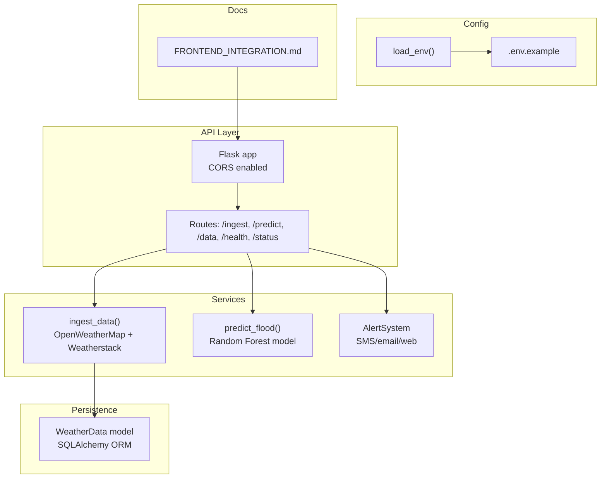
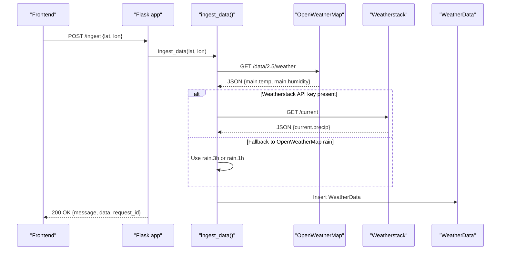
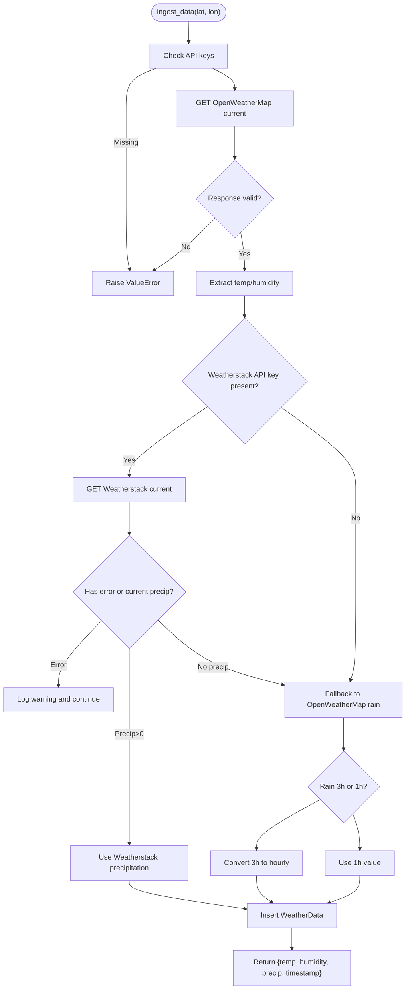
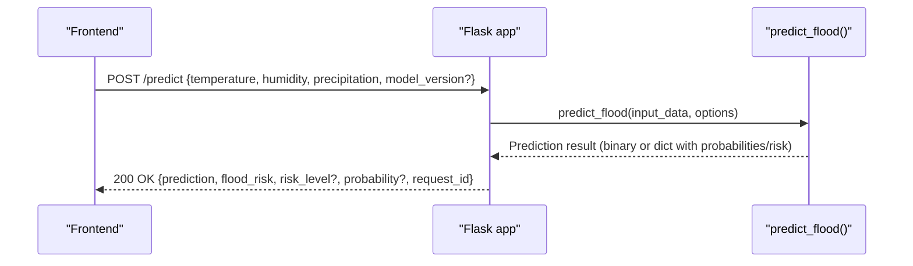
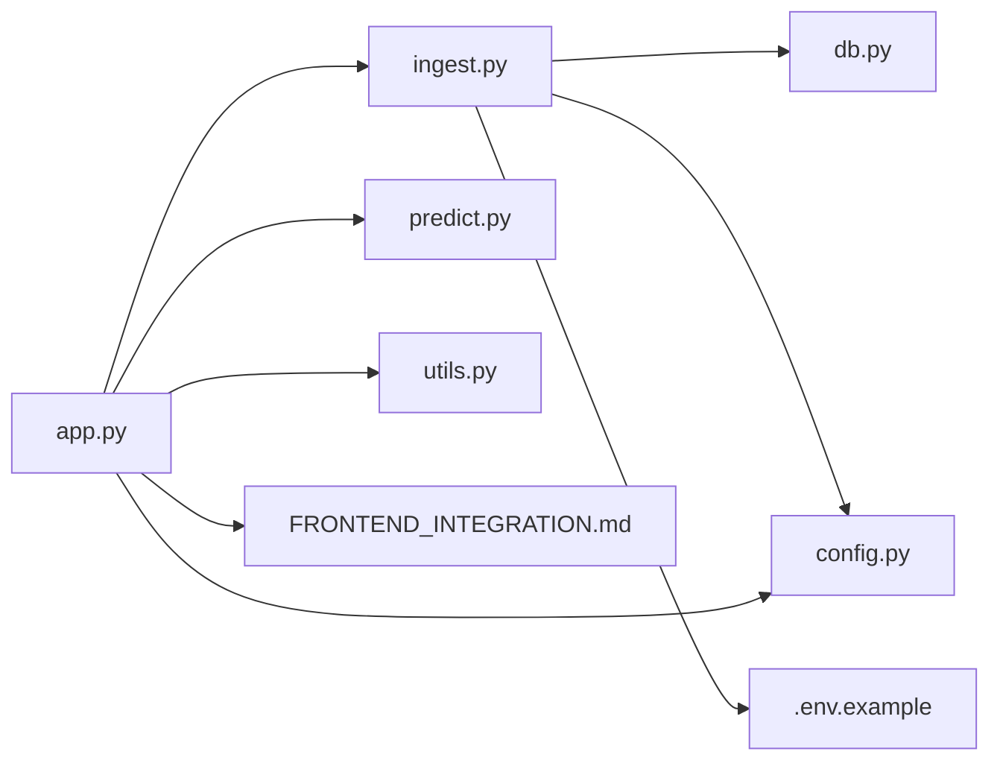

# External Integrations

<cite>
**Referenced Files in This Document**
- [ingest.py](file://backend/app/services/ingest.py)
- [app.py](file://backend/app/api/app.py)
- [config.py](file://backend/app/core/config.py)
- [utils.py](file://backend/app/utils/utils.py)
- [db.py](file://backend/app/models/db.py)
- [.env.example](file://backend/.env.example)
- [FRONTEND_INTEGRATION.md](file://backend/docs/FRONTEND_INTEGRATION.md)
- [predict.py](file://backend/app/services/predict.py)
- [alerts.py](file://backend/app/services/alerts.py)
</cite>

## Table of Contents
1. [Introduction](#introduction)
2. [Project Structure](#project-structure)
3. [Core Components](#core-components)
4. [Architecture Overview](#architecture-overview)
5. [Detailed Component Analysis](#detailed-component-analysis)
6. [Dependency Analysis](#dependency-analysis)
7. [Performance Considerations](#performance-considerations)
8. [Troubleshooting Guide](#troubleshooting-guide)
9. [Conclusion](#conclusion)
10. [Appendices](#appendices)

## Introduction
This section documents the external integrations in the floodingnaque system, focusing on how the backend ingests weather data from OpenWeatherMap and Weatherstack, manages API keys and timeouts, parses responses, persists data to the database, and exposes predictable endpoints for frontend consumption. It also covers CORS configuration, frontend communication patterns, reliability considerations for third-party weather services, and guidance for extending the system with additional data sources or integrating with emergency response systems.

## Project Structure
The external integration logic spans several backend modules:
- API entrypoints and CORS configuration
- Environment variable loading and configuration
- Weather data ingestion service
- Database persistence model
- Prediction service consuming weather features
- Utilities for logging and coordinate validation
- Frontend integration guidance

**Diagram sources**
- [app.py](file://backend/app/api/app.py#L72-L84)
- [ingest.py](file://backend/app/services/ingest.py#L9-L111)
- [predict.py](file://backend/app/services/predict.py#L112-L216)
- [alerts.py](file://backend/app/services/alerts.py#L1-L166)
- [db.py](file://backend/app/models/db.py#L13-L20)
- [config.py](file://backend/app/core/config.py#L1-L10)
- [.env.example](file://backend/.env.example#L1-L4)
- [FRONTEND_INTEGRATION.md](file://backend/docs/FRONTEND_INTEGRATION.md#L53-L57)

**Section sources**
- [app.py](file://backend/app/api/app.py#L72-L84)
- [ingest.py](file://backend/app/services/ingest.py#L9-L111)
- [db.py](file://backend/app/models/db.py#L13-L20)
- [config.py](file://backend/app/core/config.py#L1-L10)
- [.env.example](file://backend/.env.example#L1-L4)
- [FRONTEND_INTEGRATION.md](file://backend/docs/FRONTEND_INTEGRATION.md#L53-L57)

## Core Components
- OpenWeatherMap integration: Fetches current weather (temperature and humidity) and validates response structure.
- Weatherstack integration: Provides precipitation data with a fallback to OpenWeatherMap rain fields when available.
- Database persistence: Stores ingested weather data for historical retrieval and model training.
- CORS configuration: Enables cross-origin requests from frontend applications.
- Frontend communication: Standardized JSON payloads and consistent response/error formats.

**Section sources**
- [ingest.py](file://backend/app/services/ingest.py#L9-L111)
- [db.py](file://backend/app/models/db.py#L13-L20)
- [app.py](file://backend/app/api/app.py#L72-L84)
- [FRONTEND_INTEGRATION.md](file://backend/docs/FRONTEND_INTEGRATION.md#L33-L51)

## Architecture Overview
The ingestion pipeline integrates external weather APIs, persists data, and exposes endpoints for prediction and historical retrieval. The frontend consumes these endpoints with standard HTTP methods and JSON payloads.

**Diagram sources**
- [app.py](file://backend/app/api/app.py#L141-L223)
- [ingest.py](file://backend/app/services/ingest.py#L37-L111)
- [db.py](file://backend/app/models/db.py#L13-L20)

## Detailed Component Analysis

### OpenWeatherMap and Weatherstack Integration
- HTTP request patterns:
  - OpenWeatherMap: GET current weather endpoint with query parameters for latitude, longitude, and API key.
  - Weatherstack: GET current weather endpoint with access key, query coordinates, and units parameter.
- Timeout and error handling:
  - Requests use a short timeout to prevent blocking.
  - Exceptions are caught and logged; invalid responses raise explicit errors.
- Response parsing:
  - Temperature and humidity extracted from OpenWeatherMap main object.
  - Precipitation prioritized from Weatherstack current object; fallback to OpenWeatherMap rain fields when absent.
- Data normalization:
  - Converts OpenWeatherMap 3-hour rain accumulation to hourly rate when needed.
- Persistence:
  - Ingested data is inserted into the WeatherData table with a timestamp.

**Diagram sources**
- [ingest.py](file://backend/app/services/ingest.py#L9-L111)

**Section sources**
- [ingest.py](file://backend/app/services/ingest.py#L37-L111)

### API Key Management and Rate Limiting
- API keys are loaded from environment variables:
  - OpenWeatherMap key is required for OpenWeatherMap calls.
  - Weatherstack key is optional; the code accepts either a dedicated Weatherstack key or a fallback key name.
- Rate limiting considerations:
  - No built-in rate limiting in the ingestion service.
  - Recommendations:
    - Use a reverse proxy or API gateway to enforce quotas.
    - Implement client-side throttling and exponential backoff.
    - Monitor external provider limits and adjust scheduling accordingly.

**Section sources**
- [ingest.py](file://backend/app/services/ingest.py#L20-L34)
- [.env.example](file://backend/.env.example#L1-L4)

### CORS Configuration
- CORS is enabled globally for all routes, allowing frontend applications to call the API from any origin.
- This simplifies frontend integration and enables cross-domain requests.

**Section sources**
- [app.py](file://backend/app/api/app.py#L72-L84)
- [FRONTEND_INTEGRATION.md](file://backend/docs/FRONTEND_INTEGRATION.md#L53-L57)

### Frontend Communication Patterns and Data Exchange
- Base URL: The frontend integration guide specifies the base URL for local development.
- Endpoints:
  - GET /status and GET /health for health checks.
  - POST /ingest for weather data ingestion.
  - GET /data for historical weather data retrieval.
  - POST /predict for flood risk predictions.
  - GET /api/docs for API documentation.
- Request/response format:
  - JSON bodies for POST requests.
  - Consistent success and error response structures including a request_id for tracing.
- Example patterns:
  - JavaScript fetch examples for ingest, historical data, prediction, and health checks.
  - React usage patterns for dashboard integration.

**Diagram sources**
- [app.py](file://backend/app/api/app.py#L224-L305)
- [predict.py](file://backend/app/services/predict.py#L112-L216)

**Section sources**
- [FRONTEND_INTEGRATION.md](file://backend/docs/FRONTEND_INTEGRATION.md#L1-L177)
- [app.py](file://backend/app/api/app.py#L141-L223)
- [app.py](file://backend/app/api/app.py#L224-L305)

### Reliability and Third-Party Services
- Reliability concerns:
  - External APIs may fail, throttle, or return inconsistent data.
  - Network latency and timeouts can impact responsiveness.
- Fallback strategies:
  - Weatherstack precipitation is preferred; if unavailable or errored, fallback to OpenWeatherMap rain fields.
  - Validation ensures required fields exist before proceeding.
- Monitoring and observability:
  - Logging is used for ingestion and prediction errors.
  - Request IDs enable correlation across logs.

**Section sources**
- [ingest.py](file://backend/app/services/ingest.py#L58-L111)
- [utils.py](file://backend/app/utils/utils.py#L1-L48)

### Extending with Additional Data Sources
- Current ingestion supports OpenWeatherMap and Weatherstack.
- Extension points:
  - Add new service functions mirroring the ingestion pattern (HTTP request, timeout, error handling, response parsing).
  - Normalize new fields into the WeatherData schema or a separate table if needed.
  - Update the ingestion orchestrator to call the new service and merge results.
  - Ensure environment variables are configured and validated similarly.

**Section sources**
- [ingest.py](file://backend/app/services/ingest.py#L9-L111)
- [db.py](file://backend/app/models/db.py#L13-L20)

### Emergency Response System Integration
- The system includes an alert module capable of sending web alerts and placeholders for SMS/email delivery.
- Integration guidance:
  - Use the risk classification outputs from prediction to trigger alerts.
  - Configure SMS/email providers and integrate delivery functions in the alert system.
  - Store alert history for audit and reporting.

**Section sources**
- [alerts.py](file://backend/app/services/alerts.py#L1-L166)
- [predict.py](file://backend/app/services/predict.py#L183-L216)

## Dependency Analysis
External integrations depend on:
- Flask app for routing and CORS.
- Environment variables for API keys.
- Requests library for HTTP calls.
- SQLAlchemy for database persistence.
- Logging utilities for observability.

**Diagram sources**
- [app.py](file://backend/app/api/app.py#L1-L120)
- [ingest.py](file://backend/app/services/ingest.py#L1-L20)
- [predict.py](file://backend/app/services/predict.py#L1-L20)
- [db.py](file://backend/app/models/db.py#L1-L12)
- [config.py](file://backend/app/core/config.py#L1-L10)
- [utils.py](file://backend/app/utils/utils.py#L1-L28)
- [FRONTEND_INTEGRATION.md](file://backend/docs/FRONTEND_INTEGRATION.md#L1-L50)
- [.env.example](file://backend/.env.example#L1-L4)

**Section sources**
- [app.py](file://backend/app/api/app.py#L1-L120)
- [ingest.py](file://backend/app/services/ingest.py#L1-L20)
- [db.py](file://backend/app/models/db.py#L1-L12)
- [config.py](file://backend/app/core/config.py#L1-L10)
- [utils.py](file://backend/app/utils/utils.py#L1-L28)
- [FRONTEND_INTEGRATION.md](file://backend/docs/FRONTEND_INTEGRATION.md#L1-L50)
- [.env.example](file://backend/.env.example#L1-L4)

## Performance Considerations
- Timeouts: Short timeouts prevent slow external services from blocking the API.
- Concurrency: Use asynchronous workers or a queue for ingestion if scaling up.
- Caching: Cache recent weather data locally to reduce repeated external calls.
- Pagination: Use limit/offset for historical data retrieval to control payload sizes.
- Model inference: Ensure model loading is lazy and cached to minimize prediction latency.

[No sources needed since this section provides general guidance]

## Troubleshooting Guide
- Missing API keys:
  - Ensure environment variables are set and loaded before startup.
- JSON parsing failures:
  - The API includes robust parsing logic for malformed or double-escaped JSON; verify request bodies conform to expected shapes.
- Coordinate validation:
  - Latitude must be between -90 and 90; longitude between -180 and 180.
- External API errors:
  - Inspect logs for warnings and errors during ingestion; verify network connectivity and API credentials.
- Database issues:
  - Confirm database initialization and connection string; check for session commit/rollback errors.

**Section sources**
- [ingest.py](file://backend/app/services/ingest.py#L20-L34)
- [app.py](file://backend/app/api/app.py#L176-L223)
- [utils.py](file://backend/app/utils/utils.py#L39-L48)
- [db.py](file://backend/app/models/db.py#L21-L37)

## Conclusion
The floodingnaque system integrates OpenWeatherMap and Weatherstack to provide reliable weather data ingestion, robust error handling, and a clean API surface for frontend consumption. CORS is enabled for seamless frontend integration, and the system’s modular design facilitates extension with additional data sources and integration with emergency response systems.

[No sources needed since this section summarizes without analyzing specific files]

## Appendices

### API Endpoints Reference
- GET /status: Basic health status.
- GET /health: Detailed health including model availability.
- POST /ingest: Ingest weather data; supports lat/lon parameters.
- GET /data: Historical weather data with pagination and date filters.
- POST /predict: Flood risk prediction with optional model version and classification options.
- GET /api/docs: Full API documentation.

**Section sources**
- [app.py](file://backend/app/api/app.py#L123-L139)
- [app.py](file://backend/app/api/app.py#L306-L339)
- [app.py](file://backend/app/api/app.py#L141-L223)
- [app.py](file://backend/app/api/app.py#L341-L405)
- [app.py](file://backend/app/api/app.py#L224-L305)
- [app.py](file://backend/app/api/app.py#L454-L536)

### Frontend Integration Examples
- JavaScript fetch examples for ingest, historical data, prediction, and health checks.
- React dashboard patterns for displaying weather data and totals.

**Section sources**
- [FRONTEND_INTEGRATION.md](file://backend/docs/FRONTEND_INTEGRATION.md#L57-L177)