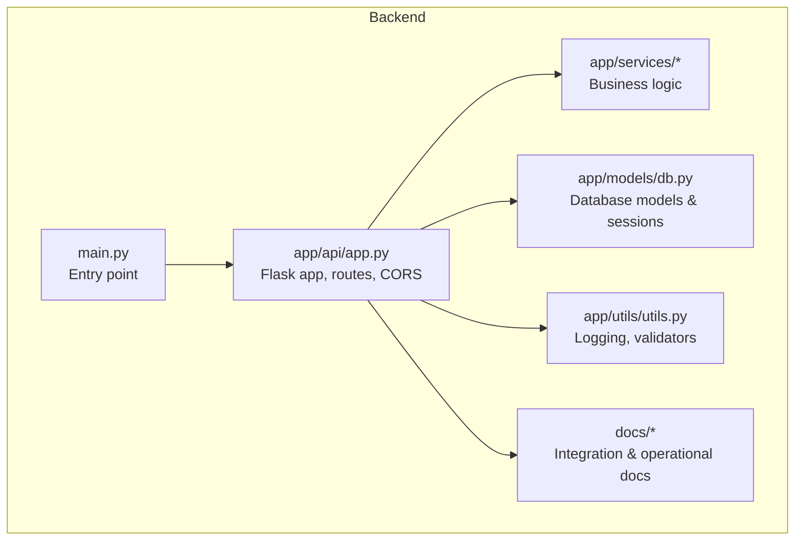
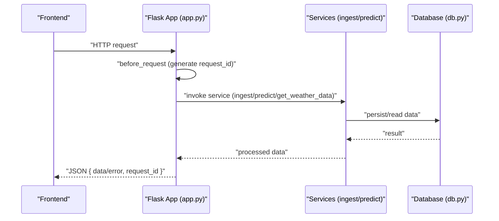
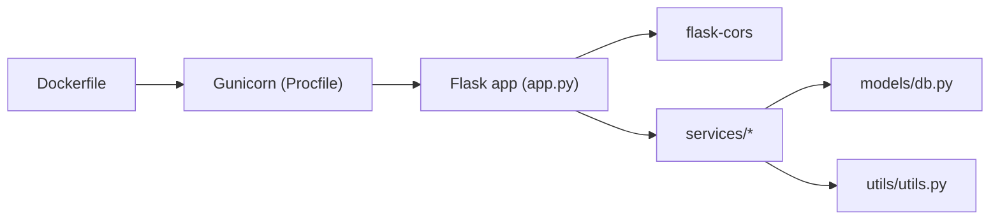
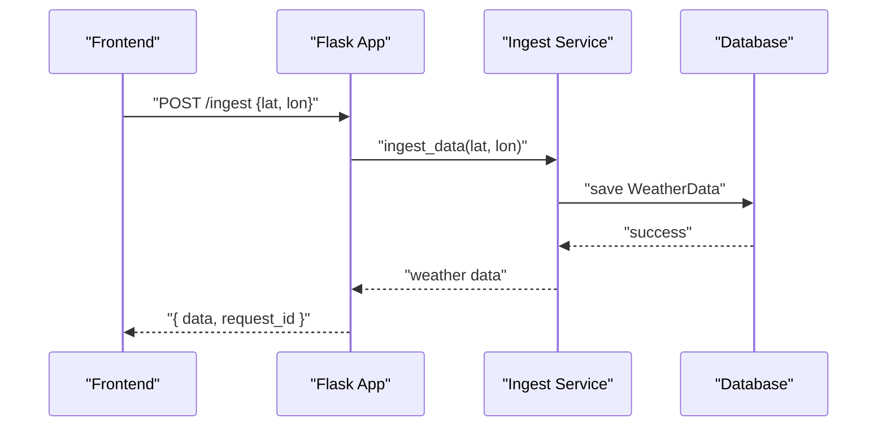
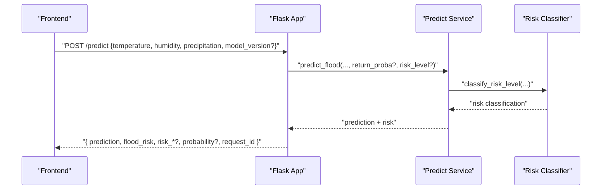
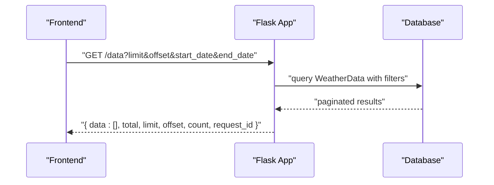

# Frontend Integration

<cite>
**Referenced Files in This Document**
- [FRONTEND_INTEGRATION.md](file://backend/docs/Frontend Integration Guide.md)
- [app.py](file://backend/app/api/app.py)
- [ingest.py](file://backend/app/services/ingest.py)
- [predict.py](file://backend/app/services/predict.py)
- [risk_classifier.py](file://backend/app/services/risk_classifier.py)
- [db.py](file://backend/app/models/db.py)
- [utils.py](file://backend/app/utils/utils.py)
- [README.md](file://backend/README.md)
- [requirements.txt](file://backend/requirements.txt)
- [Dockerfile](file://backend/Dockerfile)
- [Procfile](file://backend/Procfile)
- [main.py](file://backend/main.py)
</cite>

## Table of Contents
1. [Introduction](#introduction)
2. [Project Structure](#project-structure)
3. [Core Components](#core-components)
4. [Architecture Overview](#architecture-overview)
5. [Detailed Component Analysis](#detailed-component-analysis)
6. [Dependency Analysis](#dependency-analysis)
7. [Performance Considerations](#performance-considerations)
8. [Troubleshooting Guide](#troubleshooting-guide)
9. [Conclusion](#conclusion)
10. [Appendices](#appendices)

## Introduction
This document provides comprehensive guidance for integrating a frontend application with the floodingnaque backend. It explains CORS configuration, API endpoints, response formats, error handling, request ID tracking, and practical integration examples in JavaScript/TypeScript and React. It also covers testing approaches using curl and browser access, and outlines best practices for frontend-backend communication and performance optimization.

## Project Structure
The backend is organized around a Flask application with modular components:
- API routes and application setup live under app/api.
- Business logic resides in app/services (ingestion, prediction, risk classification, alerts).
- Data models and database session management are in app/models.
- Utilities and configuration helpers are in app/utils.
- Documentation and deployment artifacts are in docs and at the repository root.

**Diagram sources**
- [main.py](file://backend/main.py#L1-L25)
- [app.py](file://backend/app/api/app.py#L1-L120)
- [db.py](file://backend/app/models/db.py#L1-L37)
- [utils.py](file://backend/app/utils/utils.py#L1-L48)

**Section sources**
- [README.md](file://backend/README.md#L120-L177)
- [main.py](file://backend/main.py#L1-L25)
- [app.py](file://backend/app/api/app.py#L1-L120)

## Core Components
- CORS configuration: Flask-CORS is enabled globally, allowing cross-origin requests from any domain.
- Request ID tracking: A before_request hook generates and attaches a request ID to each request for tracing and debugging.
- Consistent JSON response format: Success responses include a data object and a request_id; error responses include an error message and a request_id.
- Authentication-free access: All endpoints are public and do not require authentication tokens.

**Section sources**
- [app.py](file://backend/app/api/app.py#L72-L91)
- [app.py](file://backend/app/api/app.py#L105-L121)
- [FRONTEND_INTEGRATION.md](file://backend/docs/Frontend Integration Guide.md#L33-L51)

## Architecture Overview
The frontend communicates with the backend via HTTP endpoints. The backend:
- Initializes CORS for cross-origin requests.
- Generates a request ID per request.
- Validates inputs and invokes services for data ingestion, prediction, and data retrieval.
- Returns standardized JSON responses with request_id.

**Diagram sources**
- [app.py](file://backend/app/api/app.py#L85-L104)
- [app.py](file://backend/app/api/app.py#L141-L223)
- [app.py](file://backend/app/api/app.py#L224-L305)
- [app.py](file://backend/app/api/app.py#L341-L405)
- [db.py](file://backend/app/models/db.py#L1-L37)

## Detailed Component Analysis

### CORS Configuration
- Flask-CORS is enabled globally, enabling cross-origin requests from any domain. This allows a frontend hosted on a different origin to call the API seamlessly.

Implementation reference:
- [app.py](file://backend/app/api/app.py#L72-L74)
- [requirements.txt](file://backend/requirements.txt#L1-L14)

**Section sources**
- [app.py](file://backend/app/api/app.py#L72-L74)
- [requirements.txt](file://backend/requirements.txt#L1-L14)

### Request ID Tracking
- A before_request hook attaches a request_id to each request. Services and endpoints use this request_id in their responses for debugging and error tracking.

Implementation reference:
- [app.py](file://backend/app/api/app.py#L85-L104)
- [app.py](file://backend/app/api/app.py#L205-L210)
- [app.py](file://backend/app/api/app.py#L264-L292)
- [app.py](file://backend/app/api/app.py#L392-L400)

**Section sources**
- [app.py](file://backend/app/api/app.py#L85-L104)
- [app.py](file://backend/app/api/app.py#L205-L210)
- [app.py](file://backend/app/api/app.py#L264-L292)
- [app.py](file://backend/app/api/app.py#L392-L400)

### API Endpoints

#### Root Information
- Method: GET /
- Purpose: Returns API metadata and endpoint list.

Implementation reference:
- [app.py](file://backend/app/api/app.py#L105-L121)

**Section sources**
- [app.py](file://backend/app/api/app.py#L105-L121)

#### Health Checks
- GET /status: Basic health status including model availability.
- GET /health: Detailed health including model metadata and scheduler status.

Implementation reference:
- [app.py](file://backend/app/api/app.py#L123-L139)
- [app.py](file://backend/app/api/app.py#L306-L339)

**Section sources**
- [app.py](file://backend/app/api/app.py#L123-L139)
- [app.py](file://backend/app/api/app.py#L306-L339)

#### Weather Data Ingestion
- GET/POST /ingest:
  - GET: Returns usage instructions and example request/response.
  - POST: Ingests weather data from external APIs and persists to the database.

Implementation reference:
- [app.py](file://backend/app/api/app.py#L141-L223)
- [ingest.py](file://backend/app/services/ingest.py#L1-L111)

**Section sources**
- [app.py](file://backend/app/api/app.py#L141-L223)
- [ingest.py](file://backend/app/services/ingest.py#L1-L111)

#### Historical Data Retrieval
- GET /data:
  - Query parameters: limit (1–1000, default 100), offset (default 0), start_date, end_date.
  - Returns paginated weather records with total, limit, offset, and count.

Implementation reference:
- [app.py](file://backend/app/api/app.py#L341-L405)
- [db.py](file://backend/app/models/db.py#L1-L37)

**Section sources**
- [app.py](file://backend/app/api/app.py#L341-L405)
- [db.py](file://backend/app/models/db.py#L1-L37)

#### Flood Prediction
- POST /predict:
  - Request body: temperature, humidity, precipitation (and optionally model_version).
  - Query parameters: return_proba (boolean), risk_level (boolean, default true).
  - Response: prediction (0 or 1), flood_risk (low/high), plus optional probability and 3-level risk classification (risk_level, risk_label, risk_color, risk_description, confidence).

Implementation reference:
- [app.py](file://backend/app/api/app.py#L224-L293)
- [predict.py](file://backend/app/services/predict.py#L112-L216)
- [risk_classifier.py](file://backend/app/services/risk_classifier.py#L32-L111)

**Section sources**
- [app.py](file://backend/app/api/app.py#L224-L293)
- [predict.py](file://backend/app/services/predict.py#L112-L216)
- [risk_classifier.py](file://backend/app/services/risk_classifier.py#L32-L111)

#### Additional Documentation and Metadata
- GET /api/docs: Full API documentation.
- GET /api/version: API version info.
- GET /api/models: Lists available model versions and current version.

Implementation reference:
- [app.py](file://backend/app/api/app.py#L406-L453)
- [app.py](file://backend/app/api/app.py#L454-L535)

**Section sources**
- [app.py](file://backend/app/api/app.py#L406-L453)
- [app.py](file://backend/app/api/app.py#L454-L535)

### Response Format and Error Handling
- Success response structure:
  - data: payload object
  - request_id: UUID string
- Error response structure:
  - error: human-readable message
  - request_id: UUID string
- HTTP status codes:
  - 200: Success
  - 400: Bad Request (validation errors)
  - 404: Not Found (model file, etc.)
  - 500: Internal Server Error

Implementation reference:
- [FRONTEND_INTEGRATION.md](file://backend/docs/Frontend Integration Guide.md#L33-L51)
- [app.py](file://backend/app/api/app.py#L141-L223)
- [app.py](file://backend/app/api/app.py#L224-L305)
- [app.py](file://backend/app/api/app.py#L341-L405)

**Section sources**
- [FRONTEND_INTEGRATION.md](file://backend/docs/Frontend Integration Guide.md#L33-L51)
- [app.py](file://backend/app/api/app.py#L141-L223)
- [app.py](file://backend/app/api/app.py#L224-L305)
- [app.py](file://backend/app/api/app.py#L341-L405)

### Implementation Examples

#### JavaScript/TypeScript
- Ingest weather data
- Retrieve historical data
- Predict flood risk
- Health checks

Example references:
- [FRONTEND_INTEGRATION.md](file://backend/docs/Frontend Integration Guide.md#L59-L99)

**Section sources**
- [FRONTEND_INTEGRATION.md](file://backend/docs/Frontend Integration Guide.md#L59-L99)

#### React
- Dashboard component fetching historical data and rendering records

Example references:
- [FRONTEND_INTEGRATION.md](file://backend/docs/Frontend Integration Guide.md#L101-L139)

**Section sources**
- [FRONTEND_INTEGRATION.md](file://backend/docs/Frontend Integration Guide.md#L101-L139)

### Data Models
- WeatherData record fields: id, temperature, humidity, precipitation, timestamp.
- Prediction request: temperature, humidity, precipitation (and optionally model_version).
- Prediction response: prediction, flood_risk, and optional probability and 3-level risk classification.

Example references:
- [FRONTEND_INTEGRATION.md](file://backend/docs/Frontend Integration Guide.md#L205-L235)
- [db.py](file://backend/app/models/db.py#L13-L20)
- [predict.py](file://backend/app/services/predict.py#L112-L216)

**Section sources**
- [FRONTEND_INTEGRATION.md](file://backend/docs/Frontend Integration Guide.md#L205-L235)
- [db.py](file://backend/app/models/db.py#L13-L20)
- [predict.py](file://backend/app/services/predict.py#L112-L216)

## Dependency Analysis
- Flask app depends on:
  - Flask-CORS for cross-origin support.
  - Services for business logic (ingest, predict, risk classification).
  - Database models and sessions for persistence.
  - Utilities for logging and validation.
- Production runtime uses Gunicorn with multiple workers and threads.

**Diagram sources**
- [app.py](file://backend/app/api/app.py#L1-L20)
- [requirements.txt](file://backend/requirements.txt#L1-L14)
- [Procfile](file://backend/Procfile#L1-L1)
- [Dockerfile](file://backend/Dockerfile#L1-L37)

**Section sources**
- [requirements.txt](file://backend/requirements.txt#L1-L14)
- [Procfile](file://backend/Procfile#L1-L1)
- [Dockerfile](file://backend/Dockerfile#L1-L37)

## Performance Considerations
- Pagination: Use limit and offset on /data to control payload sizes.
- Query parameters: Use start_date and end_date filters to reduce dataset size.
- Prediction options: Disable return_proba and risk_level when not needed to minimize computation overhead.
- Concurrency: The production container runs multiple workers and threads; ensure frontend retries and timeouts are configured appropriately.
- Caching: Consider client-side caching for frequently accessed historical data snapshots.

[No sources needed since this section provides general guidance]

## Troubleshooting Guide
- Verify CORS: Confirm that the browser can reach the API without CORS errors.
- Inspect request_id: Include the request_id in bug reports to backend developers.
- Check logs: Review logs/app.log for detailed error traces.
- Validate environment: Ensure OWM_API_KEY and optional METEOSTAT_API_KEY are configured for weather ingestion.
- Model availability: Confirm a trained model exists; otherwise, predict may return 404.

**Section sources**
- [FRONTEND_INTEGRATION.md](file://backend/docs/Frontend Integration Guide.md#L171-L179)
- [README.md](file://backend/README.md#L1-L25)
- [README.md](file://backend/README.md#L180-L194)
- [app.py](file://backend/app/api/app.py#L293-L305)

## Conclusion
The floodingnaque backend provides a CORS-enabled, authentication-free API with consistent JSON responses and robust error handling. Frontends can integrate using straightforward HTTP calls, leveraging request_id for debugging and error tracking. The documented endpoints and examples enable rapid integration for data ingestion, historical data retrieval, and flood prediction.

[No sources needed since this section summarizes without analyzing specific files]

## Appendices

### API Workflow: Ingest Weather Data

**Diagram sources**
- [app.py](file://backend/app/api/app.py#L141-L223)
- [ingest.py](file://backend/app/services/ingest.py#L1-L111)
- [db.py](file://backend/app/models/db.py#L1-L37)

### API Workflow: Predict Flood Risk

**Diagram sources**
- [app.py](file://backend/app/api/app.py#L224-L293)
- [predict.py](file://backend/app/services/predict.py#L112-L216)
- [risk_classifier.py](file://backend/app/services/risk_classifier.py#L32-L111)

### API Workflow: Retrieve Historical Data

**Diagram sources**
- [app.py](file://backend/app/api/app.py#L341-L405)
- [db.py](file://backend/app/models/db.py#L1-L37)

### Testing Examples

- Browser access:
  - Visit the root endpoint for API info.
  - Visit /api/docs for full documentation.
  - Visit /ingest to see usage instructions.

- curl examples:
  - Health check: curl http://localhost:5000/health
  - Ingest data: curl -X POST http://localhost:5000/ingest -H "Content-Type: application/json" -d '{"lat": 14.6, "lon": 120.98}'
  - Get data: curl http://localhost:5000/data?limit=10
  - Predict: curl -X POST http://localhost:5000/predict -H "Content-Type: application/json" -d '{"temperature": 298.15, "humidity": 65.0, "precipitation": 5.0}'

**Section sources**
- [FRONTEND_INTEGRATION.md](file://backend/docs/Frontend Integration Guide.md#L181-L203)
- [README.md](file://backend/README.md#L66-L88)

### Best Practices for Frontend-Backend Communication
- Always check response.ok and handle HTTP status codes (200, 400, 404, 500).
- Use request_id for correlating client logs with backend logs.
- Implement retry logic with exponential backoff for transient failures.
- Validate and sanitize inputs before sending requests.
- Use pagination on /data to avoid large payloads.
- Cache static or slowly changing data on the client when appropriate.

**Section sources**
- [FRONTEND_INTEGRATION.md](file://backend/docs/Frontend Integration Guide.md#L142-L169)
- [FRONTEND_INTEGRATION.md](file://backend/docs/Frontend Integration Guide.md#L33-L51)