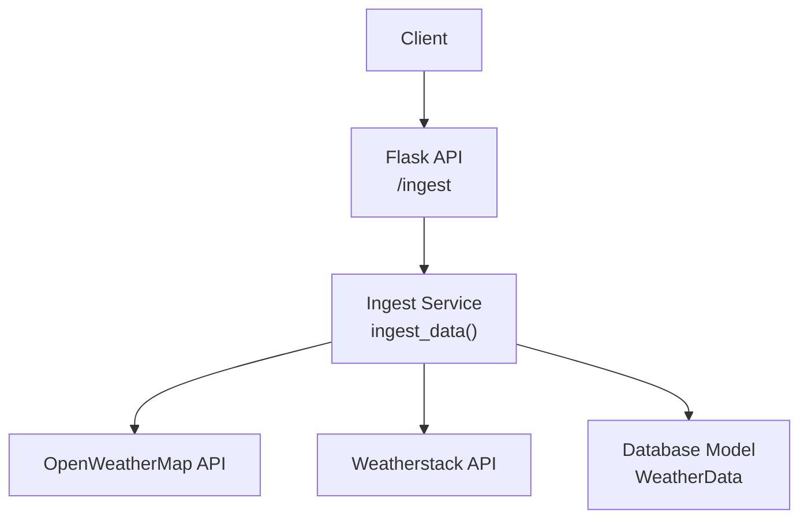
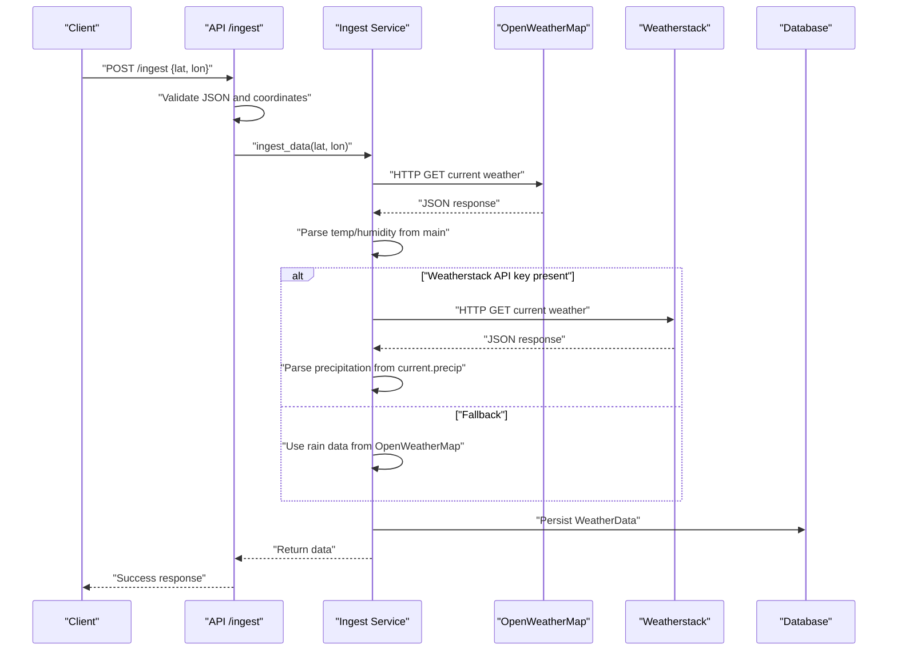
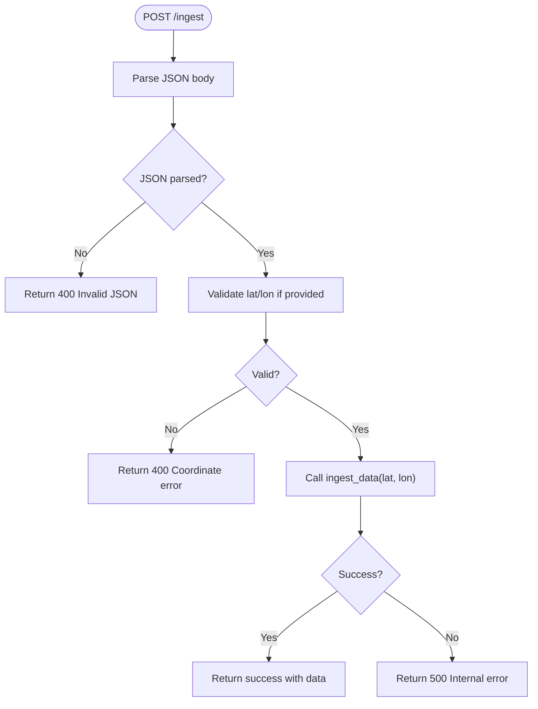
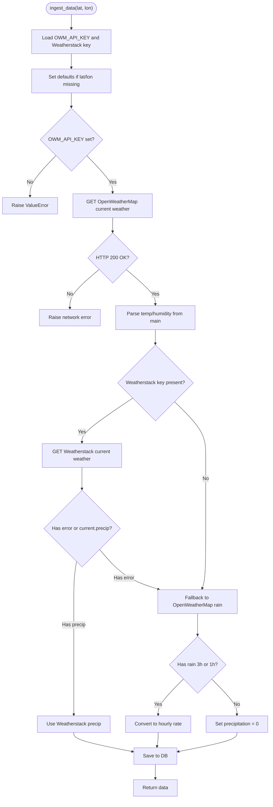
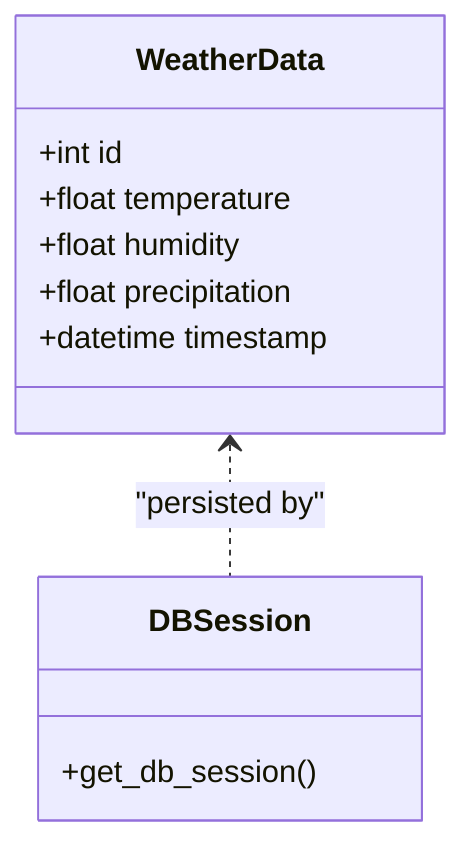
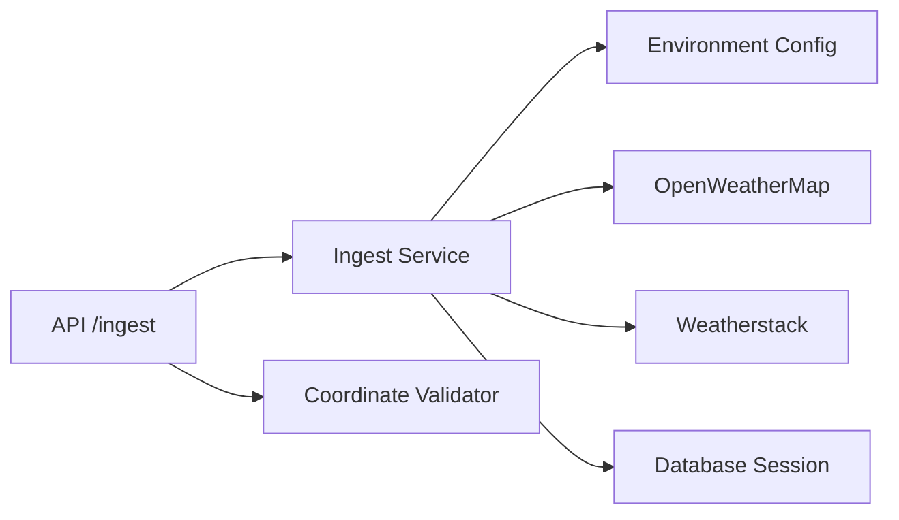

# OpenWeatherMap API Integration

<cite>
**Referenced Files in This Document**
- [ingest.py](file://backend/app/services/ingest.py)
- [app.py](file://backend/app/api/app.py)
- [utils.py](file://backend/app/utils/utils.py)
- [db.py](file://backend/app/models/db.py)
- [.env.example](file://backend/.env.example)
- [config.py](file://backend/app/core/config.py)
- [BACKEND_COMPLETE.md](file://backend/docs/BACKEND_COMPLETE.md)
</cite>

## Table of Contents
1. [Introduction](#introduction)
2. [Project Structure](#project-structure)
3. [Core Components](#core-components)
4. [Architecture Overview](#architecture-overview)
5. [Detailed Component Analysis](#detailed-component-analysis)
6. [Dependency Analysis](#dependency-analysis)
7. [Performance Considerations](#performance-considerations)
8. [Troubleshooting Guide](#troubleshooting-guide)
9. [Conclusion](#conclusion)

## Introduction
This document explains how the floodingnaque system integrates with the OpenWeatherMap API to fetch current weather conditions for flood risk modeling. It covers request construction, authentication, response parsing for temperature and humidity, and precipitation fallback behavior. It also documents error handling strategies for network failures, invalid responses, missing data, and JSON parsing issues. Guidance is provided for rate limiting considerations, API key management via environment variables, and troubleshooting common integration problems.

## Project Structure
The OpenWeatherMap integration is implemented in the backend service layer and exposed via a Flask API endpoint. The key files involved are:
- API endpoint handler that validates input and invokes ingestion
- Ingestion service that performs HTTP GET requests to OpenWeatherMap and Weatherstack, parses responses, and persists data
- Utilities for coordinate validation and logging
- Database model for storing weather data
- Environment configuration and example template

**Diagram sources**
- [app.py](file://backend/app/api/app.py#L141-L223)
- [ingest.py](file://backend/app/services/ingest.py#L9-L111)
- [db.py](file://backend/app/models/db.py#L13-L37)

**Section sources**
- [app.py](file://backend/app/api/app.py#L141-L223)
- [ingest.py](file://backend/app/services/ingest.py#L9-L111)
- [utils.py](file://backend/app/utils/utils.py#L39-L47)
- [db.py](file://backend/app/models/db.py#L13-L37)
- [BACKEND_COMPLETE.md](file://backend/docs/BACKEND_COMPLETE.md#L289-L298)

## Core Components
- API endpoint: Validates JSON and coordinates, then calls the ingestion service.
- Ingestion service: Builds OpenWeatherMap request with lat, lon, and appid; parses temperature and humidity from the main object; extracts precipitation from Weatherstack or OpenWeatherMap rain data; falls back to OpenWeatherMap rain data if Weatherstack is unavailable; saves to the database.
- Database model: Defines the schema for persisted weather data.
- Environment configuration: Loads environment variables and provides example keys.

**Section sources**
- [app.py](file://backend/app/api/app.py#L176-L223)
- [ingest.py](file://backend/app/services/ingest.py#L9-L111)
- [db.py](file://backend/app/models/db.py#L13-L37)
- [config.py](file://backend/app/core/config.py#L1-L10)
- [.env.example](file://backend/.env.example#L1-L4)

## Architecture Overview
The ingestion pipeline follows a clear flow: the API endpoint receives a request, validates inputs, delegates to the ingestion service, which performs external API calls, parses responses, and persists data.

**Diagram sources**
- [app.py](file://backend/app/api/app.py#L176-L223)
- [ingest.py](file://backend/app/services/ingest.py#L37-L111)
- [db.py](file://backend/app/models/db.py#L13-L37)

## Detailed Component Analysis

### API Endpoint: /ingest
- Handles GET to show usage and POST to ingest weather data.
- Parses JSON with robust fallbacks for PowerShell-style escaping.
- Validates coordinates using a dedicated validator.
- Invokes the ingestion service and returns structured success/error responses.

**Diagram sources**
- [app.py](file://backend/app/api/app.py#L176-L223)
- [utils.py](file://backend/app/utils/utils.py#L39-L47)

**Section sources**
- [app.py](file://backend/app/api/app.py#L141-L223)
- [utils.py](file://backend/app/utils/utils.py#L39-L47)

### Ingestion Service: ingest_data()
- Reads API keys from environment variables.
- Constructs OpenWeatherMap URL with lat, lon, and appid.
- Fetches current weather data with a 10-second timeout and raises on HTTP errors.
- Parses temperature and humidity from the main object.
- Attempts Weatherstack API for precipitation if configured.
- Falls back to OpenWeatherMap rain data (3h or 1h) when Weatherstack does not provide precipitation.
- Saves data to the database and returns the normalized dataset.

**Diagram sources**
- [ingest.py](file://backend/app/services/ingest.py#L9-L111)
- [db.py](file://backend/app/models/db.py#L13-L37)

**Section sources**
- [ingest.py](file://backend/app/services/ingest.py#L9-L111)
- [db.py](file://backend/app/models/db.py#L13-L37)

### Data Model: WeatherData
- Defines columns for temperature, humidity, precipitation, and timestamp.
- Provides a context manager for database sessions with automatic commit/rollback.

**Diagram sources**
- [db.py](file://backend/app/models/db.py#L13-L37)

**Section sources**
- [db.py](file://backend/app/models/db.py#L13-L37)

### Environment Configuration and API Keys
- Environment variables are loaded via a helper and example keys are provided in the template.
- The ingestion service reads OWM_API_KEY and Weatherstack API key (METEOSTAT_API_KEY or WEATHERSTACK_API_KEY).

**Section sources**
- [config.py](file://backend/app/core/config.py#L1-L10)
- [.env.example](file://backend/.env.example#L1-L4)
- [ingest.py](file://backend/app/services/ingest.py#L20-L24)

## Dependency Analysis
- The API endpoint depends on the ingestion service and coordinate validator.
- The ingestion service depends on the database session context manager and environment configuration.
- External dependencies include HTTP clients and third-party weather APIs.

**Diagram sources**
- [app.py](file://backend/app/api/app.py#L176-L223)
- [ingest.py](file://backend/app/services/ingest.py#L9-L111)
- [utils.py](file://backend/app/utils/utils.py#L39-L47)
- [db.py](file://backend/app/models/db.py#L25-L37)

**Section sources**
- [app.py](file://backend/app/api/app.py#L176-L223)
- [ingest.py](file://backend/app/services/ingest.py#L9-L111)
- [utils.py](file://backend/app/utils/utils.py#L39-L47)
- [db.py](file://backend/app/models/db.py#L25-L37)

## Performance Considerations
- Network timeouts: Requests use a 10-second timeout to prevent blocking.
- Fallback strategy: Precipitation data is prioritized from Weatherstack if available; otherwise, OpenWeatherMap rain data is used.
- Rate limiting: No explicit rate limiting middleware is implemented. Consider adding rate limiting and caching for production deployments.

**Section sources**
- [ingest.py](file://backend/app/services/ingest.py#L39-L41)
- [BACKEND_COMPLETE.md](file://backend/docs/BACKEND_COMPLETE.md#L289-L298)

## Troubleshooting Guide
Common issues and resolutions:
- Invalid API key
  - Symptom: ValueError raised during ingestion when OWM_API_KEY is not set.
  - Resolution: Set OWM_API_KEY in the environment and ensure it is loaded by the application.
  - Section sources
    - [ingest.py](file://backend/app/services/ingest.py#L31-L34)
    - [config.py](file://backend/app/core/config.py#L1-L10)
    - [.env.example](file://backend/.env.example#L1-L4)

- Coordinate validation errors
  - Symptom: Validation error when lat/lon are out of range or not numeric.
  - Resolution: Ensure lat is between -90 and 90 and lon is between -180 and 180.
  - Section sources
    - [utils.py](file://backend/app/utils/utils.py#L39-L47)
    - [app.py](file://backend/app/api/app.py#L199-L201)

- JSON parsing problems (PowerShell and curl compatibility)
  - Symptom: 400 error due to malformed JSON.
  - Resolution: The API includes robust JSON parsing with fallbacks for escaped strings. Verify request body formatting and content-type headers.
  - Section sources
    - [app.py](file://backend/app/api/app.py#L178-L195)
    - [app.py](file://backend/app/api/app.py#L39-L71)

- Network failures and HTTP errors
  - Symptom: Network-related exceptions or HTTP errors from OpenWeatherMap.
  - Resolution: Inspect logs for detailed error messages; verify connectivity and API key validity.
  - Section sources
    - [ingest.py](file://backend/app/services/ingest.py#L51-L56)

- Missing data in response
  - Symptom: Missing temperature/humidity or precipitation.
  - Resolution: Temperature and humidity are extracted from the main object; precipitation is taken from Weatherstack or OpenWeatherMap rain data. If both are absent, precipitation defaults to zero.
  - Section sources
    - [ingest.py](file://backend/app/services/ingest.py#L47-L48)
    - [ingest.py](file://backend/app/services/ingest.py#L85-L96)

- Database save errors
  - Symptom: Error saving data to the database.
  - Resolution: Check database connection and permissions; review logs for details.
  - Section sources
    - [ingest.py](file://backend/app/services/ingest.py#L106-L108)
    - [db.py](file://backend/app/models/db.py#L25-L37)

## Conclusion
The OpenWeatherMap integration in floodingnaque is implemented as a robust ingestion service that authenticates via environment variables, constructs HTTP GET requests with lat, lon, and appid, and parses temperature and humidity from the main object. Precipitation data is prioritized from Weatherstack when available, with a fallback to OpenWeatherMap rain data. The API endpoint provides comprehensive input validation and JSON parsing, while the ingestion service handles network failures, invalid responses, and missing data gracefully. For production, consider adding rate limiting and caching, and ensure secure management of API keys.