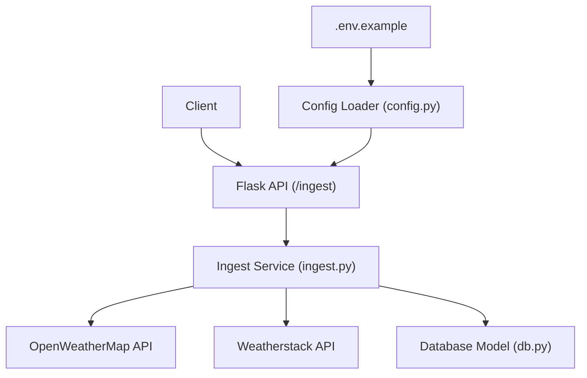
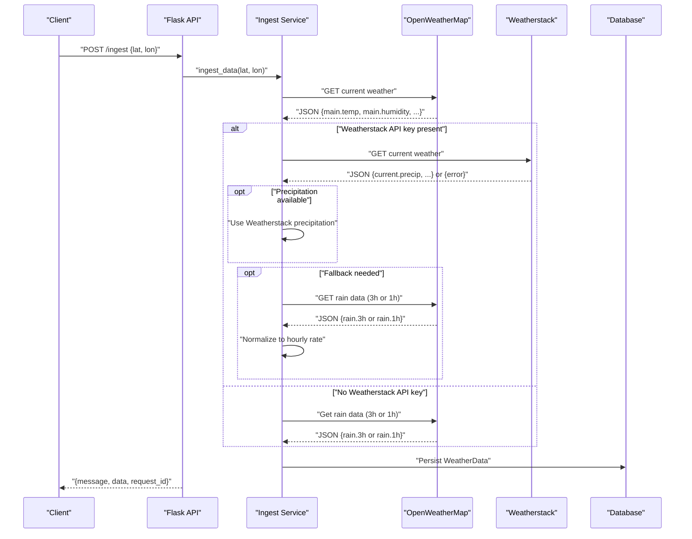
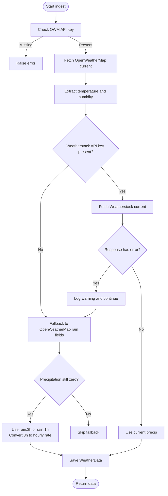
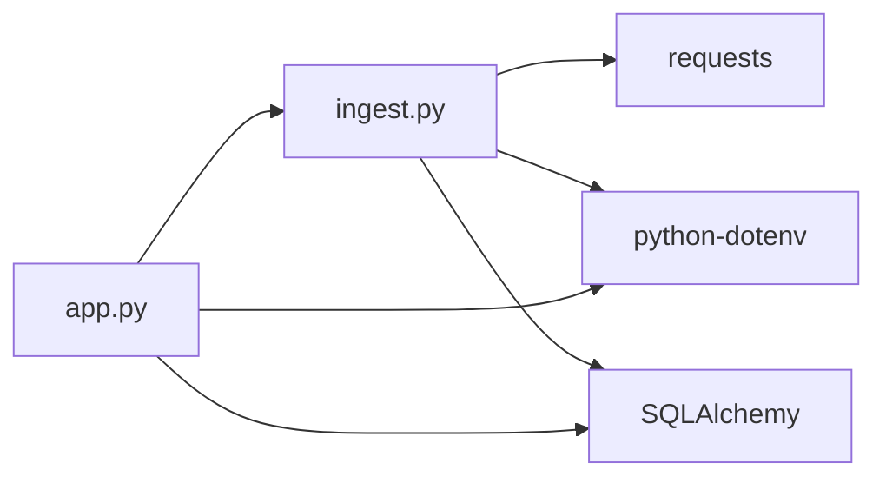

# Weatherstack API Integration

<cite>
**Referenced Files in This Document**
- [ingest.py](file://backend/app/services/ingest.py)
- [app.py](file://backend/app/api/app.py)
- [config.py](file://backend/app/core/config.py)
- [db.py](file://backend/app/models/db.py)
- [.env.example](file://backend/.env.example)
- [requirements.txt](file://backend/requirements.txt)
- [utils.py](file://backend/app/utils/utils.py)
</cite>

## Table of Contents
1. [Introduction](#introduction)
2. [Project Structure](#project-structure)
3. [Core Components](#core-components)
4. [Architecture Overview](#architecture-overview)
5. [Detailed Component Analysis](#detailed-component-analysis)
6. [Dependency Analysis](#dependency-analysis)
7. [Performance Considerations](#performance-considerations)
8. [Troubleshooting Guide](#troubleshooting-guide)
9. [Conclusion](#conclusion)

## Introduction
This document explains how the floodingnaque system integrates Weatherstack as the primary precipitation source while falling back to OpenWeatherMap when Weatherstack is unavailable. It details the HTTP request structure for Weatherstack, response parsing logic for precipitation, conditional priority logic based on environment variables, error handling and warnings, and configuration requirements. It also provides troubleshooting guidance for common issues such as invalid API keys, response format changes, and network timeouts.

## Project Structure
The Weatherstack integration lives in the backend service layer and is invoked by the API layer. The key files involved are:
- ingest service: orchestrates API calls and data parsing
- API layer: exposes the /ingest endpoint and invokes the ingest service
- configuration: loads environment variables
- database model: persists weather data
- environment example: lists required environment variables
- requirements: external dependencies including requests and python-dotenv

**Diagram sources**
- [app.py](file://backend/app/api/app.py#L141-L223)
- [ingest.py](file://backend/app/services/ingest.py#L9-L111)
- [db.py](file://backend/app/models/db.py#L13-L37)
- [config.py](file://backend/app/core/config.py#L1-L10)
- [.env.example](file://backend/.env.example#L1-L4)

**Section sources**
- [app.py](file://backend/app/api/app.py#L141-L223)
- [ingest.py](file://backend/app/services/ingest.py#L9-L111)
- [db.py](file://backend/app/models/db.py#L13-L37)
- [config.py](file://backend/app/core/config.py#L1-L10)
- [.env.example](file://backend/.env.example#L1-L4)

## Core Components
- Ingest service: fetches weather data from OpenWeatherMap, optionally from Weatherstack, extracts precipitation, and saves to the database.
- API layer: exposes the /ingest endpoint, validates coordinates, and delegates to the ingest service.
- Configuration loader: loads environment variables from .env.
- Database model: defines the WeatherData entity persisted by the ingest service.
- Environment variables: define API keys and database URL.

Key responsibilities:
- HTTP request construction for Weatherstack and OpenWeatherMap
- Conditional priority logic for Weatherstack vs OpenWeatherMap
- Precipitation extraction from Weatherstack’s current.precip and OpenWeatherMap’s rain fields
- Non-blocking error handling with warnings and fallback behavior
- Persistence of normalized weather metrics to the database

**Section sources**
- [ingest.py](file://backend/app/services/ingest.py#L9-L111)
- [app.py](file://backend/app/api/app.py#L141-L223)
- [db.py](file://backend/app/models/db.py#L13-L37)
- [config.py](file://backend/app/core/config.py#L1-L10)
- [.env.example](file://backend/.env.example#L1-L4)

## Architecture Overview
The ingest pipeline follows a deterministic order:
1. Validate OWM API key presence
2. Fetch OpenWeatherMap current weather for temperature and humidity
3. If Weatherstack API key is present, fetch Weatherstack current weather and extract precipitation
4. If Weatherstack did not provide precipitation, fallback to OpenWeatherMap rain fields
5. Persist normalized data to the database

**Diagram sources**
- [app.py](file://backend/app/api/app.py#L141-L223)
- [ingest.py](file://backend/app/services/ingest.py#L37-L111)
- [db.py](file://backend/app/models/db.py#L13-L37)

## Detailed Component Analysis

### HTTP Requests and Parameters
- Weatherstack endpoint: current weather
  - Endpoint: http://api.weatherstack.com/current
  - Required parameters:
    - access_key: API key sourced from environment variables
    - query: comma-separated lat,lon
    - units: metric units (m)
  - Timeout: 10 seconds
- OpenWeatherMap endpoint: current weather
  - Endpoint: https://api.openweathermap.org/data/2.5/weather
  - Required parameters:
    - lat, lon: coordinates
    - appid: OWM API key
  - Timeout: 10 seconds

Notes:
- The ingest service constructs URLs with the above parameters and applies timeouts.
- Weatherstack returns precipitation in current.precip (mm).
- OpenWeatherMap returns rain accumulation in rain.3h or rain.1h; the ingest service converts to hourly rates.

**Section sources**
- [ingest.py](file://backend/app/services/ingest.py#L39-L46)
- [ingest.py](file://backend/app/services/ingest.py#L66-L66)
- [ingest.py](file://backend/app/services/ingest.py#L88-L93)

### Conditional Priority Logic (Weatherstack vs OpenWeatherMap)
- API key availability:
  - OWM API key is mandatory; missing key raises an error early.
  - Weatherstack API key is optional; if present, Weatherstack is preferred for precipitation.
- Priority order:
  - Temperature and humidity: always from OpenWeatherMap.
  - Precipitation:
    - Prefer Weatherstack current.precip if API key is available.
    - Fallback to OpenWeatherMap rain.3h or rain.1h otherwise.
- Fallback conversion:
  - rain.3h is divided by 3 to estimate hourly rate.
  - rain.1h is used as-is.

**Diagram sources**
- [ingest.py](file://backend/app/services/ingest.py#L32-L34)
- [ingest.py](file://backend/app/services/ingest.py#L37-L49)
- [ingest.py](file://backend/app/services/ingest.py#L62-L84)
- [ingest.py](file://backend/app/services/ingest.py#L85-L96)
- [ingest.py](file://backend/app/services/ingest.py#L101-L110)

**Section sources**
- [ingest.py](file://backend/app/services/ingest.py#L21-L24)
- [ingest.py](file://backend/app/services/ingest.py#L32-L34)
- [ingest.py](file://backend/app/services/ingest.py#L62-L96)

### Response Parsing Logic (Precipitation Extraction)
- Weatherstack:
  - Field: current.precip
  - Units: millimeters
  - Null safety: if value is not None, cast to float and assign
- OpenWeatherMap:
  - Fields: rain.3h or rain.1h
  - Normalization: rain.3h is divided by 3 to derive hourly rate
  - Logging: informational messages indicate which source was used

**Section sources**
- [ingest.py](file://backend/app/services/ingest.py#L75-L79)
- [ingest.py](file://backend/app/services/ingest.py#L88-L93)

### Error Handling and Warning System
- Weatherstack:
  - Network errors: logged as warnings; service continues to fallback to OpenWeatherMap
  - Parsing errors: logged as warnings; service continues to fallback to OpenWeatherMap
  - API error object: if present, a warning is logged with the error info
- OpenWeatherMap:
  - Network errors: raised to the caller (non-fatal to the ingest service)
  - Parsing errors: raised to the caller (non-fatal to the ingest service)
- Database persistence:
  - Errors are logged and re-raised to the API layer

**Section sources**
- [ingest.py](file://backend/app/services/ingest.py#L51-L56)
- [ingest.py](file://backend/app/services/ingest.py#L71-L74)
- [ingest.py](file://backend/app/services/ingest.py#L80-L84)
- [ingest.py](file://backend/app/services/ingest.py#L101-L109)

### API Integration and Usage
- The /ingest endpoint accepts POST requests with optional lat and lon parameters.
- Coordinates are validated before invoking the ingest service.
- On success, the endpoint returns a message, the ingested data, and a request_id.

**Section sources**
- [app.py](file://backend/app/api/app.py#L141-L223)
- [app.py](file://backend/app/api/app.py#L200-L210)

### Database Persistence
- The ingest service persists temperature, humidity, precipitation, and timestamp to the WeatherData table.
- Sessions are managed via a scoped session with commit/rollback semantics.

**Section sources**
- [db.py](file://backend/app/models/db.py#L13-L37)
- [ingest.py](file://backend/app/services/ingest.py#L101-L110)

## Dependency Analysis
External dependencies relevant to Weatherstack integration:
- requests: HTTP client for API calls
- python-dotenv: loads environment variables from .env
- SQLAlchemy: database ORM and session management

**Diagram sources**
- [ingest.py](file://backend/app/services/ingest.py#L1-L10)
- [app.py](file://backend/app/api/app.py#L1-L20)
- [requirements.txt](file://backend/requirements.txt#L1-L15)

**Section sources**
- [requirements.txt](file://backend/requirements.txt#L1-L15)
- [config.py](file://backend/app/core/config.py#L1-L10)

## Performance Considerations
- Timeouts: Both Weatherstack and OpenWeatherMap requests use a 10-second timeout to prevent blocking.
- Fallback strategy: Weatherstack is attempted first when an API key is available; otherwise, OpenWeatherMap is used. This minimizes latency by avoiding unnecessary fallbacks.
- Logging overhead: Logging is used for warnings and informational messages; ensure log levels are configured appropriately in production.

[No sources needed since this section provides general guidance]

## Troubleshooting Guide

Common issues and resolutions:
- Invalid OWM API key
  - Symptom: ingest raises an error immediately upon startup or when calling the ingest endpoint.
  - Resolution: Set OWM_API_KEY in the environment and ensure the .env file is loaded.
  - Evidence: Early validation checks for OWM API key presence.
  
  **Section sources**
  - [ingest.py](file://backend/app/services/ingest.py#L32-L34)
  - [config.py](file://backend/app/core/config.py#L1-L10)
  - [.env.example](file://backend/.env.example#L1-L4)

- Invalid Weatherstack API key
  - Symptom: Weatherstack API error object is returned; ingest logs a warning and falls back to OpenWeatherMap.
  - Resolution: Verify the Weatherstack API key and ensure it matches the expected provider. If unavailable, rely on OpenWeatherMap fallback.
  - Evidence: Weatherstack error handling and fallback logic.
  
  **Section sources**
  - [ingest.py](file://backend/app/services/ingest.py#L71-L74)
  - [ingest.py](file://backend/app/services/ingest.py#L80-L84)

- Network timeouts or connectivity issues
  - Symptom: requests exceptions are caught and logged as warnings; ingest continues with fallback.
  - Resolution: Retry later or verify network connectivity. Consider increasing timeouts if necessary.
  - Evidence: Exception handling blocks for Weatherstack and OpenWeatherMap.
  
  **Section sources**
  - [ingest.py](file://backend/app/services/ingest.py#L40-L46)
  - [ingest.py](file://backend/app/services/ingest.py#L66-L66)
  - [ingest.py](file://backend/app/services/ingest.py#L80-L84)

- Response format changes
  - Symptom: KeyError or ValueError during parsing; ingest logs a warning and continues with fallback.
  - Resolution: Inspect the API response shape and update parsing logic if fields change.
  - Evidence: Parsing error handling for Weatherstack and OpenWeatherMap.
  
  **Section sources**
  - [ingest.py](file://backend/app/services/ingest.py#L44-L46)
  - [ingest.py](file://backend/app/services/ingest.py#L82-L84)

- Missing precipitation data
  - Symptom: precipitation remains zero after fallback.
  - Resolution: Confirm OpenWeatherMap rain fields exist in the response; otherwise, consider alternative sources or adjust coordinate selection.
  - Evidence: Fallback logic for rain fields and logging.
  
  **Section sources**
  - [ingest.py](file://backend/app/services/ingest.py#L85-L96)

- Environment configuration
  - Ensure .env is loaded and contains:
    - OWM_API_KEY
    - METEOSTAT_API_KEY or WEATHERSTACK_API_KEY (either is acceptable for Weatherstack)
    - DATABASE_URL
  - Evidence: Environment variable sourcing and example configuration.
  
  **Section sources**
  - [ingest.py](file://backend/app/services/ingest.py#L21-L24)
  - [.env.example](file://backend/.env.example#L1-L4)
  - [config.py](file://backend/app/core/config.py#L1-L10)

- Logging and diagnostics
  - Use the request_id included in API responses to correlate logs.
  - Configure logging to capture warnings and errors for debugging.
  
  **Section sources**
  - [app.py](file://backend/app/api/app.py#L141-L223)
  - [utils.py](file://backend/app/utils/utils.py#L1-L47)

## Conclusion
The Weatherstack integration in floodingnaque is designed for resilience and flexibility:
- Weatherstack is preferred when an API key is available, extracting precipitation from current.precip.
- OpenWeatherMap serves as a robust fallback for precipitation via rain.3h or rain.1h normalization.
- Non-blocking error handling ensures ingest continues even if Weatherstack fails.
- Clear environment variable requirements and logging support streamline configuration and troubleshooting.

[No sources needed since this section summarizes without analyzing specific files]