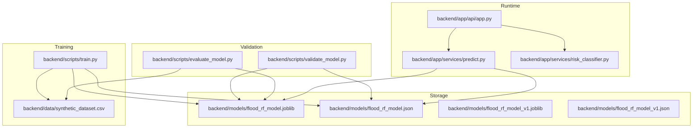
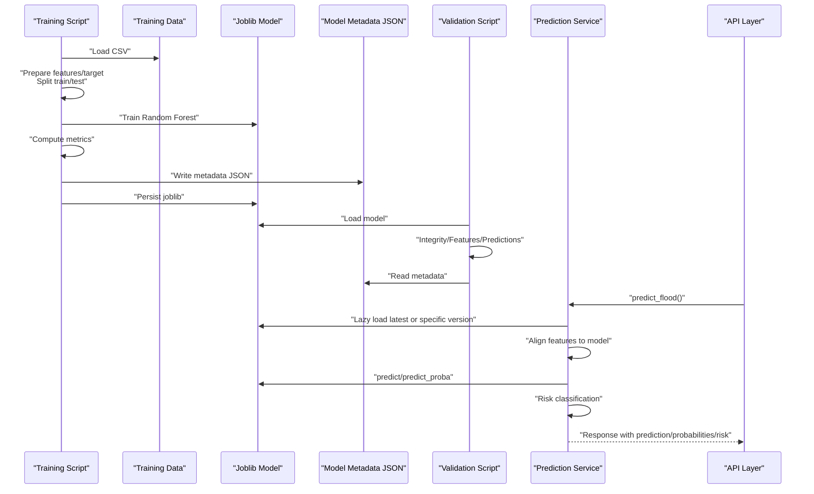
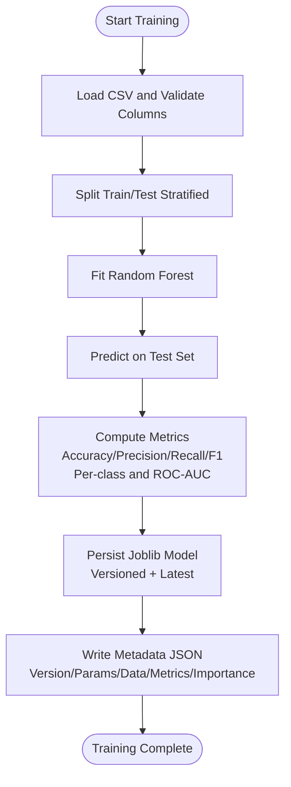
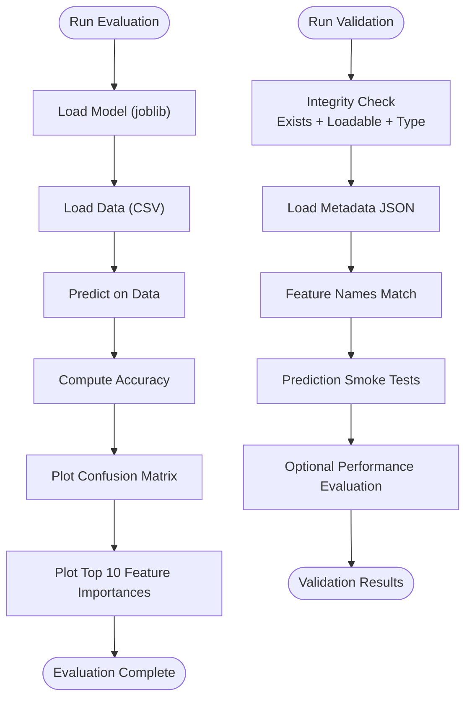
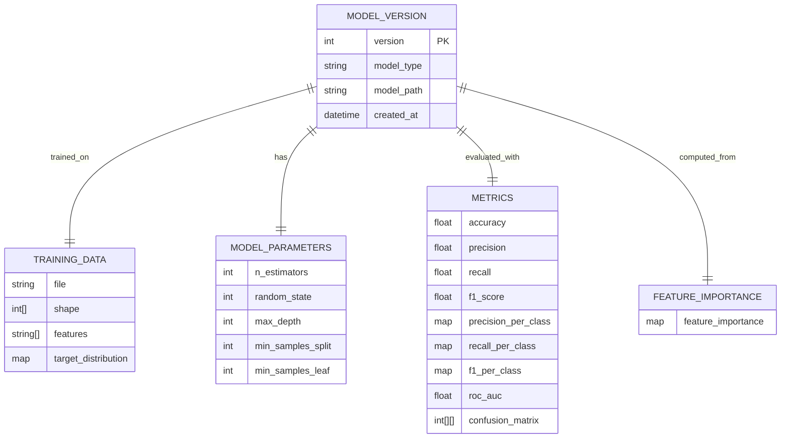
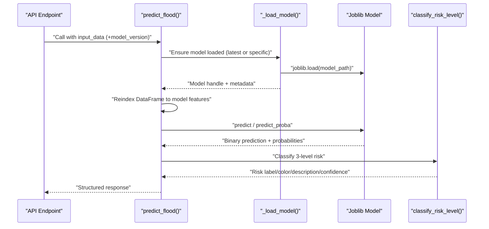
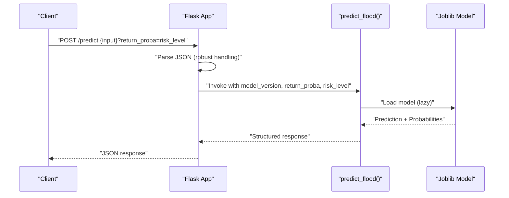
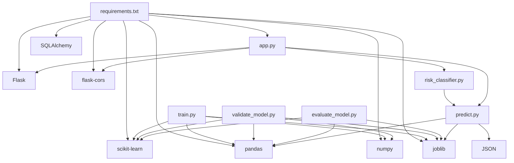

# Machine Learning Model Management

<cite>
**Referenced Files in This Document**
- [train.py](file://backend/scripts/train.py)
- [evaluate_model.py](file://backend/scripts/evaluate_model.py)
- [validate_model.py](file://backend/scripts/validate_model.py)
- [predict.py](file://backend/app/services/predict.py)
- [risk_classifier.py](file://backend/app/services/risk_classifier.py)
- [app.py](file://backend/app/api/app.py)
- [flood_rf_model.json](file://backend/models/flood_rf_model.json)
- [flood_rf_model_v1.json](file://backend/models/flood_rf_model_v1.json)
- [synthetic_dataset.csv](file://backend/data/synthetic_dataset.csv)
- [MODEL_MANAGEMENT.md](file://backend/docs/MODEL_MANAGEMENT.md)
- [requirements.txt](file://backend/requirements.txt)
</cite>

## Table of Contents
1. [Introduction](#introduction)
2. [Project Structure](#project-structure)
3. [Core Components](#core-components)
4. [Architecture Overview](#architecture-overview)
5. [Detailed Component Analysis](#detailed-component-analysis)
6. [Dependency Analysis](#dependency-analysis)
7. [Performance Considerations](#performance-considerations)
8. [Troubleshooting Guide](#troubleshooting-guide)
9. [Conclusion](#conclusion)
10. [Appendices](#appendices)

## Introduction
This document explains the machine learning model lifecycle in floodingnaque, covering training, evaluation, validation, versioning, serialization, and runtime prediction. It details how the Random Forest model is trained, how evaluation metrics are computed and stored, how models are versioned and persisted, and how predictions are served with probabilities and 3-level risk classification. It also provides best practices for retraining, validation, and deployment, along with guidance on interpreting prediction probabilities and confidence scores.

## Project Structure
The model lifecycle spans training scripts, validation utilities, runtime prediction services, and API endpoints. Models and metadata are stored under the models directory, while training data resides under data.

**Diagram sources**
- [train.py](file://backend/scripts/train.py#L1-L287)
- [evaluate_model.py](file://backend/scripts/evaluate_model.py#L1-L56)
- [validate_model.py](file://backend/scripts/validate_model.py#L1-L350)
- [predict.py](file://backend/app/services/predict.py#L1-L236)
- [risk_classifier.py](file://backend/app/services/risk_classifier.py#L1-L170)
- [app.py](file://backend/app/api/app.py#L1-L543)
- [flood_rf_model.json](file://backend/models/flood_rf_model.json#L1-L67)
- [flood_rf_model_v1.json](file://backend/models/flood_rf_model_v1.json#L1-L65)

**Section sources**
- [train.py](file://backend/scripts/train.py#L1-L287)
- [evaluate_model.py](file://backend/scripts/evaluate_model.py#L1-L56)
- [validate_model.py](file://backend/scripts/validate_model.py#L1-L350)
- [predict.py](file://backend/app/services/predict.py#L1-L236)
- [risk_classifier.py](file://backend/app/services/risk_classifier.py#L1-L170)
- [app.py](file://backend/app/api/app.py#L1-L543)
- [flood_rf_model.json](file://backend/models/flood_rf_model.json#L1-L67)
- [flood_rf_model_v1.json](file://backend/models/flood_rf_model_v1.json#L1-L65)
- [synthetic_dataset.csv](file://backend/data/synthetic_dataset.csv#L1-L12)
- [MODEL_MANAGEMENT.md](file://backend/docs/MODEL_MANAGEMENT.md#L1-L482)
- [requirements.txt](file://backend/requirements.txt#L1-L15)

## Core Components
- Training pipeline: Loads data, prepares features/target, trains a Random Forest model, evaluates with comprehensive metrics, and persists the model and metadata.
- Validation pipeline: Loads a model, validates integrity and features, runs prediction smoke tests, and optionally evaluates performance against test data.
- Runtime prediction service: Lazily loads the latest or a specific model version, aligns input features to model expectations, predicts, and returns probabilities and 3-level risk classification.
- API layer: Exposes endpoints for status, health, ingestion, listing models, and prediction with optional probabilities and risk classification.

**Section sources**
- [train.py](file://backend/scripts/train.py#L123-L265)
- [validate_model.py](file://backend/scripts/validate_model.py#L200-L326)
- [predict.py](file://backend/app/services/predict.py#L104-L216)
- [app.py](file://backend/app/api/app.py#L224-L305)

## Architecture Overview
The model lifecycle integrates training, validation, persistence, and runtime prediction into a cohesive system.

**Diagram sources**
- [train.py](file://backend/scripts/train.py#L123-L265)
- [validate_model.py](file://backend/scripts/validate_model.py#L200-L326)
- [predict.py](file://backend/app/services/predict.py#L104-L216)
- [app.py](file://backend/app/api/app.py#L224-L305)

## Detailed Component Analysis

### Training Pipeline (train.py)
- Data ingestion and validation: Reads CSV, checks for required columns, logs dataset shape and target distribution.
- Preprocessing and split: Drops target column to form features, splits into train/test with stratification.
- Model training: Instantiates a Random Forest classifier and fits on training data.
- Evaluation: Computes accuracy, precision, recall, F1-score, per-class metrics, ROC-AUC (if applicable), and confusion matrix.
- Persistence: Saves model as joblib with versioned filename and as “latest” symlink; writes metadata JSON with version, parameters, training data info, metrics, and feature importance.
- Versioning: Auto-increments version based on existing files.

**Diagram sources**
- [train.py](file://backend/scripts/train.py#L123-L265)

**Section sources**
- [train.py](file://backend/scripts/train.py#L123-L265)
- [synthetic_dataset.csv](file://backend/data/synthetic_dataset.csv#L1-L12)

### Evaluation Utilities (evaluate_model.py and validate_model.py)
- evaluate_model.py: Loads model and data, computes accuracy, saves confusion matrix heatmap, and plots top 10 feature importances.
- validate_model.py: Comprehensive validation including model integrity, metadata presence, feature compatibility, prediction smoke tests, and optional performance evaluation on test data.

**Diagram sources**
- [evaluate_model.py](file://backend/scripts/evaluate_model.py#L1-L56)
- [validate_model.py](file://backend/scripts/validate_model.py#L1-L350)

**Section sources**
- [evaluate_model.py](file://backend/scripts/evaluate_model.py#L1-L56)
- [validate_model.py](file://backend/scripts/validate_model.py#L200-L326)

### Model Versioning and Metadata
- Versioning: Models are saved as flood_rf_model_vN.joblib with auto-incremented N. A symlink-like behavior is maintained via flood_rf_model.joblib for latest.
- Metadata: Each model has a corresponding JSON file containing version, model type, model path, creation timestamp, training data info, model parameters, metrics, and feature importance. The latest metadata may include an is_latest flag and pointer to the versioned model.

**Diagram sources**
- [flood_rf_model.json](file://backend/models/flood_rf_model.json#L1-L67)
- [flood_rf_model_v1.json](file://backend/models/flood_rf_model_v1.json#L1-L65)

**Section sources**
- [train.py](file://backend/scripts/train.py#L25-L81)
- [flood_rf_model.json](file://backend/models/flood_rf_model.json#L1-L67)
- [flood_rf_model_v1.json](file://backend/models/flood_rf_model_v1.json#L1-L65)

### Prediction Service and Hot-Swapping (predict.py)
- Lazy loading: Maintains a global model handle and loads the model on demand, logging model path and version from metadata.
- Version selection: Supports loading a specific version or the latest model; hot-swapping occurs when switching versions or forcing reload.
- Feature alignment: Ensures input DataFrame columns match model’s expected features, filling missing values with reasonable defaults.
- Prediction output: Returns either a binary prediction or a structured response including prediction, model version, probabilities, and risk classification.

**Diagram sources**
- [predict.py](file://backend/app/services/predict.py#L104-L216)
- [risk_classifier.py](file://backend/app/services/risk_classifier.py#L32-L111)
- [app.py](file://backend/app/api/app.py#L224-L305)

**Section sources**
- [predict.py](file://backend/app/services/predict.py#L18-L111)
- [predict.py](file://backend/app/services/predict.py#L112-L216)
- [risk_classifier.py](file://backend/app/services/risk_classifier.py#L32-L111)

### API Integration (app.py)
- Endpoints:
  - GET /status: Basic health with model availability and accuracy from metadata.
  - GET /health: Detailed health including model type, path, features, and metrics.
  - POST /predict: Predict flood risk with optional return_proba and risk_level; supports model_version selection.
  - GET /api/models: List all model versions with metadata-derived metrics.
- JSON parsing robustness: Handles double-escaped JSON commonly produced by PowerShell curl.

**Diagram sources**
- [app.py](file://backend/app/api/app.py#L224-L305)
- [predict.py](file://backend/app/services/predict.py#L112-L216)

**Section sources**
- [app.py](file://backend/app/api/app.py#L123-L340)
- [app.py](file://backend/app/api/app.py#L415-L449)

## Dependency Analysis
- Training depends on scikit-learn for modeling and metrics, pandas/numpy for data handling, joblib for serialization, and JSON for metadata.
- Validation depends on joblib, JSON, pandas, scikit-learn metrics, and numpy.
- Prediction depends on joblib, pandas, JSON, and risk classification logic.
- API depends on Flask, CORS, and the prediction service.

**Diagram sources**
- [requirements.txt](file://backend/requirements.txt#L1-L15)
- [train.py](file://backend/scripts/train.py#L1-L20)
- [validate_model.py](file://backend/scripts/validate_model.py#L1-L20)
- [evaluate_model.py](file://backend/scripts/evaluate_model.py#L1-L10)
- [predict.py](file://backend/app/services/predict.py#L1-L12)
- [risk_classifier.py](file://backend/app/services/risk_classifier.py#L1-L12)
- [app.py](file://backend/app/api/app.py#L1-L20)

**Section sources**
- [requirements.txt](file://backend/requirements.txt#L1-L15)
- [train.py](file://backend/scripts/train.py#L1-L20)
- [validate_model.py](file://backend/scripts/validate_model.py#L1-L20)
- [evaluate_model.py](file://backend/scripts/evaluate_model.py#L1-L10)
- [predict.py](file://backend/app/services/predict.py#L1-L12)
- [risk_classifier.py](file://backend/app/services/risk_classifier.py#L1-L12)
- [app.py](file://backend/app/api/app.py#L1-L20)

## Performance Considerations
- Model loading latency:
  - Lazy loading reduces startup overhead; models are loaded on first use or when switching versions.
  - For high-throughput scenarios, consider preloading the latest model during server initialization or warming up the model in a background thread.
- Prediction latency:
  - Random Forest inference is fast; ensure input DataFrame alignment is efficient by minimizing unnecessary reindexing.
  - Avoid repeated disk I/O by keeping the model handle cached in memory.
- Serialization:
  - joblib is used for model persistence; it is efficient for scikit-learn models and supports compression options.
  - Metadata JSON is small and loaded on demand; keep it compact to reduce I/O overhead.
- Concurrency:
  - Flask is single-threaded by default; consider using a WSGI server (e.g., gunicorn) for production deployments to handle concurrent requests.

[No sources needed since this section provides general guidance]

## Troubleshooting Guide
- Model not found:
  - Ensure the model file exists at the expected path; train a model first if none exists.
  - Verify the models directory and filenames; the latest symlink is maintained for convenience.
- Version conflicts:
  - If version numbering appears incorrect, delete stale metadata files and retrain with an explicit version.
- Validation failures:
  - Check model integrity and type; confirm feature names match the model’s expected features.
  - Ensure test data includes required columns and is properly formatted.
- Prediction errors:
  - Confirm required fields are present in input data; missing features are filled with defaults based on feature names.
  - Use model_version to select a specific version for reproducible predictions.
- API JSON parsing issues:
  - The API includes robust JSON parsing to handle double-escaped payloads from PowerShell curl; ensure request bodies are valid JSON.

**Section sources**
- [validate_model.py](file://backend/scripts/validate_model.py#L200-L326)
- [predict.py](file://backend/app/services/predict.py#L112-L216)
- [app.py](file://backend/app/api/app.py#L19-L71)

## Conclusion
The floodingnaque model lifecycle provides a complete, versioned, and validated pipeline for training, evaluating, persisting, and serving Random Forest models. The system emphasizes reliability through metadata-driven versioning, comprehensive validation, and robust prediction services with 3-level risk classification. By following the best practices outlined here, teams can confidently retrain, validate, and deploy new models while maintaining predictable performance and interpretability.

[No sources needed since this section summarizes without analyzing specific files]

## Appendices

### Best Practices for Retraining, Validation, and Deployment
- Retraining:
  - Always train with versioning enabled; use explicit version numbers for reproducibility.
  - Validate post-training using the validation script; compare metrics across versions.
- Validation:
  - Run integrity, metadata, feature, and prediction tests before deployment.
  - Optionally evaluate performance on a held-out test set.
- Deployment:
  - Use the latest model by default; explicitly select a version when needed for A/B testing or rollback.
  - Monitor model accuracy and performance via health endpoints and logs.
- Monitoring:
  - Track model versions and metrics through the API’s health and model listing endpoints.

**Section sources**
- [MODEL_MANAGEMENT.md](file://backend/docs/MODEL_MANAGEMENT.md#L416-L482)
- [validate_model.py](file://backend/scripts/validate_model.py#L200-L326)
- [app.py](file://backend/app/api/app.py#L306-L340)
- [app.py](file://backend/app/api/app.py#L415-L449)

### Interpreting Prediction Probabilities and Confidence Scores
- Prediction probabilities:
  - The service returns probabilities for “no_flood” and “flood”; use these to assess uncertainty.
- Risk classification:
  - Risk levels are Safe, Alert, Critical, derived from binary prediction and probabilities with thresholds.
  - Confidence reflects the model’s internal assessment of prediction certainty based on probabilities.
- Practical guidance:
  - High “flood” probability increases risk level; moderate probabilities with high precipitation/humidity may trigger Alert.
  - Use confidence to decide whether to escalate warnings or request additional data.

**Section sources**
- [risk_classifier.py](file://backend/app/services/risk_classifier.py#L32-L111)
- [predict.py](file://backend/app/services/predict.py#L174-L210)