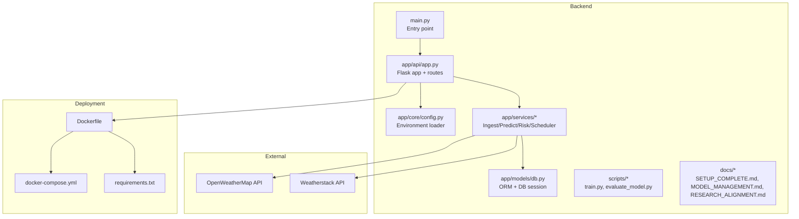
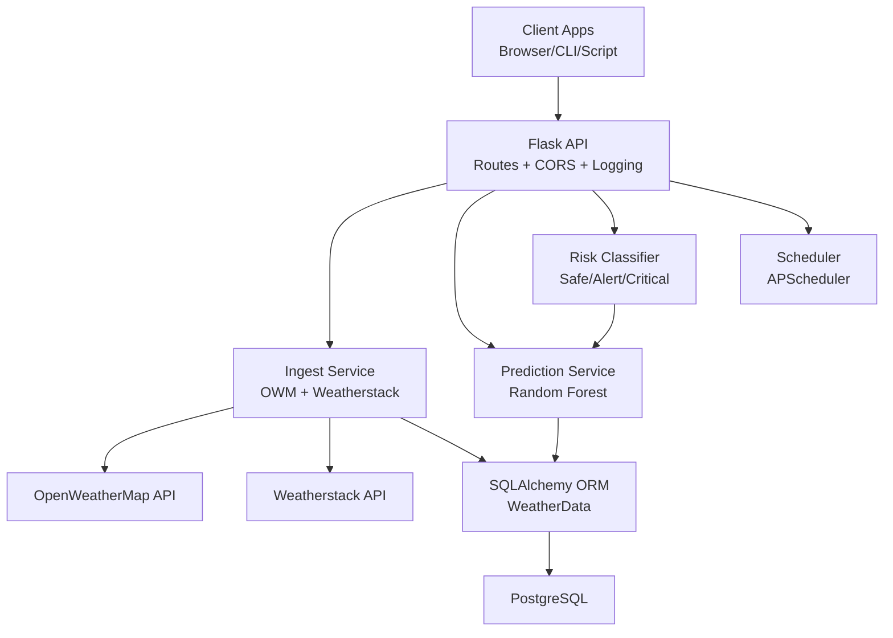
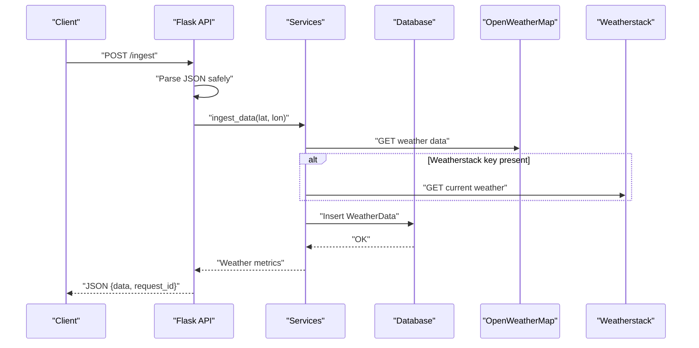
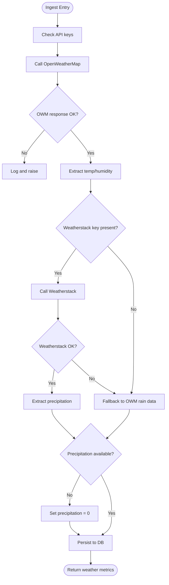
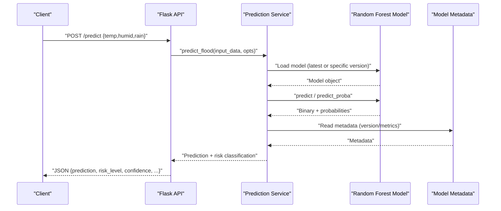
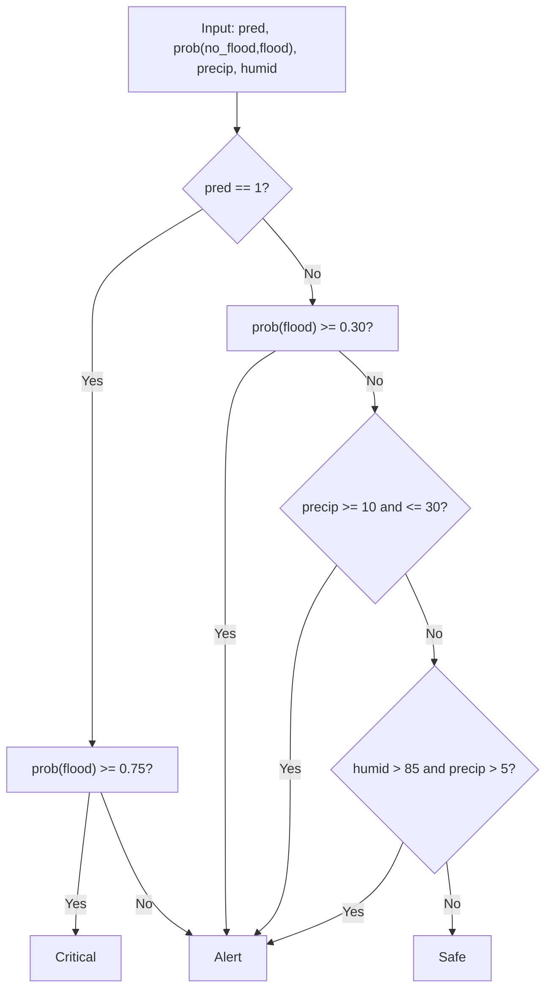
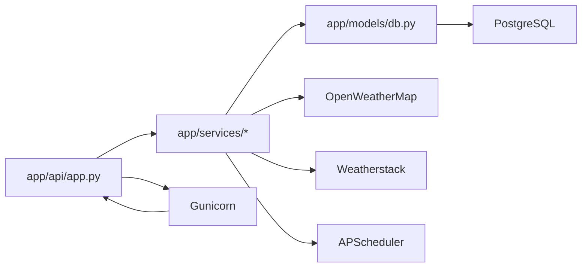

# Project Overview

<cite>
**Referenced Files in This Document**
- [README.md](file://backend/README.md)
- [main.py](file://backend/main.py)
- [app.py](file://backend/app/api/app.py)
- [config.py](file://backend/app/core/config.py)
- [ingest.py](file://backend/app/services/ingest.py)
- [predict.py](file://backend/app/services/predict.py)
- [risk_classifier.py](file://backend/app/services/risk_classifier.py)
- [scheduler.py](file://backend/app/services/scheduler.py)
- [db.py](file://backend/app/models/db.py)
- [Dockerfile](file://backend/Dockerfile)
- [docker-compose.yml](file://docker-compose.yml)
- [requirements.txt](file://backend/requirements.txt)
- [train.py](file://backend/scripts/train.py)
- [evaluate_model.py](file://backend/scripts/evaluate_model.py)
- [SETUP_COMPLETE.md](file://backend/docs/SETUP_COMPLETE.md)
- [MODEL_MANAGEMENT.md](file://backend/docs/MODEL_MANAGEMENT.md)
- [RESEARCH_ALIGNMENT.md](file://backend/docs/RESEARCH_ALIGNMENT.md)
</cite>

## Table of Contents
1. [Introduction](#introduction)
2. [Project Structure](#project-structure)
3. [Core Components](#core-components)
4. [Architecture Overview](#architecture-overview)
5. [Detailed Component Analysis](#detailed-component-analysis)
6. [Dependency Analysis](#dependency-analysis)
7. [Performance Considerations](#performance-considerations)
8. [Troubleshooting Guide](#troubleshooting-guide)
9. [Conclusion](#conclusion)
10. [Appendices](#appendices)

## Introduction
Flooding Naque is a commercial-grade flood prediction system tailored for Parañaque City. It combines machine learning with real-time weather data to deliver actionable insights and a three-level risk classification (Safe, Alert, Critical). The backend is built with Flask, integrates OpenWeatherMap and Weatherstack APIs, and exposes a REST API for ingestion, prediction, and model management. It supports automated scheduling, robust error handling, CORS-enabled responses, and production-ready deployment via Docker and Gunicorn.

## Project Structure
The backend is organized into clear layers:
- API layer: Flask routes and request lifecycle management
- Services layer: Business logic for ingestion, prediction, risk classification, and scheduling
- Data layer: SQLAlchemy ORM models and database session management
- Scripts: Training, evaluation, and inspection utilities
- Docs: Research alignment, model management, and setup guides
- Root configs: Dockerfile, docker-compose, requirements, and environment

**Diagram sources**
- [main.py](file://backend/main.py#L1-L25)
- [app.py](file://backend/app/api/app.py#L1-L120)
- [config.py](file://backend/app/core/config.py#L1-L10)
- [ingest.py](file://backend/app/services/ingest.py#L1-L111)
- [predict.py](file://backend/app/services/predict.py#L1-L120)
- [risk_classifier.py](file://backend/app/services/risk_classifier.py#L1-L60)
- [scheduler.py](file://backend/app/services/scheduler.py#L1-L15)
- [db.py](file://backend/app/models/db.py#L1-L37)
- [Dockerfile](file://backend/Dockerfile#L1-L37)
- [docker-compose.yml](file://docker-compose.yml#L1-L35)
- [requirements.txt](file://backend/requirements.txt#L1-L15)

**Section sources**
- [README.md](file://backend/README.md#L1-L155)
- [SETUP_COMPLETE.md](file://backend/docs/SETUP_COMPLETE.md#L1-L179)
- [MODEL_MANAGEMENT.md](file://backend/docs/MODEL_MANAGEMENT.md#L1-L120)

## Core Components
- Flask API with CORS, request ID tracking, and health endpoints
- Weather data ingestion from OpenWeatherMap and Weatherstack with fallback logic
- Machine learning flood prediction using a Random Forest model with versioning
- Three-level risk classification (Safe, Alert, Critical) with confidence and color coding
- Automated hourly ingestion via APScheduler
- SQLAlchemy ORM with scoped sessions and context-managed transactions
- Production deployment via Docker and Gunicorn

**Section sources**
- [app.py](file://backend/app/api/app.py#L1-L120)
- [ingest.py](file://backend/app/services/ingest.py#L1-L111)
- [predict.py](file://backend/app/services/predict.py#L1-L120)
- [risk_classifier.py](file://backend/app/services/risk_classifier.py#L1-L120)
- [scheduler.py](file://backend/app/services/scheduler.py#L1-L15)
- [db.py](file://backend/app/models/db.py#L1-L37)
- [Dockerfile](file://backend/Dockerfile#L1-L37)
- [requirements.txt](file://backend/requirements.txt#L1-L15)

## Architecture Overview
The system follows a layered architecture:
- API Layer: Routes handle requests, parse JSON safely, enforce validation, and orchestrate service calls. It also manages request IDs and logging.
- Service Layer: Encapsulates business logic for ingestion, prediction, risk classification, and scheduling. Services depend on the data layer for persistence and on external APIs for weather data.
- Data Layer: Provides ORM models and session management for storing weather observations.
- External Integrations: OpenWeatherMap and Weatherstack APIs supply real-time weather metrics.
- Deployment: Docker images run the Flask app behind Gunicorn, with PostgreSQL for persistent storage.

**Diagram sources**
- [app.py](file://backend/app/api/app.py#L1-L200)
- [ingest.py](file://backend/app/services/ingest.py#L1-L111)
- [predict.py](file://backend/app/services/predict.py#L1-L120)
- [risk_classifier.py](file://backend/app/services/risk_classifier.py#L1-L120)
- [scheduler.py](file://backend/app/services/scheduler.py#L1-L15)
- [db.py](file://backend/app/models/db.py#L1-L37)

## Detailed Component Analysis

### API Layer
- Responsibilities:
  - Define REST endpoints for status, health, ingestion, prediction, historical data, model listing, and API docs
  - Enforce CORS and request ID tracking
  - Centralize JSON parsing with robust error handling
  - Initialize environment, database, and scheduler on startup
- Key behaviors:
  - Before-request hook adds request IDs and logs method/path
  - Scheduler starts automatically and runs hourly ingestion jobs
  - Endpoints return consistent JSON with success/error envelopes and request IDs

**Diagram sources**
- [app.py](file://backend/app/api/app.py#L141-L223)
- [ingest.py](file://backend/app/services/ingest.py#L1-L111)
- [db.py](file://backend/app/models/db.py#L1-L37)

**Section sources**
- [app.py](file://backend/app/api/app.py#L1-L223)
- [SETUP_COMPLETE.md](file://backend/docs/SETUP_COMPLETE.md#L36-L115)

### Weather Data Ingestion
- Integrates OpenWeatherMap and Weatherstack APIs
- Falls back to OpenWeatherMap rain data if Weatherstack does not provide precipitation
- Validates API keys and handles timeouts and parsing errors
- Persists observations to the database with timestamps

**Diagram sources**
- [ingest.py](file://backend/app/services/ingest.py#L1-L111)

**Section sources**
- [ingest.py](file://backend/app/services/ingest.py#L1-L111)

### Machine Learning Prediction and Model Versioning
- Loads models lazily and supports multiple versions
- Supports returning prediction probabilities and risk classification
- Provides endpoints to list available models and get current model info
- Training script auto-generates metadata and saves latest and versioned models

**Diagram sources**
- [predict.py](file://backend/app/services/predict.py#L1-L236)
- [train.py](file://backend/scripts/train.py#L1-L120)
- [MODEL_MANAGEMENT.md](file://backend/docs/MODEL_MANAGEMENT.md#L1-L120)

**Section sources**
- [predict.py](file://backend/app/services/predict.py#L1-L236)
- [train.py](file://backend/scripts/train.py#L1-L120)
- [MODEL_MANAGEMENT.md](file://backend/docs/MODEL_MANAGEMENT.md#L1-L120)

### Risk Classification (Safe/Alert/Critical)
- Converts binary predictions and probabilities into three-level risk
- Uses thresholds for probability and environmental cues (precipitation/humidity)
- Returns risk label, color, description, and confidence

**Diagram sources**
- [risk_classifier.py](file://backend/app/services/risk_classifier.py#L1-L120)

**Section sources**
- [risk_classifier.py](file://backend/app/services/risk_classifier.py#L1-L170)

### Automated Scheduling
- Starts a background scheduler that triggers ingestion every hour
- Runs in-process and logs errors without crashing the API

**Section sources**
- [scheduler.py](file://backend/app/services/scheduler.py#L1-L15)

### Data Layer and Database
- SQLAlchemy declarative model for weather observations
- Scoped sessions with context-managed transactions
- Initialization creates tables on startup

**Section sources**
- [db.py](file://backend/app/models/db.py#L1-L37)

### Deployment and Environment
- Dockerfile builds a production image with Gunicorn
- docker-compose defines backend and database services
- Requirements pin Flask, scikit-learn, APScheduler, SQLAlchemy, and others
- Environment variables configure database, API keys, and runtime

**Section sources**
- [Dockerfile](file://backend/Dockerfile#L1-L37)
- [docker-compose.yml](file://docker-compose.yml#L1-L35)
- [requirements.txt](file://backend/requirements.txt#L1-L15)
- [README.md](file://backend/README.md#L13-L43)

## Dependency Analysis
- API depends on services for business logic and on models for persistence
- Services depend on external APIs and the database
- Predict service depends on trained models and metadata
- Scheduler depends on ingest service
- Docker composes backend and database containers

**Diagram sources**
- [app.py](file://backend/app/api/app.py#L1-L120)
- [ingest.py](file://backend/app/services/ingest.py#L1-L111)
- [predict.py](file://backend/app/services/predict.py#L1-L120)
- [scheduler.py](file://backend/app/services/scheduler.py#L1-L15)
- [db.py](file://backend/app/models/db.py#L1-L37)
- [Dockerfile](file://backend/Dockerfile#L1-L37)

**Section sources**
- [app.py](file://backend/app/api/app.py#L1-L120)
- [requirements.txt](file://backend/requirements.txt#L1-L15)

## Performance Considerations
- Lazy model loading reduces cold-start latency for prediction endpoints
- JSON parsing includes safeguards for malformed payloads
- Database sessions are scoped and context-managed to prevent leaks
- External API calls use timeouts to avoid blocking
- Production deployments use Gunicorn workers and threads for concurrency

[No sources needed since this section provides general guidance]

## Troubleshooting Guide
Common issues and resolutions:
- Missing API keys: Ensure OWM_API_KEY is set; Weatherstack key is optional but improves precipitation data
- Model not found: Train a model using the training script and verify model files exist
- JSON parsing errors: The API includes robust parsing helpers; verify request bodies and content types
- Database connectivity: Confirm DATABASE_URL and that PostgreSQL is reachable via docker-compose
- Scheduler errors: Check logs for ingestion failures; the scheduler continues running despite individual job errors

**Section sources**
- [SETUP_COMPLETE.md](file://backend/docs/SETUP_COMPLETE.md#L115-L179)
- [README.md](file://backend/README.md#L13-L43)
- [ingest.py](file://backend/app/services/ingest.py#L1-L111)
- [predict.py](file://backend/app/services/predict.py#L1-L120)

## Conclusion
Flooding Naque delivers a production-ready, research-aligned flood prediction system for Parañaque City. Its layered architecture cleanly separates API, services, and data concerns, while integrating real-time weather data and machine learning. The three-level risk classification, automated scheduling, and model versioning enable reliable operation and continuous improvement. Developers can deploy the system using Docker and interact with it through intuitive REST endpoints, while city planners can leverage the risk insights for preparedness and response.

[No sources needed since this section summarizes without analyzing specific files]

## Appendices

### Practical Use Cases
- City Planners:
  - Monitor real-time risk levels via API endpoints
  - Integrate risk classifications into dashboards and emergency systems
  - Use historical data to assess trends and validate model performance
- Developers:
  - Extend ingestion to additional weather providers
  - Add alert delivery channels (SMS/email) using the alert message formatter
  - Implement model retraining pipelines and A/B testing of versions
- Researchers:
  - Use evaluation scripts and metadata to compare model versions
  - Align thresholds with local flood characteristics and community needs

**Section sources**
- [RESEARCH_ALIGNMENT.md](file://backend/docs/RESEARCH_ALIGNMENT.md#L140-L217)
- [MODEL_MANAGEMENT.md](file://backend/docs/MODEL_MANAGEMENT.md#L334-L482)

### API Endpoints Overview
- GET /status: Basic health and model availability
- GET /health: Detailed system status including scheduler and model metadata
- POST /ingest: Ingest weather data from OpenWeatherMap and Weatherstack
- GET /data: Retrieve historical weather data with pagination and date filters
- POST /predict: Predict flood risk with optional probabilities and 3-level risk classification
- GET /api/models: List available model versions and current version
- GET /api/docs: Full API documentation

**Section sources**
- [README.md](file://backend/README.md#L44-L115)
- [app.py](file://backend/app/api/app.py#L406-L536)