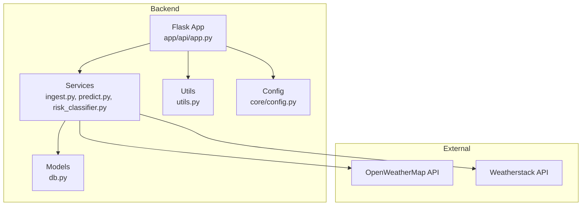
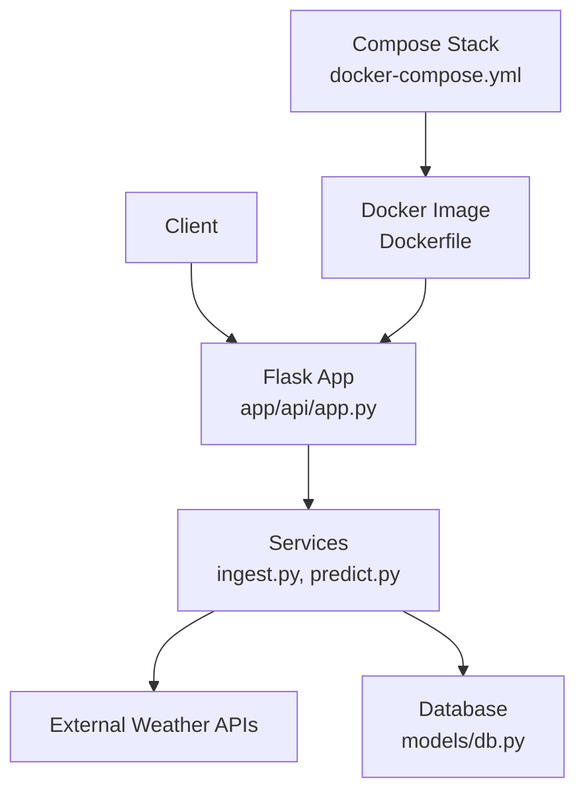
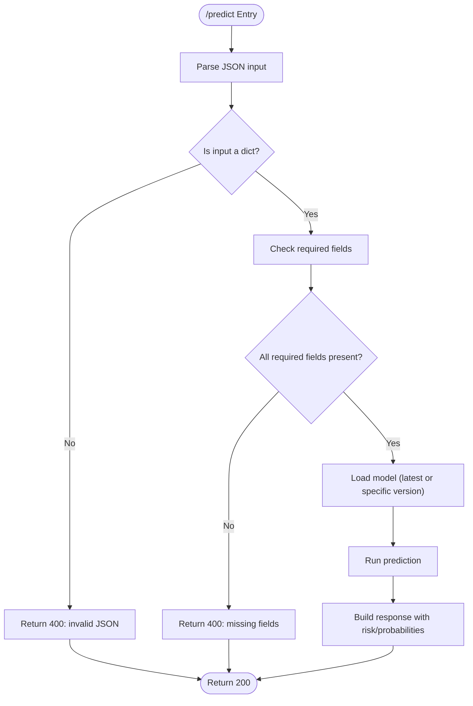
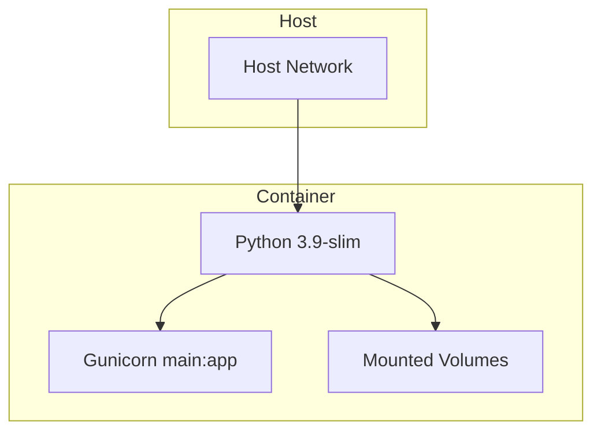
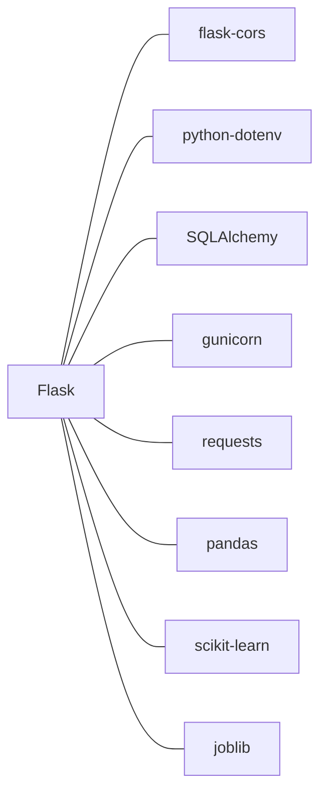

# Security Considerations

<cite>
**Referenced Files in This Document**
- [backend/.env.example](file://backend/.env.example)
- [backend/app/core/config.py](file://backend/app/core/config.py)
- [backend/app/api/app.py](file://backend/app/api/app.py)
- [backend/app/services/ingest.py](file://backend/app/services/ingest.py)
- [backend/app/services/predict.py](file://backend/app/services/predict.py)
- [backend/app/utils/utils.py](file://backend/app/utils/utils.py)
- [backend/app/models/db.py](file://backend/app/models/db.py)
- [backend/Dockerfile](file://backend/Dockerfile)
- [docker-compose.yml](file://docker-compose.yml)
- [backend/README.md](file://backend/README.md)
- [backend/requirements.txt](file://backend/requirements.txt)
</cite>

## Table of Contents
1. [Introduction](#introduction)
2. [Project Structure](#project-structure)
3. [Core Components](#core-components)
4. [Architecture Overview](#architecture-overview)
5. [Detailed Component Analysis](#detailed-component-analysis)
6. [Dependency Analysis](#dependency-analysis)
7. [Performance Considerations](#performance-considerations)
8. [Troubleshooting Guide](#troubleshooting-guide)
9. [Conclusion](#conclusion)

## Introduction
This section focuses on security aspects of the floodingnaque application. It covers API security posture, environment variable handling, input validation for key endpoints, containerized deployment security, data privacy considerations, and recommendations for HTTPS enforcement, CORS policy tightening, security headers, and protection against abuse for ML model endpoints.

## Project Structure
The backend is a Flask application with a clear separation of concerns:
- API layer: route definitions and request lifecycle
- Services: business logic for ingestion, prediction, and risk classification
- Models: database ORM and connection management
- Utils: logging and validation helpers
- Deployment: Docker image and compose configuration

**Diagram sources**
- [backend/app/api/app.py](file://backend/app/api/app.py#L1-L120)
- [backend/app/services/ingest.py](file://backend/app/services/ingest.py#L1-L111)
- [backend/app/services/predict.py](file://backend/app/services/predict.py#L1-L120)
- [backend/app/models/db.py](file://backend/app/models/db.py#L1-L37)
- [backend/app/utils/utils.py](file://backend/app/utils/utils.py#L1-L48)
- [backend/app/core/config.py](file://backend/app/core/config.py#L1-L10)

**Section sources**
- [backend/README.md](file://backend/README.md#L120-L177)
- [backend/app/api/app.py](file://backend/app/api/app.py#L1-L120)

## Core Components
- API layer exposes endpoints for ingestion, prediction, health checks, and data retrieval. It enables CORS for frontend integration and logs request IDs for traceability.
- Services encapsulate ingestion from external weather APIs and ML-based prediction logic, including model loading and risk classification.
- Models define the database schema and manage sessions safely.
- Utils provide logging and coordinate validation for coordinates.
- Config loads environment variables from a .env file.

Security-relevant observations:
- Authentication: No authentication middleware is present in the API layer.
- CORS: Enabled globally, which is convenient for frontend integration but requires policy tightening in production.
- Environment variables: API keys and database URLs are read from environment variables; however, the current example does not include a dedicated API key for client authentication.
- Input validation: Coordinates are validated; JSON parsing includes robust fallbacks and error handling.

**Section sources**
- [backend/app/api/app.py](file://backend/app/api/app.py#L1-L120)
- [backend/app/services/ingest.py](file://backend/app/services/ingest.py#L1-L111)
- [backend/app/services/predict.py](file://backend/app/services/predict.py#L1-L120)
- [backend/app/utils/utils.py](file://backend/app/utils/utils.py#L1-L48)
- [backend/app/core/config.py](file://backend/app/core/config.py#L1-L10)
- [backend/.env.example](file://backend/.env.example#L1-L4)

## Architecture Overview
The runtime architecture integrates the Flask app with external weather APIs and a local database. The Dockerfile runs the app behind Gunicorn with a non-root user and exposes a single port.

**Diagram sources**
- [backend/app/api/app.py](file://backend/app/api/app.py#L1-L120)
- [backend/app/services/ingest.py](file://backend/app/services/ingest.py#L1-L111)
- [backend/app/models/db.py](file://backend/app/models/db.py#L1-L37)
- [backend/Dockerfile](file://backend/Dockerfile#L1-L37)
- [docker-compose.yml](file://docker-compose.yml#L1-L35)

## Detailed Component Analysis

### API Security Posture
- Authentication: The API layer does not implement authentication. Any caller can invoke endpoints such as /ingest and /predict.
- CORS: CORS is enabled globally, enabling cross-origin requests from browsers. In production, restrict origins and methods.
- Request tracing: Request IDs are attached to each request for correlation and debugging.

Recommendations:
- Implement API key-based authentication or JWT-based authentication for protected endpoints.
- Enforce HTTPS in production deployments.
- Add security headers (e.g., Content-Security-Policy, X-Content-Type-Options, X-Frame-Options, Referrer-Policy).
- Tighten CORS policy to specific origins and methods.

**Section sources**
- [backend/app/api/app.py](file://backend/app/api/app.py#L1-L120)
- [backend/README.md](file://backend/README.md#L90-L110)

### Environment Variables and Secrets Management
- The example environment file defines provider API keys and a database URL.
- The configuration loader is present but not invoked automatically by the API module.
- The Docker Compose file mounts a .env file via env_file and sets sensitive environment variables.

Security considerations:
- Ensure secrets are managed securely (avoid committing secrets to version control).
- Use a secrets manager or encrypted vault in production.
- Restrict filesystem permissions for .env and model files.
- Validate presence of required environment variables at startup.

**Section sources**
- [backend/.env.example](file://backend/.env.example#L1-L4)
- [backend/app/core/config.py](file://backend/app/core/config.py#L1-L10)
- [docker-compose.yml](file://docker-compose.yml#L18-L20)

### Input Validation for /ingest and /predict
- /ingest validates coordinates when provided and parses JSON with multiple fallbacks to handle malformed inputs.
- /predict validates that input_data is a dictionary and contains required fields; it also handles model version selection and optional query parameters.

Recommendations:
- Add stricter input validation for numeric fields (e.g., bounds for temperature, humidity, precipitation).
- Sanitize and normalize inputs to prevent injection-like issues.
- Consider adding rate limiting and abuse prevention mechanisms.
- For /predict, validate and constrain model_version to known values.

**Diagram sources**
- [backend/app/api/app.py](file://backend/app/api/app.py#L224-L305)
- [backend/app/services/predict.py](file://backend/app/services/predict.py#L112-L216)

**Section sources**
- [backend/app/api/app.py](file://backend/app/api/app.py#L141-L223)
- [backend/app/api/app.py](file://backend/app/api/app.py#L224-L305)
- [backend/app/services/predict.py](file://backend/app/services/predict.py#L112-L216)
- [backend/app/utils/utils.py](file://backend/app/utils/utils.py#L39-L48)

### Docker Deployment Security
- The Dockerfile uses a slim base image, sets non-root user, and runs Gunicorn.
- Ports are exposed; the compose file publishes port 5000 and mounts volumes for code and models.

Security recommendations:
- Use network isolation (bridge networks, restricted access).
- Minimize image attack surface by pinning dependency versions and scanning images.
- Run as a non-root user (already done).
- Limit mounted volumes to only what is necessary.
- Add resource limits and timeouts.
- Consider healthchecks and restart policies.

**Diagram sources**
- [backend/Dockerfile](file://backend/Dockerfile#L1-L37)
- [docker-compose.yml](file://docker-compose.yml#L1-L35)

**Section sources**
- [backend/Dockerfile](file://backend/Dockerfile#L1-L37)
- [docker-compose.yml](file://docker-compose.yml#L1-L35)

### Data Privacy Considerations for Weather Data
- The application stores weather metrics and timestamps in a database.
- Data is exposed via a GET endpoint with pagination and date filtering.

Recommendations:
- Apply data minimization: collect only necessary data.
- Add retention policies and anonymization where applicable.
- Encrypt data at rest and in transit.
- Audit access to the /data endpoint and restrict it to authorized clients.

**Section sources**
- [backend/app/api/app.py](file://backend/app/api/app.py#L341-L405)
- [backend/app/models/db.py](file://backend/app/models/db.py#L1-L37)

### Recommendations for HTTPS, CORS, and Security Headers
- HTTPS: Enforce TLS termination at the edge (reverse proxy or platform) and redirect HTTP to HTTPS.
- CORS: Configure allowed origins, methods, and headers explicitly; disable wildcard origins in production.
- Security headers: Add CSP, X-Content-Type-Options, X-Frame-Options, Referrer-Policy, and Strict-Transport-Security.

[No sources needed since this section provides general guidance]

### Recommendations for Rate Limiting and Abuse Prevention
- Implement rate limiting per IP or API key for /ingest and /predict endpoints.
- Add request size limits and timeouts.
- Introduce circuit breakers for external API calls.
- Consider CAPTCHA or challenge-response for high-risk scenarios.

[No sources needed since this section provides general guidance]

## Dependency Analysis
External libraries relevant to security:
- Flask-CORS: Enables cross-origin requests; should be configured carefully.
- python-dotenv: Loads environment variables from .env.
- SQLAlchemy: Database ORM; ensure secure connection strings and migrations.
- gunicorn: WSGI server; tune workers and threads for production.

**Diagram sources**
- [backend/requirements.txt](file://backend/requirements.txt#L1-L15)

**Section sources**
- [backend/requirements.txt](file://backend/requirements.txt#L1-L15)

## Performance Considerations
- Gunicorn worker and thread configuration impacts throughput and latency.
- External API calls introduce latency; consider caching and retries with backoff.
- Database queries should be paginated and indexed appropriately.

[No sources needed since this section provides general guidance]

## Troubleshooting Guide
Common security-related issues and mitigations:
- Missing or misconfigured environment variables: Ensure required keys are present and loaded early.
- CORS misconfiguration: Validate allowed origins and methods.
- Unauthenticated endpoints: Add authentication and authorization layers.
- Excessive exposure of internal details: Avoid verbose error messages in production; mask stack traces.

**Section sources**
- [backend/app/api/app.py](file://backend/app/api/app.py#L1-L120)
- [backend/app/services/ingest.py](file://backend/app/services/ingest.py#L1-L111)
- [backend/app/services/predict.py](file://backend/app/services/predict.py#L1-L120)

## Conclusion
The floodingnaque application currently lacks authentication and hardened CORS/security headers. While it includes basic input validation and environment variable handling, production readiness requires explicit authentication, HTTPS enforcement, CORS policy tightening, security headers, and robust rate limiting. Container hardening and data privacy controls should also be prioritized to protect sensitive operational and environmental data.