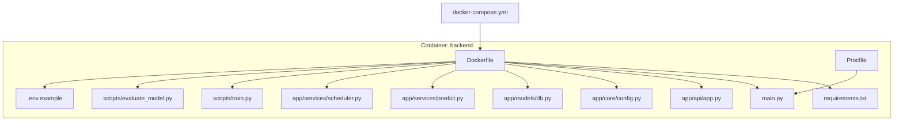
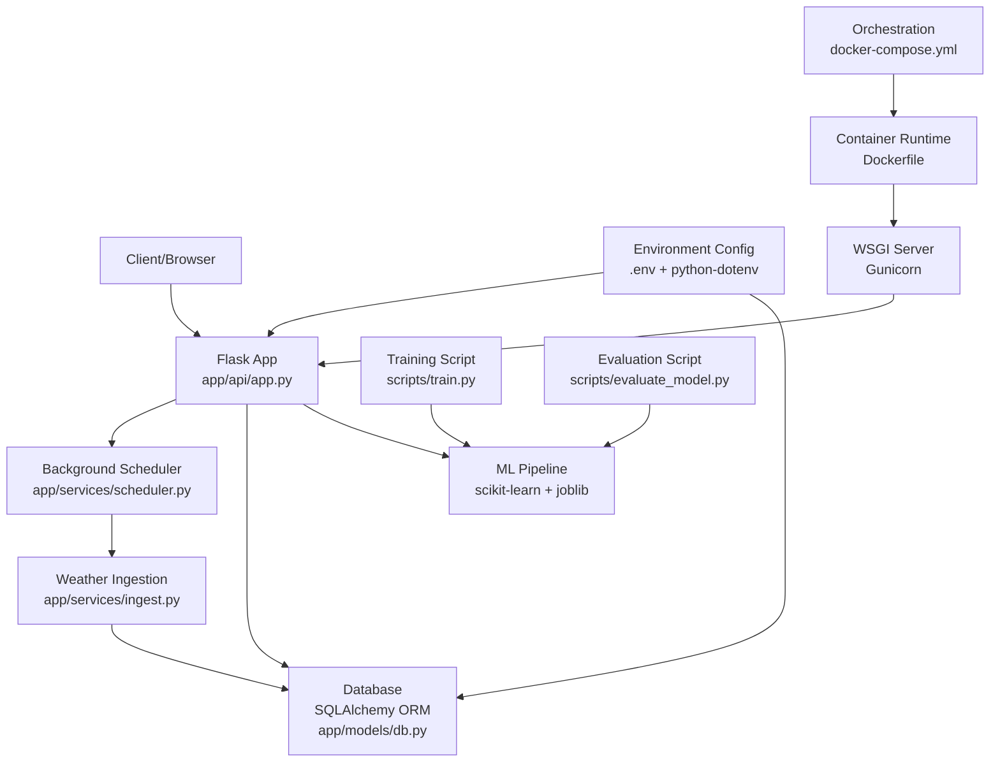
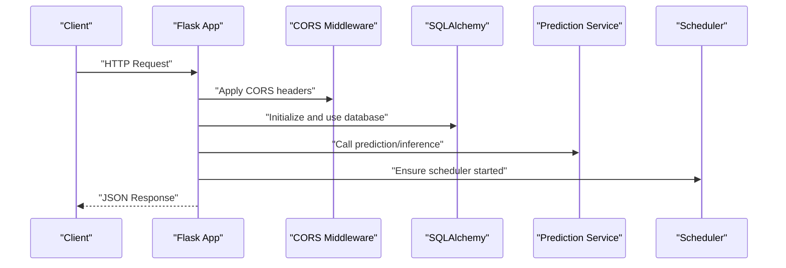
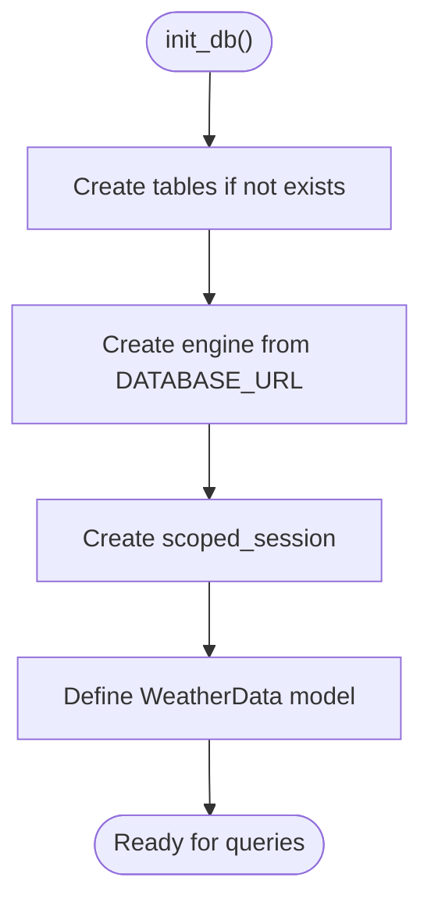
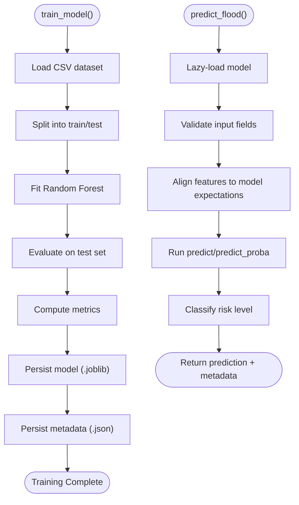
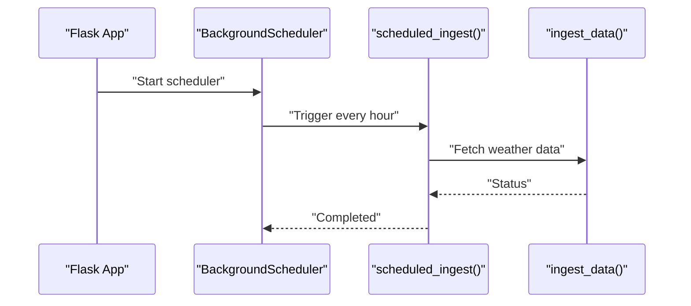
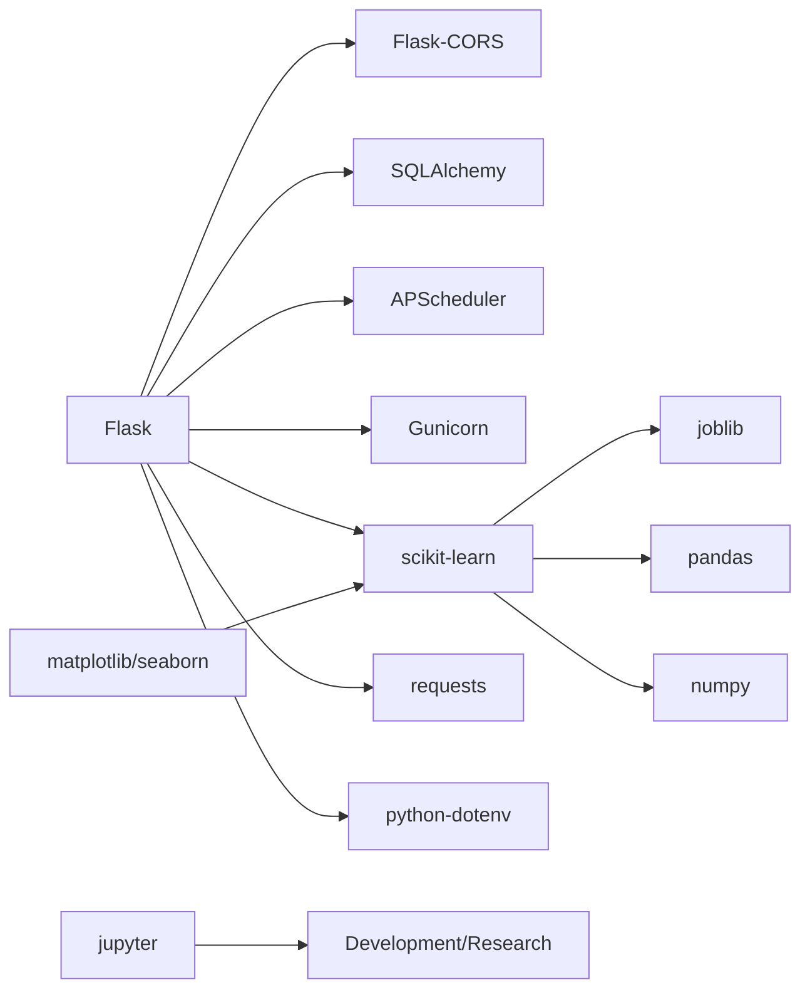

# Technology Stack & Dependencies

<cite>
**Referenced Files in This Document**
- [requirements.txt](file://backend/requirements.txt)
- [Dockerfile](file://backend/Dockerfile)
- [docker-compose.yml](file://docker-compose.yml)
- [main.py](file://backend/main.py)
- [Procfile](file://backend/Procfile)
- [backend/README.md](file://backend/README.md)
- [.env.example](file://backend/.env.example)
- [app/api/app.py](file://backend/app/api/app.py)
- [app/core/config.py](file://backend/app/core/config.py)
- [app/models/db.py](file://backend/app/models/db.py)
- [app/services/predict.py](file://backend/app/services/predict.py)
- [app/services/scheduler.py](file://backend/app/services/scheduler.py)
- [scripts/train.py](file://backend/scripts/train.py)
- [scripts/evaluate_model.py](file://backend/scripts/evaluate_model.py)
</cite>

## Table of Contents
1. [Introduction](#introduction)
2. [Project Structure](#project-structure)
3. [Core Components](#core-components)
4. [Architecture Overview](#architecture-overview)
5. [Detailed Component Analysis](#detailed-component-analysis)
6. [Dependency Analysis](#dependency-analysis)
7. [Performance Considerations](#performance-considerations)
8. [Troubleshooting Guide](#troubleshooting-guide)
9. [Conclusion](#conclusion)
10. [Appendices](#appendices)

## Introduction
This section documents the technology stack powering the floodingnaque application. It explains each dependency listed in requirements.txt, how they integrate into the Flask web service, SQLAlchemy ORM, scikit-learn machine learning pipeline, APScheduler background tasks, and Flask-CORS cross-origin support. It also covers Python version compatibility, optional packages for model evaluation, virtual environment setup, version pinning, and containerized deployment with Docker and docker-compose.yml.

## Project Structure
The backend is organized around a Flask application with modular services, a database layer, and scripts for training and evaluating models. The containerization strategy uses a Python 3.9 slim base image, installs system and Python dependencies, and runs the app with Gunicorn in production.

**Diagram sources**
- [Dockerfile](file://backend/Dockerfile#L1-L37)
- [requirements.txt](file://backend/requirements.txt#L1-L15)
- [docker-compose.yml](file://docker-compose.yml#L1-L35)
- [main.py](file://backend/main.py#L1-L25)
- [Procfile](file://backend/Procfile#L1-L2)
- [app/api/app.py](file://backend/app/api/app.py#L1-L120)
- [app/core/config.py](file://backend/app/core/config.py#L1-L10)
- [app/models/db.py](file://backend/app/models/db.py#L1-L37)
- [app/services/predict.py](file://backend/app/services/predict.py#L1-L120)
- [app/services/scheduler.py](file://backend/app/services/scheduler.py#L1-L15)
- [scripts/train.py](file://backend/scripts/train.py#L1-L120)
- [scripts/evaluate_model.py](file://backend/scripts/evaluate_model.py#L1-L56)
- [.env.example](file://backend/.env.example#L1-L4)

**Section sources**
- [backend/README.md](file://backend/README.md#L1-L191)
- [docker-compose.yml](file://docker-compose.yml#L1-L35)
- [Dockerfile](file://backend/Dockerfile#L1-L37)

## Core Components
This section details each dependency and its role in the system architecture.

- Flask
  - Role: Web framework that defines routes, middleware, and WSGI application entry point.
  - Usage: The Flask app is created in the API module and exposed via the WSGI callable for Gunicorn.
  - Integration: CORS is enabled globally; environment variables control host, port, and debug mode.
  - References:
    - [app/api/app.py](file://backend/app/api/app.py#L1-L120)
    - [main.py](file://backend/main.py#L1-L25)
    - [Procfile](file://backend/Procfile#L1-L2)

- Flask-CORS
  - Role: Enables cross-origin resource sharing so the API can be consumed by a frontend hosted on a different origin.
  - Usage: Applied to the Flask app to allow browser-based clients to call endpoints.
  - References:
    - [app/api/app.py](file://backend/app/api/app.py#L1-L120)

- SQLAlchemy
  - Role: ORM and database connectivity for storing weather observations.
  - Usage: Declarative base, engine creation, session management, and a WeatherData model are defined.
  - References:
    - [app/models/db.py](file://backend/app/models/db.py#L1-L37)

- scikit-learn
  - Role: Machine learning library used during training and inference for flood prediction.
  - Usage: Training script builds a Random Forest model; prediction service loads the model and performs inference.
  - References:
    - [scripts/train.py](file://backend/scripts/train.py#L1-L120)
    - [app/services/predict.py](file://backend/app/services/predict.py#L1-L120)

- joblib
  - Role: Efficient serialization/deserialization of trained scikit-learn models.
  - Usage: Models and metadata are persisted and loaded using joblib.
  - References:
    - [app/services/predict.py](file://backend/app/services/predict.py#L1-L120)
    - [scripts/train.py](file://backend/scripts/train.py#L1-L120)

- APScheduler
  - Role: Schedules periodic background tasks (e.g., weather data ingestion).
  - Usage: A background scheduler is initialized and a job runs hourly.
  - References:
    - [app/services/scheduler.py](file://backend/app/services/scheduler.py#L1-L15)

- python-dotenv
  - Role: Loads environment variables from a .env file.
  - Usage: Configuration loader is used to populate runtime environment variables.
  - References:
    - [app/core/config.py](file://backend/app/core/config.py#L1-L10)
    - [.env.example](file://backend/.env.example#L1-L4)

- gunicorn
  - Role: WSGI HTTP server for production deployments.
  - Usage: Used in Procfile and Docker CMD to serve the Flask app with multiple workers and threads.
  - References:
    - [Procfile](file://backend/Procfile#L1-L2)
    - [Dockerfile](file://backend/Dockerfile#L1-L37)

- requests
  - Role: HTTP client for fetching weather data from external APIs.
  - Usage: The ingestion service uses requests to call external endpoints.
  - References:
    - [app/services/ingest.py](file://backend/app/services/ingest.py#L1-L200)

- pandas and numpy
  - Role: Data manipulation and numerical computing for training and inference.
  - Usage: Training script uses pandas/numpy; prediction service converts input dicts to DataFrames.
  - References:
    - [scripts/train.py](file://backend/scripts/train.py#L1-L120)
    - [app/services/predict.py](file://backend/app/services/predict.py#L1-L120)

- matplotlib and seaborn
  - Role: Visualization for model evaluation reports and plots.
  - Usage: Evaluation script generates confusion matrices and feature importance plots.
  - References:
    - [scripts/evaluate_model.py](file://backend/scripts/evaluate_model.py#L1-L56)

- jupyter
  - Role: Notebook environment for interactive experimentation and model development.
  - Usage: Included as an optional dependency for research and prototyping.
  - References:
    - [requirements.txt](file://backend/requirements.txt#L1-L15)

**Section sources**
- [requirements.txt](file://backend/requirements.txt#L1-L15)
- [app/api/app.py](file://backend/app/api/app.py#L1-L120)
- [app/core/config.py](file://backend/app/core/config.py#L1-L10)
- [app/models/db.py](file://backend/app/models/db.py#L1-L37)
- [app/services/predict.py](file://backend/app/services/predict.py#L1-L120)
- [app/services/scheduler.py](file://backend/app/services/scheduler.py#L1-L15)
- [scripts/train.py](file://backend/scripts/train.py#L1-L120)
- [scripts/evaluate_model.py](file://backend/scripts/evaluate_model.py#L1-L56)
- [Procfile](file://backend/Procfile#L1-L2)
- [Dockerfile](file://backend/Dockerfile#L1-L37)
- [.env.example](file://backend/.env.example#L1-L4)

## Architecture Overview
The system architecture centers on a Flask application that exposes REST endpoints, integrates with a database via SQLAlchemy, and uses scikit-learn models for predictions. Background tasks are scheduled with APScheduler, and CORS is enabled for frontend integration. Containerization is achieved with Docker and orchestrated by docker-compose.

**Diagram sources**
- [app/api/app.py](file://backend/app/api/app.py#L1-L120)
- [app/services/scheduler.py](file://backend/app/services/scheduler.py#L1-L15)
- [app/services/ingest.py](file://backend/app/services/ingest.py#L1-L200)
- [app/models/db.py](file://backend/app/models/db.py#L1-L37)
- [app/services/predict.py](file://backend/app/services/predict.py#L1-L120)
- [scripts/train.py](file://backend/scripts/train.py#L1-L120)
- [scripts/evaluate_model.py](file://backend/scripts/evaluate_model.py#L1-L56)
- [app/core/config.py](file://backend/app/core/config.py#L1-L10)
- [Procfile](file://backend/Procfile#L1-L2)
- [Dockerfile](file://backend/Dockerfile#L1-L37)
- [docker-compose.yml](file://docker-compose.yml#L1-L35)

## Detailed Component Analysis

### Flask and CORS
- Flask creates the WSGI application and registers routes for status, ingestion, prediction, data retrieval, and documentation.
- CORS is enabled globally to support cross-origin requests from a frontend.
- Environment variables control host, port, and debug mode; the app initializes database and logging before serving.

**Diagram sources**
- [app/api/app.py](file://backend/app/api/app.py#L1-L120)
- [app/models/db.py](file://backend/app/models/db.py#L1-L37)
- [app/services/predict.py](file://backend/app/services/predict.py#L1-L120)
- [app/services/scheduler.py](file://backend/app/services/scheduler.py#L1-L15)

**Section sources**
- [app/api/app.py](file://backend/app/api/app.py#L1-L120)
- [app/core/config.py](file://backend/app/core/config.py#L1-L10)
- [main.py](file://backend/main.py#L1-L25)

### SQLAlchemy ORM
- Defines a declarative base and a WeatherData table model.
- Creates an engine from DATABASE_URL and manages sessions with scoped_session for thread safety.
- Provides a context manager for database sessions to ensure commit/rollback and cleanup.

**Diagram sources**
- [app/models/db.py](file://backend/app/models/db.py#L1-L37)

**Section sources**
- [app/models/db.py](file://backend/app/models/db.py#L1-L37)

### Machine Learning Pipeline (scikit-learn + joblib)
- Training script loads data, trains a Random Forest classifier, evaluates metrics, and persists the model and metadata.
- Prediction service lazily loads the model, validates input, ensures feature alignment, and returns binary predictions with optional probabilities and 3-level risk classification.

**Diagram sources**
- [scripts/train.py](file://backend/scripts/train.py#L1-L287)
- [app/services/predict.py](file://backend/app/services/predict.py#L1-L236)

**Section sources**
- [scripts/train.py](file://backend/scripts/train.py#L1-L287)
- [app/services/predict.py](file://backend/app/services/predict.py#L1-L236)

### Background Tasks (APScheduler)
- Initializes a BackgroundScheduler and schedules a function to ingest weather data at intervals.
- The scheduler is started during app initialization with error handling.

**Diagram sources**
- [app/services/scheduler.py](file://backend/app/services/scheduler.py#L1-L15)
- [app/api/app.py](file://backend/app/api/app.py#L1-L120)

**Section sources**
- [app/services/scheduler.py](file://backend/app/services/scheduler.py#L1-L15)
- [app/api/app.py](file://backend/app/api/app.py#L1-L120)

### Optional Packages for Model Evaluation
- matplotlib and seaborn are used to generate confusion matrices and feature importance visualizations during evaluation.
- jupyter enables notebook-based experimentation and iterative model development.

**Section sources**
- [scripts/evaluate_model.py](file://backend/scripts/evaluate_model.py#L1-L56)
- [requirements.txt](file://backend/requirements.txt#L1-L15)

## Dependency Analysis
The following diagram shows the primary dependencies declared in requirements.txt and their roles in the system.

**Diagram sources**
- [requirements.txt](file://backend/requirements.txt#L1-L15)

**Section sources**
- [requirements.txt](file://backend/requirements.txt#L1-L15)

## Performance Considerations
- Use pinned versions in requirements.txt to ensure reproducible builds and stable production behavior.
- In production, Gunicorn is configured with multiple workers and threads; tune worker/thread counts based on CPU cores and memory.
- Model loading is lazy and cached; avoid frequent re-initialization to reduce I/O overhead.
- Database sessions are scoped and managed centrally; ensure proper error handling to prevent connection leaks.
- CORS adds minimal overhead; keep allowed origins and methods explicit to avoid unnecessary preflight checks.

[No sources needed since this section provides general guidance]

## Troubleshooting Guide
Common issues and resolutions:

- CORS errors in browsers
  - Ensure Flask-CORS is enabled and allowed origins match the frontend origin.
  - References:
    - [app/api/app.py](file://backend/app/api/app.py#L1-L120)

- Database connectivity
  - Verify DATABASE_URL is set and reachable; initialize tables via the initialization routine.
  - References:
    - [app/models/db.py](file://backend/app/models/db.py#L1-L37)
    - [.env.example](file://backend/.env.example#L1-L4)

- Model not found or loading failures
  - Confirm model files exist under models/ and metadata JSON is present; check model version arguments.
  - References:
    - [app/services/predict.py](file://backend/app/services/predict.py#L1-L120)
    - [scripts/train.py](file://backend/scripts/train.py#L1-L120)

- Background task not running
  - Check scheduler initialization and logs; ensure scheduler.start() is invoked and no exceptions occur.
  - References:
    - [app/services/scheduler.py](file://backend/app/services/scheduler.py#L1-L15)
    - [app/api/app.py](file://backend/app/api/app.py#L1-L120)

- Container startup issues
  - Validate Dockerfile steps, environment variables, and port exposure; confirm Gunicorn command matches Procfile.
  - References:
    - [Dockerfile](file://backend/Dockerfile#L1-L37)
    - [Procfile](file://backend/Procfile#L1-L2)
    - [docker-compose.yml](file://docker-compose.yml#L1-L35)

**Section sources**
- [app/api/app.py](file://backend/app/api/app.py#L1-L120)
- [app/models/db.py](file://backend/app/models/db.py#L1-L37)
- [app/services/predict.py](file://backend/app/services/predict.py#L1-L120)
- [app/services/scheduler.py](file://backend/app/services/scheduler.py#L1-L15)
- [Dockerfile](file://backend/Dockerfile#L1-L37)
- [Procfile](file://backend/Procfile#L1-L2)
- [docker-compose.yml](file://docker-compose.yml#L1-L35)
- [.env.example](file://backend/.env.example#L1-L4)

## Conclusion
The floodingnaque application combines Flask for web services, SQLAlchemy for persistence, scikit-learn for ML, APScheduler for automation, and Flask-CORS for cross-origin support. The stack is containerized with Docker and orchestrated via docker-compose, with Gunicorn for production WSGI serving. Pinning versions, managing environment variables, and following the outlined setup steps ensures reliable development and production deployments.

[No sources needed since this section summarizes without analyzing specific files]

## Appendices

### Python Version Compatibility
- The Dockerfile specifies Python 3.9-slim as the base image.
- Ensure local development aligns with this Python version to avoid dependency conflicts.
- References:
  - [Dockerfile](file://backend/Dockerfile#L1-L37)

### Virtual Environment Setup and Installation
- Create a virtual environment and install dependencies from requirements.txt.
- References:
  - [backend/README.md](file://backend/README.md#L1-L191)
  - [requirements.txt](file://backend/requirements.txt#L1-L15)

### Version Pinning and Compatibility
- Pin major and minor versions for production stability; review changelogs for breaking changes.
- Keep scikit-learn, pandas, numpy, and SQLAlchemy versions aligned with the Python 3.9 ecosystem.
- References:
  - [requirements.txt](file://backend/requirements.txt#L1-L15)

### Containerized Deployment with Docker and docker-compose.yml
- Build the backend service using the provided Dockerfile.
- docker-compose.yml defines two services: backend and PostgreSQL, with environment variables and volume mounts for persistent storage and hot-reloading.
- References:
  - [Dockerfile](file://backend/Dockerfile#L1-L37)
  - [docker-compose.yml](file://docker-compose.yml#L1-L35)