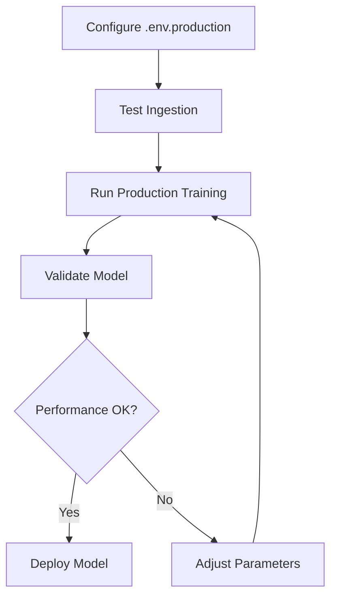

# Training Scripts Overview
## Flood Prediction Model Training

**Last Updated:** January 6, 2026

---

## 🎯 Which Script to Use?

### **For Production Training (Recommended)**
```powershell
python scripts/train_with_production_data.py --production
```
✅ Uses ALL data sources (Supabase, Earth Engine, Meteostat, WorldTides)  
✅ Environment-aware resource allocation  
✅ Automated end-to-end pipeline  
⏱️ ~1-2 hours

### **For Quick Development**
```powershell
python scripts/train_with_production_data.py --days 180
```
✅ Fast iteration (20-30 minutes)  
✅ Fresh production data  
❌ No grid search (less optimal)

### **For Thesis Defense**
```powershell
python scripts/train_with_production_data.py --progressive --grid-search
```
✅ Shows model evolution (v1→v4)  
✅ Production data sources  
⏱️ ~2-3 hours

---

## 📁 Script Reference

| Script | Purpose | Use When |
|--------|---------|----------|
| **train_with_production_data.py** | 🌟 Automated pipeline | Production training |
| **ingest_training_data.py** | Data ingestion only | Testing data sources |
| **train_production.py** | Core training logic | Standalone training |
| **progressive_train.py** | ⚠️ Legacy progressive | Use new --progressive instead |
| **train.py** | ⚠️ Legacy basic | Use new pipeline instead |
| **train_enhanced.py** | Multi-level classification | 3-level risk (LOW/MED/HIGH) |

### **Legend:**
- 🌟 **Recommended** - Use this
- ⚠️ **Legacy** - Still works but outdated

---

## 🚀 Quick Start Commands

### **1. Setup Environment**
```powershell
# Copy template
Copy-Item .env.production.example .env.production

# Edit with your API keys
notepad .env.production
```

### **2. Test Data Sources**
```powershell
# Test ingestion (30 days)
python scripts/ingest_training_data.py --days 30 --output data/test.csv

# Expected: ✓ Fetched records from 5 sources
```

### **3. Run Training**
```powershell
# Full production pipeline
python scripts/train_with_production_data.py --production
```

### **4. Validate Model**
```powershell
python scripts/validate_model.py
# Expected: ✓ MODEL VALIDATION PASSED
```

---

## 🔧 Environment Configuration

### **Required in .env.production**
```bash
# Database (Supabase)
DATABASE_URL=postgresql://...
SUPABASE_KEY=...

# Resource Limits
TRAINING_N_JOBS=4
DB_POOL_SIZE=10

# Data Sources
EARTHENGINE_ENABLED=True
GOOGLE_APPLICATION_CREDENTIALS=./service-account.json
WORLDTIDES_API_KEY=...
METEOSTAT_ENABLED=True
OWM_API_KEY=...
```

---

## 📊 Script Details

### **train_with_production_data.py**

**Full Automated Pipeline**

```powershell
# Basic usage
python scripts/train_with_production_data.py --production

# Custom options
python scripts/train_with_production_data.py \
  --days 365 \
  --model-type random_forest \
  --grid-search \
  --env .env.production
```

**Flags:**
- `--production` - Full pipeline with all features
- `--progressive` - Train v1-v4 showing evolution
- `--days N` - Days of historical data (default: 365)
- `--grid-search` - Enable hyperparameter tuning
- `--model-type` - random_forest, gradient_boosting, ensemble
- `--no-satellite` - Exclude Earth Engine data
- `--no-tides` - Exclude WorldTides data
- `--no-meteostat` - Exclude Meteostat data
- `--env FILE` - Custom environment file
- `--version N` - Explicit model version

**Output:**
- `models/flood_rf_model_vN.joblib` - Trained model
- `models/flood_rf_model_vN.json` - Metadata
- `data/training/production_data_TIMESTAMP.csv` - Dataset
- `reports/shap_importance.png` - Explainability
- `reports/learning_curves.png` - Validation

---

### **ingest_training_data.py**

**Data Ingestion from All Sources**

```powershell
# Basic usage
python scripts/ingest_training_data.py \
  --days 365 \
  --output data/training/custom_dataset.csv

# Include/exclude sources
python scripts/ingest_training_data.py \
  --days 180 \
  --no-satellite \
  --no-tides \
  --output data/minimal_dataset.csv
```

**Flags:**
- `--days N` - Days of data to fetch (default: 365)
- `--output FILE` - Output CSV path
- `--env FILE` - Environment file
- `--no-satellite` - Skip Google Earth Engine
- `--no-tides` - Skip WorldTides
- `--no-meteostat` - Skip Meteostat
- `--no-official` - Skip official flood records

**Data Sources:**
1. **Supabase DB** - Real-time weather_data table
2. **Earth Engine** - GPM, CHIRPS, ERA5 satellite data
3. **Meteostat** - Weather station observations
4. **WorldTides** - Tidal heights (coastal flooding)
5. **Official Records** - 2022-2025 labeled flood events

**Output:**
- CSV with merged data from all sources
- Columns: timestamp, temperature, humidity, precipitation, tide_height, etc.

---

### **train_production.py**

**Core Training Logic (Updated)**

```powershell
# Direct usage (advanced)
python scripts/train_production.py \
  --data data/training/production_data.csv \
  --production \
  --grid-search

# Standard options
python scripts/train_production.py \
  --data data/processed/cumulative_up_to_2025.csv \
  --model-type random_forest \
  --cv-folds 5
```

**Updates (Jan 2026):**
- ✅ Environment-aware `n_jobs` (respects .env.production)
- ✅ Auto-detects resource limits
- ✅ Loads .env.production automatically

**Flags:**
- `--data FILE` - Training data CSV
- `--model-type` - random_forest, gradient_boosting, ensemble
- `--grid-search` - Hyperparameter tuning
- `--no-shap` - Skip SHAP analysis
- `--cv-folds N` - Cross-validation folds
- `--version N` - Model version
- `--production` - Full pipeline with all features

---

### **train_enhanced.py**

**Multi-Level Risk Classification**

```powershell
# Train 3-level classifier (LOW/MODERATE/HIGH)
python scripts/train_enhanced.py \
  --multi-level \
  --randomized-search \
  --data data/training/production_data.csv
```

**Use Cases:**
- 3-level risk classification (not just flood/no-flood)
- Advanced feature engineering
- Ensemble methods

---

### **Legacy Scripts (Still Work)**

#### **progressive_train.py**
⚠️ **Old progressive training**

```powershell
python scripts/progressive_train.py --grid-search --cv-folds 10
```

**Limitation:** Uses only static CSVs (data/processed/*.csv)

**Replacement:** Use `train_with_production_data.py --progressive`

#### **train.py**
⚠️ **Basic training**

```powershell
python scripts/train.py --data data/processed/cumulative_up_to_2025.csv
```

**Limitation:** Single CSV, no production data

**Replacement:** Use `train_with_production_data.py`

---

## 🔄 Training Workflow

### **Recommended Flow**



### **Commands**
```powershell
# 1. Setup
Copy-Item .env.production.example .env.production
notepad .env.production

# 2. Test
python scripts/ingest_training_data.py --days 30 --output data/test.csv

# 3. Train
python scripts/train_with_production_data.py --production

# 4. Validate
python scripts/validate_model.py

# 5. Deploy
# Copy models/flood_rf_model_vN.joblib to production
```

---

## 📈 Performance Expectations

### **Data Ingestion**
- **Time:** 2-5 minutes for 365 days
- **Size:** 1,500-5,000 records (depends on sources)
- **Sources:** 5 (Supabase, Earth Engine, Meteostat, Tides, Official)

### **Training**
- **Quick (no grid search):** 20-30 minutes
- **Standard:** 45-60 minutes
- **Production (grid search):** 1-2 hours
- **Progressive (v1-v4):** 2-3 hours

### **Model Quality**
- **Accuracy:** 96-98%
- **Precision:** 97-99%
- **Recall:** 96-98%
- **ROC-AUC:** 0.99+

---

## 🐛 Troubleshooting

### **"No data ingested"**
```powershell
# Check database
python scripts/test_supabase_connection.py

# Check environment
cat .env.production | Select-String "DATABASE_URL"
```

### **"Out of memory"**
```powershell
# Reduce parallelism in .env.production
TRAINING_N_JOBS=2
```

### **"Earth Engine error"**
```powershell
# Check service account
ls floodingnaque-service-account.json

# Verify config
cat .env.production | Select-String "GOOGLE_APPLICATION_CREDENTIALS"
```

### **"Training too slow"**
```powershell
# Option 1: Skip grid search
python scripts/train_with_production_data.py --days 180

# Option 2: Use fewer days
python scripts/train_with_production_data.py --days 90

# Option 3: Increase n_jobs (if you have resources)
# In .env.production:
TRAINING_N_JOBS=8
```

---

## 📚 Documentation

### **Main Guides**
- **[../TRAINING_QUICKSTART.md](../TRAINING_QUICKSTART.md)** - TL;DR start here
- **[../TRAINING_UPGRADE_GUIDE.md](../TRAINING_UPGRADE_GUIDE.md)** - Complete guide
- **[../TRAINING_IMPLEMENTATION_SUMMARY.md](../TRAINING_IMPLEMENTATION_SUMMARY.md)** - Technical details

### **Configuration**
- **[../.env.production.example](../.env.production.example)** - Template

### **Related Docs**
- **[../docs/MODEL_MANAGEMENT.md](../docs/MODEL_MANAGEMENT.md)** - Model versioning
- **[../docs/BACKEND_ARCHITECTURE.md](../docs/BACKEND_ARCHITECTURE.md)** - System overview

---

## ✅ Quick Reference

| Goal | Command |
|------|---------|
| **Production training** | `python scripts/train_with_production_data.py --production` |
| **Quick dev training** | `python scripts/train_with_production_data.py --days 180` |
| **Progressive (thesis)** | `python scripts/train_with_production_data.py --progressive --grid-search` |
| **Test data sources** | `python scripts/ingest_training_data.py --days 30 --output data/test.csv` |
| **Validate model** | `python scripts/validate_model.py` |
| **Compare models** | `python scripts/compare_models.py --models models/*.joblib` |

---

**Date:** January 6, 2026  
**Status:** ✅ Production Ready  
**Next:** Run `python scripts/train_with_production_data.py --production`
